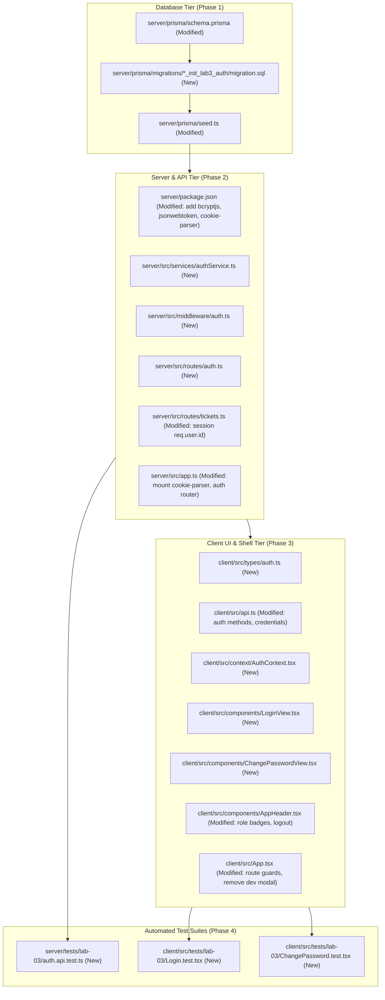

# Technical Implementation Plan: Issue 12 — Authentication Foundation, User Migration & Application Shell Navigation

**Document ID**: PLAN-FEAT-12  
**Feature Branch**: `feature/12-auth-and-shell`  
**Target Milestone**: TokTickIT Lab 3 (Sprint 3)  
**Authoritative Contract Reference**: [docs/features/12-auth-and-shell/contract.md](./contract.md)  
**Document Status**: Ready for Review & Implementation  

---

## 1. Target File Inventory

Below is the complete, exhaustive inventory of all files to be created or modified across `server/`, `client/`, `prisma/`, and `tests/`:



### Detailed Inventory Table

| Component | Path | Action | Description |
| :--- | :--- | :---: | :--- |
| **Prisma** | `server/prisma/schema.prisma` | `MODIFY` | Add `Role` enum, update `User` model, repoint `Ticket` and `Attachment` relations. |
| **Prisma** | `server/prisma/migrations/...` | `NEW` | SQL migration script generated via `npx prisma migrate dev --name init_lab3_auth`. |
| **Prisma** | `server/prisma/seed.ts` | `MODIFY` | Idempotent upsert of users with bcrypt hashed passwords across all 3 roles (active/inactive). |
| **Server** | `server/package.json` | `MODIFY` | Add `bcryptjs`, `jsonwebtoken`, `cookie-parser`, and corresponding `@types/*`. |
| **Server** | `server/src/services/authService.ts` | `NEW` | Password hashing, verification, complexity validation, and JWT token issuance/verification. |
| **Server** | `server/src/middleware/auth.ts` | `NEW` | `authenticateUser`, `requireAuth`, `requirePasswordChanged` (`BR-02`), and role guard middleware. |
| **Server** | `server/src/routes/auth.ts` | `NEW` | Express route handlers for `/login`, `/logout`, `/me`, and `/change-password`. |
| **Server** | `server/src/routes/tickets.ts` | `MODIFY` | Enforce server-side `req.user.id` derivation (`BR-03`), replace `requesterUser` with `user`. |
| **Server** | `server/src/app.ts` | `MODIFY` | Mount `cookieParser()`, update `cors` credentials, mount `/api/v1/auth`, guard ticket routes. |
| **Client** | `client/src/types/auth.ts` | `NEW` | TypeScript interfaces for `User`, `Role`, `AuthResponse`, `LoginCredentials`, `PasswordChangePayload`. |
| **Client** | `client/src/api.ts` | `MODIFY` | Add `loginUser`, `logoutUser`, `fetchCurrentUser`, `changePassword` API client functions. |
| **Client** | `client/src/context/AuthContext.tsx` | `NEW` | React Context for session management, token handling, bootstrap `/me` verification, and login/logout state. |
| **Client** | `client/src/components/LoginView.tsx` | `NEW` | Login screen matching Zen Green wireframe with email/password, spinner, blur normalization, and safe error alert. |
| **Client** | `client/src/components/ChangePasswordView.tsx` | `NEW` | Forced password change screen with 5-rule interactive live checklist, mismatch check, and route barrier. |
| **Client** | `client/src/components/AppHeader.tsx` | `MODIFY` | Remove Dev Requester selector/modal trigger, add user name, Zen Green role badge, working Logout. |
| **Client** | `client/src/App.tsx` | `MODIFY` | Wrap with `AuthProvider`, remove `RequesterModal` and banner, conditional rendering for `/login`, `/change-password`, and app. |
| **Tests** | `server/tests/lab-03/auth.api.test.ts` | `NEW` | Supertest integration tests for `AUTH-01` through `AUTH-10`. |
| **Tests** | `client/src/tests/lab-03/Login.test.tsx` | `NEW` | RTL component tests for `UI-LOG-01` (rendering, blur clearing, submission, 401 error). |
| **Tests** | `client/src/tests/lab-03/ChangePassword.test.tsx` | `NEW` | RTL component tests for `UI-PWD-01` (live rule checking, mismatch alert, submission). |

---

## 2. Step-by-Step Execution Sequence

### Phase 1: Database & Seed Data Execution

#### 1.1. Update `server/prisma/schema.prisma`
- Define enum `Role`:
  ```prisma
  enum Role {
    REQUESTER
    IT_STAFF
    ADMINISTRATOR
  }
  ```
- Replace model `RequesterUser` with unified model `User`:
  ```prisma
  model User {
    id                 Int          @id @default(autoincrement())
    name               String
    email              String       @unique
    passwordHash       String
    role               Role         @default(REQUESTER)
    department         String?
    isActive           Boolean      @default(true)
    mustChangePassword Boolean      @default(true)
    createdAt          DateTime     @default(now())
    updatedAt          DateTime     @updatedAt

    submittedTickets   Ticket[]     @relation("RequesterTickets")
    removedAttachments Attachment[] @relation("UserRemovedAttachments")

    @@map("users")
  }
  ```
- Update relational attributes in `Ticket`:
  ```prisma
  requesterId Int
  requester   User @relation("RequesterTickets", fields: [requesterId], references: [id], onDelete: Restrict)
  ```
- Update relational attributes in `Attachment`:
  ```prisma
  removedByRequesterId Int?
  removedByUser        User? @relation("UserRemovedAttachments", fields: [removedByRequesterId], references: [id], onDelete: SetNull)
  ```

#### 1.2. Execute Database Migration
- Run command: `npx prisma migrate dev --name init_lab3_auth`
- Verify that PostgreSQL performs:
  1. Creation of enum `"Role"`.
  2. Table rename of `requester_users` $\rightarrow$ `users` (or creation with safe transfer of existing rows 1–5).
  3. Addition of columns `passwordHash`, `role`, `mustChangePassword`, `isActive` with safe defaults.
  4. Repointed foreign keys from `tickets` and `attachments` to `users(id)` without orphan errors.
- Run `npx prisma generate` to update Prisma client bindings.

#### 1.3. Update Database Seed Script (`server/prisma/seed.ts`)
- Import `bcryptjs`.
- Define standard pre-hashed passwords using `bcrypt.hashSync("Password123!", 10)` and `bcrypt.hashSync("InitialPass123!", 10)`.
- Seed comprehensive user accounts using `prismaClient.user.upsert` matching on normalized lowercase `email` without passing explicit primary key `id`:
  - **Requesters**:
    - `sompong.it@kmutt.ac.th` (Active, `Password123!`, `mustChangePassword: false`)
    - `anong.sta@kmutt.ac.th` & `anong.st@kmutt.ac.th` (Active, `Password123!`, `mustChangePassword: false`)
    - `kittisak.stu@kmutt.ac.th` & `mana.st@kmutt.ac.th` (Active, `Password123!`, `mustChangePassword: false`)
    - `wichai.fac@kmutt.ac.th` & `kanda.fc@kmutt.ac.th` (Active, `Password123!`, `mustChangePassword: false`)
    - `prasert.ina@kmutt.ac.th` & `prasert.in@kmutt.ac.th` (Inactive, `isActive: false`)
    - `new.requester@kmutt.ac.th` (Active, `InitialPass123!`, `mustChangePassword: true`)
  - **IT Staff**:
    - `wichai.it@kmutt.ac.th` (Active, `Password123!`, `mustChangePassword: false`)
    - `nareerat.it@kmutt.ac.th` (Active, `Password123!`, `mustChangePassword: false`)
    - `ekachai.it@kmutt.ac.th` (Active, `Password123!`, `mustChangePassword: false`)
    - `inactive.staff@kmutt.ac.th` (Inactive, `isActive: false`)
  - **Administrators**:
    - `admin.toktick@kmutt.ac.th` (Active, `Password123!`, `mustChangePassword: false`)
    - `backup.admin@kmutt.ac.th` (Active, `Password123!`, `mustChangePassword: false`)
- Run `npm run prisma:seed` and verify zero errors.

---

### Phase 2: Backend Authentication APIs & Middleware

#### 2.1. Dependency Installation in `server/`
- Install: `bcryptjs`, `jsonwebtoken`, `cookie-parser`.
- Install dev dependencies: `@types/bcryptjs`, `@types/jsonwebtoken`, `@types/cookie-parser`.

#### 2.2. Implement Authentication Service (`server/src/services/authService.ts`)
- `hashPassword(password: string): Promise<string>`
- `verifyPassword(password: string, hash: string): Promise<boolean>`
- `validatePasswordStrength(password: string): { isValid: boolean; errors: string[] }`
  - Validates: $\ge 8$ chars, uppercase (`[A-Z]`), lowercase (`[a-z]`), digit (`[0-9]`), special symbol (`[!@#$%^&*()_+\-=\[\]{};':"\\|,.<>\/?]`).
- `generateToken(user: { id: number; email: string; role: string; mustChangePassword: boolean }): string`
  - Signs payload with `JWT_SECRET` (defaulting to safe local dev secret if unset).
- `verifyToken(token: string): AuthPayload | null`

#### 2.3. Implement Authentication & Authorization Middleware (`server/src/middleware/auth.ts`)
- `authenticateUser(req, res, next)`:
  - Extracts token from `req.cookies.toktickit_session` or header `Authorization: Bearer <token>`.
  - Verifies token; if valid, attaches `req.user = decoded`. If invalid, `req.user = undefined`.
  - Calls `next()`.
- `requireAuth(req, res, next)`:
  - If `!req.user`, responds with HTTP `401 Unauthorized` (`UNAUTHENTICATED`, `"Authentication required"`).
- `requirePasswordChanged(req, res, next)`:
  - If `req.user && req.user.mustChangePassword === true`, responds with HTTP `403 Forbidden` (`PASSWORD_CHANGE_REQUIRED`, `"You must change your password before accessing the service desk."`).
  - Whitelist: allows `/api/v1/auth/change-password`, `/api/v1/auth/logout`, `/api/v1/auth/me`.
- `requireRole(roles: Role[])`:
  - Enforces role checks (`403 Forbidden` if role unauthorized).

#### 2.4. Implement Auth Routes (`server/src/routes/auth.ts`)
- `POST /api/v1/auth/login`:
  - Validates email and password in body.
  - Normalizes email (`trim().toLowerCase()`).
  - Queries `prisma.user.findUnique({ where: { email } })`.
  - Anti-enumeration (`BR-01`): if user does not exist, password does not match, or `user.isActive === false`, returns HTTP `401 Unauthorized` with generic message: `"Invalid email or password"`.
  - On success: sets HTTP-only cookie `toktickit_session` (`httpOnly: true, sameSite: "lax", path: "/", maxAge: 86400000`), returns `{ user: safeUser, token }`.
- `POST /api/v1/auth/logout`:
  - Clears `toktickit_session` cookie (`res.clearCookie("toktickit_session")`).
  - Returns `{ message: "Successfully logged out." }`.
- `GET /api/v1/auth/me`:
  - Requires `requireAuth`.
  - Fetches fresh user record from DB: `prisma.user.findUnique({ where: { id: req.user.id } })`.
  - If missing or inactive, returns `401`.
  - Returns `{ user: safeUser }`.
- `POST /api/v1/auth/change-password`:
  - Requires `requireAuth` (callable even when `mustChangePassword === true`).
  - Verifies `currentPassword` against `user.passwordHash`. If mismatched $\rightarrow$ HTTP `401` (`"Current password is incorrect"`).
  - Validates `newPassword` complexity rules. If failing $\rightarrow$ HTTP `400` (`VALIDATION_FAILED`).
  - Verifies `confirmPassword === newPassword`. If failing $\rightarrow$ HTTP `400` (`"Passwords do not match"`).
  - Hashes new password, updates DB: `prisma.user.update({ where: { id: req.user.id }, data: { passwordHash: newHash, mustChangePassword: false } })`.
  - Issues updated token with `mustChangePassword: false` and sets updated cookie.
  - Returns `{ message: "Password changed successfully.", user: updatedUser, token }`.

#### 2.5. Integrate Anti-Spoofing on Ticket Routes (`server/src/routes/tickets.ts`)
- In `createTicket`:
  - Discard any client-supplied `req.body.requesterId` or `req.headers["x-requester-id"]`.
  - Derive requester identity strictly as `requesterId = req.user.id` (`BR-03`).
- In `getTickets`:
  - For `REQUESTER` role: strictly filter `where: { requesterId: req.user.id }`.
- Update all references from `prisma.requesterUser` to `prisma.user`.

#### 2.6. Mount Middleware in `server/src/app.ts`
- Mount `cookieParser()`.
- Update CORS: `app.use(cors({ origin: true, credentials: true }))`.
- Mount router: `app.use("/api/v1/auth", authRouter)`.
- Protect operational ticket routes with `authenticateUser`, `requireAuth`, and `requirePasswordChanged`.

---

### Phase 3: Frontend UI Components & App Shell

#### 3.1. Auth Type Definitions (`client/src/types/auth.ts`)
- Types: `Role` (`"REQUESTER" | "IT_STAFF" | "ADMINISTRATOR"`), `User`, `AuthResponse`, `LoginCredentials`, `ChangePasswordPayload`.

#### 3.2. Update API Client (`client/src/api.ts`)
- Update `fetch` wrappers to include `credentials: "include"`.
- Implement:
  - `login(credentials: LoginCredentials): Promise<AuthResponse>`
  - `logout(): Promise<void>`
  - `getMe(): Promise<User>`
  - `changePassword(payload: ChangePasswordPayload): Promise<AuthResponse>`

#### 3.3. Create Auth Context (`client/src/context/AuthContext.tsx`)
- Provides: `user`, `isLoading`, `isAuthenticated`, `login()`, `logout()`, `changePassword()`.
- Bootstrap verification: On mount, calls `api.getMe()` to restore active session from cookie.
- If `401`, resets state to guest.

#### 3.4. Implement Login Screen (`client/src/components/LoginView.tsx`)
- Centered card layout (`max-width: 440px`) adhering to Zen Green tokens (`ui-spec.md` §3.2).
- Email & password inputs with autofocus on email.
- Blur Validation Rule (`AGENTS.md` §4): invalid email formats normalize/clear on blur; validation alerts display only on submit.
- Submitting state: inputs disabled, button displays spinner and label `"Signing in..."`.
- Safe error alert: generic banner (`var(--zen-error-bg)`) displayed on 401: *"Invalid email or password"*.

#### 3.5. Implement Mandatory Change Password Screen (`client/src/components/ChangePasswordView.tsx`)
- Centered card layout (`max-width: 480px`) matching `ui-spec.md` §3.3.
- Interactive 5-rule checklist:
  - Real-time visual indicator turning green with `✓` as each rule is met.
- Password mismatch inline warning.
- Route barrier: navigation blocked until successfully updated.
- Submitting state with spinner `"Updating Password..."`.
- On success: triggers session state refresh and redirects to role home view.

#### 3.6. Modernize Header & App Shell (`client/src/components/AppHeader.tsx` & `App.tsx`)
- In `AppHeader.tsx`:
  - Completely remove Dev Requester modal triggers, "Change Requester" buttons, and banner notices.
  - Render user name: `user.name`.
  - Render styled Zen Green role badge:
    - Requester: `#EAF6EF`, `#006B3C`
    - IT Staff: `#E0F2FE`, `#0369A1`
    - Administrator: `#F3E8FF`, `#6B21A8`
  - Add working "Logout" button invoking `logout()`.
  - Role-aware navigation links (`Create Ticket`, `My Tickets`, `Staff Queue`, `User Admin`).
- In `App.tsx`:
  - Remove `RequesterModal` and `useRequester`.
  - Conditionally render:
    - If `isLoading`: render Zen skeleton loading spinner.
    - If `!isAuthenticated`: render `<LoginView />`.
    - If `isAuthenticated && user.mustChangePassword`: render `<ChangePasswordView />`.
    - If `isAuthenticated && !user.mustChangePassword`: render standard application views based on user role.

---

### Phase 4: Automated Test Suite Implementation

#### 4.1. Server API Integration Tests (`server/tests/lab-03/auth.api.test.ts`)
- `AUTH-01`: Valid login returns 200, session cookie, safe user object without password hash.
- `AUTH-02`: Login with wrong password returns 401 generic error.
- `AUTH-03`: Login with inactive user (`isActive: false`) returns 401 generic error without existence leak (`BR-01`).
- `AUTH-04`: `GET /api/v1/auth/me` with session returns authenticated user profile.
- `AUTH-05`: `GET /api/v1/auth/me` without session returns 401 Unauthorized.
- `AUTH-06`: `POST /api/v1/auth/logout` invalidates session and clears cookie.
- `AUTH-07`: User with `mustChangePassword = true` receives 403 `PASSWORD_CHANGE_REQUIRED` on operational route (`BR-02`).
- `AUTH-08`: Successful password change updates hash and sets `mustChangePassword = false`.
- `AUTH-09`: Weak password returns 400 Bad Request with complexity validation errors.
- `AUTH-10`: Anti-spoofing regression test verifying `POST /api/v1/tickets` assigns `req.user.id` ignoring client-supplied `requesterId` (`AC-05`, `BR-03`).

#### 4.2. Client UI Component Tests (`client/src/tests/lab-03/Login.test.tsx`)
- `UI-LOG-01`:
  - Renders login title, email, password, and sign-in button.
  - Blur validation: invalid format clears on blur without premature inline error alert.
  - Submit validation: required field validation on empty submit.
  - Submitting state: disabled button and loading spinner.
  - Safe error alert: generic 401 message rendered in error container.
  - Successful login: triggers session update and view transition.

#### 4.3. Client UI Component Tests (`client/src/tests/lab-03/ChangePassword.test.tsx`)
- `UI-PWD-01`:
  - Renders current, new, and confirm password inputs.
  - Interactive live checklist: dynamically checks off rules as criteria are typed.
  - Mismatch validation: flags mismatched passwords.
  - Successful submission: calls change password API and clears navigation barrier.

---

## 3. Verification & Test Execution Commands

### 3.1. Database Setup & Seeding Verification
```bash
# In server/
cd server
npx prisma migrate dev --name init_lab3_auth
npm run prisma:seed
```

### 3.2. Server API Test Verification (Vitest + Supertest)
```bash
# In server/
cd server
npx vitest run tests/lab-03/auth.api.test.ts
```

### 3.3. Client UI Component Test Verification (Vitest + React Testing Library)
```bash
# In client/
cd client
npx vitest run src/tests/lab-03/Login.test.tsx
npx vitest run src/tests/lab-03/ChangePassword.test.tsx
```

### 3.4. Full Regression Verification Across Lab 1, Lab 2, and Lab 3
```bash
# Run all server tests
cd server
npm run test

# Run all client component tests
cd client
npm run test
```

---

## 4. Review & Approval Gate

| Verification Gate | Expected Outcome |
| :--- | :--- |
| **All Target Files Identified** | Exact 18 file paths specified across `server/`, `client/`, `prisma/`, and `tests/`. |
| **Zero Data Loss Guarantee** | Foreign keys repointed to `users(id)` with `ON DELETE RESTRICT` and `ON DELETE SET NULL`. |
| **Strict Security Enforcement** | `BR-01` anti-enumeration, `BR-02` forced change interception, `BR-03` session derivation. |
| **UI Spec & Theme Compliance** | Zen Green tokens (`#006B3C`, `#0B7A46`, `#EAF6EF`), blur validation, no HTML `title`. |
| **100% Traceable Tests** | All 10 API scenarios (`AUTH-01` to `AUTH-10`) and 2 UI scenarios (`UI-LOG-01`, `UI-PWD-01`) mapped. |
