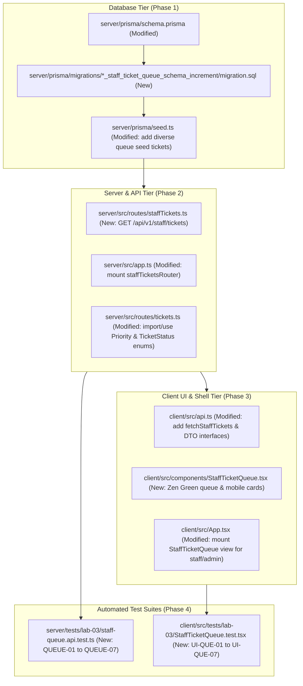

# Technical Implementation Plan: Issue 13 — IT Staff Ticket Queue & List Queries

**Document ID**: PLAN-FEAT-13  
**Feature Branch**: `feature/13-staff-ticket-queue` (Issue 13)  
**Base Branch**: `lab3-staging`  
**Target Milestone**: TokTickIT Lab 3 (Sprint 3)  
**Authoritative Contract Reference**: [docs/features/13-staff-ticket-queue/contract.md](./contract.md)  
**Document Status**: Ready for Review & Implementation  

---

## 1. Target File Inventory

Below is the complete, exhaustive inventory of all files to be created or modified across `server/`, `client/`, `prisma/`, and `tests/`:



### Detailed Inventory Table

| Component | Path | Action | Description |
| :--- | :--- | :---: | :--- |
| **Prisma** | `server/prisma/schema.prisma` | `MODIFY` | Add `Priority` and `TicketStatus` enums; add `ownerId` FK and relation `owner` to `Ticket`; add `assignedTickets` to `User`; update `itPriority`, `requestedPriority`, `currentStatus` types and indexes. |
| **Prisma** | `server/prisma/migrations/...` | `NEW` | SQL migration script generated via `npx prisma migrate dev --name staff_ticket_queue_schema_increment`. |
| **Prisma** | `server/prisma/seed.ts` | `MODIFY` | Seed at least 12 realistic tickets across varied statuses, priorities, categories, and assigned vs unassigned states to power query testing. |
| **Server** | `server/src/routes/staffTickets.ts` | `NEW` | Express route handler for `GET /api/v1/staff/tickets` supporting search, filtering, sorting, pagination, and role-based access control (`BR-06`). |
| **Server** | `server/src/routes/tickets.ts` | `MODIFY` | Update ticket creation and listing queries to use `Priority` and `TicketStatus` enums; initialize `itPriority` from `requestedPriority` (`BR-07`). |
| **Server** | `server/src/app.ts` | `MODIFY` | Mount `staffTicketsRouter` at `/api/v1/staff/tickets` and `/api/staff/tickets`. |
| **Client** | `client/src/api.ts` | `MODIFY` | Export TypeScript interfaces (`StaffTicketSummary`, `StaffTicketQueryParams`, `StaffTicketQueueResponse`) and add `fetchStaffTickets()` client function. |
| **Client** | `client/src/components/StaffTicketQueue.tsx` | `NEW` | Responsive Zen Green staff queue screen with search input, 4 filter dropdowns, Reset button, sortable data table, pagination bar, loading shimmer skeleton, empty/error feedback states, and mobile stacked cards (< 768px). |
| **Client** | `client/src/App.tsx` | `MODIFY` | Support `"staff-queue"` active view; mount `<StaffTicketQueue />` when selected; set role-aware default view for `IT_STAFF` and `ADMINISTRATOR`. |
| **Tests** | `server/tests/lab-03/staff-queue.api.test.ts` | `NEW` | Supertest API integration tests covering `QUEUE-01` through `QUEUE-07` (`AC-13.1`, `AC-13.2`, `AC-13.3`, `AC-07`, `AC-08`). |
| **Tests** | `client/src/tests/lab-03/StaffTicketQueue.test.tsx` | `NEW` | React Testing Library component tests covering `UI-QUE-01` through `UI-QUE-07` (`AC-13.1`, `AC-13.3`, `AC-13.4`). |

---

## 2. Step-by-Step Execution Sequence

### Phase 1: Database Schema & Seed Data Execution

#### 1.1. Update Prisma Schema (`server/prisma/schema.prisma`)
1. Add `Priority` enum:
   ```prisma
   enum Priority {
     LOW
     MEDIUM
     HIGH
     URGENT
   }
   ```
2. Add `TicketStatus` enum:
   ```prisma
   enum TicketStatus {
     NEW
     OPEN
     IN_PROGRESS
     WAITING_FOR_REQUESTER
     RESOLVED
     CLOSED
     REOPENED
     CANCELLED
   }
   ```
3. Update `User` model with relation back-link:
   ```prisma
   assignedTickets Ticket[] @relation("StaffOwnedTickets")
   ```
4. Update `Ticket` model:
   ```prisma
   model Ticket {
     id                  Int          @id @default(autoincrement())
     ticketNumber        String       @unique @db.VarChar(32)
     requesterId         Int
     ownerId             Int?         // Nullable FK to User for assigned IT Staff/Admin
     categoryId          Int
     relatedSystemId     Int
     summary             String       @db.VarChar(100)
     description         String       @db.Text
     requestedPriority   Priority     @default(MEDIUM)
     itPriority          Priority     @default(MEDIUM)
     currentStatus       TicketStatus @default(NEW)
     requesterResolvedAt DateTime?
     createdAt           DateTime     @default(now())
     updatedAt           DateTime     @updatedAt

     // Relations
     requester           User          @relation("RequesterTickets", fields: [requesterId], references: [id], onDelete: Restrict)
     owner               User?         @relation("StaffOwnedTickets", fields: [ownerId], references: [id], onDelete: SetNull)
     category            Category      @relation(fields: [categoryId], references: [id], onDelete: Restrict)
     relatedSystem       RelatedSystem @relation(fields: [relatedSystemId], references: [id], onDelete: Restrict)
     attachments         Attachment[]

     @@index([requesterId])
     @@index([ownerId])
     @@index([currentStatus])
     @@index([itPriority])
     @@index([createdAt])
     @@map("tickets")
   }
   ```

#### 1.2. Generate and Apply Database Migration
1. Run migration command in `server/`:
   ```bash
   npx prisma migrate dev --name staff_ticket_queue_schema_increment
   ```
2. Inspect the generated SQL migration to confirm:
   - Creates ENUM types `"Priority"` and `"TicketStatus"`.
   - Casts existing `requestedPriority`, `itPriority`, and `currentStatus` columns to the new enums with uppercase values.
   - Adds nullable column `ownerId` to `tickets` with foreign key referencing `users(id)` `ON DELETE SET NULL`.
   - Adds indexes on `ownerId`, `currentStatus`, `itPriority`, and `createdAt`.
3. Run `npx prisma generate` to refresh Prisma Client TypeScript definitions.

#### 1.3. Update Seed Script (`server/prisma/seed.ts`)
1. Ensure the seed script populates 12 diverse tickets (`TKT-2026-00001` through `TKT-2026-00012`) as specified in contract §2.3:
   - Distributed across all 8 statuses: `NEW`, `OPEN`, `IN_PROGRESS`, `WAITING_FOR_REQUESTER`, `RESOLVED`, `CLOSED`, `REOPENED`, `CANCELLED`.
   - Realistic categories: `Network`, `Hardware`, `Software`, `Account and Access`.
   - Varied priorities: `LOW`, `MEDIUM`, `HIGH`, `URGENT`.
   - Assigned staff owners (`wichai.it@kmutt.ac.th`, `nareerat.it@kmutt.ac.th`, `ekachai.it@kmutt.ac.th`) and unassigned tickets (`ownerId: null`).
2. Run `npm run prisma:seed` and verify clean database execution without orphan records or sequence drift.

---

### Phase 2: Backend Staff Queue REST API & Auth

#### 2.1. Implement Staff Tickets Router (`server/src/routes/staffTickets.ts`)
1. Create router exporting `staffTicketsRouter`.
2. Apply authorization middleware chain:
   ```typescript
   staffTicketsRouter.get(
     "/",
     requireAuth,
     requirePasswordChanged,
     requireRole("IT_STAFF", "ADMINISTRATOR"),
     getStaffTickets
   );
   ```
   - If user is unauthenticated $\rightarrow$ HTTP `401 Unauthorized` (`UNAUTHENTICATED`).
   - If `mustChangePassword === true` $\rightarrow$ HTTP `403 Forbidden` (`PASSWORD_CHANGE_REQUIRED`).
   - If `user.role === "REQUESTER"` $\rightarrow$ HTTP `403 Forbidden` (`FORBIDDEN`) per `BR-06`.
3. Query Parameter Processing & Validation:
   - `search`: string (trimmed). If present, build Prisma `OR` condition:
     ```typescript
     OR: [
       { ticketNumber: { contains: search, mode: "insensitive" } },
       { summary: { contains: search, mode: "insensitive" } },
     ]
     ```
   - `status`: string. If valid `TicketStatus`, filter `{ currentStatus: status as TicketStatus }`.
   - `category`: string/number. If present, parse int and filter `{ categoryId: parsedCategoryId }`.
   - `itPriority`: string. If valid `Priority`, filter `{ itPriority: itPriority as Priority }`.
   - `owner`: string.
     - If `"unassigned"` $\rightarrow$ filter `{ ownerId: null }`.
     - If numeric string $\rightarrow$ filter `{ ownerId: parseInt(owner, 10) }`.
   - `sortBy`: string. Allowed values: `createdAt`, `ticketNumber`, `summary`, `itPriority`, `currentStatus` (defaults to `createdAt`).
   - `sortOrder`: `"asc" | "desc"`. Defaults to `"desc"`.
   - `page`: integer $\ge 1$ (defaults to `1`).
   - `pageSize`: integer $\in \{10, 25, 50\}$ (defaults to `10`).
4. Database Execution & Pagination:
   - Calculate `skip = (page - 1) * pageSize` and `take = pageSize`.
   - Use `prisma.$transaction([prisma.ticket.count({ where }), prisma.ticket.findMany({ where, include: { requester: true, owner: true, category: true }, orderBy, skip, take })])`.
   - Calculate `totalPages = totalCount === 0 ? 1 : Math.ceil(totalCount / pageSize)`.
5. Map results to `StaffTicketSummaryDTO`:
   ```typescript
   items: tickets.map((t) => ({
     id: t.id,
     ticketNumber: t.ticketNumber,
     summary: t.summary,
     categoryName: t.category.name,
     categoryId: t.categoryId,
     requestedPriority: t.requestedPriority,
     itPriority: t.itPriority,
     currentStatus: t.currentStatus,
     requesterName: t.requester.name,
     requesterId: t.requesterId,
     ownerName: t.owner ? t.owner.name : null,
     ownerId: t.ownerId,
     requesterResolved: Boolean(t.requesterResolvedAt),
     createdAt: t.createdAt.toISOString(),
     updatedAt: t.updatedAt.toISOString(),
   }))
   ```
6. Return `200 OK` with JSON envelope:
   `{ items, totalCount, page, pageSize, totalPages }`.

#### 2.2. Update Existing `server/src/routes/tickets.ts`
- Ensure ticket creation initializes `itPriority` to match `requestedPriority` enum (`BR-07`).
- Update Prisma queries to reference `Priority` and `TicketStatus` enums safely without runtime type errors.

#### 2.3. Mount Route in `server/src/app.ts`
- Mount `staffTicketsRouter`:
  ```typescript
  import { staffTicketsRouter } from "./routes/staffTickets.js";

  app.use("/api/v1/staff/tickets", staffTicketsRouter);
  app.use("/api/staff/tickets", staffTicketsRouter);
  ```

---

### Phase 3: Frontend Zen Green Staff Ticket Queue Screen

#### 3.1. Extend Client API Client (`client/src/api.ts`)
1. Define interfaces:
   ```typescript
   export interface StaffTicketSummary {
     id: number;
     ticketNumber: string;
     summary: string;
     categoryName: string;
     categoryId: number;
     requestedPriority: string;
     itPriority: string;
     currentStatus: string;
     requesterName: string;
     requesterId: number;
     ownerName: string | null;
     ownerId: number | null;
     requesterResolved: boolean;
     createdAt: string;
     updatedAt: string;
   }

   export interface StaffTicketQueryParams {
     search?: string;
     status?: string;
     category?: string | number;
     itPriority?: string;
     owner?: string | number;
     sortBy?: "createdAt" | "ticketNumber" | "summary" | "itPriority" | "currentStatus";
     sortOrder?: "asc" | "desc";
     page?: number;
     pageSize?: number;
   }

   export interface StaffTicketQueueResponse {
     items: StaffTicketSummary[];
     totalCount: number;
     page: number;
     pageSize: number;
     totalPages: number;
   }
   ```
2. Implement `fetchStaffTickets`:
   ```typescript
   export async function fetchStaffTickets(
     params: StaffTicketQueryParams = {},
     signal?: AbortSignal
   ): Promise<StaffTicketQueueResponse>
   ```
   - Sends query parameters via `URLSearchParams`.
   - Sets `credentials: "include"` for session cookie authentication.

#### 3.2. Build `StaffTicketQueue.tsx` Component (`client/src/components/StaffTicketQueue.tsx`)
1. **Zen Green Design & Tokens**:
   - Header title: `"IT Staff Ticket Queue"`, and total count pill badge: `Total Tickets: X`.
   - Styling: Uses CSS variables `--zen-primary-green`, `--zen-secondary-green`, `--zen-pale-green`, etc.
2. **Filter & Search Toolbar**:
   - Search input: Placeholder `"Search by ticket number or summary..."`, updates on change, trimmed.
   - Status dropdown: `All Statuses`, `NEW`, `OPEN`, `IN_PROGRESS`, `WAITING_FOR_REQUESTER`, `RESOLVED`, `CLOSED`, `REOPENED`, `CANCELLED`.
   - Category dropdown: `All Categories`, loaded from `api.fetchCategories()`.
   - IT Priority dropdown: `All Priorities`, `LOW`, `MEDIUM`, `HIGH`, `URGENT`.
   - Owner dropdown: `All Owners`, `Unassigned`, and active staff members.
   - "Reset Filters" action button: Resets search and all dropdowns to default and resets `page` to `1`.
3. **Data Table (Desktop & Tablet $\ge 768\text{px}$)**:
   - Columns: `Ticket No`, `Created Date`, `Summary`, `Category`, `Req. Prio`, `IT Prio`, `Status`, `Owner`.
   - Sortable headers: Click toggles ascending/descending order with arrow indicators (▲/▼).
   - Row hover effect: `var(--zen-pale-green)`.
   - Row click: Invokes `onViewTicket(ticket.id)`.
   - Badges: Renders status, requested priority, and IT priority badges matching `docs/lab-03/ui-spec.md` §2.2.
   - Owner: Displays staff name or `Unassigned` pill.
4. **Mobile Responsive Card Presentation ($< 768\text{px}$)**:
   - Detects mobile viewport via media query / CSS responsive classes.
   - Collapses table into stacked Zen Green cards (`data-testid="mobile-card-container"`).
   - Zero horizontal scroll (`overflow-x: hidden`).
   - Cards display: Ticket number, Status badge, summary, category, IT priority badge, owner name, date, and full-width touch button `"View Ticket Details >"` with $\ge 48\text{px}$ height (`AC-13.4`).
5. **Pagination Bar**:
   - Text: `"Showing X to Y of Z tickets"`.
   - Rows-per-page dropdown (`10`, `25`, `50`).
   - `Previous` and `Next` buttons with disabled states at boundaries.
   - Numeric page buttons highlighting active page.
6. **Feedback States**:
   - Loading skeleton: 5 pulsing shimmer rows (`.zen-skeleton`) while fetching.
   - Empty queue state: Banner when `totalCount === 0` and no filters active.
   - No results state: Banner when `totalCount === 0` and filters active, with `"Clear Filters"` CTA.
   - Error alert: Accessible red banner with `"Retry"` button if API fails.

#### 3.3. Integrate with Shell (`client/src/App.tsx`)
1. Import `StaffTicketQueue`.
2. Extend `activeView` type to include `"staff-queue"`.
3. In `AppContent`:
   - If `user.role === "IT_STAFF"` and `initialView` is not specified, default `activeView` to `"staff-queue"`.
   - Render `<StaffTicketQueue onViewTicket={(id) => { setSelectedTicketId(id); setActiveView("detail"); }} />` when `activeView === "staff-queue"`.
4. Ensure `AppHeader.tsx` links for "Staff Queue" trigger `onViewChange("staff-queue")`.

---

### Phase 4: Automated Test Suites (STS)

#### 4.1. Server API Integration Tests (`server/tests/lab-03/staff-queue.api.test.ts`)
- **Setup**: Create test users (IT Staff, Admin, Requester) and test tickets in `beforeAll`.
- **Test Scenarios**:
  - `QUEUE-01`: IT Staff queries `/api/v1/staff/tickets` $\rightarrow$ `200 OK`, validates DTO shape, pagination metadata (`AC-13.1`, `AC-07`).
  - `QUEUE-01b`: Administrator queries `/api/v1/staff/tickets` $\rightarrow$ `200 OK`, validates full queue access (`AC-13.1`).
  - `QUEUE-07`: Requester queries `/api/v1/staff/tickets` $\rightarrow$ `403 Forbidden` (`FORBIDDEN`) (`AC-13.2`, `BR-06`).
  - `QUEUE-02`: Search filtering by ticket number or summary keyword (`AC-13.3`).
  - `QUEUE-03`: Multi-field filtering by status and IT priority (`AC-13.3`).
  - `QUEUE-04a`: Filter by specific staff owner ID (`AC-13.3`).
  - `QUEUE-04b`: Filter by special token `"unassigned"` (`AC-13.3`).
  - `QUEUE-05`: Multi-column sorting (`createdAt`, `ticketNumber`, `itPriority`) in `asc`/`desc` (`AC-13.3`).
  - `QUEUE-06`: Page boundary and page size pagination (`10`, `25`) returning accurate `totalPages` and record counts (`AC-13.3`).

#### 4.2. Client UI Component Tests (`client/src/tests/lab-03/StaffTicketQueue.test.tsx`)
- **Mocks**: Mock `api.fetchStaffTickets` and `api.fetchCategories`.
- **Test Scenarios**:
  - `UI-QUE-01`: Renders table headers, ticket rows, badges, owner names, and ticket counter (`AC-13.1`).
  - `UI-QUE-02`: Typing into search input triggers filtered query update (`AC-13.3`).
  - `UI-QUE-03`: Interacting with Status, Category, Priority, and Owner dropdowns updates query filters (`AC-13.3`).
  - `UI-QUE-04`: Clicking "Reset Filters" clears search and all dropdown filters (`AC-13.3`).
  - `UI-QUE-05`: Clicking Next/Prev or changing rows per page updates page parameter (`AC-13.3`).
  - `UI-QUE-06`: Renders empty queue state, no-results state, and loading shimmer skeleton rows (`AC-13.1`).
  - `UI-QUE-07`: On mobile viewport (< 768px), renders stacked Zen Green cards without horizontal page scroll (`AC-13.4`).

---

## 3. Verification & Execution Commands

### 3.1. Database Migration & Seed Verification
```bash
# In server/
cd server
npx prisma migrate dev --name staff_ticket_queue_schema_increment
npm run prisma:seed
```

### 3.2. Server API Test Verification
```bash
# In server/
cd server
npx vitest run tests/lab-03/staff-queue.api.test.ts
```

### 3.3. Client UI Component Test Verification
```bash
# In client/
cd client
npx vitest run src/tests/lab-03/StaffTicketQueue.test.tsx
```

### 3.4. Full Regression Verification Across Lab 1, Lab 2, and Lab 3
```bash
# Run all server tests
cd server
npm run test

# Run all client tests
cd client
npm run test
```

---

## 4. Review & Approval Gate

| Verification Gate | Expected Outcome |
| :--- | :--- |
| **Complete File Inventory** | Exactly 11 files identified across `server/`, `client/`, `prisma/`, and `tests/`. |
| **Zero Data Loss Guarantee** | Migration casts existing columns cleanly; relations preserve all existing tickets and attachments. |
| **Strict Role Guard (`BR-06`)** | Route rejects `REQUESTER` with `403 Forbidden`; accepts `IT_STAFF` and `ADMINISTRATOR`. |
| **Comprehensive Query System** | Search, multi-field filtering, multi-column sorting, and page-based pagination fully specified. |
| **Zen Green UI & Mobile Card View** | Zen Green tokens applied; mobile view (< 768px) collapses to stacked cards with zero horizontal scroll. |
| **STS Test Coverage** | 100% of Acceptance Criteria (`AC-13.1` to `AC-13.4`) verified via automated Vitest/RTL tests. |
