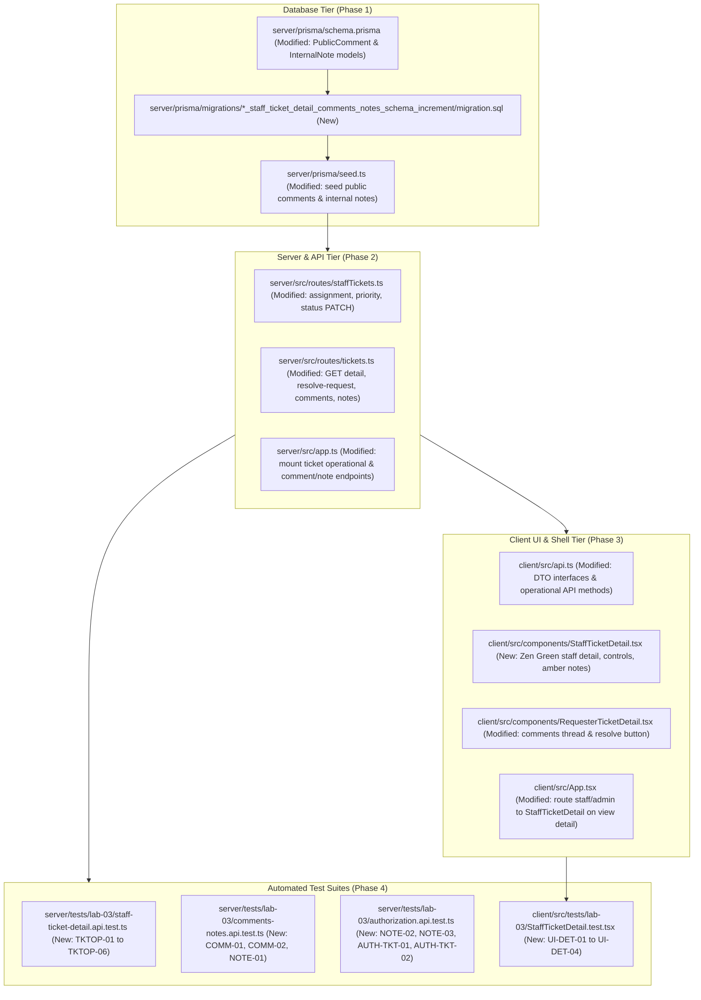

# Technical Implementation Plan: Issue 14 — IT Staff Ticket Detail, Operational Controls, Comments & Notes

**Document ID**: PLAN-FEAT-14  
**Feature Branch**: `feature/14-staff-ticket-detail` (Issue 14)  
**Base Branch**: `lab3-staging`  
**Target Milestone**: TokTickIT Lab 3 (Sprint 3)  
**Authoritative Contract Reference**: [docs/features/14-staff-ticket-detail/contract.md](./contract.md)  
**Master Specifications**:
* [docs/lab-03/specification.md](../../lab-03/specification.md) (`FR-04`, `FR-05`, `BR-04`, `BR-05`, `BR-08`, `AC-09` to `AC-13`, `AC-14.1` to `AC-14.4`)
* [docs/lab-03/api-spec.md](../../lab-03/api-spec.md) (§3.3, §3.4, §4.2 to §4.4, §5.1, §5.2)
* [docs/lab-03/ui-spec.md](../../lab-03/ui-spec.md) (Screen 4, Screen 5, Zen Green & Amber Security Tokens)
* [docs/lab-03/tests.md](../../lab-03/tests.md) (`TKTOP-01` to `TKTOP-06`, `COMM-01`, `COMM-02`, `NOTE-01` to `NOTE-03`, `UI-DET-01`, `UI-DET-02`)
* [AGENTS.md](../../../AGENTS.md) (Work Norms: Closed-World Rule, TDD, Theme Compliance, Blur Validation Rule)
**Document Status**: Ready for Review & Execution  

---

## 1. Target File Inventory

Below is the complete, exhaustive inventory of all files to be created or modified across `server/`, `client/`, `prisma/`, and `tests/`:



### Detailed Inventory Table

| Component | Path | Action | Description |
| :--- | :--- | :---: | :--- |
| **Prisma** | `server/prisma/schema.prisma` | `MODIFY` | Add append-only `PublicComment` and `InternalNote` models with `@db.VarChar(2000)`; add `publicComments` and `internalNotes` relations to `Ticket` and `User`. |
| **Prisma** | `server/prisma/migrations/...` | `NEW` | Migration script generated via `npx prisma migrate dev --name staff_ticket_detail_comments_notes_schema_increment`. |
| **Prisma** | `server/prisma/seed.ts` | `MODIFY` | Seed representative public comments and internal notes on existing seeded tickets across varied statuses. |
| **Server** | `server/src/routes/staffTickets.ts` | `MODIFY` | Add operational PATCH endpoints: `/api/v1/staff/tickets/:id/assignment`, `/priority`, and `/status` (enforcing status transition matrix). |
| **Server** | `server/src/routes/tickets.ts` | `MODIFY` | Refactor `getTicketById` to support role-filtered detail (strip `internalNotes` for requesters, allow staff/admin all tickets); add `POST /:id/resolve-request`, `POST /:id/comments`, and `POST /:id/notes`. |
| **Server** | `server/src/app.ts` | `MODIFY` | Mount newly added routes on both `/api/v1/tickets` and `/api/tickets` compatibility paths. |
| **Client** | `client/src/api.ts` | `MODIFY` | Export TypeScript interfaces (`PublicCommentDTO`, `InternalNoteDTO`, `StaffTicketDetailDTO`, etc.) and export helper methods for assignment, priority, status transition, resolve-request, comments, and notes. |
| **Client** | `client/src/components/StaffTicketDetail.tsx` | `NEW` | Zen Green IT Staff Ticket Detail component with ticket header, read-only requester context, operational controls (Owner/Claim, Priority, Status transition), attachments panel, public comments thread, and high-contrast amber internal notes thread with lock icon. |
| **Client** | `client/src/components/RequesterTicketDetail.tsx` | `MODIFY` | Add "Problem Appears Resolved" button & confirmed banner (`BR-05`); add Public Comments thread and form; strictly exclude Internal Notes. |
| **Client** | `client/src/App.tsx` | `MODIFY` | Route ticket detail view to `<StaffTicketDetail />` for `IT_STAFF` and `ADMINISTRATOR` roles, and `<RequesterTicketDetail />` for `REQUESTER` role. |
| **Tests** | `server/tests/lab-03/staff-ticket-detail.api.test.ts` | `NEW` | Supertest integration tests for claiming, reassignment, priority updates, status transitions, and requester resolution indication (`TKTOP-01` to `TKTOP-06`, `AC-14.1`, `AC-14.4`). |
| **Tests** | `server/tests/lab-03/comments-notes.api.test.ts` | `NEW` | Supertest integration tests for public comments and internal notes creation, trimming validation (1–2000 chars), and append-only immutability (`COMM-01`, `COMM-02`, `NOTE-01`, `AC-14.2`). |
| **Tests** | `server/tests/lab-03/authorization.api.test.ts` | `NEW` | Supertest integration tests for role boundaries: requester forbidden on internal notes (`403`), internal notes stripped on detail retrieval (`BR-04`), cross-requester protection (`NOTE-02`, `NOTE-03`, `AUTH-TKT-01`, `AUTH-TKT-02`, `AC-14.3`). |
| **Tests** | `client/src/tests/lab-03/StaffTicketDetail.test.tsx` | `NEW` | React Testing Library component tests for operational controls, amber visual styling, lock icons, comment/note submission, and requester view isolation (`UI-DET-01` to `UI-DET-04`, `AC-14.1` to `AC-14.4`). |

---

## 2. Phase 1: Database Modeling, Migration & Seed Increment

### 2.1. Prisma Schema Modifications (`server/prisma/schema.prisma`)
1. **Update `User` Model**:
   Add relational fields referencing public comments and internal notes:
   ```prisma
   model User {
     // ... existing fields ...
     submittedTickets   Ticket[]     @relation("RequesterTickets")
     assignedTickets    Ticket[]     @relation("StaffOwnedTickets")
     removedAttachments Attachment[] @relation("UserRemovedAttachments")

     // Issue 14 increments
     publicComments     PublicComment[] @relation("UserPublicComments")
     internalNotes      InternalNote[]  @relation("UserInternalNotes")

     @@map("users")
   }
   ```
2. **Update `Ticket` Model**:
   Add relational fields referencing public comments and internal notes:
   ```prisma
   model Ticket {
     // ... existing fields ...
     attachments         Attachment[]

     // Issue 14 increments
     publicComments      PublicComment[]
     internalNotes       InternalNote[]

     @@index([requesterId])
     @@index([ownerId])
     @@index([currentStatus])
     @@index([itPriority])
     @@index([createdAt])
     @@map("tickets")
   }
   ```
3. **Define `PublicComment` Model**:
   ```prisma
   model PublicComment {
     id        Int      @id @default(autoincrement())
     ticketId  Int
     authorId  Int
     content   String   @db.VarChar(2000)
     createdAt DateTime @default(now())

     // Relational Integrity
     ticket    Ticket   @relation(fields: [ticketId], references: [id], onDelete: Cascade)
     author    User     @relation("UserPublicComments", fields: [authorId], references: [id], onDelete: Restrict)

     @@index([ticketId])
     @@index([authorId])
     @@map("public_comments")
   }
   ```
4. **Define `InternalNote` Model**:
   ```prisma
   model InternalNote {
     id        Int      @id @default(autoincrement())
     ticketId  Int
     authorId  Int
     content   String   @db.VarChar(2000)
     createdAt DateTime @default(now())

     // Relational Integrity
     ticket    Ticket   @relation(fields: [ticketId], references: [id], onDelete: Cascade)
     author    User     @relation("UserInternalNotes", fields: [authorId], references: [id], onDelete: Restrict)

     @@index([ticketId])
     @@index([authorId])
     @@map("internal_notes")
   }
   ```
   *Note: Both models omit `updatedAt` to enforce append-only lifecycle at the database definition level (`BR-08`).*

### 2.2. Migration Execution
Run the Prisma migration command to generate SQL and update the database:
```bash
cd server
npx prisma migrate dev --name staff_ticket_detail_comments_notes_schema_increment
npx prisma generate
```

### 2.3. Seed Data Specification (`server/prisma/seed.ts`)
Update `server/prisma/seed.ts` to add public comments and internal notes across tickets:
1. Public comments authored by Requester (`sompong.it@kmutt.ac.th`) and IT Staff (`wichai.it@kmutt.ac.th`).
2. Internal notes authored by IT Staff (`wichai.it@kmutt.ac.th`) and Admin (`admin.toktick@kmutt.ac.th`).
3. Establish a clean baseline by executing:
```bash
npx prisma migrate reset --force
```
*(This automatically reruns all migrations and executes `prisma/seed.ts`, verifying clean idempotency).*

---

## 3. Phase 2: Backend Operational APIs & Authorization Protocols

### 3.1. Refactor `GET /api/v1/tickets/:id` (`server/src/routes/tickets.ts`)
1. **Authentication & Identity**:
   - Extract authenticated user via `req.user`.
   - If user is `REQUESTER`: Enforce `ticket.requesterId === req.user.id` (`BR-03`). Return `403 Forbidden` (`FORBIDDEN`) or `404 Not Found` if not owned.
   - If user is `IT_STAFF` or `ADMINISTRATOR`: Permitted to retrieve any ticket.
2. **Data Inclusion & Filtering (`BR-04`)**:
   - Query Prisma with `include`: `requester`, `owner`, `category`, `relatedSystem`, `attachments` (filtered `isRemoved: false`), and `publicComments` (ordered by `createdAt: "asc"`).
   - If user is `IT_STAFF` or `ADMINISTRATOR`: also query `internalNotes` (ordered by `createdAt: "asc"`).
   - If user is `REQUESTER`: strictly **omit `internalNotes`** from query or strip it from the response object (`internalNotes: undefined`).
3. **Response Envelope**:
   - Return `{ ticket: ticketData, ...ticketData }` to preserve root-level properties for Lab 2 client regression tests while providing the standardized `{ ticket }` envelope for Lab 3 consumers.

### 3.2. Operational Endpoints in `server/src/routes/staffTickets.ts`

```typescript
// Router: staffTicketsRouter mounted at /api/v1/staff/tickets

// 1. PATCH /api/v1/staff/tickets/:id/assignment
staffTicketsRouter.patch(
  "/:id/assignment",
  requireAuth,
  requirePasswordChanged,
  requireRole("IT_STAFF", "ADMINISTRATOR"),
  assignTicketOwner
);

// 2. PATCH /api/v1/staff/tickets/:id/priority
staffTicketsRouter.patch(
  "/:id/priority",
  requireAuth,
  requirePasswordChanged,
  requireRole("IT_STAFF", "ADMINISTRATOR"),
  updateTicketPriority
);

// 3. PATCH /api/v1/staff/tickets/:id/status
staffTicketsRouter.patch(
  "/:id/status",
  requireAuth,
  requirePasswordChanged,
  requireRole("IT_STAFF", "ADMINISTRATOR"),
  transitionTicketStatus
);
```

#### Detailed Handler Specifications:
* **`assignTicketOwner`**:
  - Accepts `{ ownerId: number | null }`.
  - If `ownerId !== null`: Verifies user exists, has `isActive: true`, and role is `IT_STAFF` or `ADMINISTRATOR`. If not, returns `400 Bad Request` (`INVALID_ASSIGNEE`).
  - Updates `ticket.ownerId`. Returns `200 OK` with `{ message: "Ownership updated successfully.", owner: { id, name, email } | null }`.
* **`updateTicketPriority`**:
  - Accepts `{ itPriority: Priority }`.
  - Validates against `LOW | MEDIUM | HIGH | URGENT`. If invalid, returns `400 Bad Request` (`VALIDATION_FAILED`).
  - Updates `ticket.itPriority`. Returns `200 OK` with `{ message: "IT Priority updated.", itPriority }`.
* **`transitionTicketStatus`**:
  - Accepts `{ status: TicketStatus }`.
  - Enforces state machine transition matrix:
    ```typescript
    const ALLOWED_TRANSITIONS: Record<TicketStatus, TicketStatus[]> = {
      NEW: ["OPEN", "CANCELLED"],
      OPEN: ["IN_PROGRESS", "WAITING_FOR_REQUESTER", "CANCELLED"],
      IN_PROGRESS: ["WAITING_FOR_REQUESTER", "RESOLVED", "CANCELLED"],
      WAITING_FOR_REQUESTER: ["IN_PROGRESS", "RESOLVED"],
      RESOLVED: ["CLOSED", "REOPENED"],
      CLOSED: ["REOPENED"],
      REOPENED: ["IN_PROGRESS", "CANCELLED"],
      CANCELLED: [],
    };
    ```
  - If `!ALLOWED_TRANSITIONS[currentStatus].includes(targetStatus)`, rejects with `400 Bad Request` (`INVALID_STATUS_TRANSITION`, `"Cannot transition ticket status from X to Y."`).
  - Updates `ticket.currentStatus`. Returns `200 OK` with `{ message: "Ticket status transitioned.", currentStatus }`.

### 3.3. Ticket Actions in `server/src/routes/tickets.ts`

```typescript
// 1. POST /api/v1/tickets/:id/resolve-request (BR-05)
export async function indicateProblemResolved(req: Request, res: Response) {
  // Enforces ownership: ticket.requesterId === req.user.id
  // Rejects terminal states (CLOSED, CANCELLED) with 400 Bad Request
  // Sets ticket.requesterResolvedAt = new Date() without changing currentStatus
  // Returns 200 OK with { message: "Problem resolution recorded.", requesterResolvedAt }
}

// 2. POST /api/v1/tickets/:id/comments (Public Comments)
export async function appendPublicComment(req: Request, res: Response) {
  // Permitted roles: owning Requester, IT_STAFF, ADMINISTRATOR
  // Non-owning Requester returns 403 Forbidden
  // Content validation: 1 <= content.trim().length <= 2000
  // Persists PublicComment record linked to ticketId and authorId (req.user.id)
  // Returns 201 Created with { comment }
}

// 3. POST /api/v1/tickets/:id/notes (Internal Notes - BR-04)
export async function appendInternalNote(req: Request, res: Response) {
  // Permitted roles: IT_STAFF, ADMINISTRATOR strictly
  // Requester role receives 403 Forbidden (FORBIDDEN)
  // Content validation: 1 <= content.trim().length <= 2000
  // Persists InternalNote record linked to ticketId and authorId (req.user.id)
  // Returns 201 Created with { note }
}
```

Mount these handlers in `server/src/app.ts` under `/api/v1/tickets` and `/api/tickets`.

---

## 4. Phase 3: Frontend Zen Green UI & Component Engineering

### 4.1. Client API Client Extension (`client/src/api.ts`)
1. **Export DTO Interfaces**:
   - `PublicCommentDTO`: `{ id, ticketId, content, author: { id, name, role }, createdAt }`.
   - `InternalNoteDTO`: `{ id, ticketId, content, author: { id, name, role }, createdAt }`.
   - `StaffTicketDetailDTO`: Comprehensive ticket fields including `requester`, `owner`, `category`, `relatedSystem`, `attachments`, `publicComments`, `internalNotes`, `requesterResolvedAt`.
2. **Export API Functions**:
   - `assignTicketOwner(ticketId: number, ownerId: number | null)`
   - `updateTicketPriority(ticketId: number, itPriority: string)`
   - `transitionTicketStatus(ticketId: number, status: string)`
   - `indicateProblemResolved(ticketId: number)`
   - `postPublicComment(ticketId: number, content: string)`
   - `postInternalNote(ticketId: number, content: string)`

### 4.2. Build `StaffTicketDetail.tsx` (`client/src/components/StaffTicketDetail.tsx`)
Create a dedicated component for resolvers conforming to Zen Green tokens and Screen 4 layout:
1. **Header & Navigation**:
   - `< Back to Staff Queue` button (triggers `onBack()`).
   - Ticket Number (`TKT-YYYY-NNNNN`), Current Status badge, and IT Priority badge.
2. **Left Column: Read-Only Ticket Context (60%)**:
   - Requester details card: Name, Department, Email.
   - Classification card: Category, Related System, Requested Priority badge, Created timestamp.
   - Problem Summary (prominent `h3`).
   - Problem Description (`white-space: pre-wrap`, read-only shaded canvas).
   - **Requester Resolution Banner**: If `requesterResolvedAt` is present, render alert box:
     `"★ Requester indicated problem appears resolved on [Formatted Date]."`
3. **Right Column: Operational Controls (40%)**:
   - **Ticket Ownership Card**: Current owner display, staff selection dropdown, and **"Claim Ticket (Assign to Me)"** 1-click button (disabled if already owner).
   - **IT Priority Setting Card**: Dropdown (`LOW`, `MEDIUM`, `HIGH`, `URGENT`) with save button.
   - **Status Workflow Card**: Current status badge, next allowed status dropdown (filtered by transition matrix), and "Transition Status" button with modal confirmation for terminal states.
   - **Attachments Card**: File list with download actions preserving Lab 2 attachments.
4. **Bottom Section: Dual Collaboration Threads**:
   - **Public Comments Section**:
     - Light pale green container (`#FFFFFF` surface, `--zen-pale-green` hover).
     - Header: `"Public Comments (Visible to Requester & Staff)"`.
     - Chronological comment cards with author name, role badge, timestamp, and message.
     - Textarea with character counter (max 2000) and green primary submit button (`.btn-zen-primary`).
   - **Internal Notes Section (High-Contrast Amber Visual Guardrail)**:
     - Container background: `var(--zen-note-bg): #FFFBEB`.
     - Container border: `2px solid #F59E0B`.
     - Prominent Banner: `🔒 STRICTLY CONFIDENTIAL — IT STAFF ONLY`.
     - Note cards with amber tag: `CONFIDENTIAL INTERNAL NOTE`.
     - Textarea with character counter and amber warning submit button (`.btn-zen-amber`).

### 4.3. Update `RequesterTicketDetail.tsx` (`client/src/components/RequesterTicketDetail.tsx`)
1. **Add "Problem Appears Resolved" Action (`BR-05`)**:
   - If `ticket.requesterResolvedAt === null` and ticket status is not terminal (`CLOSED`, `CANCELLED`), render `"Problem Appears Resolved"` button in header.
   - Modal confirmation: *"Indicate that this problem appears resolved? (This notifies IT Staff that your issue is resolved, but does not immediately close the ticket)."*
   - On confirmation, call `api.indicateProblemResolved(ticket.id)`.
   - Once resolved, render confirmed green alert banner:
     `"✓ You indicated this problem appears resolved on [Formatted Date]. IT Staff has been notified."`
2. **Add Public Comments Thread**:
   - Render public comments in chronological order.
   - Textarea to post new comment with character count limit (2000 chars).
3. **Strict Information Barrier (`BR-04`)**:
   - Completely exclude Internal Notes and operational controls from DOM tree.

### 4.4. Update Shell View Routing (`client/src/App.tsx`)
In `client/src/App.tsx`, when `activeView === "detail" && selectedTicketId`:
- If `user.role === "REQUESTER"`: render `<RequesterTicketDetail ticketId={selectedTicketId} onBack={...} />`.
- If `user.role === "IT_STAFF" || user.role === "ADMINISTRATOR"`: render `<StaffTicketDetail ticketId={selectedTicketId} onBack={...} />`.

---

## 5. Phase 4: STS Automated Verification Workflow

### 5.1. Mandatory Database Reset Rule
> [!IMPORTANT]
> **Mandatory Pre-Condition**: Prior to running any server test suite, always run:
> ```bash
> cd server
> npx prisma migrate reset --force
> ```
> This ensures that all migrations, clean seed data, and schema relations are synchronized in PostgreSQL, avoiding foreign key conflicts or dirty state flakiness.

### 5.2. Test Suites Implementation

#### 1. `server/tests/lab-03/staff-ticket-detail.api.test.ts`
* **`TKTOP-01`**: IT Staff claims unassigned ticket (`PATCH .../assignment` with `ownerId = staffId`).
* **`TKTOP-02`**: IT Staff reassigns ticket to another staff member or unassigns with `ownerId: null`.
* **`TKTOP-03`**: IT Staff updates IT priority (`PATCH .../priority`).
* **`TKTOP-04`**: Permitted status transition (e.g. `NEW` $\rightarrow$ `OPEN`, `OPEN` $\rightarrow$ `IN_PROGRESS`).
* **`TKTOP-05`**: Prohibited status transition (e.g. `NEW` $\rightarrow$ `CLOSED`, `CANCELLED` $\rightarrow$ `OPEN`) rejected with `400 Bad Request` (`INVALID_STATUS_TRANSITION`).
* **`TKTOP-06`**: Requester indicates "Problem Appears Resolved" (`POST .../resolve-request`); records `requesterResolvedAt` without modifying `currentStatus` (`BR-05`).

#### 2. `server/tests/lab-03/comments-notes.api.test.ts`
* **`COMM-01`**: Requester and IT Staff append Public Comments (`POST .../comments`); returns `201 Created` with author metadata.
* **`COMM-02`**: Empty or whitespace-only comment rejected with `400 Bad Request` (`VALIDATION_FAILED`); comment exceeding 2000 characters rejected with `400`.
* **`NOTE-01`**: IT Staff appends Internal Note (`POST .../notes`); returns `201 Created` with staff author.
* **Append-Only Test**: Verify no `PUT`, `PATCH`, or `DELETE` endpoints exist for comments or notes (`404` or `405`).

#### 3. `server/tests/lab-03/authorization.api.test.ts`
* **`NOTE-02`**: Requester attempting to post Internal Note receives HTTP `403 Forbidden` (`FORBIDDEN`) (`BR-04`).
* **`NOTE-03`**: Requester querying `GET /api/v1/tickets/:id` receives payload with `internalNotes` strictly stripped (`BR-04`).
* **`AUTH-TKT-01`**: Requester attempting to view unowned ticket receives HTTP `403` or `404` (`BR-03`).
* **`AUTH-TKT-02`**: Requester attempting operational PATCH endpoints (`/assignment`, `/priority`, `/status`) receives HTTP `403 Forbidden`.

#### 4. `client/src/tests/lab-03/StaffTicketDetail.test.tsx`
* **`UI-DET-01`**: Renders ticket metadata, claim shortcut button, IT priority dropdown, status transition dropdown, and attachments list.
* **`UI-DET-02`**: Verifies high-contrast amber container (`--zen-note-bg`, `2px solid #F59E0B`), lock icon (`🔒`), and confidentiality banner on Internal Notes.
* **`UI-DET-03`**: Submits Public Comment and Internal Note, validating optimistic/async UI thread updates.
* **`UI-DET-04`**: Requester view displays "Problem Appears Resolved" button, confirms transformation into green banner, and verifies complete absence of Internal Notes.

### 5.3. Execution Command Verification Protocol
```bash
# Step 1: Server Database Reset & Migration Verification
cd server
npx prisma migrate reset --force

# Step 2: Run Server Integration & Security Suites
npx vitest run tests/lab-03/staff-ticket-detail.api.test.ts
npx vitest run tests/lab-03/comments-notes.api.test.ts
npx vitest run tests/lab-03/authorization.api.test.ts

# Step 3: Run Client UI Component Suite
cd ../client
npx vitest run src/tests/lab-03/StaffTicketDetail.test.tsx

# Step 4: Run Full Regression Suites
cd ../server && npm test
cd ../client && npm test
```

---

## 6. Definition of Done (DoD) for Issue 14 Execution

Before requesting PR merge from `feature/14-staff-ticket-detail` to `lab3-staging`, verify:
1. `npx prisma migrate reset --force` completes without error.
2. All 4 new automated test files pass 100% with zero flakes or test skips.
3. Requester identity and ownership strictly honored via server session (`req.user.id`).
4. Internal Notes leak prevention verified: completely absent in Requester responses and UI.
5. High-contrast amber styling and lock icons verified on Staff Ticket Detail.
6. Zero git regressions in existing Lab 2 and Issue 12/13 test suites.
