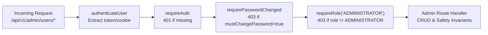

# Feature 15 Engineering Contract: Administrator User Management & Account Safety

**Feature Title**: Administrator User Management & Account Safety  
**Branch Name**: `feature/15-admin-user-management` (Issue 15)  
**Base Branch**: `lab3-staging`  
**Document Status**: Approved Feature Baseline  
**Author**: TokTickIT Engineering Team  
**Traceability References**:
* [TokTickIT-System-Level-SDS-v1.0.pdf](../../reference/TokTickIT-System-Level-SDS-v1.0.pdf) (§Architecture, §Data Conventions, §Security Invariants)
* [Lab_3_sheet.pdf](../../reference/Lab_3_sheet.pdf) (§1, §3, §4.3, §4.4, §5.1, §6, §7, §8.5, §14 Part 8)
* [docs/lab-03/specification.md](../../lab-03/specification.md) (`FR-06`, `BR-01`, `BR-02`, `BR-09`, `BR-10`, `BR-11`, `BR-12`, `AC-14`, `AC-15`, `AC-15.1` through `AC-15.5`)
* [docs/lab-03/ui-spec.md](../../lab-03/ui-spec.md) (Zen Green Tokens, Typography, Role Badges, Account Activation Badges, Screen 6: Administrator User Management, Modal Wireframes, Responsive Breakpoints)
* [docs/lab-03/api-spec.md](../../lab-03/api-spec.md) (§6 Administrator User Management APIs, §6.1 Retrieve User List, §6.2 Create User, §6.3 Edit User Details & Active Status, §6.4 Reset Initial Password)
* [docs/lab-03/tests.md](../../lab-03/tests.md) (STS Test Catalog `ADMIN-01` to `ADMIN-07`, `UI-ADM-01`, `E2E-03`)
* [docs/lab-03/poc-scope-and-issues.md](../../lab-03/poc-scope-and-issues.md) (Issue 15 Decomposition)
* [AGENTS.md](../../../AGENTS.md) (Work Norms: Strict Closed-World Rule, TDD, Theme Compliance, Blur Validation Rule)

---

## 1. Feature Scope & Objectives

### 1.1. Strategic Objectives
Issue 15 delivers the administrative core and critical account safety guardrails for the TokTickIT Service Desk. Following the delivery of Authentication Foundation (Issue 12), IT Staff Ticket Queue (Issue 13), and IT Staff Ticket Detail (Issue 14), this feature establishes the self-contained administrative user management console (`/admin/users`) and backend API endpoints (`/api/v1/admin/users/*`).

The system enables authorized Administrators to provision, inspect, modify, activate/deactivate user accounts, and reset initial credentials without requiring external identity providers or complex enterprise directory federation. Crucially, Issue 15 enforces strict system invariants that guarantee system continuity and prevent catastrophic administrative lockout.

Key objectives include:
1. **Administrative Access Control**:
   - Restrict all `/api/v1/admin/users/*` routes and the `/admin/users` UI view strictly to users possessing the `ADMINISTRATOR` role.
   - Return HTTP `403 Forbidden` (`FORBIDDEN`) for `REQUESTER` and `IT_STAFF` roles; return HTTP `401 Unauthorized` (`UNAUTHENTICATED`) for unauthenticated requests.
2. **User Listing & Searchable Directory**:
   - Deliver a responsive Zen Green table listing all registered users with Name, Email Address, Role badge, Active/Inactive status badge, Creation timestamp, and Action buttons (`Edit`, `Reset Password`).
   - Support case-insensitive partial keyword search matching against either `name` or `email`.
   - Support optional single-role filtering (`REQUESTER`, `IT_STAFF`, `ADMINISTRATOR`).
3. **User Account Provisioning**:
   - Provide an intuitive "Create User" slideout/modal to create new accounts with Full Name, Email, exactly one permitted Role, initial activation state, and Initial Password.
   - Automatically assign `mustChangePassword = true` upon creation to compel password change on initial login (`FR-02`, `BR-02`).
   - Validate password strength meeting university security rules (min 8 chars, uppercase, lowercase, digit, special character).
   - Enforce case-insensitive email uniqueness, returning HTTP `409 Conflict` (`EMAIL_ALREADY_EXISTS`) on collisions (`BR-10`).
4. **User Profile Modification & Activation Management**:
   - Allow Administrators to edit an existing user's Name, Email, Role, and Active status (`isActive`).
   - Enforce that user deletion is strictly prohibited; accounts are disabled via deactivation (`isActive = false`) to preserve ticket history, ownership auditability, and comment/note attribution.
5. **Initial Password Resets**:
   - Enable Administrators to issue a new initial password for any user account.
   - Automatically flag the user with `mustChangePassword = true` so the user is forced into the mandatory password change workflow on subsequent login.
6. **Critical Account Safety Guardrails**:
   - **BR-11 Self-Deactivation Prevention**: Strictly prevent an Administrator from deactivating their own active account or demoting their own role (HTTP `400 Bad Request` or `403 Forbidden` with `CANNOT_DEACTIVATE_SELF`).
   - **BR-12 Last Active Administrator Preservation**: Strictly prevent deactivating or demoting the final remaining active Administrator in the system (HTTP `400 Bad Request` or `409 Conflict` with `CANNOT_DEACTIVATE_LAST_ADMIN`).

---

### 1.2. In-Scope Deliverables

| Deliverable Area | Component / File Path | Core Functionality |
| :--- | :--- | :--- |
| **Backend REST API Router** | `server/src/routes/adminUsers.ts` | Complete router for `/api/v1/admin/users/*` implementing listing, creation, modification, safety checks, and initial password reset. |
| **Server App Integration** | `server/src/app.ts` | Mount `adminUsersRouter` under `/api/v1/admin/users` and `/api/admin/users` guarded by `requireRole("ADMINISTRATOR")`. |
| **Client API Client** | `client/src/api.ts` | Frontend API client methods: `fetchAdminUsers`, `createAdminUser`, `updateAdminUser`, `resetUserPassword`. |
| **Client UI View** | `client/src/components/UserManagement.tsx` | Full Zen Green user management screen with toolbar, search, role filter, data table, responsive card collapse, and action modals. |
| **Client Shell Integration** | `client/src/App.tsx`, `AppHeader.tsx` | Route integration for `activeView === "user-admin"` accessible by `ADMINISTRATOR` role. |
| **Backend Automated Tests** | `server/tests/lab-03/users-admin.api.test.ts` | Supertest integration tests verifying `ADMIN-01` through `ADMIN-07`, role guards, validation, and safety invariants. |
| **Frontend Automated Tests** | `client/src/tests/lab-03/UserManagement.test.tsx` | React Testing Library component tests verifying `UI-ADM-01` through `UI-ADM-05`, modals, safety feedback, and search interactions. |

---

### 1.3. Explicitly Excluded Scope (Strictly Out of Scope per Issue 15)

To prevent scope creep and maintain strict fidelity with Lab 3 requirements (§4.2, §8.5):
* **Hard User Deletion**: The system strictly supports deactivation (`isActive: false`). No `DELETE /api/v1/admin/users/:id` endpoint or database deletion operations will be provided.
* **Bulk User Operations**: No bulk user activation, bulk deactivation, bulk role changes, or multi-select table actions.
* **User Import / Export**: No CSV, Excel, or LDAP batch import or export mechanisms.
* **Department / Organization Management**: No organizational tree, department hierarchy, cost centers, or office room management.
* **Profile Avatars & Photos**: No user photo upload, avatar cropping, or image storage.
* **Email Password Delivery**: Initial passwords and reset passwords are communicated out-of-band by administrators. No SMTP, SendGrid, or automated email dispatch services.
* **Multiple Roles per User**: Every user has exactly one assigned role (`REQUESTER`, `IT_STAFF`, or `ADMINISTRATOR`) per `BR-09`. No custom permissions, groups, or composite roles.
* **Server-Side Pagination on User Table**: The user list returns all matching users with `totalCount`. Client-side pagination or unbounded scrolling is sufficient for the Lab 3 administrative user scale.

---

## 2. Database Modeling & Safety Protocols

### 2.1. Prisma Model Specification (`server/prisma/schema.prisma`)

Issue 15 utilizes the existing unified `User` model established in Sprint 3 (Issue 12):

```prisma
// ---------------------------------------------------------------------------
// 0. Role Enum (Strict Single-Role Policy per BR-09)
// ---------------------------------------------------------------------------
enum Role {
  REQUESTER
  IT_STAFF
  ADMINISTRATOR
}

// ---------------------------------------------------------------------------
// 1. User Model (Unified Authenticated Identity)
// ---------------------------------------------------------------------------
model User {
  id                 Int          @id @default(autoincrement())
  name               String       // Full display name (min 2, max 100 chars)
  email              String       @unique // Stored & queried in normalized lowercase (BR-10)
  passwordHash       String       // Hashed via bcrypt (cost factor 10); never plaintext
  role               Role         @default(REQUESTER) // Strictly one role per user (BR-09)
  department         String?      // Preserved optional affiliation string
  isActive           Boolean      @default(true) // Account state; deactivation preserves foreign keys
  mustChangePassword Boolean      @default(true) // Forces change on first login (FR-02, BR-02)
  createdAt          DateTime     @default(now())
  updatedAt          DateTime     @updatedAt

  // Relational Integrity & Audit Trails
  submittedTickets   Ticket[]     @relation("RequesterTickets")
  assignedTickets    Ticket[]     @relation("StaffOwnedTickets")
  removedAttachments Attachment[] @relation("UserRemovedAttachments")
  publicComments     PublicComment[] @relation("UserPublicComments")
  internalNotes      InternalNote[]  @relation("UserInternalNotes")

  @@map("users")
}
```

---

### 2.2. Safety Protocols & Business Rules

#### BR-09: Single-Role Policy
* Every user in the system is assigned exactly one role from the `Role` enum:
  - `REQUESTER`: Can create tickets, view owned tickets, post public comments, download attachments, and indicate problem resolution.
  - `IT_STAFF`: Can view the shared ticket queue, claim/assign tickets, adjust IT priority, transition status, post public comments, and post/view private internal notes.
  - `ADMINISTRATOR`: Inherits staff ticketing capabilities and holds exclusive authority to manage user accounts, assign roles, toggle activation, and reset initial passwords.
* Multi-role assignments, composite role arrays, and fine-grained permissions are strictly prohibited.

#### BR-10: Unique Email & Credential Storage Policy
* Email addresses must be unique across all users in the system.
* Email matching is case-insensitive. All email inputs must be trimmed of leading/trailing whitespace and normalized to lowercase (`email.trim().toLowerCase()`) prior to database queries and persistence.
* Any attempt to create a user or update an existing user with an email already belonging to another account must be rejected with HTTP `409 Conflict` (`EMAIL_ALREADY_EXISTS`).
* Passwords must never be stored in plaintext. All passwords (initial passwords and reset passwords) must be securely hashed using `bcrypt` (minimum 10 salt rounds) or `Argon2id` before saving.
* All passwords must satisfy the university complexity rules:
  - Minimum 8 characters in length.
  - At least 1 uppercase letter (`[A-Z]`).
  - At least 1 lowercase letter (`[a-z]`).
  - At least 1 numeric digit (`[0-9]`).
  - At least 1 special symbol (`[!@#$%^&*()_+\-=\[\]{};':"\\|,.<>\/?]`).

#### BR-11: Administrator Self-Deactivation Prevention Rule
* An Administrator is strictly prohibited from modifying their own account's `isActive` status to `false` or demoting their own role from `ADMINISTRATOR`.
* When processing `PATCH /api/v1/admin/users/:id`:
  - If `Number(req.params.id) === req.user.id`:
    - If `isActive === false`: The request must be rejected with HTTP `400 Bad Request` or `403 Forbidden` (`CANNOT_DEACTIVATE_SELF`).
    - If `role !== undefined && role !== "ADMINISTRATOR"`: The request must be rejected with HTTP `400 Bad Request` or `403 Forbidden` (`CANNOT_DEMOTE_SELF`).
* In the frontend UI (`UserManagement.tsx`), if the logged-in Administrator opens the Edit modal for their own account:
  - The `Active` toggle switch and `Role` dropdown must be disabled (`disabled={true}`).
  - A contextual warning badge or helper copy must be displayed: *"You cannot deactivate or demote your own active administrator account (BR-11)."*

#### BR-12: Last Active Administrator Preservation Rule
* The system must preserve at least one active user with the `ADMINISTRATOR` role at all times to prevent irreparable lockout.
* When processing `PATCH /api/v1/admin/users/:id`:
  - Target user lookup: Retrieve current database record of target user.
  - If target user currently has `role === "ADMINISTRATOR"` and `isActive === true`:
    - If the update requests `isActive: false` OR requests a role demotion (`role !== "ADMINISTRATOR"`):
      - Query database: `count = await prisma.user.count({ where: { role: "ADMINISTRATOR", isActive: true } })`.
      - If `count <= 1`: The request must be rejected with HTTP `409 Conflict` or `400 Bad Request` (`CANNOT_DEACTIVATE_LAST_ADMIN`).
* In the frontend UI (`UserManagement.tsx`):
  - If only one active administrator exists in the user directory, the Edit modal for that user must disable the `Active` toggle and `Role` dropdown with helper text: *"Cannot deactivate or demote the system's last active Administrator (BR-12)."*

---

### 2.3. Idempotent Seed Data Plan (`server/prisma/seed.ts`)

The seed script must guarantee the presence of representative accounts across all roles and activation states to support reliable test execution and manual evaluation:

| Email Address | Full Name | Role | `isActive` | `mustChangePassword` | Initial Password | Purpose |
| :--- | :--- | :--- | :---: | :---: | :--- | :--- |
| `admin.toktick@kmutt.ac.th` | Admin TokTick | `ADMINISTRATOR` | `true` | `false` | `Password123!` | Primary active administrator account |
| `backup.admin@kmutt.ac.th` | Backup Admin | `ADMINISTRATOR` | `true` | `false` | `Password123!` | Secondary admin (enables testing multi-admin operations) |
| `wichai.it@kmutt.ac.th` | Wichai IT | `IT_STAFF` | `true` | `false` | `Password123!` | Active IT staff resolver |
| `nareerat.it@kmutt.ac.th` | Nareerat IT | `IT_STAFF` | `true` | `false` | `Password123!` | Active IT staff resolver |
| `ekachai.it@kmutt.ac.th` | Ekachai IT | `IT_STAFF` | `true` | `false` | `Password123!` | Active IT staff resolver |
| `inactive.staff@kmutt.ac.th` | Inactive Staff | `IT_STAFF` | `false` | `false` | `Password123!` | Deactivated staff account |
| `sompong.it@kmutt.ac.th` | Sompong IT | `REQUESTER` | `true` | `false` | `Password123!` | Active requester with tickets |
| `anong.st@kmutt.ac.th` | Anong Staff | `REQUESTER` | `true` | `false` | `Password123!` | Active requester with tickets |
| `mana.st@kmutt.ac.th` | Mana Student | `REQUESTER` | `true` | `false` | `Password123!` | Active requester with tickets |
| `kanda.fc@kmutt.ac.th` | Kanda Faculty | `REQUESTER` | `true` | `false` | `Password123!` | Active requester with tickets |
| `prasert.in@kmutt.ac.th` | Prasert Inactive | `REQUESTER` | `false` | `false` | `Password123!` | Deactivated requester account |
| `new.requester@kmutt.ac.th` | New Requester | `REQUESTER` | `true` | `true` | `InitialPass123!` | Account for testing mandatory initial password change |

---

## 3. API & Authorization Protocols

### 3.1. Middleware Chain & Security Invariants

All administrative user management routes rely on the layered Express middleware pipeline:



1. **`authenticateUser`**: Decodes session cookie (`toktickit_session`) or Bearer token (`Authorization: Bearer <token>`). Sets `req.user`.
2. **`requireAuth`**: If `req.user` is undefined, immediately returns HTTP `401 Unauthorized` (`UNAUTHENTICATED`).
3. **`requirePasswordChanged`**: If `req.user.mustChangePassword === true`, rejects access with HTTP `403 Forbidden` (`PASSWORD_CHANGE_REQUIRED`).
4. **`requireRole("ADMINISTRATOR")`**: If `req.user.role !== "ADMINISTRATOR"`, rejects access with HTTP `403 Forbidden` (`FORBIDDEN`).

---

### 3.2. REST Endpoint Contracts

#### 1. Retrieve User List
`GET /api/v1/admin/users`

* **Access**: `ADMINISTRATOR` strictly (`requireRole("ADMINISTRATOR")`).
* **Query Parameters**:
  - `search` (optional, string): Case-insensitive partial text matching against `name` OR `email`.
  - `role` (optional, string): Filter by single role (`REQUESTER`, `IT_STAFF`, `ADMINISTRATOR`).
* **Processing Logic**:
  - Build Prisma `where` clause:
    - If `search` provided: `OR: [{ name: { contains: search, mode: "insensitive" } }, { email: { contains: search, mode: "insensitive" } }]`
    - If `role` provided: `role: role as Role`
  - Query database: `findMany` ordering by `createdAt: "asc"`.
  - Exclude `passwordHash` from select/results.
* **Success Response `200 OK`**:
```json
{
  "users": [
    {
      "id": 1,
      "name": "Admin TokTick",
      "email": "admin.toktick@kmutt.ac.th",
      "role": "ADMINISTRATOR",
      "department": "IT Operations",
      "isActive": true,
      "mustChangePassword": false,
      "createdAt": "2026-09-01T08:00:00.000Z"
    },
    {
      "id": 2,
      "name": "Wichai IT",
      "email": "wichai.it@kmutt.ac.th",
      "role": "IT_STAFF",
      "department": "Network Engineering",
      "isActive": true,
      "mustChangePassword": false,
      "createdAt": "2026-09-01T08:30:00.000Z"
    }
  ],
  "totalCount": 2
}
```
* **Error Responses**:
  - `401 Unauthorized`: Unauthenticated request.
  - `403 Forbidden`: Authenticated as non-admin (`REQUESTER`, `IT_STAFF`) or `mustChangePassword === true`.

---

#### 2. Create User
`POST /api/v1/admin/users`

* **Access**: `ADMINISTRATOR` strictly.
* **Request Headers**: `Content-Type: application/json`.
* **Request Body**:
```json
{
  "name": "Siriporn Engineer",
  "email": "siriporn.en@kmutt.ac.th",
  "role": "IT_STAFF",
  "isActive": true,
  "initialPassword": "InitialPassword123!"
}
```
* **Validation & Business Rules**:
  - `name`: Required string, trimmed, length between 2 and 100 characters.
  - `email`: Required string, valid email format, trimmed and lowercased.
  - `role`: Required, must be one of `REQUESTER`, `IT_STAFF`, `ADMINISTRATOR` (`BR-09`).
  - `isActive`: Optional boolean, defaults to `true`.
  - `initialPassword`: Required string, must satisfy password complexity rules (`>= 8` chars, uppercase, lowercase, number, symbol).
  - Duplicate email check: If email already exists in database (case-insensitive), return HTTP `409 Conflict` with code `EMAIL_ALREADY_EXISTS` (`BR-10`).
* **Persistence Behavior**:
  - Hash `initialPassword` using `bcrypt.hash(initialPassword, 10)`.
  - Persist new user with `mustChangePassword: true` (`FR-02`, `BR-02`).
* **Success Response `201 Created`**:
```json
{
  "user": {
    "id": 16,
    "name": "Siriporn Engineer",
    "email": "siriporn.en@kmutt.ac.th",
    "role": "IT_STAFF",
    "isActive": true,
    "mustChangePassword": true,
    "createdAt": "2026-09-16T12:00:00.000Z"
  }
}
```
* **Error Responses**:
  - `400 Bad Request` (`VALIDATION_FAILED`): Missing required fields, invalid email format, or weak password.
  - `409 Conflict` (`EMAIL_ALREADY_EXISTS`): Email already in use by another user.
  - `403 Forbidden`: Requester or IT Staff attempting access.

---

#### 3. Edit User Details & Activation State
`PATCH /api/v1/admin/users/:id`

* **Access**: `ADMINISTRATOR` strictly.
* **Request Parameters**: `id` (integer).
* **Request Body**:
```json
{
  "name": "Siriporn Senior IT",
  "email": "siriporn.sr@kmutt.ac.th",
  "role": "IT_STAFF",
  "isActive": false
}
```
* **Validation & Safety Rules**:
  - Target user lookup: If user with `id` does not exist, return HTTP `404 Not Found`.
  - `name`: Optional string (2 to 100 chars after trim).
  - `email`: Optional string, valid email format, lowercased. If changed, verify that no other user has this email (`409 Conflict`).
  - `role`: Optional, must be valid `Role` enum value.
  - `isActive`: Optional boolean.
  - **Self-Deactivation Guardrail (`BR-11`)**:
    - If `targetId === req.user.id`:
      - If `isActive === false`: Reject with HTTP `400 Bad Request` (`code: "CANNOT_DEACTIVATE_SELF"`, message: `"Administrators cannot deactivate their own active account."`).
      - If `role !== undefined && role !== "ADMINISTRATOR"`: Reject with HTTP `400 Bad Request` (`code: "CANNOT_DEMOTE_SELF"`, message: `"Administrators cannot demote their own account."`).
  - **Last Active Administrator Guardrail (`BR-12`)**:
    - If target user is currently an active administrator (`target.role === "ADMINISTRATOR" && target.isActive === true`):
      - If `isActive === false` OR `(role !== undefined && role !== "ADMINISTRATOR")`:
        - Count active administrators: `activeAdminCount = await prisma.user.count({ where: { role: "ADMINISTRATOR", isActive: true } })`.
        - If `activeAdminCount <= 1`: Reject with HTTP `409 Conflict` (`code: "CANNOT_DEACTIVATE_LAST_ADMIN"`, message: `"Cannot deactivate or demote the system's last active Administrator."`).
* **Success Response `200 OK`**:
```json
{
  "user": {
    "id": 16,
    "name": "Siriporn Senior IT",
    "email": "siriporn.sr@kmutt.ac.th",
    "role": "IT_STAFF",
    "isActive": false,
    "mustChangePassword": true,
    "updatedAt": "2026-09-16T12:15:00.000Z"
  }
}
```
* **Error Responses**:
  - `400 Bad Request` (`CANNOT_DEACTIVATE_SELF`): Admin attempting to deactivate self.
  - `409 Conflict` (`CANNOT_DEACTIVATE_LAST_ADMIN`): Attempting to deactivate or demote sole remaining admin.
  - `409 Conflict` (`EMAIL_ALREADY_EXISTS`): Updated email already taken.
  - `404 Not Found`: Target user ID does not exist.

---

#### 4. Reset Initial Password
`POST /api/v1/admin/users/:id/reset-password`

* **Access**: `ADMINISTRATOR` strictly.
* **Request Parameters**: `id` (integer).
* **Request Body**:
```json
{
  "initialPassword": "TempPasswordReset456!"
}
```
* **Validation & Behavior**:
  - Target user lookup: Verify target user exists; return `404 Not Found` if not.
  - `initialPassword`: Required string conforming to password complexity rules (min 8 chars, uppercase, lowercase, digit, symbol).
  - Hash `initialPassword` using `bcrypt.hash(initialPassword, 10)`.
  - Update user record:
    - Set `passwordHash = newHash`.
    - Set `mustChangePassword = true` (forces user to complete password change on their next login).
* **Success Response `200 OK`**:
```json
{
  "message": "Initial password has been reset. User will be required to change it at next login.",
  "userId": 16
}
```
* **Error Responses**:
  - `400 Bad Request` (`VALIDATION_FAILED`): Password does not meet complexity requirements.
  - `404 Not Found`: Target user does not exist.
  - `403 Forbidden`: Non-admin role attempting access.

---

## 4. UI Wireframe & State Contracts

The Administrator User Management screen is built strictly using the KMUTT IT Service Desk "Zen Green" design tokens (`docs/lab-03/ui-spec.md`).

### 4.1. Administrator User Management Screen (`/admin/users`)

#### Desktop Wireframe Layout ($\ge 1200\text{px}$)

```
+---------------------------------------------------------------------------------------------------------+
| TokTickIT Desk   |  User Admin  |  Staff Queue  |  My Tickets             [ Admin TokTick (Admin) v ]   |
+---------------------------------------------------------------------------------------------------------+
|                                                                                                         |
| Administrator User Management                                                    [ + Create User ]      |
| Manage university user accounts, roles, activation statuses, and initial credentials                    |
|                                                                                                         |
| +-----------------------------------------------------------------------------------------------------+ |
| | [ Search by name or email...                    ]   [ Role Filter: All Roles v ]  [ Clear Filters ] | |
| +-----------------------------------------------------------------------------------------------------+ |
|                                                                                                         |
| Showing 12 registered users                                                                             |
| +-----------------------------------------------------------------------------------------------------+ |
| | Full Name          | Email Address             | Role             | Status     | Actions            | |
| +--------------------+---------------------------+------------------+------------+--------------------+ |
| | Admin TokTick (You)| admin.toktick@kmutt.ac.th | [Administrator]  | [Active]   | [Edit] [Reset Pwd] | |
| | Backup Admin       | backup.admin@kmutt.ac.th  | [Administrator]  | [Active]   | [Edit] [Reset Pwd] | |
| | Wichai IT          | wichai.it@kmutt.ac.th     | [IT Staff]       | [Active]   | [Edit] [Reset Pwd] | |
| | Sompong IT         | sompong.it@kmutt.ac.th    | [Requester]      | [Active]   | [Edit] [Reset Pwd] | |
| | Prasert Inactive   | prasert.in@kmutt.ac.th    | [Requester]      | [Inactive] | [Edit] [Reset Pwd] | |
| +-----------------------------------------------------------------------------------------------------+ |
+---------------------------------------------------------------------------------------------------------+
```

#### Responsive Breakpoints & Viewport Adaptations
* **Desktop ($\ge 1200\text{px}$)**: Full width container (`max-width: 1320px`), full data table, inline search and filter controls.
* **Tablet ($768\text{px} - 1024\text{px}$)**: Responsive table container with horizontal scroll padding; modals take 85% width.
* **Mobile ($< 768\text{px}$)**: Table collapses into stacked Zen Green user cards; minimum 48px tap targets; strictly zero horizontal page scrolling:

```
+-------------------------------------------------------+
| Admin TokTick (You)                   [Administrator] |
| admin.toktick@kmutt.ac.th                             |
| Status: [Active]                  Created: 2026-09-01 |
|                                                       |
| [ Edit User Details ]        [ Reset Initial Pwd ]    |
+-------------------------------------------------------+
```

---

### 4.2. "Create User" Slideout / Modal

```
+-------------------------------------------------------+
| Create New User Account                            [X]|
+-------------------------------------------------------+
| Provision a new user account with initial password.   |
|                                                       |
| [ Alert: Error message (e.g. Email exists) ]          |
|                                                       |
| Full Name *                                           |
| [ e.g. Siriporn Engineer                            ] |
|                                                       |
| Email Address *                                       |
| [ siriporn.en@kmutt.ac.th                           ] |
|                                                       |
| System Role *                                         |
| [ IT Staff                                         v ]|
|   (Options: Requester, IT Staff, Administrator)       |
|                                                       |
| Account Status                                        |
| [X] Active Account (Enabled)                          |
|                                                       |
| Initial Password *                                    |
| [ ******************                                ] |
| (Must be at least 8 characters with upper, lower,     |
|  number, and special symbol)                          |
|                                                       |
| (i) Notice: The user will be required to change this  |
|     initial password upon their first login (FR-02).  |
|                                                       |
| +---------------------------------------------------+ |
| | [ Cancel ]                        [ Create User ] | |
| +---------------------------------------------------+ |
+-------------------------------------------------------+
```

* **Validation Rules**:
  - `Full Name`: Required, min 2 chars.
  - `Email Address`: Required, valid university email format, trimmed on blur.
  - `System Role`: Defaults to `REQUESTER`. Exactly one selectable.
  - `Initial Password`: Validates complexity.
  - Blur Validation Rule: Malformed inputs clear on blur; form validation messages display on submit.
  - Button enters disabled state with inline spinner during submission (`"Creating User..."`).

---

### 4.3. "Edit User" Slideout / Modal & Safety Enforcements

```
+-------------------------------------------------------+
| Edit User Account: Admin TokTick                   [X]|
+-------------------------------------------------------+
| Modify user profile, role, or activation status.      |
|                                                       |
| [ Alert: Safety violation / Conflict (if error) ]     |
|                                                       |
| Full Name *                                           |
| [ Admin TokTick                                     ] |
|                                                       |
| Email Address *                                       |
| [ admin.toktick@kmutt.ac.th                         ] |
|                                                       |
| System Role *                                         |
| [ Administrator                                    v ]|
| [!] Cannot demote yourself or the last active admin   |
|                                                       |
| Account Activation Status                             |
| [X] Active Account (Disabled if self or last admin)   |
| [!] "You cannot deactivate your own active account"   |
|                                                       |
| +---------------------------------------------------+ |
| | [ Cancel ]                         [ Save Changes ] |
| +---------------------------------------------------+ |
+-------------------------------------------------------+
```

* **In-App Safety State Rules**:
  1. **Self-Editing Case (`user.id === loggedInUser.id`)**:
     - The `Active Account` checkbox is `disabled={true}`.
     - The `System Role` dropdown is `disabled={true}`.
     - Contextual alert: *"You cannot deactivate or demote your own active administrator account (BR-11)."*
  2. **Last Active Administrator Case (`totalActiveAdmins === 1 && user.role === "ADMINISTRATOR"`)**:
     - The `Active Account` checkbox is `disabled={true}`.
     - The `System Role` dropdown is `disabled={true}`.
     - Contextual alert: *"Cannot deactivate or demote the system's last active Administrator (BR-12)."*
  3. **Backend Safety Violation Handling**:
     - If a race condition occurs and the server responds with `CANNOT_DEACTIVATE_SELF` or `CANNOT_DEACTIVATE_LAST_ADMIN`, render a clear Zen Red error callout (`var(--zen-error-bg)` with red icon and explicit explanation).

---

### 4.4. "Reset Initial Password" Modal

```
+-------------------------------------------------------+
| Reset Initial Password: Wichai IT                  [X]|
+-------------------------------------------------------+
| Set a new temporary initial password for this user.   |
|                                                       |
| Target User: Wichai IT (wichai.it@kmutt.ac.th)        |
|                                                       |
| New Initial Password *                                |
| [ ******************                                ] |
|                                                       |
| Requirements:                                         |
| [v] Min 8 chars  [v] Uppercase  [v] Number  [v] Symbol|
|                                                       |
| (i) Notice: The user will be required to change this  |
|     password upon their next login (mustChangePassword|
|     will be reset to true).                           |
|                                                       |
| +---------------------------------------------------+ |
| | [ Cancel ]                      [ Reset Password ] | |
| +---------------------------------------------------+ |
+-------------------------------------------------------+
```

---

## 5. Test Workflow & Traceability Matrix

### 5.1. Mandatory Test Pre-Condition

> [!IMPORTANT]
> **Mandatory Execution Rule**: Always run `npx prisma migrate reset --force` prior to executing server test suites (`npm test` or `npx vitest run ...`).
> This guarantees that all seed data (dual active administrators, resolvers, and inactive accounts) are freshly initialized and test runs are completely deterministic without cross-suite contamination.

```bash
# Clean database reset before running test suites
cd server
npx prisma migrate reset --force
```

---

### 5.2. Acceptance Criteria Traceability Matrix (AC-15.1 through AC-15.5)

| AC ID | Specification Criteria | Backend Test Target (`server/`) | Frontend Test Target (`client/`) | Status |
| :--- | :--- | :--- | :--- | :---: |
| **AC-15.1** | *Given* an Administrator, *when* creating a user with valid details, *then* the account is created with one permitted role, and `mustChangePassword` is set to `true`. | `server/tests/lab-03/users-admin.api.test.ts`<br/>(`ADMIN-02`) | `client/src/tests/lab-03/UserManagement.test.tsx`<br/>(`UI-ADM-01`) | **Mapped** |
| **AC-15.2** | *Given* an email already in use, *when* creating or updating a user, *then* the API rejects the request with HTTP `409 Conflict`. | `server/tests/lab-03/users-admin.api.test.ts`<br/>(`ADMIN-03`) | `client/src/tests/lab-03/UserManagement.test.tsx`<br/>(`UI-ADM-02`) | **Mapped** |
| **AC-15.3** | *Given* an Administrator viewing their own account, *when* attempting to deactivate it, *then* the operation is blocked with a clear safety warning. | `server/tests/lab-03/users-admin.api.test.ts`<br/>(`ADMIN-04`) | `client/src/tests/lab-03/UserManagement.test.tsx`<br/>(`UI-ADM-03`) | **Mapped** |
| **AC-15.4** | *Given* only one active Administrator exists in the system, *when* attempting to deactivate or demote that user, *then* the system rejects the operation. | `server/tests/lab-03/users-admin.api.test.ts`<br/>(`ADMIN-05`) | `client/src/tests/lab-03/UserManagement.test.tsx`<br/>(`UI-ADM-04`) | **Mapped** |
| **AC-15.5** | *Given* an IT Staff or Requester user, *when* attempting to access `/api/v1/admin/users`, *then* the server responds with HTTP `403 Forbidden`. | `server/tests/lab-03/users-admin.api.test.ts`<br/>(`ADMIN-06`) | `client/src/tests/lab-03/UserManagement.test.tsx`<br/>(`UI-ADM-05`) | **Mapped** |

---

### 5.3. Complete Test Catalog

#### Backend API Test Suite (`server/tests/lab-03/users-admin.api.test.ts`)
* **`ADMIN-01`**: Administrator lists users (`GET /api/v1/admin/users`), supporting keyword search (`search=wichai`) and role filter (`role=IT_STAFF`).
* **`ADMIN-02`**: Administrator creates new user with valid details; verifies user persisted with `mustChangePassword: true` and hashed password (`POST /api/v1/admin/users`).
* **`ADMIN-03`**: Creation and update rejected with HTTP `409 Conflict` when using duplicate email address (`BR-10`).
* **`ADMIN-04`**: Self-deactivation attempt by Administrator rejected with HTTP `400 Bad Request` (`CANNOT_DEACTIVATE_SELF`) (`BR-11`).
* **`ADMIN-05`**: Deactivation or demotion of last active Administrator rejected with HTTP `409 Conflict` (`CANNOT_DEACTIVATE_LAST_ADMIN`) (`BR-12`).
* **`ADMIN-06`**: Non-admin users (`REQUESTER`, `IT_STAFF`) requesting administrative endpoints are rejected with HTTP `403 Forbidden`.
* **`ADMIN-07`**: Administrator resets user initial password (`POST /api/v1/admin/users/:id/reset-password`); verifies `mustChangePassword` is reset to `true`.

#### Frontend UI Component Suite (`client/src/tests/lab-03/UserManagement.test.tsx`)
* **`UI-ADM-01`**: Renders user management directory, search bar, role filter dropdown, and user table with role and status badges.
* **`UI-ADM-02`**: Opens "Create User" modal, validates input fields, submits new user, handles duplicate email conflict alert (`409`).
* **`UI-ADM-03`**: Opens "Edit User" modal for logged-in admin; verifies `Active` toggle is disabled with self-deactivation warning message (`BR-11`).
* **`UI-ADM-04`**: Opens "Edit User" modal for the sole active administrator; verifies `Active` toggle is disabled with last-admin protection warning message (`BR-12`).
* **`UI-ADM-05`**: Opens "Reset Password" modal, enters new initial password with complexity validation, and handles successful reset confirmation.

---

### 5.4. Exact Verification Execution Commands

```bash
# ---------------------------------------------------------------------------
# 1. Reset Database State (Mandatory Pre-Condition)
# ---------------------------------------------------------------------------
cd server
npx prisma migrate reset --force

# ---------------------------------------------------------------------------
# 2. Execute Backend Admin User Management API Tests
# ---------------------------------------------------------------------------
npx vitest run tests/lab-03/users-admin.api.test.ts

# ---------------------------------------------------------------------------
# 3. Execute Frontend Admin User Management UI Tests
# ---------------------------------------------------------------------------
cd ../client
npx vitest run src/tests/lab-03/UserManagement.test.tsx

# ---------------------------------------------------------------------------
# 4. Execute Full Verification Suite Across All Labsheet Milestones
# ---------------------------------------------------------------------------
cd ../server && npm test
cd ../client && npm test
```

---

## 6. Review & Sign-Off Gate

| Gate Checklist Item | Status | Verification Criteria & Evidence |
| :--- | :---: | :--- |
| **No Application Code Pre-Written** | ✅ PASS | Strictly contract authored; zero application routes, UI views, or database migrations created. |
| **Prisma Model & Roles Specified** | ✅ PASS | Existing `User` model, `Role` enum, and audit relationships fully documented. |
| **Single-Role Policy (`BR-09`)** | ✅ PASS | Enforces exactly one role (`REQUESTER`, `IT_STAFF`, `ADMINISTRATOR`) per user. |
| **Unique Email & Case Normalization (`BR-10`)** | ✅ PASS | Case-insensitive uniqueness enforced; duplicate email attempts return HTTP `409 Conflict`. |
| **Self-Deactivation Guardrail (`BR-11`)** | ✅ PASS | Documented server-side rejection (`400 CANNOT_DEACTIVATE_SELF`) and disabled UI toggle. |
| **Last Active Admin Guardrail (`BR-12`)** | ✅ PASS | Documented server-side rejection (`409 CANNOT_DEACTIVATE_LAST_ADMIN`) and disabled UI controls. |
| **Initial Password Reset Workflow** | ✅ PASS | Documented password hashing and mandatory `mustChangePassword = true` enforcement. |
| **Zen Green UI & Modal Wireframes** | ✅ PASS | Design tokens, table wireframe, create/edit/reset modal wireframes, and responsive card layouts. |
| **Mandatory Test Pre-Condition Documented** | ✅ PASS | Prominently highlights running `npx prisma migrate reset --force` prior to `npm test`. |
| **Test Traceability Matrix (STS)** | ✅ PASS | Direct mappings from `AC-15.1` through `AC-15.5` to `users-admin.api.test.ts` and `UserManagement.test.tsx`. |
