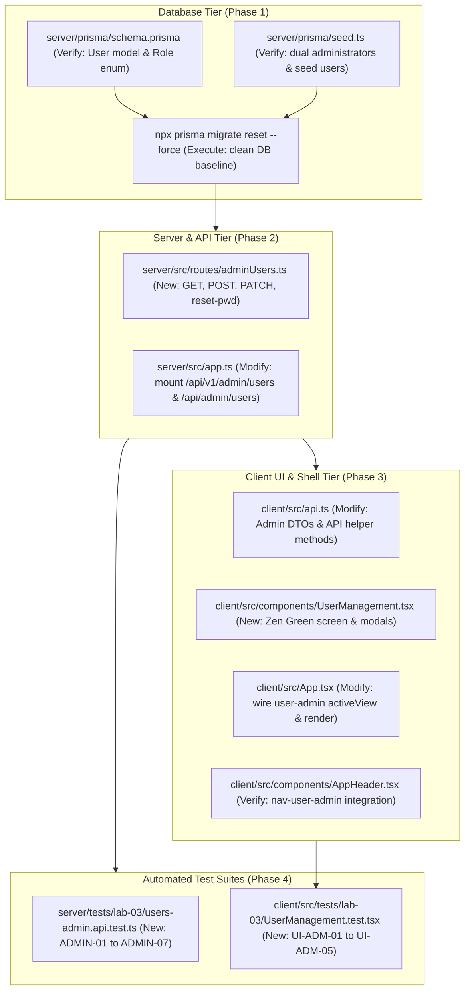

# Technical Implementation Plan: Issue 15 — Administrator User Management & Account Safety

**Document ID**: PLAN-FEAT-15  
**Feature Branch**: `feature/15-admin-user-management` (Issue 15)  
**Base Branch**: `lab3-staging`  
**Target Milestone**: TokTickIT Lab 3 (Sprint 3) — Administrator Screens & Account Safety  
**Authoritative Contract Reference**: [docs/features/15-admin-user-management/contract.md](./contract.md)  
**Master Specifications**:
* [docs/lab-03/specification.md](../../lab-03/specification.md) (`FR-06`, `BR-01`, `BR-02`, `BR-09`, `BR-10`, `BR-11`, `BR-12`, `AC-14`, `AC-15`, `AC-15.1` through `AC-15.5`)
* [docs/lab-03/api-spec.md](../../lab-03/api-spec.md) (§6 Administrator User Management APIs, §6.1 to §6.4)
* [docs/lab-03/ui-spec.md](../../lab-03/ui-spec.md) (§2 Badges, §3.7 Screen 6: Administrator User Management, §4 Breakpoints, §5 Blur Validation)
* [docs/lab-03/tests.md](../../lab-03/tests.md) (§2 Traceability Matrix, §3 Test Catalog `ADMIN-01` to `ADMIN-07`, `UI-ADM-01`, `E2E-03`)
* [docs/lab-03/poc-scope-and-issues.md](../../lab-03/poc-scope-and-issues.md) (§2 Issue 15 Decomposition)
* [AGENTS.md](../../../AGENTS.md) (Work Norms: Strict Closed-World Rule, TDD, Theme Compliance, Blur Validation Rule)
**Document Status**: Ready for Review & Execution  

---

## 1. Target File Inventory

The following is the complete, exhaustive inventory of all files to be inspected, created, or modified across `server/`, `client/`, `prisma/`, and `tests/`:



### Detailed Inventory Table

| Component | Path | Action | Description |
| :--- | :--- | :---: | :--- |
| **Prisma** | `server/prisma/schema.prisma` | `VERIFY` | Verify existing `User` model attributes (`id`, `name`, `email`, `passwordHash`, `role`, `department`, `isActive`, `mustChangePassword`, `createdAt`, `updatedAt`) and `Role` enum (`REQUESTER`, `IT_STAFF`, `ADMINISTRATOR`). |
| **Prisma** | `server/prisma/seed.ts` | `VERIFY` | Verify seeded accounts: primary admin `admin.toktick@kmutt.ac.th`, backup admin `backup.admin@kmutt.ac.th`, IT staff resolvers, active requesters, and inactive accounts. |
| **Server** | `server/src/routes/adminUsers.ts` | `NEW` | Create Express router implementing `GET /` (search & role filter), `POST /` (user creation with `mustChangePassword: true`), `PATCH /:id` (profile/activation updates enforcing `BR-09`, `BR-10`, `BR-11`, `BR-12`), and `POST /:id/reset-password`. |
| **Server** | `server/src/app.ts` | `MODIFY` | Import and mount `adminUsersRouter` under `/api/v1/admin/users` and `/api/admin/users` guarded with `authenticateUser`, `requireAuth`, `requirePasswordChanged`, and `requireRole("ADMINISTRATOR")`. |
| **Client** | `client/src/api.ts` | `MODIFY` | Export TypeScript interfaces (`AdminUserSummaryDTO`, `CreateUserPayload`, `UpdateUserPayload`) and API client methods: `fetchAdminUsers`, `createAdminUser`, `updateAdminUser`, and `resetUserPassword`. |
| **Client** | `client/src/components/UserManagement.tsx` | `NEW` | Create the Zen Green Administrator User Management screen with search bar, role filter dropdown, user directory table, status/role badges, Create User slideout, Edit User slideout (with self-edit and last-admin disabled controls), and Reset Password modal. |
| **Client** | `client/src/App.tsx` | `MODIFY` | Extend `activeView` type union to include `"user-admin"` and render `<UserManagement />` when `activeView === "user-admin"` for `ADMINISTRATOR` role. |
| **Client** | `client/src/components/AppHeader.tsx` | `VERIFY` | Confirm that `nav-user-admin` button is rendered for `ADMINISTRATOR` and triggers `onViewChange("user-admin")`. |
| **Tests** | `server/tests/lab-03/users-admin.api.test.ts` | `NEW` | Author Supertest integration test suite covering `ADMIN-01` through `ADMIN-07`, testing user listing, search/filter, user creation, duplicate email rejection (`409`), self-deactivation guard (`BR-11`), last-admin guard (`BR-12`), non-admin forbidden checks (`403`), and password reset. |
| **Tests** | `client/src/tests/lab-03/UserManagement.test.tsx` | `NEW` | Author React Testing Library component test suite covering `UI-ADM-01` through `UI-ADM-05`, testing table rendering, badges, search/filter, create modal, edit modal safety warnings, and reset password modal. |

---

## 2. Phase 1: Database State & Seed Verification

### 2.1. Schema & Attribute Verification (`server/prisma/schema.prisma`)
1. Verify that `server/prisma/schema.prisma` contains the complete `Role` enum and `User` model attributes required by the contract:
   - `Role` enum: `REQUESTER`, `IT_STAFF`, `ADMINISTRATOR`.
   - `User` model:
     - `id`: `Int @id @default(autoincrement())`
     - `name`: `String`
     - `email`: `String @unique`
     - `passwordHash`: `String`
     - `role`: `Role @default(REQUESTER)`
     - `department`: `String?`
     - `isActive`: `Boolean @default(true)`
     - `mustChangePassword`: `Boolean @default(true)`
     - `createdAt`: `DateTime @default(now())`
     - `updatedAt`: `DateTime @updatedAt`
2. No schema migrations are required because the model and enum were already established in Issue 12.

### 2.2. Seed Data Verification (`server/prisma/seed.ts`)
Verify that `server/prisma/seed.ts` contains:
* Dual active administrators:
  - `admin.toktick@kmutt.ac.th` (Active Admin, `mustChangePassword: false`)
  - `backup.admin@kmutt.ac.th` (Active Admin, `mustChangePassword: false`)
* Active IT Staff resolvers:
  - `wichai.it@kmutt.ac.th`, `nareerat.it@kmutt.ac.th`, `ekachai.it@kmutt.ac.th`
* Inactive accounts:
  - `inactive.staff@kmutt.ac.th` (`isActive: false`)
  - `prasert.in@kmutt.ac.th` (`isActive: false`)
* Active requesters:
  - `sompong.it@kmutt.ac.th`, `anong.st@kmutt.ac.th`, `mana.st@kmutt.ac.th`, `kanda.fc@kmutt.ac.th`, `new.requester@kmutt.ac.th`

### 2.3. Clean Test Baseline Execution
Establish a completely clean, known database state prior to code execution:
```bash
cd server
npx prisma migrate reset --force
```
*Expected Outcome*: Prisma resets the PostgreSQL database, applies all existing migrations, and executes `seed.ts` successfully, outputting confirmation that all categories, systems, users, tickets, comments, and notes are seeded.

---

## 3. Phase 2: Backend Admin APIs & Safety Enforcement

### 3.1. Create Router `server/src/routes/adminUsers.ts`

The router will be structured as follows:

```typescript
import { Router, Request, Response } from "express";
import bcrypt from "bcryptjs";
import { getPrisma } from "../prisma.js";
import { requireAuth, requirePasswordChanged, requireRole } from "../middleware/auth.js";
import { Role } from "@prisma/client";

export const adminUsersRouter = Router();

// Layered role guard: all routes require authenticated ADMINISTRATOR who has satisfied password change
adminUsersRouter.use(requireAuth);
adminUsersRouter.use(requirePasswordChanged);
adminUsersRouter.use(requireRole("ADMINISTRATOR"));
```

#### Detailed Handler Implementation Specifications:

#### 1. `GET /api/v1/admin/users` (User Listing, Search & Filter)
* **Query Parameters**:
  - `search`: string (optional, partial match on `name` or `email`).
  - `role`: string (optional, filter by `REQUESTER`, `IT_STAFF`, or `ADMINISTRATOR`).
* **Query Construction**:
  ```typescript
  const prisma = getPrisma();
  const search = typeof req.query.search === "string" ? req.query.search.trim() : undefined;
  const roleQuery = typeof req.query.role === "string" ? req.query.role.trim() : undefined;

  const where: any = {};
  if (search) {
    where.OR = [
      { name: { contains: search, mode: "insensitive" } },
      { email: { contains: search, mode: "insensitive" } },
    ];
  }
  if (roleQuery && ["REQUESTER", "IT_STAFF", "ADMINISTRATOR"].includes(roleQuery)) {
    where.role = roleQuery as Role;
  }
  ```
* **Projection & Response**:
  - Select fields: `id`, `name`, `email`, `role`, `department`, `isActive`, `mustChangePassword`, `createdAt`.
  - Exclude `passwordHash`.
  - Order by: `createdAt: "asc"`.
  - Return `200 OK` with `{ users, totalCount: users.length }`.

---

#### 2. `POST /api/v1/admin/users` (User Provisioning)
* **Payload**: `{ name, email, role, isActive, initialPassword }`.
* **Validation**:
  - `name`: String, trimmed, length 2–100 chars. Return `400 Bad Request` if invalid.
  - `email`: Valid email format, trimmed and normalized to lowercase (`normalizedEmail = email.trim().toLowerCase()`).
  - `role`: Must be one of `REQUESTER`, `IT_STAFF`, `ADMINISTRATOR` (`BR-09`). Return `400 Bad Request` if invalid.
  - `initialPassword`: Validated against complexity regex:
    - `>= 8` characters, `>= 1` uppercase letter, `>= 1` lowercase letter, `>= 1` digit, `>= 1` symbol (`[!@#$%^&*()_+\-=\[\]{};':"\\|,.<>\/?]`).
    - Return `400 Bad Request` (`VALIDATION_FAILED`) if complexity fails.
* **Duplicate Email Constraint (`BR-10`)**:
  - Check existing: `const existing = await prisma.user.findUnique({ where: { email: normalizedEmail } })`.
  - If exists, return HTTP `409 Conflict`:
    ```json
    {
      "error": {
        "code": "EMAIL_ALREADY_EXISTS",
        "message": "Email is already registered to another account.",
        "field": "email"
      }
    }
    ```
* **Persistence**:
  - `passwordHash = await bcrypt.hash(initialPassword, 10)`.
  - Create user with `mustChangePassword: true` (`FR-02`, `BR-02`) and `isActive: isActive !== false`.
  - Return HTTP `201 Created` with `{ user }` (excluding `passwordHash`).

---

#### 3. `PATCH /api/v1/admin/users/:id` (User Modification & Safety Guardrails)
* **Parameters**: `id` (integer).
* **Payload**: `{ name?, email?, role?, isActive? }`.
* **Lookup**:
  - `const targetId = parseInt(req.params.id, 10);`
  - Find target user. If not found, return HTTP `404 Not Found`.
* **Duplicate Email Constraint (`BR-10`)**:
  - If `email` provided and differs from target's current email:
    - `const normalizedEmail = email.trim().toLowerCase();`
    - Check if another user has this email: `findFirst({ where: { email: normalizedEmail, NOT: { id: targetId } } })`.
    - If found, return HTTP `409 Conflict` (`EMAIL_ALREADY_EXISTS`).
* **Safety Invariant 1: Self-Deactivation / Demotion Prevention (`BR-11`)**:
  - Check if target is current logged-in administrator: `targetId === req.user!.id`.
  - If `isActive === false`:
    - Return HTTP `400 Bad Request` (or `403 Forbidden`):
      ```json
      {
        "error": {
          "code": "CANNOT_DEACTIVATE_SELF",
          "message": "Administrators cannot deactivate their own active account."
        }
      }
      ```
  - If `role !== undefined && role !== "ADMINISTRATOR"`:
    - Return HTTP `400 Bad Request` (or `403 Forbidden`):
      ```json
      {
        "error": {
          "code": "CANNOT_DEMOTE_SELF",
          "message": "Administrators cannot demote their own account."
        }
      }
      ```
* **Safety Invariant 2: Last Active Administrator Preservation (`BR-12`)**:
  - If target user currently has `target.role === "ADMINISTRATOR"` and `target.isActive === true`:
    - If `isActive === false` OR `(role !== undefined && role !== "ADMINISTRATOR")`:
      - Query count: `const activeAdminCount = await prisma.user.count({ where: { role: "ADMINISTRATOR", isActive: true } });`
      - If `activeAdminCount <= 1`:
        - Return HTTP `409 Conflict` (or `400 Bad Request`):
          ```json
          {
            "error": {
              "code": "CANNOT_DEACTIVATE_LAST_ADMIN",
              "message": "Cannot deactivate or demote the system's last active Administrator."
            }
          }
          ```
* **Update & Response**:
  - Apply updates in Prisma and return HTTP `200 OK` with `{ user }` (excluding `passwordHash`).

---

#### 4. `POST /api/v1/admin/users/:id/reset-password` (Initial Password Reset)
* **Parameters**: `id` (integer).
* **Payload**: `{ initialPassword }`.
* **Validation**:
  - Target user lookup (`404 Not Found` if missing).
  - Verify `initialPassword` against password complexity rules. Return `400 Bad Request` if weak.
* **Update**:
  - `const newHash = await bcrypt.hash(initialPassword, 10);`
  - Update user: `{ passwordHash: newHash, mustChangePassword: true }`.
  - Return HTTP `200 OK`:
    ```json
    {
      "message": "Initial password has been reset. User will be required to change it at next login.",
      "userId": targetId
    }
    ```

---

### 3.2. Mount Router in `server/src/app.ts`
Update `server/src/app.ts`:
1. Import `adminUsersRouter` from `./routes/adminUsers.js`.
2. Mount under both `/api/v1/admin/users` and `/api/admin/users`:
   ```typescript
   import { adminUsersRouter } from "./routes/adminUsers.js";

   // Administrator User Management (Lab 3 Issue 15)
   app.use("/api/v1/admin/users", adminUsersRouter);
   app.use("/api/admin/users", adminUsersRouter);
   ```

---

## 4. Phase 3: Frontend Zen Green UI Engineering

### 4.1. Extend Client API Client (`client/src/api.ts`)
1. **Define DTO Interfaces**:
   ```typescript
   export interface AdminUserSummaryDTO {
     id: number;
     name: string;
     email: string;
     role: Role;
     department: string | null;
     isActive: boolean;
     mustChangePassword: boolean;
     createdAt: string;
   }

   export interface CreateUserPayload {
     name: string;
     email: string;
     role: Role;
     isActive?: boolean;
     initialPassword: string;
   }

   export interface UpdateUserPayload {
     name?: string;
     email?: string;
     role?: Role;
     isActive?: boolean;
   }
   ```
2. **Export API Methods**:
   - `fetchAdminUsers(params?: { search?: string; role?: Role }): Promise<{ users: AdminUserSummaryDTO[]; totalCount: number }>`
   - `createAdminUser(payload: CreateUserPayload): Promise<{ user: AdminUserSummaryDTO }>`
   - `updateAdminUser(id: number, payload: UpdateUserPayload): Promise<{ user: AdminUserSummaryDTO }>`
   - `resetUserPassword(id: number, initialPassword: string): Promise<{ message: string; userId: number }>`

---

### 4.2. Build `UserManagement.tsx` (`client/src/components/UserManagement.tsx`)

Create the dedicated administrator screen matching Screen 6 wireframe and Zen Green styling:

1. **Header & Action Toolbar**:
   - Page Title: `"Administrator User Management"` with subtitle copy.
   - Primary Action: `"+ Create New User"` (`.btn-zen-primary`) button triggering the Create User modal.
   - Filter Toolbar:
     - Search Input (`placeholder="Search by name or email..."`, debounced or triggered on change).
     - Role Filter Dropdown: Options for `All Roles`, `Requester`, `IT Staff`, `Administrator`.
     - "Reset Filters" button if filters are active.
2. **User Directory Data Table**:
   - Headers: `Full Name`, `Email Address`, `Role`, `Status`, `Created Date`, `Actions`.
   - Columns:
     - Name: Displays user name, with indicator `"(You)"` if matching `currentUser.id`.
     - Email: Monospaced/clean text.
     - Role Badge:
       - `REQUESTER`: Pale Green (`#EAF6EF`, text `#006B3C`, border `#C4E5D2`).
       - `IT_STAFF`: Sky Blue (`#E0F2FE`, text `#0369A1`, border `#BAE6FD`).
       - `ADMINISTRATOR`: Purple (`#F3E8FF`, text `#6B21A8`, border `#E9D5FF`).
     - Status Badge:
       - `Active`: Green tint (`#DCFCE7`, text `#15803D`, border `#BBF7D0`).
       - `Inactive`: Red tint (`#FEE2E2`, text `#991B1B`, border `#FECACA`).
     - Actions:
       - `"Edit"` button: Opens Edit User modal.
       - `"Reset Password"` button: Opens Reset Password modal.
   - Loading state: Render `.zen-skeleton` shimmer rows.
   - Empty state: Clear feedback when no users match search/filter with "Clear Filters" CTA.
3. **Mobile Responsive Card Collapse (< 768px)**:
   - Tables collapse into individual Zen Green cards with zero horizontal overflow.
   - Tap targets minimum 48px.
4. **"Create User" Slideout / Modal**:
   - Fields: Full Name, Email Address, Role dropdown, Active toggle (default `true`), Initial Password.
   - Live password complexity checklist (turning green as rules pass).
   - Informational notice: *"The user will be required to change this password on their next login (BR-02)."*
   - Blur Validation Rule: Malformed inputs clear on blur; form validation messages display on submit.
   - Submission state: Busy spinner with `"Creating User..."`.
   - Conflict handling: Display red alert if email already exists (`409 Conflict`).
5. **"Edit User" Slideout / Modal & Safety Enforcements**:
   - Fields: Full Name, Email Address, Role dropdown, Active toggle switch (`Active` / `Inactive`).
   - **Self-Editing Case (`user.id === loggedInUser.id`)**:
     - `Active` toggle is disabled (`disabled={true}`).
     - `Role` dropdown is disabled (`disabled={true}`).
     - Warning alert: *"You cannot deactivate or demote your own active administrator account (BR-11)."*
   - **Last Active Administrator Case (`activeAdminCount <= 1 && user.role === "ADMINISTRATOR"`)**:
     - `Active` toggle is disabled (`disabled={true}`).
     - `Role` dropdown is disabled (`disabled={true}`).
     - Warning alert: *"Cannot deactivate or demote the system's last active Administrator (BR-12)."*
   - **Error Handling**: Displays server error alerts in red box (`--zen-error-bg`).
6. **"Reset Initial Password" Modal**:
   - Displays target user's Name and Email.
   - New Initial Password input with password complexity checklist.
   - Notice explaining forced change upon user's next login.
   - Submit button with busy state.

---

### 4.3. Integrate in Application Shell (`client/src/App.tsx`)
1. In `client/src/App.tsx`:
   - Import `UserManagement` from `./components/UserManagement.js`.
   - Update `AppContentProps` and `activeView` state to allow `"user-admin"`.
   - In the view switch statement:
     ```tsx
     {activeView === "user-admin" && user.role === "ADMINISTRATOR" ? (
       <div className="mb-4">
         <UserManagement />
       </div>
     ) : activeView === "create" ? (
       // ...
     ```
2. Verify that `client/src/components/AppHeader.tsx` triggers `onViewChange("user-admin")` when the administrator clicks "User Admin".

---

## 5. Phase 4: STS Automated Tests Workflow

### 5.1. Mandatory Database Reset Rule
> [!IMPORTANT]
> **Mandatory Pre-Condition**: Prior to running any server test suite, always execute:
> ```bash
> cd server
> npx prisma migrate reset --force
> ```
> This ensures that all migrations and idempotent seed data (dual active administrators, resolvers, and inactive accounts) are freshly initialized in PostgreSQL, guaranteeing deterministic test execution without state pollution.

---

### 5.2. Backend API Test Suite (`server/tests/lab-03/users-admin.api.test.ts`)

Implement the following test scenarios matching contract specifications:

* **`ADMIN-01` (List Users & Search/Filter)**:
  - Administrator queries `GET /api/v1/admin/users`: returns HTTP `200 OK` with user list and `totalCount`.
  - Search query `?search=wichai`: returns matching users.
  - Role filter `?role=IT_STAFF`: returns only users with `role: "IT_STAFF"`.
* **`ADMIN-02` (Create User with Initial Password)**:
  - Administrator posts valid payload (`POST /api/v1/admin/users`): returns HTTP `201 Created`.
  - Verifies user is created in database with `mustChangePassword === true` and hashed password (not plaintext).
* **`ADMIN-03` (Duplicate Email Conflict Rejection - `BR-10`)**:
  - Administrator attempts to create a user with an already registered email (`admin.toktick@kmutt.ac.th`).
  - Returns HTTP `409 Conflict` with `code: "EMAIL_ALREADY_EXISTS"`.
  - Administrator attempts to update a user's email to another user's email (`PATCH`): returns HTTP `409 Conflict`.
* **`ADMIN-04` (Self-Deactivation & Demotion Prevention - `BR-11`)**:
  - Administrator attempts to set `isActive: false` on their own user ID (`PATCH /api/v1/admin/users/:ownId`).
  - Returns HTTP `400 Bad Request` with `code: "CANNOT_DEACTIVATE_SELF"`.
  - Administrator attempts to change their own role to `IT_STAFF`: returns HTTP `400 Bad Request` with `code: "CANNOT_DEMOTE_SELF"`.
* **`ADMIN-05` (Last Active Administrator Preservation - `BR-12`)**:
  - Ensure only 1 active administrator remains in the database (e.g., deactivate `backup.admin@kmutt.ac.th`).
  - Attempt to deactivate the sole remaining active administrator:
  - Returns HTTP `409 Conflict` with `code: "CANNOT_DEACTIVATE_LAST_ADMIN"`.
  - Attempt to demote the sole remaining active administrator to `IT_STAFF`: returns HTTP `409 Conflict`.
* **`ADMIN-06` (Role Guard & Forbidden Access - `AC-15.5`)**:
  - Authenticated `REQUESTER` attempts to access `GET /api/v1/admin/users`: returns HTTP `403 Forbidden`.
  - Authenticated `IT_STAFF` attempts to access `POST /api/v1/admin/users`: returns HTTP `403 Forbidden`.
  - Unauthenticated request: returns HTTP `401 Unauthorized`.
* **`ADMIN-07` (Reset Initial Password)**:
  - Administrator resets a user's initial password (`POST /api/v1/admin/users/:id/reset-password`).
  - Returns HTTP `200 OK`. Verifies password hash is updated and `mustChangePassword === true` in database.

---

### 5.3. Frontend UI Component Suite (`client/src/tests/lab-03/UserManagement.test.tsx`)

Implement component test scenarios using Vitest and React Testing Library:

* **`UI-ADM-01` (Render Directory, Table & Badges)**:
  - Renders user table with Name, Email, Role badges, Status badges, and action buttons.
  - Verifies search input and role filter dropdown are present and functional.
* **`UI-ADM-02` (Create User Modal & Email Conflict Alert)**:
  - Clicks `+ Create New User`, fills in form, submits valid data.
  - Verifies API call is made and table updates.
  - Simulates duplicate email `409 Conflict` error; verifies red error banner is rendered.
* **`UI-ADM-03` (Edit Modal Self-Deactivation Guardrail - `BR-11`)**:
  - Opens Edit modal for logged-in admin's own account.
  - Verifies `Active` toggle is disabled (`disabled={true}`).
  - Verifies warning message: *"You cannot deactivate or demote your own active administrator account"*.
* **`UI-ADM-04` (Edit Modal Last Active Admin Guardrail - `BR-12`)**:
  - Sets up mock state with 1 active administrator.
  - Opens Edit modal for that administrator.
  - Verifies `Active` toggle and `Role` dropdown are disabled.
  - Verifies warning message: *"Cannot deactivate or demote the system's last active Administrator"*.
* **`UI-ADM-05` (Reset Password Modal)**:
  - Clicks "Reset Password" on user row.
  - Verifies modal opens with user context and password complexity checklist.
  - Submits valid new password; verifies API method called and success feedback displayed.

---

### 5.4. Execution Verification Protocol

```bash
# ---------------------------------------------------------------------------
# Step 1: Mandatory Database Reset
# ---------------------------------------------------------------------------
cd server
npx prisma migrate reset --force

# ---------------------------------------------------------------------------
# Step 2: Run Server Integration & Security Suites
# ---------------------------------------------------------------------------
npx vitest run tests/lab-03/users-admin.api.test.ts

# ---------------------------------------------------------------------------
# Step 3: Run Client UI Component Suite
# ---------------------------------------------------------------------------
cd ../client
npx vitest run src/tests/lab-03/UserManagement.test.tsx

# ---------------------------------------------------------------------------
# Step 4: Run Full System Regression Test Suites
# ---------------------------------------------------------------------------
cd ../server && npm test
cd ../client && npm test
```

---

## 6. Definition of Done (DoD) for Issue 15 Execution

Before declaring Issue 15 complete and creating a Pull Request from `feature/15-admin-user-management` into `lab3-staging`:
1. [ ] `npx prisma migrate reset --force` completes with zero errors.
2. [ ] All backend test scenarios in `users-admin.api.test.ts` (`ADMIN-01` to `ADMIN-07`) pass 100%.
3. [ ] All frontend test scenarios in `UserManagement.test.tsx` (`UI-ADM-01` to `UI-ADM-05`) pass 100%.
4. [ ] All existing regression test suites pass (`npm test` in `server/` and `npm test` in `client/`).
5. [ ] Role guards verified: `REQUESTER` and `IT_STAFF` cannot access `/api/v1/admin/users/*` (`403 Forbidden`).
6. [ ] Safety rules verified: Admin cannot self-deactivate (`BR-11`), last active Admin cannot be deactivated/demoted (`BR-12`), duplicate emails return `409 Conflict` (`BR-10`).
7. [ ] Zen Green styling, badges, and zero-horizontal-overflow mobile layouts verified.
8. [ ] Git working tree clean with only relevant feature files committed.
