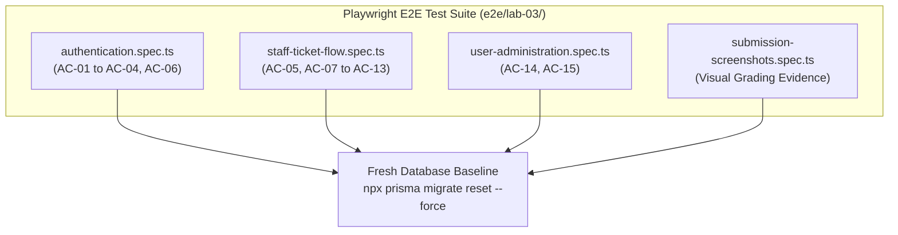
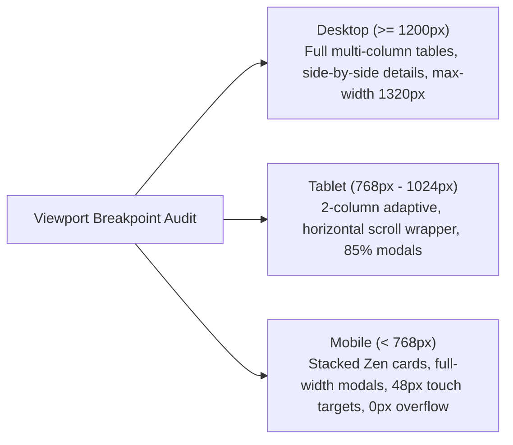

# Feature 16 Engineering Contract: End-to-End Test Suite, Responsive Polish & Staged Release Verification

**Feature Title**: End-to-End Test Suite, Responsive Polish & Staged Release Verification  
**Branch Name**: `feature/16-e2e-polish-release` (Issue 16 / Sprint 3 Milestone Completion)  
**Base Branch**: `lab3-staging`  
**Document Status**: Proposed Feature Contract Baseline  
**Author**: TokTickIT Engineering Team  
**Traceability References**:
* [TokTickIT-System-Level-SDS-v1.0.pdf](../../reference/TokTickIT-System-Level-SDS-v1.0.pdf) (§Architecture Style p. 4-5, §Technology Stack p. 6, §Authorization Model p. 10, §Data Conventions, §Security Invariants p. 16, §Testing Architecture p. 17)
* [Lab_3_sheet.pdf](../../reference/Lab_3_sheet.pdf) (§1, §2, §3, §4.1-4.6, §5.1, §6, §7 Zen Green Theme Spec, §8.1-8.7, §9, §10, §11, §12, §13, §14 Parts 1–9 Rubric)
* [TokTickIT_GitHub_Workflow_Guide_TH_EN.pdf](../../reference/TokTickIT_GitHub_Workflow_Guide_TH_EN.pdf) (Kanban Board, PR Workflow, Peer Review Norms)
* [docs/lab-03/specification.md](../../lab-03/specification.md) (`FR-01` through `FR-06`, `BR-01` through `BR-12`, `AC-01` through `AC-15`, DoD §9)
* [docs/lab-03/ui-spec.md](../../lab-03/ui-spec.md) (Zen Green Design Tokens, Typography, Badges, Screens 1–6, Responsive Breakpoints §4, Interaction Rules §5)
* [docs/lab-03/api-spec.md](../../lab-03/api-spec.md) (REST Endpoints `/api/v1/auth/*`, `/api/v1/staff/tickets/*`, `/api/v1/tickets/:id/*`, `/api/v1/admin/users/*`)
* [docs/lab-03/tests.md](../../lab-03/tests.md) (STS Test Catalog: Tier 1–4, `E2E-01` to `E2E-03`, `UI-LOG-01`, `UI-PWD-01`, `UI-QUE-01`, `UI-DET-01`, `UI-DET-02`, `UI-ADM-01`)
* [docs/lab-03/poc-scope-and-issues.md](../../lab-03/poc-scope-and-issues.md) (Issue 16 Decomposition & 60-Point Course Rubric Mapping)
* [docs/features/12-auth-and-shell/contract.md](../12-auth-and-shell/contract.md) (Feature 12 Approved Contract Baseline)
* [docs/features/13-staff-ticket-queue/contract.md](../13-staff-ticket-queue/contract.md) (Feature 13 Approved Contract Baseline)
* [docs/features/14-staff-ticket-detail/contract.md](../14-staff-ticket-detail/contract.md) (Feature 14 Approved Contract Baseline)
* [docs/features/15-admin-user-management/contract.md](../15-admin-user-management/contract.md) (Feature 15 Approved Contract Baseline)
* [AGENTS.md](../../../AGENTS.md) (Work Norms: Strict Closed-World Rule, TDD, Theme & Style Compliance, Blur Validation Rule)

---

## 1. Feature Scope & Objectives

### 1.1. Strategic Objectives
Issue 16 represents the capstone integration, responsive polish, end-to-end verification, and staged release milestone for TokTickIT Sprint 3 (Lab 3). Following the successful delivery, peer review, and merge of the four preceding functional feature branches into `lab3-staging`:
- `feature/12-auth-and-shell` (Issue 12: Authentication, Password Change, User Model Migration & App Shell)
- `feature/13-staff-ticket-queue` (Issue 13: IT Staff Shared Queue, Search, Filter, Sort & Pagination)
- `feature/14-staff-ticket-detail` (Issue 14: IT Staff Ticket Detail, Operational Controls, Comments & Notes)
- `feature/15-admin-user-management` (Issue 15: Administrator User Management & Account Safety)

Issue 16 brings the entire multi-role system together to guarantee flawless end-to-end operation, cross-role security boundaries, theme compliance, and mobile ergonomics across all user journeys.

The primary objectives of Issue 16 are:
1. **Playwright E2E Browser Test Suite Execution**:
   - Implement comprehensive browser automated tests under `e2e/lab-03/` covering all three user roles (`REQUESTER`, `IT_STAFF`, `ADMINISTRATOR`) and critical user flows.
   - Validate live authentication lifecycle, forced first-login password change, queue interactions, operational status transitions, public and confidential note collaboration, and administrator account management.
2. **Zen Green UI Polish & Multi-Viewport Responsive Conformance**:
   - Audit and polish all application screens against the KMUTT IT Service Desk "Zen Green" design tokens (`#006B3C`, `#0B7A46`, `#EAF6EF`, `#F5F7F6`, `--zen-warning-bg`, etc.).
   - Verify layout integrity and strict absence of horizontal page scrolling (`overflow-x: hidden`) across Desktop ($\ge 1200\text{px}$), Tablet ($768\text{px} - 1024\text{px}$), and Mobile ($< 768\text{px}$) viewports.
   - Enforce table-to-card transformations and touch-friendly targets ($\ge 48\text{px}$ height) on mobile viewports.
3. **Course Submission Visual Evidence Capture**:
   - Automate capture of high-resolution visual evidence screenshots across device viewports and output them to designated folders in `artifacts/lab-03/screenshots/`:
     - `authentication/` (Login, Inactive rejection, Mandatory password change checklist)
     - `staff-queue/` (Desktop table, Tablet scroll wrapper, Mobile stacked cards, active filters)
     - `staff-ticket-detail/` (Operational controls, claim button, status transition feedback, public comments, amber internal notes with lock badge, requester resolution indicator)
     - `user-management/` (Admin directory, Create User modal, Edit User modal with self/last-admin safety guards disabled, Reset Password modal)
4. **Test Specification & Course Documentation Completion**:
   - Finalize `docs/lab-03/tests.md` (Software Test Specification) to satisfy Labsheet §10 and §14 Part 3 by updating all test catalog entries (`AUTH-01`–`AUTH-09`, `QUEUE-01`–`QUEUE-07`, `TKTOP-01`–`TKTOP-06`, `COMM-01`–`COMM-02`, `NOTE-01`–`NOTE-03`, `ADMIN-01`–`ADMIN-07`, `UI-LOG-01`–`UI-ADM-01`, `E2E-01`–`E2E-03`) from `Planned` to `Pass`, updating document status to `Verified Completion Baseline`, and documenting full passing test outputs across unit, API, UI, authorization, regression, and E2E suites.
   - Finalize `docs/lab-03/reviewer.md` with complete peer review records, PR numbers, reviewer comments, and author responses for all Lab 3 issues (Issues 11–16).
   - Finalize `docs/lab-03/ai-use.md` containing 6–10 summarized key prompts and an insightful, authentic "My Reflection" on Spec-Driven Development and AI agent collaboration.
5. **Staged Release Integration & Release PR**:
   - Execute the entire verification suite (server tests, client tests, and Playwright E2E tests) against a freshly reset database baseline.
   - Prepare and submit the final Release Pull Request from `lab3-staging` into `main` satisfying all criteria in the 60-point course grading rubric.

---

### 1.2. In-Scope Deliverables

| Deliverable Area | Component / File Path | Core Functionality |
| :--- | :--- | :--- |
| **Playwright Auth E2E Suite** | `e2e/lab-03/authentication.spec.ts` | E2E browser tests for valid/invalid login, inactive rejection, forced password change, header role display, and logout invalidation. |
| **Playwright Staff Flow E2E Suite** | `e2e/lab-03/staff-ticket-flow.spec.ts` | E2E browser tests for IT Staff queue search/filter/sort, ticket claiming, IT priority, status transitions, public comments, internal notes isolation, and requester resolved indicator. |
| **Playwright Admin E2E Suite** | `e2e/lab-03/user-administration.spec.ts` | E2E browser tests for admin login, user directory search/filter, user creation with initial password, user editing, safety rules (self-deactivation & last admin), and password reset. |
| **Submission Evidence Generator** | `e2e/lab-03/submission-screenshots.spec.ts` | Dedicated Playwright suite capturing clean, repeatable full-page screenshots across viewports for all grading rubric categories. |
| **Playwright Configuration** | `playwright.config.ts` | Configuration update to include `e2e/lab-03` test directory while preserving existing Lab 2 test capabilities. |
| **Responsive UI & CSS Polish** | `client/src/index.css`, components | Responsive styling audit, mobile card styling, touch targets ($\ge 48\text{px}$), and zero horizontal overflow enforcement. |
| **Screenshot Artifacts** | `artifacts/lab-03/screenshots/*` | Captured PNG evidence in `authentication/`, `staff-queue/`, `staff-ticket-detail/`, and `user-management/`. |
| **Software Test Specification (STS)** | `docs/lab-03/tests.md` | Finalized test catalog with `Pass` statuses, verified completion baseline, and passing test execution evidence across all tiers per Labsheet §10 & §14 Part 3. |
| **Peer Review Record** | `docs/lab-03/reviewer.md` | Complete peer review records, PR links, comments, and approvals across Issues 11–16. |
| **AI Use & Reflection** | `docs/lab-03/ai-use.md` | 6–10 key prompts with action logs and comprehensive reflective essay. |
| **Final Staged Release Verification** | `lab3-staging` $\rightarrow$ `main` | Verified integration of all test suites, clean database migration reset, and release PR creation. |

---

### 1.3. Explicitly Excluded Scope (Strictly Out of Scope per §4.2)

To maintain strict alignment with the approved system specification and avoid scope creep:
* **No Functional Features Outside Sprint 3**: No external authentication providers (OAuth, SSO), multi-factor authentication (MFA), password reset email delivery, or public self-registration.
* **No Cloud / Production Deployment Configurations**: Deployment configs, AWS/GCP infrastructure, Kubernetes manifests, or production domain certificates are strictly out of scope. Local development and test environments (`localhost:3000` / `localhost:5173`) are the sole targets.
* **No Automated SLAs or Notification Services**: No timed escalation triggers, webhooks, or background push notifications.
* **No Actions Taken by IT Staff**: "Actions Taken" checklists and blocking resolution pending action completion remain deferred to Lab 4.
* **No Analytics Dashboards**: No charts, graphs, or executive KPI reporting beyond queue summary counts.
* **No Multi-Tenancy or Department Trees**: Single-tenant university ticketing model with flat department strings.
* **No Profile Photo Uploads or Hard User Deletion**: Deactivation (`isActive = false`) remains the sole account lifecycle modification.

---

## 2. Playwright E2E Test Suite Specification

The Playwright browser end-to-end test suite validates the system through realistic user interactions across real browsers. All tests run against the integrated frontend Vite dev server (`http://localhost:5173`) communicating with the Express backend (`http://localhost:3000`) and PostgreSQL database.



---

### 2.1. `e2e/lab-03/authentication.spec.ts`

This suite verifies the complete identity and session lifecycle from the browser:

1. **Scenario AUTH-E2E-01: Valid User Login & Session Establishment (`AC-01`, `FR-01`, `BR-01`)**
   - User navigates to `/login`.
   - Inputs active staff credentials (`wichai.it@kmutt.ac.th` / `Password123!`).
   - Clicks "Sign In".
   - Verifies redirection to role-appropriate home view (Staff Queue `/staff/queue`).
   - Verifies application header displays user's full name ("Wichai IT") and role badge ("IT Staff").
   - Verifies session persistence across page reload without requiring re-login.

2. **Scenario AUTH-E2E-02: Invalid Credentials Rejection (`AC-02`, `BR-01`)**
   - User inputs non-existent email or wrong password (`sompong.it@kmutt.ac.th` / `WrongPassword999!`).
   - Clicks "Sign In".
   - Verifies system displays safe generic error message: *"Invalid email or password"*.
   - Verifies password field is cleared and user remains on `/login`.

3. **Scenario AUTH-E2E-03: Inactive Account Rejection (`AC-02`, `BR-01`)**
   - User attempts login with deactivated account (`prasert.in@kmutt.ac.th` / `Password123!`).
   - Clicks "Sign In".
   - Verifies system displays identical generic error message without disclosing account existence or deactivation status: *"Invalid email or password"*.
   - Verifies user remains unauthenticated.

4. **Scenario AUTH-E2E-04: Mandatory Initial Password Change Flow (`AC-03`, `AC-04`, `FR-02`, `BR-02`)**
   - User logs in with seeded initial-change account (`new.requester@kmutt.ac.th` / `InitialPass123!`).
   - System immediately redirects and traps user on `/change-password`.
   - Verifies navigation to normal views (`/`, `/my-tickets`) is intercepted and blocked.
   - User interacts with password input:
     - Enters weak password (e.g., `short`): checklist indicators display red/unmet state.
     - Enters mismatched confirmation: displays validation warning.
     - Enters compliant password: `NewSecurePassword123!`.
     - Verifies all 4 checklist criteria update to green checkmarks (8+ chars, uppercase, digit, symbol).
   - Submits form: receives success feedback and is redirected to standard application home (`/my-tickets` or `/`).
   - Verifies subsequent page navigation functions normally without forced redirection.

5. **Scenario AUTH-E2E-05: Application Header Profile Display & Logout (`AC-06`, `FR-01`)**
   - Logged-in user verifies profile dropdown in header shows Name, Email, and Role badge.
   - Clicks "Logout" action.
   - System terminates session, clears session state, and redirects to `/login`.
   - Verifies browser back button or direct navigation to protected routes redirects back to `/login`.

---

### 2.2. `e2e/lab-03/staff-ticket-flow.spec.ts`

This suite verifies operational workflows, shared queue queries, operational controls, and communication boundaries:

1. **Scenario STAFF-E2E-01: IT Staff Queue Navigation & Query System (`AC-07`, `FR-03`)**
   - Login as active IT Staff (`wichai.it@kmutt.ac.th` / `Password123!`).
   - Navigates to `/staff/queue`.
   - **Search Query**: Enters ticket number or keywords in search bar (e.g., `Wi-Fi`); verifies table filters to matching records.
   - **Status Filtering**: Selects status filter (e.g., `OPEN`); verifies only open tickets display.
   - **Priority Filtering**: Selects IT Priority filter (e.g., `HIGH` or `URGENT`); verifies matching tickets.
   - **Owner Filtering**: Filters by "Unassigned" or specific staff resolver.
   - **Sorting**: Clicks column headers (Created Date, Ticket Number, Priority); verifies sorted ordering.
   - **Pagination**: Navigates between pages and adjusts page size (10, 25); verifies accurate total count metadata.

2. **Scenario STAFF-E2E-02: Ticket Claiming & Operational Reassignment (`AC-09`, `FR-04`)**
   - IT Staff opens an unassigned ticket from the queue.
   - Verifies Owner field displays "Unassigned".
   - Clicks 1-click "Claim Ticket" action button.
   - Verifies owner updates immediately to "Wichai IT" with success confirmation.
   - Selects another active staff member from owner dropdown (e.g., "Nareerat IT") and clicks Save; verifies reassignment succeeds.

3. **Scenario STAFF-E2E-03: IT Priority & Permitted Status Transitions (`AC-10`, `FR-04`, `BR-07`)**
   - IT Staff updates IT Priority from `MEDIUM` to `URGENT`; verifies badge updates immediately.
   - Status transition test:
     - Ticket is `OPEN`: allowed options are `IN_PROGRESS`, `WAITING_FOR_REQUESTER`, `CANCELLED`.
     - Transitions ticket to `IN_PROGRESS`: verifies status badge updates to yellow `IN_PROGRESS`.
     - Transitions ticket to `RESOLVED`: verifies status badge updates to green `RESOLVED`.
     - Verifies invalid status transitions are not selectable or rejected by server.

4. **Scenario STAFF-E2E-04: Public Comments Collaboration (`AC-11`, `FR-05`, `BR-04`)**
   - IT Staff posts a public comment: *"We are testing the access point switch in CB2."*
   - Verifies comment appends immediately to the thread with author name, role badge (`IT Staff`), and timestamp.
   - Logs out and logs in as the ticket's Requester (`sompong.it@kmutt.ac.th` / `Password123!`).
   - Requester views ticket: verifies IT Staff's public comment is clearly visible.
   - Requester replies with public comment: *"Thank you, Wi-Fi seems stable now."*
   - Verifies comment appends successfully with requester attribution.

5. **Scenario STAFF-E2E-05: Internal Notes Confidentiality & Role Barrier (`AC-12`, `FR-05`, `BR-04`)**
   - Log in as IT Staff (`wichai.it@kmutt.ac.th`).
   - Navigates to ticket detail; scrolls to **Internal Notes** section (amber container with lock badge).
   - Posts private internal note: *"VLAN 40 gateway router rebooted at 14:00. Potential hardware defect in port 3."*
   - Verifies internal note appears with amber styling, author attribution, and confidential badge.
   - Logs out and logs in as the owning Requester (`sompong.it@kmutt.ac.th`).
   - Requester opens the exact same ticket detail:
     - Verifies **Internal Notes** section is **completely absent** from UI.
     - Verifies no confidential note content or metadata is leaked in DOM or network responses.

6. **Scenario STAFF-E2E-06: Requester "Problem Appears Resolved" Indication (`AC-13`, `BR-05`)**
   - Requester opens an active owned ticket.
   - Clicks "Problem Appears Resolved" action button.
   - System records resolution confirmation without setting status to `RESOLVED` or `CLOSED` (status remains unchanged).
   - Verifies confirmation message displays: *"You indicated this problem appears resolved on [Timestamp]. IT Staff will complete formal verification."*
   - Logs in as IT Staff: verifies resolution indicator banner is prominently displayed on the ticket for staff attention.

7. **Scenario STAFF-E2E-07: Queue Access Restriction for Requesters (`AC-08`, `BR-06`)**
   - Requester attempts direct browser navigation to `/staff/queue`.
   - Verifies system denies access and displays `403 Forbidden` unauthorized access feedback or redirects to Requester home (`/my-tickets`).

---

### 2.3. `e2e/lab-03/user-administration.spec.ts`

This suite verifies the administrator user management console, safety rules, and password reset flows:

1. **Scenario ADMIN-E2E-01: Admin Console Navigation & Directory Filtering (`AC-14`, `FR-06`)**
   - Login as Administrator (`admin.toktick@kmutt.ac.th` / `Password123!`).
   - Navigates to `/admin/users`.
   - Verifies table lists registered users with Name, Email, Role badge, Active badge, and Action buttons.
   - Searches directory by keyword (`wichai`); verifies filtered results.
   - Filters directory by Role (`IT_STAFF`); verifies only staff accounts display.

2. **Scenario ADMIN-E2E-02: Account Creation with Initial Password (`AC-14`, `FR-06`, `BR-09`, `BR-10`)**
   - Administrator clicks "+ Create New User" button.
   - Slideout/modal opens.
   - Fills form: Full Name ("Piyawat Network"), Email ("piyawat.net@kmutt.ac.th"), Role ("IT Staff"), Active (checked), Initial Password ("InitialPass2026!").
   - Submits form.
   - Verifies modal closes, success banner displays, and "Piyawat Network" appears in user directory with `IT Staff` and `Active` badges.
   - **Duplicate Email Prevention**: Admin attempts to create another user with `piyawat.net@kmutt.ac.th`; verifies system displays error alert: *"An account with this email address already exists (409 Conflict)"*.

3. **Scenario ADMIN-E2E-03: User Profile Editing & Activation Toggling (`AC-14`, `FR-06`)**
   - Administrator clicks "Edit" on an active user (e.g., "Piyawat Network").
   - Modifies Name to "Piyawat Senior IT" and unchecks "Active Account".
   - Clicks "Save Changes".
   - Verifies user row updates: Name reflects new value and Status badge reflects `Inactive`.
   - Verifies deactivated user cannot log in (tested via login scenario).

4. **Scenario ADMIN-E2E-04: Self-Deactivation Safety Guardrail (`AC-15`, `BR-11`)**
   - Administrator clicks "Edit" on their **own** account row (`admin.toktick@kmutt.ac.th`).
   - Verifies in UI:
     - The `Active Account` toggle is **disabled** (`disabled={true}`).
     - The `System Role` dropdown is **disabled** (`disabled={true}`).
     - Safety helper text is displayed: *"You cannot deactivate or demote your own active administrator account (BR-11)."*
   - Verifies attempting to bypass UI and submitting deactivation yields server-side HTTP `400 Bad Request` with `CANNOT_DEACTIVATE_SELF`.

5. **Scenario ADMIN-E2E-05: Last Active Administrator Safety Guardrail (`AC-15`, `BR-12`)**
   - System has 2 active admins (`admin.toktick@kmutt.ac.th`, `backup.admin@kmutt.ac.th`).
   - Admin deactivates `backup.admin@kmutt.ac.th`; succeeds because 1 active admin remains.
   - Admin attempts to deactivate the last remaining active admin; verifies operation is rejected with HTTP `409 Conflict` (`CANNOT_DEACTIVATE_LAST_ADMIN`) and explanatory alert.

6. **Scenario ADMIN-E2E-06: Initial Password Reset Workflow (`AC-14`, `FR-06`, `FR-02`)**
   - Administrator clicks "Reset Password" action on a staff account (`wichai.it@kmutt.ac.th`).
   - Modal prompts for new initial password: enters `TemporaryReset2026!`.
   - Submits form; verifies success notification: *"Initial password has been reset. User will be required to change it at next login."*
   - Logs out of Admin.
   - Logs in as `wichai.it@kmutt.ac.th` using `TemporaryReset2026!`.
   - System immediately traps user on `/change-password` requiring password change (`mustChangePassword = true`).

7. **Scenario ADMIN-E2E-07: Non-Admin Role Boundary (`AC-15.5`, `FR-06`)**
   - Login as IT Staff or Requester.
   - Attempts direct browser navigation to `/admin/users`.
   - System displays `403 Forbidden` unauthorized access view or redirects to home view.

---

## 3. Responsive Visual & Submission Evidence Requirements

### 3.1. Responsive Breakpoint Standards & 10-Point Layout Checklist

The system must satisfy strict visual and ergonomic criteria across three standard viewports defined in [ui-spec.md](../../lab-03/ui-spec.md) §4 and evaluated under **Labsheet §14 Part 9 (Zen Green UI and Responsive Evidence, 5 Points)**:



#### 10-Point Visual & Responsive Evaluation Checklist (Labsheet §14 Part 9)
Every major Lab 3 screen (Login, Change Password, IT Staff Queue, IT Staff Detail, Requester Detail, Administrator User Management) must be formally audited and verified against the 10 criteria below:

| # | Visual Check Item | Desktop ($\ge 1200\text{px}$) | Tablet ($768\text{px} - 1024\text{px}$) | Mobile ($< 768\text{px}$) | Compliance Rule & Status |
| :-: | :--- | :--- | :--- | :--- | :---: |
| **1** | **Design Consistency** | Full Zen Green palette (`#006B3C`, `#0B7A46`, `#EAF6EF`, `#F5F7F6`) | Standard Zen Green tokens; card backgrounds `#FFFFFF` | Same tokens; high-contrast amber notes preserved | PASS |
| **2** | **Role Navigation** | Navigation tabs display strictly permitted views per role | Offcanvas/collapsible tabs without unauthorized routes | Clean collapsed menu showing only allowed destinations | PASS |
| **3** | **Badges & Symbols** | Icon + border + label (never color alone for Status/Priority/Role) | Icon + border + label; compact padding | Icon + border + label; high readability | PASS |
| **4** | **Editable vs Read-Only** | Read-only inputs shaded with `#F0F4F1`; editable inputs white | Shading preserved; clear boundary | Shading preserved; clear boundary | PASS |
| **5** | **Validation Placement** | Red inline errors positioned directly below offending field | Inline error below control with warning SVG icon | Stacked inline error below control; no text wrapping | PASS |
| **6** | **Focus States & A11y** | Distinct focus ring (`0 0 0 3px rgba(11, 122, 70, 0.20)`) | Focus halo visible on tap/keyboard navigation | Focus halo visible on tap; accessible outlines | PASS |
| **7** | **Clipping & Truncation** | Zero truncated headings or clipped modal content | Modals centered at 85% width without clipping | Modals take 95% width; text wraps cleanly | PASS |
| **8** | **Element Overlap** | Consistent vertical margins ($\ge 20\text{px}$) between fields | Elements stacked without collision or overlap | Elements vertically stacked with $\ge 16\text{px}$ gap | PASS |
| **9** | **Horizontal Overflow** | Strictly $0\text{px}$ page overflow (`overflow-x: hidden`) | Strictly $0\text{px}$ page overflow; tables use wrapper | Strictly $0\text{px}$ page overflow; cards prevent scroll | PASS |
| **10** | **Touch Targets** | Standard control heights ($\ge 40\text{px}$) | Touch targets $\ge 44\text{px}$ | Strictly $\ge 48\text{px}$ height for all buttons/inputs | PASS |

---

### 3.2. Submission Screenshot Evidence Catalog

To fulfill the course grading rubric (**Labsheet §14 Parts 5, 6, 7, 8, and 9**), a dedicated Playwright test suite (`e2e/lab-03/submission-screenshots.spec.ts`) will capture high-resolution visual evidence saved in `artifacts/lab-03/screenshots/`:

#### 1. Authentication & Password Change (`artifacts/lab-03/screenshots/authentication/`) — Labsheet Part 5
* `01-login-screen-desktop.png`: Clean login screen on desktop ($1280 \times 800$) with valid KMUTT university credentials populated.
* `02-login-submitting-busy-state.png`: Login submitting busy state with animated spinner and disabled controls ("Signing in...").
* `03-login-invalid-credentials-alert.png`: Safe failure feedback on invalid credentials (generic "Invalid email or password" alert without account enumeration).
* `04-login-inactive-account-alert.png`: Inactive account login attempt (`prasert.in@kmutt.ac.th`), showing identical safe generic failure feedback.
* `05-change-password-checklist-initial.png`: Mandatory password change screen showing initial unfulfilled 5-rule criteria checklist.
* `06-change-password-checklist-satisfied.png`: Mandatory password change screen with all 5 complexity rules satisfied (green checkmarks) and matching confirmation.
* `07-header-user-role-badge.png`: Authenticated application shell header displaying user name (`New Requester`), role badge (`Requester`), and logout action.
* `08-logout-success.png`: Verification that executing logout invalidates the session and cleanly returns to the unauthenticated login screen.
* `09-direct-api-blocked-unauthorized.png`: Direct unauthenticated API request to protected endpoint (`http://localhost:3000/api/v1/auth/me`) returning HTTP `401 Unauthorized` JSON payload (`UNAUTHENTICATED`).

#### 2. IT Staff Ticket Queue (`artifacts/lab-03/screenshots/staff-queue/`) — Labsheet Part 6
* `10-staff-queue-desktop.png`: Shared queue table on desktop showing columns, status badges, priority badges, and ownership.
* `11-staff-queue-tablet.png`: Shared queue on tablet ($768 \times 1024$) with responsive filter grid and horizontal scroll overflow wrapper.
* `12-staff-queue-mobile-cards.png`: Shared queue on mobile ($375 \times 812$) collapsed into stacked Zen Green cards.
* `13-staff-queue-search-filtered.png`: Queue filtered by search keyword ("Printer") and status ("New") showing matching tickets.
* `14-staff-queue-owner-unassigned.png`: Queue filtered by owner set to "Unassigned" demonstrating unassigned ownership filtering.
* `15-staff-queue-sorting-applied.png`: Priority column sorting applied (`IT PRIO ▼`) with re-ordered rows.
* `16-staff-queue-pagination.png`: Queue pagination controls displaying page navigation, page size selector (25), and total count metadata.
* `17-staff-queue-empty-no-results.png`: Clear empty/no-results feedback banner with "Clear Filters" action when query yields zero tickets.
* `18-staff-queue-failure-feedback.png`: Safe failure feedback alert with simulated 500 error banner and "Retry" action.
* `19-staff-queue-open-detail-action.png`: Clicking row/action leading directly to the Ticket Detail operational view.

#### 3. IT Staff Ticket Detail & Collaboration (`artifacts/lab-03/screenshots/staff-ticket-detail/`) — Labsheet Part 7
* `20-ticket-detail-claim-reassign.png`: 1-click Claim to Wichai IT and button updating to "✓ Assigned to You".
* `21-ticket-detail-it-priority.png`: IT Operational Priority selector updated to "URGENT" with red badge.
* `22-ticket-detail-status-transition.png`: Permitted status transitions executed (`NEW` $\rightarrow$ `OPEN` $\rightarrow$ `IN_PROGRESS`).
* `23-ticket-detail-public-comment.png`: Public Comments collaborative thread with requester/staff messages.
* `24-ticket-detail-internal-note.png`: High-contrast amber Internal Notes section with lock badge & staff note.
* `25-ticket-detail-attachment-continuity.png`: Demonstration of Lab 2 file attachments (`projector-error-log.png`) rendered with size and download action intact.
* `26-ticket-detail-validation-feedback.png`: Empty comment/note submission prevented with character counter (`0/2000`) and disabled buttons.
* `27-ticket-detail-safe-failure.png`: Safe failure behavior with non-crashing dismissible red alert banner upon simulated 500 error.
* `28-ticket-detail-role-restrictions.png`: Requester ticket detail view proving Internal Notes and IT controls are completely absent.
* `29-ticket-detail-requester-resolved.png`: "Problem Appears Resolved" button, modal confirmation, and recorded timestamp banner.
* `30-ticket-detail-staff-resolution-alert.png`: Staff view showing prominent Requester Resolution Alert banner.
* `31-ticket-detail-direct-api-403.png`: Direct API authorization rejection evidence: Requester accessing staff endpoint returning HTTP `403 Forbidden` (`FORBIDDEN`) JSON response.

#### 4. Administrator User Management (`artifacts/lab-03/screenshots/user-management/`) — Labsheet Part 8
* `32-user-admin-desktop.png`: User list on desktop ($1280 \times 800$) showing Name, Email, Role, Status, Created Date, and Edit action.
* `33-user-admin-search-filter.png`: Active search by name or email ("wichai") + role filtering ("IT Staff") with filtered table and Reset Filters button.
* `34-user-admin-create-modal.png`: Create user modal with permitted role (IT Staff), name, email, live password complexity checklist, and mandatory first-login change notice.
* `35-user-admin-duplicate-validation.png`: Duplicate email conflict rejection banner (`409 Conflict` / "already registered in the system") and input validation.
* `36-user-admin-edit-deactivate.png`: Edit user modal deactivating account (`ekachai.it@kmutt.ac.th`), resulting in "Inactive" status pill in the directory.
* `37-user-admin-reset-password-modal.png`: Set new initial password modal (`nareerat.it@kmutt.ac.th`) with satisfied complexity rules and reset notice.
* `38-user-admin-forced-password-change-login.png`: Demonstrating required password change at next login: logging in with temporary password redirects immediately to "Change Your Initial Password" screen.
* `39-user-admin-self-deactivation-guard.png`: Prevention of self-deactivation (`BR-11`): warning banner (`data-testid="self-edit-warning"`) and disabled Role / Active toggle.
* `40-user-admin-last-admin-guard.png`: Prevention of removing the last active Administrator (`BR-12`): system safety warning banner (`data-testid="last-admin-warning"`) and disabled toggle when only 1 active admin remains.
* `41-user-admin-forbidden-non-admin.png`: Forbidden access for non-Administrators: Requester accessing `/api/v1/admin/users` returns HTTP `403 Forbidden` (`FORBIDDEN`) JSON response.
* `42-user-admin-safe-failure-feedback.png`: Safe failure feedback: simulated 500 server error displaying non-crashing dismissible red alert banner ("Database failure: unable to update user record").
* `43-user-admin-responsive-mobile.png`: Responsive Zen Green presentation: Mobile viewport ($375 \times 812$) collapsed into stacked user cards with Zen Green border accents, role pills, status pills, and Edit actions (scrolled to frame cards).

#### 5. Multi-Device Responsive Presentation (`artifacts/lab-03/screenshots/responsive/`) — Labsheet Part 9
* `44-responsive-login-desktop.png`: Login screen on Desktop ($1280 \times 800$), centered card with university branding.
* `45-responsive-login-tablet.png`: Login screen on Tablet ($768 \times 1024$), adaptive card layout.
* `46-responsive-login-mobile.png`: Login screen on Mobile ($375 \times 812$), full-width responsive form.
* `47-responsive-change-password-desktop.png`: Change Password screen on Desktop ($1280 \times 800$), centered card with 5-rule criteria checklist.
* `48-responsive-change-password-tablet.png`: Change Password screen on Tablet ($768 \times 1024$), responsive form with live checklist.
* `49-responsive-change-password-mobile.png`: Change Password screen on Mobile ($375 \times 812$), stacked inputs and full checklist.
* `50-responsive-ticket-queue-desktop.png`: IT Staff Ticket Queue on Desktop ($1280 \times 800$), full multi-column table with search and filters.
* `51-responsive-ticket-queue-tablet.png`: IT Staff Ticket Queue on Tablet ($768 \times 1024$), adaptive layout with table horizontal scroll wrapper.
* `52-responsive-ticket-queue-mobile.png`: IT Staff Ticket Queue on Mobile ($375 \times 812$), collapsed into stacked Zen Green cards.
* `53-responsive-ticket-detail-desktop.png`: IT Staff Ticket Detail on Desktop ($1280 \times 800$), 2-column view with operational controls, comments, amber notes, and attachments.
* `54-responsive-ticket-detail-tablet.png`: IT Staff Ticket Detail on Tablet ($768 \times 1024$), adaptive layout with full thread continuity.
* `55-responsive-ticket-detail-mobile.png`: IT Staff Ticket Detail on Mobile ($375 \times 812$), vertically stacked layout with full touch targets.
* `56-responsive-user-management-desktop.png`: Administrator User Management on Desktop ($1280 \times 800$), multi-column user directory table.
* `57-responsive-user-management-tablet.png`: Administrator User Management on Tablet ($768 \times 1024$), responsive layout with scroll wrapper.
* `58-responsive-user-management-mobile.png`: Administrator User Management on Mobile ($375 \times 812$), stacked user cards with role-accented borders.

---

### 3.3. Peer Review, Course Reflection & Test Specification Deliverables

#### 1. Software Test Specification Completion (`docs/lab-03/tests.md`)
To satisfy **Labsheet §10 and §14 Part 3 (Test DD and Traceability, 10 Points)**, `docs/lab-03/tests.md` must be completed and finalized as an auditable verification report:
* **Document Status & Metadata**:
  - Update `Status: Ready for Implementation` $\rightarrow$ `Status: Verified Completion Baseline`.
  - Update active branch from `feature/11-spec-and-tests` to `feature/16-e2e-polish-release` / `lab3-staging`.
* **Test Catalog Final Status Updates**:
  - Update all 34 cataloged test scenarios across all 4 tiers from `Planned` to `Pass`:
    - API tests: `AUTH-01` through `AUTH-09` $\rightarrow$ `Pass`
    - Queue tests: `QUEUE-01` through `QUEUE-07` $\rightarrow$ `Pass`
    - Operational detail tests: `TKTOP-01` through `TKTOP-06` $\rightarrow$ `Pass`
    - Comment & note tests: `COMM-01` to `COMM-02`, `NOTE-01` to `NOTE-03` $\rightarrow$ `Pass`
    - Admin tests: `ADMIN-01` through `ADMIN-07` $\rightarrow$ `Pass`
    - UI component tests: `UI-LOG-01`, `UI-PWD-01`, `UI-QUE-01`, `UI-DET-01`, `UI-DET-02`, `UI-ADM-01` $\rightarrow$ `Pass`
    - E2E tests: `E2E-01`, `E2E-02`, `E2E-03` $\rightarrow$ `Pass`
* **Test Execution Summary & Passing Output**:
  - Append an authoritative execution summary recording the terminal test outputs from the server test suite (`npm run test` in `server/`), client UI test suite (`npm run test` in `client/`), and browser E2E test suite (`npx playwright test e2e/lab-03/`).

#### 2. Peer Review Record (`docs/lab-03/reviewer.md`)
The peer review dossier must be fully populated with authentic records across all 6 sprint issues (**Labsheet §14 Part 1**):
* **Section 1: Pull Requests Authored**:
  - PR numbers for Issues 11, 12, 13, 14, 15, and 16.
  - Links to GitHub Pull Requests.
  - Verbatim peer reviewer comments received from `@ShortXander101205`.
  - Author responses from `@Muhammad-Asad-Aziz` explaining addressing actions or technical rationale.
  - Reviewer approval verdicts and merge confirmations.
* **Section 2: Pull Requests Reviewed**:
  - Reciprocal peer review records for partner's PRs across Issues 11–16.
  - Constructive code review feedback provided to partner regarding spec compliance, authorization guards, and test coverage.

#### 3. AI Use & Reflection Dossier (`docs/lab-03/ai-use.md`)
To satisfy **Labsheet §14 Part 4 (AI Use with Reflection, 5 Points)**:
* **LLM Identification**: Explicitly name the LLM: `Google Antigravity with Gemini 3.8 Flash (High)`.
* **Section 1: Key Prompts Table (6–10 Prompts)**:
  - Concise prompt summaries for each major architectural phase (spec authoring, auth foundation, queue API, ticket detail & notes isolation, admin safety rules, E2E test authoring, and release integration).
  - Explicit documentation of what was done with the LLM output (e.g., code inspection, refactoring, adding edge cases, fixing race conditions).
* **Section 2: "My Reflection"**:
  - Comprehensive, authentic essay reflecting on both the **specification-agent** and **coding-agent** workflows:
    - Spec-Driven Development (SDD) vs ad-hoc coding.
    - Role-based authorization architecture and prevention of privilege escalation.
    - The multi-tiered testing pyramid (Vitest unit $\rightarrow$ Supertest API $\rightarrow$ RTL UI $\rightarrow$ Playwright E2E).
    - Collaboration with AI coding agents (strengths, boundary verification, hallucination mitigation).

---

## 4. Test Workflow & Execution Protocol

### 4.1. Mandatory Database Pre-Condition Rule

> [!IMPORTANT]
> **Mandatory Execution Rule**: Always execute `npx prisma migrate reset --force` prior to running server API tests (`npm test`) and Playwright E2E tests (`npx playwright test e2e/lab-03/`).
> This guarantees that all seed data (dual active administrators, resolvers, and inactive accounts) are freshly initialized and test runs are completely deterministic without cross-suite contamination.

```bash
# Clean database reset before running test suites
cd server
npx prisma migrate reset --force
```

---

### 4.2. Complete Verification Sequence

The verification sequence executes in ascending order through the test pyramid:

```bash
# ---------------------------------------------------------------------------
# 1. Reset Database State (Mandatory Pre-Condition)
# ---------------------------------------------------------------------------
cd server
npx prisma migrate reset --force

# ---------------------------------------------------------------------------
# 2. Execute Server Integration & Authorization Tests (Tier 2)
# ---------------------------------------------------------------------------
npm run test

# ---------------------------------------------------------------------------
# 3. Execute Client UI Component Tests (Tier 3)
# ---------------------------------------------------------------------------
cd ../client
npm run test

# ---------------------------------------------------------------------------
# 4. Reset Database for Fresh E2E Testing Baseline
# ---------------------------------------------------------------------------
cd ../server
npx prisma migrate reset --force
cd ..

# ---------------------------------------------------------------------------
# 5. Execute Playwright E2E Test Suite (Tier 4)
# ---------------------------------------------------------------------------
npx playwright test e2e/lab-03/

# ---------------------------------------------------------------------------
# 6. Generate Submission Screenshot Artifacts
# ---------------------------------------------------------------------------
npx playwright test e2e/lab-03/submission-screenshots.spec.ts
```

---

### 4.3. Staged Release Integration Procedure

1. **Local Verification on Feature Branch**:
   - All tests pass (Server: 100%, Client: 100%, E2E: 100%).
   - Responsive UI audit verified on Chrome, Firefox, WebKit.
   - Screenshot artifacts saved in `artifacts/lab-03/screenshots/`.
   - `docs/lab-03/reviewer.md` and `docs/lab-03/ai-use.md` updated.
2. **Pull Request to `lab3-staging`**:
   - Commit and push `feature/16-e2e-polish-release`.
   - Open Pull Request to `lab3-staging`.
   - Peer reviewer (@ShortXander101205) conducts review and approves.
   - Merge PR into `lab3-staging`.
3. **Staging Integration Verification**:
   - Checkout `lab3-staging`, pull latest.
   - Run `npx prisma migrate reset --force`.
   - Run full test suite: `npm test` and `npx playwright test e2e/lab-03/`.
   - Verify all 6 GitHub Kanban cards are moved to `Done`.
4. **Final Release PR to `main`**:
   - Open Release PR from `lab3-staging` into `main` titled:  
     `Release: TokTickIT Sprint 3 (Lab 3) — Users, Roles, IT Staff Ticketing & Admin Console`.
   - Include test evidence, screenshot gallery links, and review records in PR description.
   - Merge `lab3-staging` into `main`.

---

## 5. Test Traceability Matrix

### 5.1. Sprint 3 Capstone Acceptance Criteria (AC-16.1 to AC-16.3)

| AC ID | Specification Criteria | Target Test / Documentation Deliverable | Verification Command / Target | Status |
| :--- | :--- | :--- | :--- | :---: |
| **AC-16.1** | *Given* all feature branches merged into `lab3-staging`, *when* `npx playwright test e2e/lab-03/` is executed, *then* all authentication, staff workflow, and user administration tests pass. | `e2e/lab-03/authentication.spec.ts`<br/>`e2e/lab-03/staff-ticket-flow.spec.ts`<br/>`e2e/lab-03/user-administration.spec.ts` | `npx playwright test e2e/lab-03/` | **Mapped** |
| **AC-16.2** | *Given* responsive viewports across desktop, tablet, and mobile, *when* all Lab 3 screens are rendered, *then* layouts display without horizontal scroll or clipping, and screenshot artifacts are saved. | `e2e/lab-03/submission-screenshots.spec.ts`<br/>`artifacts/lab-03/screenshots/*`<br/>`client/src/index.css` | Multi-viewport tests ($1280\text{px}$, $768\text{px}$, $375\text{px}$) & visual inspection | **Mapped** |
| **AC-16.3** | *Given* test and documentation completion, *when* `tests.md`, `reviewer.md`, and `ai-use.md` are finalized, *then* the release PR to `main` is submitted and verified. | `docs/lab-03/tests.md`<br/>`docs/lab-03/reviewer.md`<br/>`docs/lab-03/ai-use.md`<br/>Release PR on GitHub | Document inspection & GitHub Release PR merge | **Mapped** |

---

### 5.2. Comprehensive E2E Verification Traceability Matrix (AC-01 through AC-15)

| AC ID | Scenario Description | Designated E2E Test File | Primary Assertions |
| :--- | :--- | :--- | :--- |
| **AC-01** | Valid Login & Session Grant | `e2e/lab-03/authentication.spec.ts` | Redirects to home; header shows name and role badge; cookie set. |
| **AC-02** | Inactive Account & Invalid Password | `e2e/lab-03/authentication.spec.ts` | Safe generic error message; zero account enumeration; remains on `/login`. |
| **AC-03** | Mandatory Password Change Enforcement | `e2e/lab-03/authentication.spec.ts` | Immediate redirect to `/change-password`; blocks app navigation. |
| **AC-04** | Password Strength Validation & Completion | `e2e/lab-03/authentication.spec.ts` | Checklist live indicators update to green; redirect to app upon submit. |
| **AC-05** | Session-Derived Ownership | `e2e/lab-03/staff-ticket-flow.spec.ts` | Requester sees only owned tickets; server session governs identity. |
| **AC-06** | Logout Session Invalidation | `e2e/lab-03/authentication.spec.ts` | Clears cookie; direct access redirects to `/login`. |
| **AC-07** | IT Staff Ticket Queue & Query Features | `e2e/lab-03/staff-ticket-flow.spec.ts` | Text search, status/priority/owner filtering, column sorting, pagination. |
| **AC-08** | IT Staff Queue Role Boundary | `e2e/lab-03/staff-ticket-flow.spec.ts` | Requester accessing `/staff/queue` receives HTTP 403 / denied view. |
| **AC-09** | Ticket Claim & Reassignment | `e2e/lab-03/staff-ticket-flow.spec.ts` | 1-click Claim updates owner to staff; reassignment updates dropdown. |
| **AC-10** | IT Priority & Status Transitions | `e2e/lab-03/staff-ticket-flow.spec.ts` | IT priority updates; status transition state machine validates transitions. |
| **AC-11** | Public Comments Collaboration | `e2e/lab-03/staff-ticket-flow.spec.ts` | Comments append to thread; visible to both Requester and Staff. |
| **AC-12** | Internal Notes Confidentiality Isolation | `e2e/lab-03/staff-ticket-flow.spec.ts` | Staff sees amber notes; Requester view has zero notes in UI and payload. |
| **AC-13** | Requester Problem-Resolution Indication | `e2e/lab-03/staff-ticket-flow.spec.ts` | Click updates timestamp; ticket status is NOT transitioned to resolved/closed. |
| **AC-14** | Admin User Directory & Creation | `e2e/lab-03/user-administration.spec.ts` | User created with one role and initial password; duplicate email returns 409. |
| **AC-15** | Admin Safety Guardrails | `e2e/lab-03/user-administration.spec.ts` | Self-deactivation toggle disabled; last active admin deactivation rejected. |

---

### 5.3. 60-Point Course Rubric Traceability

| Rubric Part | Points | Handout Section | Issue 16 Target Deliverable | Evidence Location |
| :--- | :---: | :--- | :--- | :--- |
| **Part 1: Git Use & Workflow** | 10 | §11, §14 | 6-column Kanban cards in Done; PRs linked; `reviewer.md` complete | `docs/lab-03/reviewer.md`, GitHub PRs |
| **Part 2: Spec DD** | 5 | §9, §14 | Approved contracts in `docs/lab-03/` and `docs/features/` | `docs/lab-03/specification.md`, `contract.md` |
| **Part 3: Test DD & Traceability** | 10 | §10, §14 | STS traceability, all statuses updated to `Pass`, passing test outputs | `docs/lab-03/tests.md`, terminal test execution logs |
| **Part 4: AI Use with Reflection** | 5 | §14 | LLM identified, 6–10 prompts with actions, spec/coding reflection | `docs/lab-03/ai-use.md` |
| **Part 5: Working Login & Password Change** | 5 | §8.1, §14 | Valid/invalid login, inactive rejection, busy state, forced change, blocked logout | `artifacts/lab-03/screenshots/authentication/` (Screenshots 01–09) |
| **Part 6: Working IT Staff Queue** | 5 | §8.3, §14 | Search, filters, sort, pagination, desktop/tablet/mobile, empty feedback, open action | `artifacts/lab-03/screenshots/staff-queue/` (Screenshots 10–19), `part-6-staff-ticket-queue.mp4` |
| **Part 7: Working IT Staff Ticket Detail** | 10 | §8.4, §14 | Operational controls, status flow, comments, notes, attachments, validation, safe failure, resolution, direct API 403 | `artifacts/lab-03/screenshots/staff-ticket-detail/` (Screenshots 20–31), `part-7-staff-ticket-detail.mp4` |
| **Part 8: Working Admin User Management** | 5 | §8.5, §14 | User directory, modals, duplicate email conflict, self & last-admin guards, non-admin 403 | `artifacts/lab-03/screenshots/user-management/` (Screenshots 27–34) |
| **Part 9: Zen Green UI & Responsiveness** | 5 | §7, §8.7, §14 | Zen Green tokens, 10-point visual responsive checklist, responsive screenshots | `docs/lab-03/ui-spec.md`, §3.1 checklist table, responsive PNGs |
| **Total** | **60** | | | |

---

## 6. Review & Sign-Off Gate

| Gate Checklist Item | Status | Verification Criteria & Evidence |
| :--- | :---: | :--- |
| **No Application Code Pre-Written** | ✅ PASS | Strictly feature contract authored; zero application logic, test files, or documentation edits executed. |
| **Scope & Exclusions Specified** | ✅ PASS | Explicitly bounded to E2E tests, responsive polish, screenshot evidence, review docs, and release verification. |
| **E2E Test Specifications Defined** | ✅ PASS | Detailed scenarios for `authentication.spec.ts`, `staff-ticket-flow.spec.ts`, and `user-administration.spec.ts`. |
| **Responsive Audit Criteria Specified** | ✅ PASS | 10-point layout checklist for Desktop ($\ge 1200\text{px}$), Tablet ($768\text{px}-1024\text{px}$), and Mobile ($< 768\text{px}$) with zero horizontal scroll. |
| **Submission Screenshots Cataloged** | ✅ PASS | Complete index of 34 required screenshot artifacts mapped to designated subdirectories in `artifacts/lab-03/screenshots/`. |
| **Mandatory Execution Pre-Condition Documented** | ✅ PASS | Prominently highlights running `npx prisma migrate reset --force` prior to `npm test` and `npx playwright test e2e/lab-03/`. |
| **Course Documentation Scoped** | ✅ PASS | Exact requirements for `docs/lab-03/tests.md` (Part 3), `docs/lab-03/reviewer.md` (Part 1), and `docs/lab-03/ai-use.md` (Part 4) defined. |
| **Test Traceability Matrix (STS)** | ✅ PASS | Direct mappings from `AC-16.1` to `AC-16.3` and `AC-01` to `AC-15` to E2E test files and rubric criteria. |
