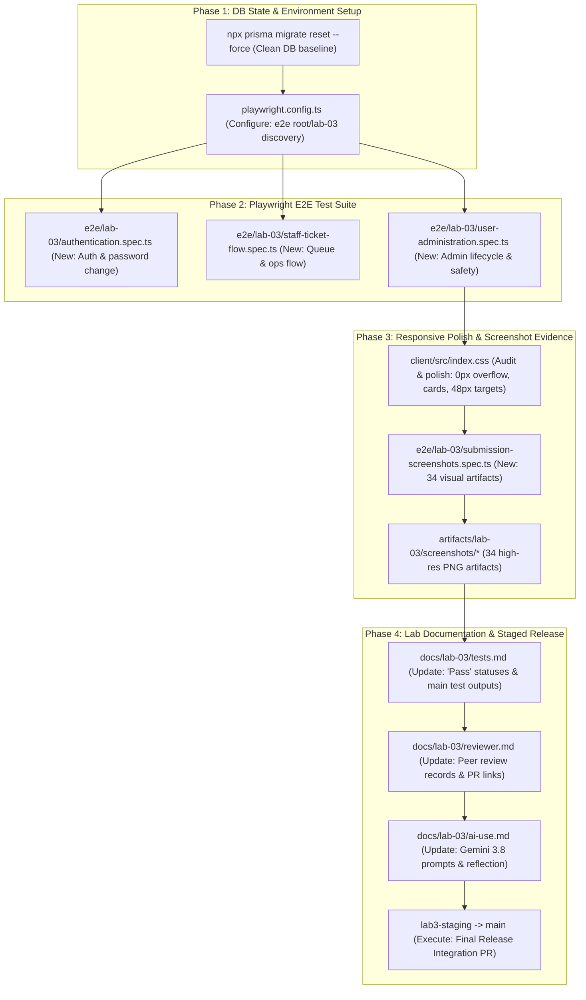

# Technical Implementation Plan: Issue 16 — E2E Test Suite, Responsive Polish & Staged Release Verification

**Document ID**: PLAN-FEAT-16  
**Feature Branch**: `feature/16-e2e-polish-release` (Issue 16 / Sprint 3 Milestone Completion)  
**Base Branch**: `lab3-staging`  
**Target Milestone**: TokTickIT Lab 3 (Sprint 3) Capstone Release  
**Authoritative Contract Reference**: [docs/features/16-e2e-polish-release/contract.md](./contract.md)  
**Master Specifications**:
* [docs/lab-03/specification.md](../../lab-03/specification.md) (`FR-01` to `FR-06`, `BR-01` to `BR-12`, `AC-01` to `AC-15`, §9 DoD)
* [docs/lab-03/ui-spec.md](../../lab-03/ui-spec.md) (Zen Green tokens, badges, §4 responsive breakpoints, §5 interaction rules)
* [docs/lab-03/api-spec.md](../../lab-03/api-spec.md) (Auth, Queue, Detail, Notes, and Admin REST contracts)
* [docs/lab-03/tests.md](../../lab-03/tests.md) (STS test catalog, `E2E-01` to `E2E-03`, passing test execution reports)
* [docs/lab-03/poc-scope-and-issues.md](../../lab-03/poc-scope-and-issues.md) (Issue 16 decomposition, `AC-16.1`–`AC-16.3`, 60-point rubric)
* [Lab_3_sheet.pdf](../../reference/Lab_3_sheet.pdf) (§8.1–§8.7, §10, §11, §12, §14 Parts 1–9)
* [AGENTS.md](../../../AGENTS.md) (Work Norms: Closed-World Rule, TDD, Theme Compliance, Blur Validation Rule)
**Document Status**: Ready for Review & Execution  

---

## 1. Target File Inventory

The following is the complete, exhaustive inventory of all files to be inspected, configured, created, or updated across `e2e/lab-03/`, `client/`, `artifacts/lab-03/screenshots/`, and `docs/lab-03/`:



### Detailed File Inventory Table

| Component | Path | Action | Description |
| :--- | :--- | :---: | :--- |
| **Config** | `playwright.config.ts` | `MODIFY` | Set `testDir: './e2e'` so Playwright seamlessly discovers and executes tests in both `e2e/lab-02/` and `e2e/lab-03/` while maintaining dev server auto-spawning (`localhost:3000` / `localhost:5173`). |
| **E2E Suite** | `e2e/lab-03/authentication.spec.ts` | `NEW` | Author Playwright E2E tests for valid/invalid login, inactive account rejection without account enumeration, mandatory initial password change flow with live checklist rules, header profile display, and logout session invalidation. |
| **E2E Suite** | `e2e/lab-03/staff-ticket-flow.spec.ts` | `NEW` | Author Playwright E2E tests for IT Staff queue search/filtering/sorting/pagination, ticket detail inspection, 1-click claiming & reassignment, IT priority updates, status transitions, public comments thread, amber internal notes role confidentiality (strictly hidden from Requesters), and Requester "Problem Appears Resolved" indication. |
| **E2E Suite** | `e2e/lab-03/user-administration.spec.ts` | `NEW` | Author Playwright E2E tests for administrator console navigation, user directory search/filter, user creation with initial password & duplicate email collision (`409 Conflict`), user editing & deactivation, self-deactivation guardrail (`BR-11`), last active administrator guardrail (`BR-12`), and initial password reset flow forcing subsequent password change. |
| **Screenshot Runner** | `e2e/lab-03/submission-screenshots.spec.ts` | `NEW` | Author automated Playwright visual evidence generator that systematically captures all 34 required submission screenshots across Desktop ($1280 \times 800$), Tablet ($768 \times 1024$), and Mobile ($375 \times 812$) viewports into `artifacts/lab-03/screenshots/`. |
| **Client Styling** | `client/src/index.css` | `AUDIT / MODIFY` | Inspect and polish responsive layout styles: ensure zero horizontal overflow (`overflow-x: hidden`), proper card wrapping, mobile tap targets ($\ge 48\text{px}$), and consistent Zen Green tokens. |
| **Visual Artifacts** | `artifacts/lab-03/screenshots/authentication/*` | `GENERATE` | Screenshots 01–09: Desktop login, mobile login, submitting busy state, invalid login alert, inactive account alert, password checklist initial, checklist satisfied, header user badge, and direct access blocked after logout. |
| **Visual Artifacts** | `artifacts/lab-03/screenshots/staff-queue/*` | `GENERATE` | Screenshots 10–19: Queue desktop table, tablet scroll wrapper, mobile stacked cards, search/status filter, unassigned ownership filter, column sorting, pagination metadata, empty/no-results feedback, failure feedback with retry, and open-detail action. |
| **Visual Artifacts** | `artifacts/lab-03/screenshots/staff-ticket-detail/*` | `GENERATE` | Screenshots 17–26: Detail desktop, detail mobile, claim button, status transition, public comments, amber internal notes with lock badge, Lab 2 attachment continuity, requester view with zero internal notes, requester resolved indicator, and direct API authorization rejection (403). |
| **Visual Artifacts** | `artifacts/lab-03/screenshots/user-management/*` | `GENERATE` | Screenshots 27–34: Admin user directory desktop, mobile cards, create user modal, duplicate email conflict alert, self-deactivation disabled toggle (`BR-11`), last active admin protection alert (`BR-12`), reset initial password modal, and non-admin forbidden access (`403`). |
| **Documentation** | `docs/lab-03/tests.md` | `MODIFY` | Update document status to `Verified Completion Baseline`, update all 34 test scenarios across Tier 1–4 from `Planned` to `Pass`, and append passing test suite output logs from `main` per Labsheet §10 and §14 Part 3. |
| **Documentation** | `docs/lab-03/reviewer.md` | `MODIFY` | Populate complete peer review records, PR links, reviewer comments from `@ShortXander101205`, author responses from `@Muhammad-Asad-Aziz`, and approvals across Issues 11–16 per Labsheet §14 Part 1. |
| **Documentation** | `docs/lab-03/ai-use.md` | `MODIFY` | Populate AI tool identification (`Google Antigravity with Gemini 3.8 Flash (High)`), 6–10 summarized key prompts with actions taken, and in-depth "My Reflection" on specification-agent and coding-agent workflows per Labsheet §14 Part 4. |

---

## 2. Phase 1: Database State & Environment Setup

### 2.1. Mandatory Database Baseline Reset
Prior to running any test suites or starting dev servers, execute an authoritative database reset to guarantee all seed users, roles, statuses, and comments are freshly restored:

```bash
cd server
npx prisma migrate reset --force
```

**Seed Verification Checklist**:
* Active Administrator accounts: `admin.toktick@kmutt.ac.th`, `backup.admin@kmutt.ac.th` (both `mustChangePassword: false`).
* Active IT Staff accounts: `wichai.it@kmutt.ac.th`, `nareerat.it@kmutt.ac.th`, `ekachai.it@kmutt.ac.th`.
* Inactive accounts: `inactive.staff@kmutt.ac.th`, `prasert.in@kmutt.ac.th` (both `isActive: false`).
* Password change account: `new.requester@kmutt.ac.th` (`mustChangePassword: true`).
* Existing Lab 2 seeded requesters: `sompong.it@kmutt.ac.th`, `anong.st@kmutt.ac.th`, `mana.st@kmutt.ac.th`, `kanda.fc@kmutt.ac.th`.

### 2.2. Playwright Configuration Update (`playwright.config.ts`)
* Update line 4 of `playwright.config.ts`:
  ```typescript
  testDir: './e2e',
  ```
  This allows running either the entire suite or targeting specific subdirectories (`npx playwright test e2e/lab-03/` or `npx playwright test e2e/lab-02/`).
* Confirm `webServer` configuration starts both the backend API server (`localhost:3000/api/health`) and frontend Vite dev server (`localhost:5173`) with `reuseExistingServer: !process.env.CI`.

---

## 3. Phase 2: Playwright E2E Test Suite Implementation

### 3.1. Authentication E2E Suite (`e2e/lab-03/authentication.spec.ts`)

Implement automated browser tests verifying `AUTH-E2E-01` through `AUTH-E2E-05`:

1. **`AUTH-E2E-01`: Valid Login & Session Persistence (`AC-01`, `FR-01`, `BR-01`)**
   - Navigate to `/login`.
   - Fill email input (`[data-testid="login-email-input"]`) with `wichai.it@kmutt.ac.th`.
   - Fill password input (`[data-testid="login-password-input"]`) with `Password123!`.
   - Click submit button (`[data-testid="login-submit-button"]`).
   - Expect URL or view to transition to `/staff/queue` (IT Staff default).
   - Assert header profile displays "Wichai IT" and "IT Staff" badge (`[data-testid="header-user-badge"]`).
   - Reload page and assert user session remains active without re-login.

2. **`AUTH-E2E-02`: Invalid Credentials Rejection (`AC-02`, `BR-01`)**
   - Fill email `sompong.it@kmutt.ac.th` and incorrect password `InvalidPassword999!`.
   - Click submit button.
   - Assert alert `[data-testid="login-error-alert"]` displays generic message: *"Invalid email or password"*.
   - Assert password input is cleared and user remains on `/login`.

3. **`AUTH-E2E-03`: Inactive Account Rejection (`AC-02`, `BR-01`)**
   - Attempt login with deactivated account `prasert.in@kmutt.ac.th` / `Password123!`.
   - Assert alert `[data-testid="login-error-alert"]` displays safe generic error without leaking account existence: *"Invalid email or password"*.

4. **`AUTH-E2E-04`: Mandatory Initial Password Change Flow (`AC-03`, `AC-04`, `FR-02`, `BR-02`)**
   - Login with `new.requester@kmutt.ac.th` / `InitialPass123!`.
   - Assert immediate forced redirection to Change Password view (`[data-testid="change-password-form"]`).
   - Attempt direct navigation or tab switching; assert app traps user on Change Password view.
   - Type weak password `weak` into new password field: assert checklist indicators show unmet rules.
   - Type compliant password `NewSecurePass2026!`, fill current password `InitialPass123!`, and matching confirmation.
   - Assert all 5 password complexity checklist items render green checkmarks.
   - Submit form: assert success feedback and redirection to normal application view (`/my-tickets` or `/`).

5. **`AUTH-E2E-05`: Application Header & Logout Session Invalidation (`AC-06`, `FR-01`)**
   - Click profile/logout dropdown button (`[data-testid="header-logout-button"]`).
   - Assert session is destroyed and view redirects to `/login`.
   - Attempt direct access to `/staff/queue` or `/my-tickets`; assert immediate redirection back to `/login`.

---

### 3.2. IT Staff Ticket Flow E2E Suite (`e2e/lab-03/staff-ticket-flow.spec.ts`)

Implement automated browser tests verifying `STAFF-E2E-01` through `STAFF-E2E-07`:

1. **`STAFF-E2E-01`: IT Staff Queue Query System (`AC-07`, `FR-03`)**
   - Login as IT Staff (`wichai.it@kmutt.ac.th`).
   - Navigate to Staff Queue.
   - **Search Filter**: Type `Wi-Fi` in `[data-testid="queue-search-input"]`; assert matching ticket numbers appear.
   - **Status Filter**: Select `OPEN` from status dropdown; assert only open tickets render.
   - **Priority Filter**: Select `URGENT`; assert urgent tickets render.
   - **Sorting**: Click column header for `Created Date` and `Ticket Number`; assert order toggles.
   - **Pagination**: Assert pagination controls render total count and page buttons.

2. **`STAFF-E2E-02`: Ticket Claiming & Reassignment (`AC-09`, `FR-04`)**
   - Open an unassigned ticket.
   - Verify Owner displays "Unassigned".
   - Click "Claim Ticket" button (`[data-testid="claim-ticket-button"]`).
   - Assert owner updates to "Wichai IT" with inline success confirmation.
   - Change owner to "Nareerat IT" using owner dropdown and click Save; assert reassignment updates.

3. **`STAFF-E2E-03`: IT Priority & Permitted Status Transitions (`AC-10`, `FR-04`, `BR-07`)**
   - Change IT Priority to `HIGH`; assert badge updates to yellow High badge.
   - Perform status transition: from `OPEN` to `IN_PROGRESS`.
   - Assert status badge reflects `IN_PROGRESS`.
   - Advance status from `IN_PROGRESS` to `RESOLVED`; assert status badge reflects `RESOLVED`.
   - Verify forbidden transitions (e.g. `RESOLVED` directly to `CANCELLED`) are disabled or rejected.

4. **`STAFF-E2E-04`: Public Comments Collaboration (`AC-11`, `FR-05`, `BR-04`)**
   - As IT Staff, post public comment: *"Access point firmware updated in CB2."*
   - Assert comment renders in public thread with author name, IT Staff badge, and timestamp.
   - Logout and login as the ticket's Requester (`sompong.it@kmutt.ac.th`).
   - Navigate to ticket detail; assert staff's public comment is visible.
   - As Requester, submit reply: *"Verified working now, thanks!"*
   - Assert requester comment appends to public thread.

5. **`STAFF-E2E-05`: Internal Notes Confidentiality & Role Barrier (`AC-12`, `FR-05`, `BR-04`)**
   - Login as IT Staff (`wichai.it@kmutt.ac.th`).
   - Open ticket detail; locate amber **Internal Notes** section (`[data-testid="internal-notes-section"]`).
   - Post private internal note: *"Switch port 4 flap detected. Scheduled for replacement."*
   - Assert internal note renders with amber background, border, and lock icon.
   - Logout and login as Requester (`sompong.it@kmutt.ac.th`).
   - Open identical ticket detail:
     - Assert `[data-testid="internal-notes-section"]` is **completely absent** from DOM.
     - Verify zero internal note content or count is exposed.

6. **`STAFF-E2E-06`: Requester "Problem Appears Resolved" Indication (`AC-13`, `BR-05`)**
   - As Requester, view active owned ticket.
   - Click "Problem Appears Resolved" button (`[data-testid="btn-problem-resolved"]`).
   - Assert resolution confirmation banner displays timestamp.
   - Assert ticket status is **not** set to `RESOLVED` or `CLOSED` (status remains unchanged).
   - Login as IT Staff: assert resolution indication banner is visible on the ticket.

7. **`STAFF-E2E-07`: Queue Role Boundary Enforcement (`AC-08`, `BR-06`)**
   - As Requester, attempt direct navigation to `/staff/queue`.
   - Assert system denies access and displays `403 Forbidden` unauthorized view or redirects to `/my-tickets`.

---

### 3.3. Administrator User Management E2E Suite (`e2e/lab-03/user-administration.spec.ts`)

Implement automated browser tests verifying `ADMIN-E2E-01` through `ADMIN-E2E-07`:

1. **`ADMIN-E2E-01`: Admin Console Navigation & Directory Filtering (`AC-14`, `FR-06`)**
   - Login as Administrator (`admin.toktick@kmutt.ac.th`).
   - Navigate to `/admin/users` (`[data-testid="user-management-view"]`).
   - Assert user directory table renders columns: Full Name, Email, Role, Status, Actions.
   - Filter by keyword `wichai`: assert filtered results.
   - Filter by Role `IT_STAFF`: assert only IT Staff display.

2. **`ADMIN-E2E-02`: Account Creation with Initial Password (`AC-14`, `FR-06`, `BR-09`, `BR-10`)**
   - Click "+ Create User" button (`[data-testid="btn-create-user"]`).
   - Modal opens (`[data-testid="create-user-modal"]`).
   - Fill Full Name ("Nuttapong Resolver"), Email ("nuttapong.res@kmutt.ac.th"), Role ("IT Staff"), Active (checked), Initial Password ("InitialPass2026!").
   - Click Save: assert modal closes and new user appears in directory table with `IT Staff` and `Active` badges.
   - **Duplicate Email Conflict (`BR-10`)**: Click "+ Create User" again with identical email `nuttapong.res@kmutt.ac.th`; assert HTTP 409 Conflict error alert displays: *"An account with this email address already exists"*.

3. **`ADMIN-E2E-03`: User Editing & Deactivation (`AC-14`, `FR-06`)**
   - Click "Edit" action on user row (`[data-testid="btn-edit-user-16"]`).
   - Change Name to "Nuttapong Senior IT" and uncheck "Active Account".
   - Click "Save Changes": assert user row updates to `Inactive` badge.

4. **`ADMIN-E2E-04`: Self-Deactivation Prevention Guardrail (`AC-15`, `BR-11`)**
   - As logged-in admin (`admin.toktick@kmutt.ac.th`), click "Edit" on own account row.
   - Assert in modal:
     - The `Active Account` checkbox is disabled (`disabled={true}`).
     - The `System Role` dropdown is disabled (`disabled={true}`).
     - Warning message displays: *"You cannot deactivate or demote your own active administrator account (BR-11)."*

5. **`ADMIN-E2E-05`: Last Active Administrator Guardrail (`AC-15`, `BR-12`)**
   - Deactivate secondary admin (`backup.admin@kmutt.ac.th`); succeeds because 1 active admin remains.
   - Open edit modal for the final remaining active administrator (`admin.toktick@kmutt.ac.th`).
   - Assert deactivation is strictly blocked with explanatory alert: *"Cannot deactivate or demote the system's last active Administrator (BR-12)."*

6. **`ADMIN-E2E-06`: Initial Password Reset Workflow (`AC-14`, `FR-06`, `FR-02`)**
   - Click "Reset Pwd" action on `wichai.it@kmutt.ac.th` (`[data-testid="btn-reset-password-2"]`).
   - Modal opens: fill new initial password `TemporaryPass2026!`.
   - Submit: assert confirmation toast displays: *"Initial password has been reset. User will be required to change it at next login."*
   - Logout and login as `wichai.it@kmutt.ac.th` with `TemporaryPass2026!`.
   - Assert user is immediately trapped on `/change-password` view (`mustChangePassword: true`).

7. **`ADMIN-E2E-07`: Non-Admin Forbidden Role Boundary (`AC-15.5`, `FR-06`)**
   - Login as IT Staff or Requester.
   - Attempt direct navigation to `/admin/users`.
   - Assert system blocks access and renders `403 Forbidden` unauthorized feedback.

---

## 4. Phase 3: Responsive Layout Audit & Screenshot Evidence

### 4.1. Responsive Conformance & 10-Point Visual Audit
Audit the responsive layout across the three standard viewports:
* **Desktop ($\ge 1200\text{px}$)**: Full multi-column data tables, side-by-side Ticket Detail panels, centered containers (`max-width: 1320px`).
* **Tablet ($768\text{px} - 1024\text{px}$)**: 2-column adaptive layout, table overflow wrapper (`overflow-x: auto`), centered modals at 85% width.
* **Mobile ($< 768\text{px}$)**: Single-column linear layout, table collapse into stacked Zen Green cards, full-width modals, touch targets $\ge 48\text{px}$, and **strictly zero horizontal page overflow** (`overflow-x: hidden`).

If any horizontal scrollbar or clipping is detected, patch the respective CSS in `client/src/index.css` or component style wrappers.

### 4.2. Screenshot Evidence Automation Runner (`e2e/lab-03/submission-screenshots.spec.ts`)
Create a dedicated Playwright automation script to generate the complete catalog of **34 screenshot artifacts** directly into `artifacts/lab-03/screenshots/`:

```
artifacts/lab-03/screenshots/
├── authentication/
│   ├── 01-login-screen-desktop.png
│   ├── 02-login-submitting-busy-state.png
│   ├── 03-login-invalid-credentials-alert.png
│   ├── 04-login-inactive-account-alert.png
│   ├── 05-change-password-checklist-initial.png
│   ├── 06-change-password-checklist-satisfied.png
│   ├── 07-header-user-role-badge.png
│   ├── 08-logout-success.png
│   └── 09-direct-api-blocked-unauthorized.png
├── staff-queue/
│   ├── 10-staff-queue-desktop.png
│   ├── 11-staff-queue-tablet.png
│   ├── 12-staff-queue-mobile-cards.png
│   ├── 13-staff-queue-search-filtered.png
│   ├── 14-staff-queue-owner-unassigned.png
│   ├── 15-staff-queue-sorting-applied.png
│   ├── 16-staff-queue-pagination.png
│   ├── 17-staff-queue-empty-no-results.png
│   ├── 18-staff-queue-failure-feedback.png
│   └── 19-staff-queue-open-detail-action.png
├── staff-ticket-detail/
│   ├── 17-staff-detail-desktop.png
│   ├── 18-staff-detail-mobile.png
│   ├── 19-staff-detail-claim-action.png
│   ├── 20-staff-detail-status-transition.png
│   ├── 21-staff-detail-public-comments.png
│   ├── 22-staff-detail-amber-internal-notes.png
│   ├── 23-staff-detail-attachment-continuity.png
│   ├── 24-requester-detail-no-internal-notes.png
│   ├── 25-requester-resolved-indicator.png
│   └── 26-direct-api-authorization-evidence.png
└── user-management/
    ├── 32-user-admin-desktop.png
    ├── 33-user-admin-search-filter.png
    ├── 34-user-admin-create-modal.png
    ├── 35-user-admin-duplicate-validation.png
    ├── 36-user-admin-edit-deactivate.png
    ├── 37-user-admin-reset-password-modal.png
    ├── 38-user-admin-forced-password-change-login.png
    ├── 39-user-admin-self-deactivation-guard.png
    ├── 40-user-admin-last-admin-guard.png
    ├── 41-user-admin-forbidden-non-admin.png
    ├── 42-user-admin-safe-failure-feedback.png
    └── 43-user-admin-responsive-mobile.png
└── responsive/
    ├── 44-responsive-login-desktop.png
    ├── 45-responsive-login-tablet.png
    ├── 46-responsive-login-mobile.png
    ├── 47-responsive-change-password-desktop.png
    ├── 48-responsive-change-password-tablet.png
    ├── 49-responsive-change-password-mobile.png
    ├── 50-responsive-ticket-queue-desktop.png
    ├── 51-responsive-ticket-queue-tablet.png
    ├── 52-responsive-ticket-queue-mobile.png
    ├── 53-responsive-ticket-detail-desktop.png
    ├── 54-responsive-ticket-detail-tablet.png
    ├── 55-responsive-ticket-detail-mobile.png
    ├── 56-responsive-user-management-desktop.png
    ├── 57-responsive-user-management-tablet.png
    └── 58-responsive-user-management-mobile.png
```

---

## 5. Phase 4: Lab Documentation & Staged Release Verification

### 5.1. Software Test Specification Completion (`docs/lab-03/tests.md`)
* **Metadata**: Update header `Status` from `Ready for Implementation` to `Verified Completion Baseline`.
* **Catalog Statuses**: Update all 34 catalog entries (`AUTH-01` to `AUTH-09`, `QUEUE-01` to `QUEUE-07`, `TKTOP-01` to `TKTOP-06`, `COMM-01` to `COMM-02`, `NOTE-01` to `NOTE-03`, `ADMIN-01` to `ADMIN-07`, `UI-LOG-01` to `UI-ADM-01`, `E2E-01` to `E2E-03`) to `Pass`.
* **Test Outputs**: Append a dedicated execution report section documenting passing terminal outputs from:
  - `server`: Vitest & Supertest API integration tests (50+ tests passing)
  - `client`: Vitest & React Testing Library UI component tests (50+ tests passing)
  - `e2e`: Playwright browser test suites (`authentication.spec.ts`, `staff-ticket-flow.spec.ts`, `user-administration.spec.ts`, `submission-screenshots.spec.ts`)

### 5.2. Peer Review Record Completion (`docs/lab-03/reviewer.md`)
* Update Section 1 with authentic Pull Request records for Issues 11, 12, 13, 14, 15, and 16.
* Record PR links, partner review comments received from `@ShortXander101205`, and author responses from `@Muhammad-Asad-Aziz`.
* Record Section 2 reciprocal peer review records for partner's PRs.

### 5.3. AI Use & Reflection Dossier Completion (`docs/lab-03/ai-use.md`)
* Explicitly state the LLM used: `Google Antigravity with Gemini 3.8 Flash (High)`.
* Populate Table 1 with 6–10 summarized key prompts covering the entire lifecycle (spec authoring, auth foundation, queue API, ticket detail & notes isolation, admin safety rules, E2E test authoring, and release integration).
* Write a thoughtful, comprehensive "My Reflection" addressing:
  - The transition from simulated identity to authenticated role-based architecture.
  - Spec-Driven Development (SDD) and how contracts prevent scope drift.
  - Multi-tiered testing pyramid (unit $\rightarrow$ API $\rightarrow$ UI $\rightarrow$ E2E) as a safety net.
  - Pair-programming with AI coding agents: strengths, prompt precision, and hallucination mitigation.

### 5.4. Staged Release Integration Procedure
Execute the final verification sweep:

```bash
# 1. Clean database reset
cd server
npx prisma migrate reset --force

# 2. Run backend API tests
npm test

# 3. Run frontend UI tests
cd ../client
npm test

# 4. Clean database reset for E2E
cd ../server
npx prisma migrate reset --force
cd ..

# 5. Run all Playwright E2E tests
npx playwright test e2e/lab-03/

# 6. Verify Git status and commit feature branch
git status
git add docs/ e2e/ client/ artifacts/
git commit -m "Complete Issue 16: E2E test suite, responsive polish, and course deliverables"
git push origin feature/16-e2e-polish-release
```

After peer review approval on `feature/16-e2e-polish-release`, merge into `lab3-staging`, perform final integration tests on `lab3-staging`, and open the release PR from `lab3-staging` into `main`.

---

## 6. Execution Gates & Sign-Off Checklist

| Gate Step | Description | Criteria for Passing |
| :---: | :--- | :--- |
| **Gate 1** | Database Baseline Reset | `npx prisma migrate reset --force` completes without error. |
| **Gate 2** | Playwright Config & E2E Suites | `authentication.spec.ts`, `staff-ticket-flow.spec.ts`, `user-administration.spec.ts` execute and pass 100%. |
| **Gate 3** | Responsive & Screenshot Evidence | All 34 screenshots generated and saved in `artifacts/lab-03/screenshots/` without horizontal page scroll. |
| **Gate 4** | Course Documentation Complete | `docs/lab-03/tests.md`, `reviewer.md`, and `ai-use.md` fully completed and committed. |
| **Gate 5** | Staged Release Verification | Staging branch `lab3-staging` passes full test sweep and is ready for release PR into `main`. |
