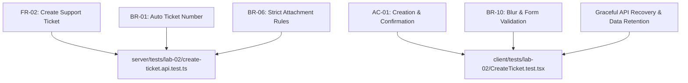

# Feature 7 Engineering Contract: Create Ticket Form & Validation

**Feature Title**: Create Ticket Form, Dynamic Number Generation & Attachment Validation  
**Branch Name**: `feature/7-create-ticket` (Issue 3)  
**Base Branch**: `lab2-staging`  
**Document Status**: Proposed Feature Contract Baseline  
**Author**: TokTickIT Engineering Team  
**Traceability References**:
* [TokTickIT-System-Level-SDS-v1.0.md](../../reference/TokTickIT-System-Level-SDS-v1.0.md) (§Data Architecture, §Decisions D-02, D-03, D-06, D-10)
* [Lab_02_labsheet.md](../../reference/Lab_02_labsheet.md) (§3, §4.3, §4.4, §4.5, §7, §8.2, §8.3)
* [specification.md](../../lab-02/specification.md) (`FR-02`, `FR-05`, `BR-01`, `BR-02`, `BR-06`, `BR-10`, `AC-01`, `AC-05`, `AC-08`)
* [api-spec.md](../../lab-02/api-spec.md) (Endpoints `POST /api/tickets`, `POST /api/v1/tickets`, Attachment Upload Rules)
* [ui-spec.md](../../lab-02/ui-spec.md) (Zen Green Tokens, DR-01 through DR-20)
* [tests.md](../../lab-02/tests.md) (STS Test Catalog: API-02, API-03, API-07, API-08, API-09, UI-03, UI-04, UI-05)
* [requester-context/contract.md](../requester-context/contract.md) (Feature 2 Approved Contract Baseline)

---

## 1. Purpose, Scope, and Exclusions

### 1.1. Purpose
Feature 7 implements the core ticket creation experience for TokTickIT Sprint 2 (Lab 2). It allows an authenticated development requester (established via `RequesterContext`) to submit an IT support request by selecting a category, identifying the affected campus system, specifying a requested priority, providing a concise summary and detailed description, and attaching supporting files (screenshots, diagnostic documents).

Upon submission, the backend atomically generates an official, human-readable, sequentially incremented Ticket Number in the format `TKT-YYYY-NNNNN` (with annual sequence resets) and persists the ticket in initial status `New`. The interface adheres strictly to the KMUTT IT Service Desk "Zen Green" design language, enforces field-level blur validation rules, supports graceful recovery during network or server disconnects, and renders a dedicated confirmation view with a copyable ticket identifier.

### 1.2. Scope
1. **Frontend Create Ticket Form & Layout**:
   * Pre-filled read-only header fields: Ticket Number (*"Generated upon submission"*), Ticket Date (current system date), and Requester Name & Email (sourced directly from `RequesterContext`).
   * Dynamic dropdown selection for **Category** (populated via `GET /api/categories`) and **Related System** (populated via `GET /api/related-systems`).
   * Visual selection control for **Requested Priority** (`Low`, `Medium`, `High`, `Urgent`) styled with Zen Green tokens and standard priority tint badges.
   * **Ticket Summary** input (required, 1–100 characters, single line).
   * **Detailed Description** textarea (required, 10–2000 characters, multiline, vertically resizable).
   * Staged **Attachments** file input with drag-and-drop or file picker, validating file type, size, and quantity before submission.
2. **Client-Side Validation & Blur Rule**:
   * Field-level blur validation: invalid or malformed field contents clear/blank out on blur without triggering premature form-level red error alerts.
   * Explicit submit validation: clicking "Submit Ticket" evaluates all required fields; if validation fails, field-specific red error messages (`#B3261E`) render directly below the offending controls with SVG warning icons.
3. **Graceful Network / Server Failure Recovery**:
   * If `POST /api/tickets` fails (e.g. backend server offline, HTTP 500, network drop), the UI displays a visible alert callout at the top of the form.
   * **Input Retention**: All user-entered form data (category, system, priority, summary, description, and staged attachments) is strictly retained in state so the user never loses their typed work.
   * The Submit button is re-enabled immediately to permit retry upon connection restoration.
4. **Backend Atomic Ticket Number Generation**:
   * Server-side transactional counter leveraging PostgreSQL and the existing `TicketNumberSequence` model.
   * Guarantees concurrent safety, gap minimization, and zero collisions formatted as `TKT-YYYY-NNNNN`.
   * Automatically resets sequence to `1` when the calendar year transitions.
5. **Strict Attachment Validation & Storage**:
   * Validation on both frontend and backend for allowed MIME types (`image/jpeg`, `image/png`, `image/webp`, `application/pdf`), max 5 MB ($5,242,880$ bytes) per file, and max 5 files per ticket.
   * Safe server storage under `server/uploads/` using UUID keys, recording `Attachment` metadata linked to the newly created ticket.
6. **Automated Verification**:
   * Supertest integration tests verifying ticket number generation, sequential ordering, concurrency safety, validation rejections, and attachment limits.
   * React Testing Library component tests verifying Zen Green styling, initial loading skeletons, inline error placement, input retention on API failure, and success card transitions.

### 1.3. Explicit Exclusions
To maintain strict compliance with Sprint 2 boundaries and avoid scope creep, the following capabilities are deliberately excluded:
* **Status Transitions Beyond "New"**: Requesters cannot select or transition statuses. All tickets enter the database with `currentStatus: "New"`.
* **IT Staff Fields & Priority Overrides**: Fields such as `itPriority`, assignee, resolver notes, internal comments, and resolution target dates are strictly prohibited.
* **Public Comments & Ticket Activity Feeds**: Deferred to Lab 3 / Lab 4.
* **Post-Creation Ticket Editing**: Once created, core ticket fields are immutable for the requester in Sprint 2.
* **Direct Ticket Deletion**: Tickets cannot be deleted by requesters.

---

## 2. Architecture & Data Model Alignment (Prisma)

Feature 7 consumes the Prisma foundation established and migrated in Feature 2 (`server/prisma/schema.prisma`). No new migrations or schema changes are required.

### 2.1. Relevant Schema Models
```prisma
// server/prisma/schema.prisma (Pre-existing models utilized by Feature 7)

model Ticket {
  id                Int           @id @default(autoincrement())
  ticketNumber      String        @unique @db.VarChar(32) // Format: TKT-YYYY-NNNNN
  requesterId       Int
  categoryId        Int
  relatedSystemId   Int
  summary           String        @db.VarChar(100)
  description       String        @db.Text
  requestedPriority String        // Low, Medium, High, Urgent
  itPriority        String?       // Deferred to IT Staff workflows
  currentStatus     String        @default("New")
  createdAt         DateTime      @default(now())
  updatedAt         DateTime      @updatedAt

  // Relations
  requester         RequesterUser @relation("RequesterTickets", fields: [requesterId], references: [id], onDelete: Restrict)
  category          Category      @relation(fields: [categoryId], references: [id], onDelete: Restrict)
  relatedSystem     RelatedSystem @relation(fields: [relatedSystemId], references: [id], onDelete: Restrict)
  attachments       Attachment[]

  @@index([requesterId])
  @@index([currentStatus])
  @@map("tickets")
}

model Attachment {
  id                   Int            @id @default(autoincrement())
  ticketId             Int
  originalFilename     String
  storedFilename       String         @unique
  mimeType             String
  fileSize             Int            // Size in bytes (max 5,242,880)
  isRemoved            Boolean        @default(false)
  removalReason        String?        @db.Text
  removedAt            DateTime?
  removedByRequesterId Int?
  createdAt            DateTime       @default(now())
  updatedAt            DateTime       @updatedAt

  // Relations
  ticket               Ticket         @relation(fields: [ticketId], references: [id], onDelete: Cascade)
  removedByRequester   RequesterUser? @relation("RequesterRemovedAttachments", fields: [removedByRequesterId], references: [id], onDelete: SetNull)

  @@index([ticketId])
  @@map("attachments")
}

model TicketNumberSequence {
  year    Int @id
  nextVal Int @default(1)

  @@map("ticket_number_sequences")
}
```

### 2.2. Transactional Ticket Number Generation Logic (`TKT-YYYY-NNNNN`)
To satisfy Business Rule `BR-01` and Decision `D-10`, the Ticket Number must be auto-generated by the backend inside an isolated Prisma database transaction (`prisma.$transaction`).

```
+-----------------------------------------------------------------------------+
| Prisma Transaction ($transaction)                                           |
|                                                                             |
| 1. Current Year: const year = new Date().getFullYear();                     |
|                                                                             |
| 2. Upsert Sequence Counter:                                                 |
|    - If row for `year` exists: increment `nextVal` by 1.                    |
|    - If row for `year` does not exist: create row { year, nextVal: 2 },     |
|      and use 1 as current value.                                            |
|                                                                             |
| 3. Format Ticket Number:                                                    |
|    const ticketNumber = `TKT-${year}-${String(allocatedVal).padStart(5, '0')}`; |
|    (e.g., TKT-2026-00001, TKT-2026-00002)                                  |
|                                                                             |
| 4. Create Ticket Record & Staged Attachments in single transaction.         |
+-----------------------------------------------------------------------------+
```

#### Transaction Implementation Specification:
```typescript
// server/src/services/ticketNumberService.ts
export async function generateTicketNumber(tx: Prisma.TransactionClient): Promise<string> {
  const currentYear = new Date().getFullYear();

  // Atomically lock and retrieve/advance the sequence counter for the current year
  const sequence = await tx.ticketNumberSequence.upsert({
    where: { year: currentYear },
    update: { nextVal: { increment: 1 } },
    create: { year: currentYear, nextVal: 2 },
  });

  // If newly created, allocated sequence is 1; if updated, allocated sequence is sequence.nextVal - 1
  const allocatedNumber = sequence.nextVal === 2 
    ? 1 
    : sequence.nextVal - 1;

  const paddedSequence = String(allocatedNumber).padStart(5, "0");
  return `TKT-${currentYear}-${paddedSequence}`;
}
```

* **Annual Reset Guarantees**: On January 1 of any year, `where: { year: currentYear }` matches nothing, creating a new row with `nextVal: 2` and allocating `00001`.
* **Concurrency Protection**: PostgreSQL row-level locks on the `ticket_number_sequences` table during `upsert` guarantee that concurrent submissions serialize safely without duplicate key violations on `ticketNumber`.

---

## 3. Strict Attachment Rules & Storage Pipeline

### 3.1. Attachment Validation Boundaries
In compliance with `BR-06` and *Labsheet* §4.5, both frontend and backend enforce the following strict boundaries:

| Attribute | Constraint Specification | Error Code / Failure Mode |
| :--- | :--- | :--- |
| **Allowed File Types** | `.jpg`, `.jpeg` (`image/jpeg`)<br/>`.png` (`image/png`)<br/>`.webp` (`image/webp`)<br/>`.pdf` (`application/pdf`) | `UNSUPPORTED_FILE_TYPE` ("Only JPG, PNG, WEBP, and PDF files are permitted.") |
| **Maximum File Size** | 5 MB = **5,242,880 bytes** per individual file | `FILE_TOO_LARGE` ("File exceeds the maximum allowed size of 5 MB.") |
| **Maximum File Count** | Maximum **5 active attachments** per ticket | `ATTACHMENT_LIMIT_EXCEEDED` ("A maximum of 5 attachments are allowed per ticket.") |

### 3.2. Frontend File Staging & Client-Side Pre-Check
* When files are selected via the file input or dragged onto the upload zone:
  1. The client inspects `file.type` and `file.name` extension against allowed extensions (`.jpg`, `.jpeg`, `.png`, `.webp`, `.pdf`).
  2. The client inspects `file.size <= 5242880`.
  3. The client inspects `currentStagedFiles.length + incomingFiles.length <= 5`.
* **Rejection Behavior**: If any incoming file fails validation, it is rejected immediately, excluded from the staged list, and a dismissible warning callout is shown (e.g. *"File 'data.txt' rejected: unsupported file type"* or *"File 'report.pdf' rejected: exceeds 5 MB limit"*).
* **Staged Attachments UI**: Each valid staged file is displayed in a clean list below the file picker showing:
  * File icon (image vs. PDF).
  * Original filename.
  * Formatted file size (e.g., `1.2 MB`, `420 KB`).
  * A "Remove" button (`✕`) allowing the user to remove an individual staged file before submitting.

### 3.3. Server Storage Pipeline (`server/uploads/`)
* **Storage Location**: Local directory `server/uploads/` (abstracted for zero-friction swap to SeaweedFS/S3 per Decision `PD-03`).
* **Disk Filename Sanitization**: Stored filenames use random UUID v4 with preserved extension: `${crypto.randomUUID()}.${ext}` (e.g., `8f3b6c2d-8e4a-4d1f-b5e2-6c3a8d9e0f1a.png`).
* **Audit Metadata**: The database record saves the original filename (`originalFilename`), MIME type (`mimeType`), file size in bytes (`fileSize`), and stored filename key (`storedFilename`).

---

## 4. REST API Contracts

### 4.1. `POST /api/tickets` (and alias `POST /api/v1/tickets`)
Creates a new support ticket in initial status `New`. Supports both pure JSON submissions (0 files) and `multipart/form-data` submissions (1–5 files).

* **Method**: `POST`
* **Routes**: `/api/tickets` and `/api/v1/tickets`
* **Headers**:
  * `Accept: application/json`
  * `x-requester-id: <number>` (Optional if `requesterId` is supplied in body/form)
  * `Content-Type`: `application/json` OR `multipart/form-data`

#### Request Payload Specification:

##### A. JSON Body (`Content-Type: application/json` — No Attachments):
```json
{
  "requesterId": 1,
  "categoryId": 4,
  "relatedSystemId": 1,
  "requestedPriority": "High",
  "summary": "Cannot connect to KMUTT-Secure Wi-Fi in building SCL",
  "description": "Device repeatedly fails authentication when trying to connect to KMUTT-Secure on the 3rd floor. Tried forgetting network and re-entering credentials without success."
}
```

##### B. Multipart Form Data (`Content-Type: multipart/form-data` — With Attachments):
* `requesterId`: `1` (stringified integer)
* `categoryId`: `4` (stringified integer)
* `relatedSystemId`: `1` (stringified integer)
* `requestedPriority`: `"High"`
* `summary`: `"Cannot connect to KMUTT-Secure Wi-Fi in building SCL"`
* `description`: `"Device repeatedly fails authentication when trying to connect to KMUTT-Secure on the 3rd floor."`
* `attachments`: `[File binary, File binary, ...]` (up to 5 binary files)

#### Field Validation Rules:
* `requesterId`: Required positive integer; must match an active `RequesterUser` (`isActive: true`).
* `categoryId`: Required positive integer; must reference an active `Category`.
* `relatedSystemId`: Required positive integer; must reference an active `RelatedSystem`.
* `requestedPriority`: Required enum string: `"Low"`, `"Medium"`, `"High"`, or `"Urgent"`.
* `summary`: Required string, trimmed; length between 1 and 100 characters.
* `description`: Required string, trimmed; minimum length 10 characters, maximum length 2000 characters.
* `attachments`: Optional array of binary files; max 5 files; max 5,242,880 bytes per file; MIME types restricted to `image/jpeg`, `image/png`, `image/webp`, `application/pdf`.

#### Success Response (`201 Created`):
```json
{
  "id": 101,
  "ticketNumber": "TKT-2026-00001",
  "requesterId": 1,
  "categoryId": 4,
  "relatedSystemId": 1,
  "summary": "Cannot connect to KMUTT-Secure Wi-Fi in building SCL",
  "description": "Device repeatedly fails authentication when trying to connect to KMUTT-Secure on the 3rd floor. Tried forgetting network and re-entering credentials without success.",
  "requestedPriority": "High",
  "itPriority": null,
  "currentStatus": "New",
  "createdAt": "2026-09-04T16:20:00.000Z",
  "updatedAt": "2026-09-04T16:20:00.000Z",
  "requester": {
    "id": 1,
    "name": "Sompong IT",
    "email": "sompong.it@kmutt.ac.th"
  },
  "category": {
    "id": 4,
    "code": "NET",
    "name": "Network"
  },
  "relatedSystem": {
    "id": 1,
    "name": "Campus Wi-Fi"
  },
  "attachments": [
    {
      "id": 501,
      "originalFilename": "wifi_error.png",
      "mimeType": "image/png",
      "fileSize": 245760,
      "createdAt": "2026-09-04T16:20:00.000Z"
    }
  ]
}
```

#### Error Responses:

##### 1. Validation Failure (`400 Bad Request`):
```json
{
  "error": {
    "code": "VALIDATION_FAILED",
    "message": "Validation failed for ticket creation.",
    "fieldErrors": [
      {
        "field": "summary",
        "message": "Summary is required and must not exceed 100 characters."
      },
      {
        "field": "description",
        "message": "Description must be at least 10 characters."
      }
    ],
    "timestamp": "2026-09-04T16:20:00.000Z"
  }
}
```

##### 2. File Validation Failure (`400 Bad Request`):
```json
{
  "error": {
    "code": "UNSUPPORTED_FILE_TYPE",
    "message": "File 'script.sh' has an unsupported format. Allowed types: JPG, PNG, WEBP, PDF.",
    "timestamp": "2026-09-04T16:20:00.000Z"
  }
}
```

##### 3. Server Failure (`500 Internal Server Error`):
```json
{
  "error": {
    "code": "INTERNAL_SERVER_ERROR",
    "message": "An unexpected error occurred while creating the ticket. Please try again.",
    "timestamp": "2026-09-04T16:20:00.000Z"
  }
}
```

---

## 5. UI Specification & Zen Green Design System

All visual elements, layout proportions, control states, and color applications adhere strictly to the KMUTT IT Service Desk "Zen Green" design tokens and approved decisions `DR-01` through `DR-20`.

### 5.1. Form Layout Wireframes

#### A. Initial / Active Create Ticket Form
```
+-----------------------------------------------------------------------------+
| TokTickIT  [Create Ticket]  [My Tickets]         👤 Sompong IT  [Switch User]|
+-----------------------------------------------------------------------------+
|                                                                             |
|  Create Support Ticket                                                      |
|  Submit an IT incident or service request to the KMUTT Service Desk.        |
|                                                                             |
|  +-----------------------------------------------------------------------+  |
|  | [Read-Only Header Section]                                            |  |
|  | Ticket Number: [ TKT-YYYY-NNNNN (Generated upon submission) ] (gray)   |  |
|  | Ticket Date:   [ 2026-09-04 (Today)                         ] (gray)   |  |
|  | Requester:     [ Sompong IT (sompong.it@kmutt.ac.th)       ] (gray)   |  |
|  +-----------------------------------------------------------------------+  |
|                                                                             |
|  Category *                          Related System *                       |
|  [ Select Category               ▼]  [ Select Related System            ▼]  |
|                                                                             |
|  Requested Priority *                                                       |
|  ( ) Low      (•) Medium      ( ) High      ( ) Urgent                      |
|                                                                             |
|  Ticket Summary *                                                           |
|  [ e.g. Cannot connect to campus Wi-Fi in building SCL                   ]  |
|  (Helper: Concise description of the issue, max 100 characters)             |
|                                                                             |
|  Detailed Description *                                                     |
|  +-----------------------------------------------------------------------+  |
|  | Provide steps to reproduce, exact error messages, room number, etc.    |  |
|  |                                                                       |  |
|  |                                                                       |  |
|  +-----------------------------------------------------------------------+  |
|  (Helper: Minimum 10 characters)                                            |
|                                                                             |
|  Supporting Attachments (Optional)                                          |
|  +-----------------------------------------------------------------------+  |
|  | 📁 Drag & drop files here, or click to browse                         |  |
|  | Accepted: JPG, PNG, WEBP, PDF (Max 5 MB each, up to 5 files)           |  |
|  +-----------------------------------------------------------------------+  |
|  Staged Files:                                                              |
|  • wifi_error.png (240 KB)  [✕ Remove]                                      |
|                                                                             |
|  +-----------------------------------------------------------------------+  |
|  | [ Cancel / Reset ]                             [ Submit Ticket ➔ ]    |  |
|  +-----------------------------------------------------------------------+  |
+-----------------------------------------------------------------------------+
```

#### B. API Connection Failure & Input Retention State
```
+-----------------------------------------------------------------------------+
| ⚠️ Submission Failed: Unable to connect to TokTickIT server.                 |
| Your entered details have been preserved. Please verify your connection      |
| and click "Retry Submission".                                                |
+-----------------------------------------------------------------------------+
|  [Form remains completely populated with user's typed summary, description,  |
|   priority selection, category, and staged files. No inputs are wiped.]     |
|                                                                             |
|  [ Cancel / Reset ]                             [ Retry Submission ➔ ]      |
+-----------------------------------------------------------------------------+
```

#### C. Dedicated Creation Confirmation Card (`DR-16`)
```
+-----------------------------------------------------------------------------+
|                                                                             |
|                    +-----------------------------------+                    |
|                    |               ( ✓ )               |                    |
|                    |     Ticket Created Successfully!  |                    |
|                    +-----------------------------------+                    |
|                    | Your support ticket has been      |                    |
|                    | registered in the system.         |                    |
|                    |                                   |                    |
|                    | Official Ticket Number:           |                    |
|                    | +-------------------------------+ |                    |
|                    | |       TKT-2026-00001          | |                    |
|                    | +-------------------------------+ |                    |
|                    | [ 📋 Copy Number ]                |                    |
|                    |                                   |                    |
|                    | Status: [ New ]  Priority: [ High]|                    |
|                    | Summary: Cannot connect to Wi-Fi  |                    |
|                    | Date: 2026-09-04 16:20            |                    |
|                    |                                   |                    |
|                    | [ Create Another Ticket ]         |                    |
|                    +-----------------------------------+                    |
|                                                                             |
+-----------------------------------------------------------------------------+
```

### 5.2. Zen Green Token Compliance
All form elements consume tokens from `client/src/index.css` or CSS variables:
* **Header / Primary Action**: `--zen-primary-green: #006B3C`
* **Focus Halo / Hover State**: `--zen-secondary-green: #0B7A46` with halo `0 0 0 3px rgba(11, 122, 70, 0.20)` (`DR-08`)
* **Page Canvas**: `--zen-page-bg: #F5F7F6`
* **Card & Form Surface**: `--zen-surface: #FFFFFF` with `border-radius: 8px` and soft shadow
* **Read-Only Shading**: `--zen-field-readonly-bg: #F0F4F1`
* **Text Primary**: `--zen-text-primary: #1C2826`
* **Error Text & Border**: `--zen-error: #B3261E` with focus halo `0 0 0 3px rgba(179, 38, 30, 0.15)` (`DR-13`)
* **Priority Tints**:
  * Low: Background `#E5E7EB`, text `#374151`
  * Medium: Background `#DBEAFE`, text `#1E40AF`
  * High: Background `#FEF3C7`, text `#92400E`
  * Urgent: Background `#FEE2E2`, text `#991B1B`

### 5.3. Form Field Behavior & The Blur Validation Rule
* **Label Placement**: Positioned strictly above controls (`DR-06`), `16px`, `font-weight: 600`, color `var(--zen-text-primary)` with red asterisk `<span className="text-danger ms-1">*</span>` on required fields.
* **The Blur Validation Rule (`AGENTS.md` §4, `BR-10`)**:
  * If a user types malformed or whitespace-only data into a field and tabs/clicks away, the control clears/blanks out on blur.
  * Form-level red validation alerts and error messages are **NOT** rendered during general typing or blurring. They only trigger upon clicking the explicit "Submit Ticket" button.
* **Inline Error Presentation (`DR-13`)**:
  * Rendered directly below the invalid input in `13px` `#B3261E` with an SVG warning icon.
  * The input border transitions to `1px solid #B3261E` with error glow `0 0 0 3px rgba(179, 38, 30, 0.15)`.

### 5.4. Component Interaction Workflows & State Machine

```mermaid
stateDiagram-v2
    [*] --> Loading: Mount & Fetch Reference Data
    Loading --> Idle: Categories & Systems Loaded
    Loading --> LoadError: Master Data Fetch Fails
    LoadError --> Loading: Click "Retry Loading"
    
    Idle --> Typing: User Enters Inputs / Stages Files
    Typing --> Typing: Blur clears invalid field
    
    Typing --> Validating: User clicks "Submit Ticket"
    Validating --> InvalidState: Validation checks fail
    InvalidState --> Typing: User corrects inputs
    
    Validating --> Submitting: Validation checks pass
    Submitting --> SuccessState: HTTP 201 Created
    Submitting --> RecoverableError: HTTP 4xx/5xx or Network Error
    
    RecoverableError --> Submitting: Inputs preserved, click "Retry"
    SuccessState --> Idle: Click "Create Another Ticket"
```



1. **Loading State (`.zen-skeleton`)**: While `GET /api/categories` and `GET /api/related-systems` are resolving, render pulsing skeleton placeholder bars for the dropdowns.
2. **Submitting / Busy State**:
   * Submit button becomes disabled, background transitions to `#8EAA9A`, cursor `not-allowed`.
   * Button text changes to `"Submitting…"`, prepended with an animated Bootstrap spinner `<span className="spinner-border spinner-border-sm me-2" role="status" aria-hidden="true" />`.
   * All form inputs (`<input>`, `<select>`, `<textarea>`, file picker) are temporarily disabled to prevent concurrent duplicate submissions (`AC-03.4`).
3. **Graceful Error Recovery State**:
   * If the API call fails or network drops, a prominent alert banner appears at the top of the form with `role="alert"`:
     *"⚠️ Submission Failed: Unable to connect to TokTickIT server. Your inputs have been preserved. Please try again."*
   * Form inputs are unlocked.
   * **Crucial Invariant**: State variables for `summary`, `description`, `categoryId`, `relatedSystemId`, `requestedPriority`, and `stagedFiles` are untouched, ensuring zero data loss.
4. **Successful Creation State (`DR-16`)**:
   * Renders the confirmation card with green checkmark icon.
   * Highlighted box displaying the official generated `ticketNumber` with a "Copy" button that writes to `navigator.clipboard`.
   * Displays created ticket summary, priority badge, and status `New` badge.
   * "Create Another Ticket" button that resets form state to clean defaults.

### 5.5. Responsive Breakpoint Rules
* **Desktop ($\ge 992\text{px}$)**:
  * Maximum container width `1320px` (`DR-04`).
  * Card padding `24px` (`DR-03`).
  * Category and Related System render side-by-side in a 2-column grid (`col-lg-6`).
* **Tablet ($768\text{px} - 991\text{px}$)**:
  * Hybrid 2-column header (`Category` and `Related System` side-by-side); `Priority`, `Summary`, and `Description` expand full-width (`DR-11`).
* **Mobile ($< 768\text{px}$)**:
  * Full-width single-column stack with card padding `16px`.
  * Touch target minimum **`48px`** on all interactive inputs, buttons, and radio pills (`DR-12`).
  * Zero horizontal scrolling.

---

## 6. Software Test Specification (STS)

Every functional requirement, business rule, and boundary check is mapped to deterministic automated assertions across Supertest and React Testing Library.



### 6.1. Backend API Integration Tests (`server/tests/lab-02/create-ticket.api.test.ts`)

| Test ID | Scenario / Focus | Input Parameters | Expected Assertion & Result | Mapped Req |
| :--- | :--- | :--- | :--- | :--- |
| `API-TKT-01` | Valid Ticket Creation (JSON) | Valid `requesterId`, `categoryId`, `relatedSystemId`, `requestedPriority: "High"`, `summary: "Wi-Fi down"`, `description: "Cannot connect on 3rd floor"` | HTTP `201 Created`; returns ticket object with `id`, `ticketNumber` matching `^TKT-[0-9]{4}-[0-9]{5}$`, `currentStatus: "New"`, and relations populated. | `FR-02`, `AC-01`, `BR-02` |
| `API-TKT-02` | Sequential Number Allocation | Submit two tickets consecutively in year `YYYY` | Ticket 1 has `TKT-YYYY-00001`; Ticket 2 has `TKT-YYYY-00002`. Asserts strict sequential progression without gaps. | `BR-01`, `AC-01` |
| `API-TKT-03` | Concurrency Safety (Atomic Sequence) | Execute 5 parallel `POST /api/tickets` requests via `Promise.all` | All 5 requests return HTTP 201; all 5 generated ticket numbers are strictly unique; sequence counters match consecutive order. | `BR-01`, `AC-03.6` |
| `API-TKT-04` | Missing Required Fields | Payload with empty `summary: ""` or `description: ""` | HTTP `400 Bad Request`; response has `error.code: "VALIDATION_FAILED"` and `fieldErrors` array pointing to `summary` and `description`. | `AC-03.2` |
| `API-TKT-05` | Summary Max Length Boundary | Payload with `summary` of exactly 100 characters vs. 101 characters | 100 characters returns HTTP 201; 101 characters returns HTTP 400 with `fieldErrors` for `summary`. | `FR-02` |
| `API-TKT-06` | Description Min Length Boundary | Payload with `description` of 9 characters vs. 10 characters | 9 characters returns HTTP 400; 10 characters returns HTTP 201. | `FR-02` |
| `API-TKT-07` | Inactive Requester Rejection | Payload referencing inactive user `Prasert Inactive` (`isActive: false`) | HTTP `400 Bad Request`; rejects creation for inactive requesters. | `BR-09` |
| `API-TKT-08` | Valid Multipart Attachment Upload | `multipart/form-data` with ticket data + 1 valid PNG file (100 KB) | HTTP `201 Created`; ticket created; `attachments` array has 1 item with matching `originalFilename` and `fileSize`. | `FR-05`, `BR-06` |
| `API-TKT-09` | Attachment Type Boundary Rejection | Upload file `test.txt` (`text/plain`) or `malicious.exe` | HTTP `400 Bad Request`; returns `error.code: "UNSUPPORTED_FILE_TYPE"`. No ticket created. | `BR-06`, `AC-05` |
| `API-TKT-10` | Attachment Size Boundary Rejection | Upload file of size $5,242,881$ bytes ($5\text{ MB} + 1\text{ byte}$) | HTTP `400 Bad Request`; returns `error.code: "FILE_TOO_LARGE"`. File is not written to disk. | `BR-06`, `AC-05` |
| `API-TKT-11` | Attachment Quantity Boundary Rejection | Upload payload with 6 active files | HTTP `400 Bad Request`; returns `error.code: "ATTACHMENT_LIMIT_EXCEEDED"`. | `BR-06`, `AC-05` |

### 6.2. Frontend Component Tests (`client/tests/lab-02/CreateTicket.test.tsx`)

| Test ID | Scenario / Focus | User Interaction & Component Mocking | Expected Assertion & Verification Criteria | Mapped Req |
| :--- | :--- | :--- | :--- | :--- |
| `UI-TKT-01` | Read-Only Header Population | Mount form with mock active requester "Sompong IT" | Asserts Ticket Number displays `"Generated upon submission"`, Requester displays `"Sompong IT"`, and inputs have read-only styling. | `BR-01`, `AC-01` |
| `UI-TKT-02` | Dropdown Population | Mock `/api/categories` and `/api/related-systems` | Asserts Category dropdown contains 4 options; Related System dropdown contains at least 6 options. | `AC-01` |
| `UI-TKT-03` | Empty Submission Inline Errors | Click "Submit Ticket" with pristine/empty fields | Form submission is halted; API is not called; inline error messages appear directly below `Summary`, `Description`, `Category`, and `Related System`. | `AC-03.2`, `BR-10` |
| `UI-TKT-04` | Blur Validation Rule | Type spaces in Summary, blur input; type invalid text in Description, blur input | Input values are cleared/blanked on blur; asserts form-level error message is **not** prematurely displayed before submit. | `BR-10`, `AGENTS.md` |
| `UI-TKT-05` | Submitting Busy State | Click "Submit Ticket" with valid form inputs | Submit button immediately becomes disabled; displays spinner icon and text `"Submitting…"`; inputs are disabled. | `AC-03.4`, `DR-09` |
| `UI-TKT-06` | Creation Success Card & Copy | Mock successful `POST /api/tickets` response with `TKT-2026-00001` | Form unmounts; Confirmation card renders with `TKT-2026-00001`; clicking "Copy Number" triggers clipboard write; "Create Another" resets form. | `DR-16`, `AC-01` |
| `UI-TKT-07` | API Failure Graceful Recovery & Input Retention | Mock `POST /api/tickets` rejecting with Network Error / 500 | Asserts visible error banner rendered at top (`role="alert"`); **crucially asserts all typed values (Summary, Description, Priority, Category) remain intact in the fields**; Submit button re-enabled. | `AC-03.5`, Requirement 5 |
| `UI-TKT-08` | Client File Validation (Type & Size) | Select a 6MB PDF or a `.txt` file via file picker | File is rejected; warning alert shown; staged files list remains empty; invalid file is not uploaded. | `BR-06`, Requirement 4 |
| `UI-TKT-09` | Staged Attachment Removal | Select 2 valid PNG files, click "Remove" on the first | Staged files list updates to 1 file; removed file is omitted from subsequent form submission payload. | Requirement 4 |

---

## 7. Open Questions & Architectural Clarifications

1. **Attachment Upload Strategy (Combined vs. Two-Step)**:
   * *Resolution Confirmed*: The contract supports submitting attachments directly during initial ticket creation via `multipart/form-data` on `POST /api/tickets` (and pure JSON if no files are attached). This eliminates orphaned files if the user abandons creation, while maintaining compatibility with Issue 5's post-creation attachment upload endpoint `POST /api/v1/tickets/:id/attachments`.
2. **Summary Character Limit Alignment**:
   * *Resolution Confirmed*: The Prisma schema defines `summary String @db.VarChar(100)`. To prevent database truncation errors, the contract sets the strict maximum length to **100 characters** (updating the informal 120 character mention in early planning notes).
3. **Priority Selection Component**:
   * *Resolution Confirmed*: A radio group / button pill selector displaying `Low`, `Medium`, `High`, and `Urgent` with standard Zen Green priority color tints (`Low`: gray `#E5E7EB`, `Medium`: blue `#DBEAFE`, `High`: amber `#FEF3C7`, `Urgent`: red `#FEE2E2`). Default selection is `"Medium"`.

---

## 8. Review & Sign-Off Gate

| Gate Checklist Item | Status | Verification Evidence |
| :--- | :---: | :--- |
| Strict Closed-World compliance (no unauthorized assumptions) | ✅ PASS | All requirements grounded in Lab 2 Labsheet, SDS v1.0, and SPEC-LAB-02. |
| Zero application code written before contract review | ✅ PASS | Only contract specification file updated; working tree clean. |
| Automatic Ticket Number generation transactionally specified | ✅ PASS | Fully defined in §2.2 with `TicketNumberSequence` atomic upsert pattern. |
| Strict attachment rules defined (types, 5MB, 5 files max) | ✅ PASS | Defined in §3 with frontend and backend validation specs. |
| Graceful API failure recovery with input retention specified | ✅ PASS | Documented in §5.1, §5.4, and verified in test `UI-TKT-07`. |
| REST API endpoint `POST /api/tickets` schemas defined | ✅ PASS | Detailed JSON and multipart schemas with field validation rules in §4.1. |
| Software Test Specification (STS) with concrete assertions | ✅ PASS | 11 API tests + 9 UI component tests specified in §6. |
| KMUTT Zen Green style tokens and blur validation rule enforced | ✅ PASS | Codified in §5 with explicit CSS variables and blur clearing mechanics. |
| Exclusions strictly documented (no status > New, no IT staff) | ✅ PASS | Codified in §1.3. |
