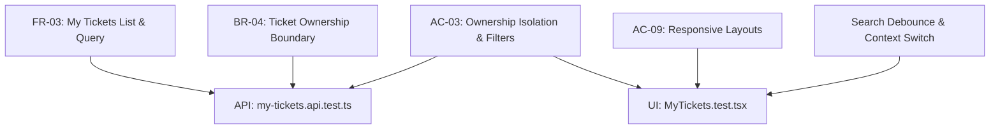

# Feature 8 Engineering Contract: My Tickets Screen & Filtering

**Feature Title**: My Tickets Screen, Filtering, Search & Responsive Pagination  
**Branch Name**: `feature/8-my-tickets` (Issue 8 / Sprint 2 Issue 4)  
**Base Branch**: `lab2-staging`  
**Document Status**: Proposed Feature Contract Baseline  
**Author**: TokTickIT Engineering Team  
**Traceability References**:
* [TokTickIT-System-Level-SDS-v1.0.md](../../reference/TokTickIT-System-Level-SDS-v1.0.md) (§Data Architecture, §Decisions D-02, D-03, D-04, §"Authorization Model" p. 10, §"API Design Standards" p. 12)
* [Lab_02_labsheet.md](../../reference/Lab_02_labsheet.md) (§1, §3, §6.1, §7, §8.4, §14 Part 7)
* [specification.md](../../lab-02/specification.md) (`FR-03`, `BR-04`, `AC-03`, `AC-09`)
* [api-spec.md](../../lab-02/api-spec.md) (Endpoints `GET /api/tickets`, `GET /api/v1/tickets`)
* [ui-spec.md](../../lab-02/ui-spec.md) (Zen Green Tokens, DR-01 through DR-20, §3.4 Tables, §4 Responsive Breakpoint Rules)
* [tests.md](../../lab-02/tests.md) (STS Test Catalog: API-04, API-05, UI-06, UI-07)
* [requester-context/contract.md](../requester-context/contract.md) (Feature 2 Approved Contract Baseline)
* [create-ticket/contract.md](../create-ticket/contract.md) (Feature 7 Approved Contract Baseline)

---

## 1. Purpose, Scope, and Exclusions

### 1.1. Purpose
Feature 8 delivers the central ticket tracking dashboard for TokTickIT Sprint 2 (Lab 2): the **My Tickets Screen**. This interface allows university requesters (students, staff, faculty) operating under our simulated Development Requester context to browse, inspect, search, filter, sort, and paginate through their submitted IT support requests.

The My Tickets view provides requesters with complete operational visibility into their active and resolved tickets, displaying key metadata including system-generated Ticket Numbers (`TKT-YYYY-NNNNN`), problem summaries, assigned categories, affected campus IT systems, requested priorities, IT-assigned priorities, current lifecycle statuses, creation dates, and last updated timestamps.

The backend endpoint (`GET /api/tickets` and alias `GET /api/v1/tickets`) acts as an authoritative ownership boundary, guaranteeing that requesters can **only** inspect tickets they created, with complete data isolation between university accounts. The frontend adheres strictly to the KMUTT IT Service Desk "Zen Green" design language, featuring debounced keyword searching, multi-criteria filtering, interactive column sorting, bounded pagination, distinct empty and no-results states, seamless mobile responsiveness, and instant reactivity when the simulated requester context changes.

### 1.2. Scope
1. **Backend Paginated Query API (`GET /api/tickets` & `GET /api/v1/tickets`)**:
   * **Strict Server-Side Ownership Filter**: Query execution is mathematically scoped to `WHERE requesterId = currentRequesterId` derived from the validated `x-requester-id` HTTP header.
   * **Multi-Attribute Filtering**:
     * `search`: Free-text query performing case-insensitive substring matching against `ticketNumber` and `summary`.
     * `category`: Exact match on category `id`, `name`, or `code`.
     * `requestedPriority`: Case-insensitive match on priority (`Low`, `Medium`, `High`, `Urgent`).
     * `itPriority`: Case-insensitive match on IT priority (`Low`, `Medium`, `High`, `Urgent`, or `UNASSIGNED`).
     * `status`: Exact match on `currentStatus` (`New`, `Assigned`, `In Progress`, `Pending Requester`, `Resolved`, `Closed`, `Cancelled`).
   * **Multi-Column Sorting**:
     * Supported sort fields: `createdAt` (default), `ticketNumber`, `summary`, `updatedAt`, `requestedPriority`, `itPriority`, `currentStatus`.
     * Sort orders: `asc` and `desc` (default: `desc`).
   * **Bounded Pagination Math**:
     * 1-indexed `page` parameter (default `1`).
     * `pageSize` parameter bounded to `10`, `25`, or `50` records (default `10`).
     * Response metadata: `totalCount`, `totalPages`, `currentPage` (and alias `page`), `pageSize`.
   * **Relational Joins & Count Aggregation**: Includes joined records for `category`, `relatedSystem`, and active `attachmentCount`.
2. **Frontend My Tickets Interface (`MyTickets.tsx`)**:
   * **Debounced Search Bar**: Text input featuring a 350ms client-side debounce to prevent query spam on every keystroke, complete with a quick-clear trigger (`✕`).
   * **Filter Bar**: Dropdown selectors for Category, Requested Priority, IT Priority, and Status, accompanied by a visible "Clear Filters" action.
   * **Interactive Table Headers (Desktop)**: Column headers with clickable sorting triggers displaying directional indicators (`▲` ASC, `▼` DESC, `⇅` inactive).
   * **Pagination Bar**: Navigation controls providing Previous, Next, numerical page pills, and a page size selector (`10`, `25`, `50`), with a record counter (`Showing X to Y of Z tickets`).
   * **Responsive Layout Adaptation**:
     * Desktop ($\ge 992\text{px}$): Clean, high-density data table (`~52px` row height) with hover highlights.
     * Mobile ($< 768\text{px}$): Stacked card view optimizing vertical space, eliminating horizontal scrolling, and enforcing $\ge 48\text{px}$ touch targets.
     * Tablet ($768\text{px} - 991\text{px}$): Hybrid layout with horizontal swipe container.
   * **Context Reactivity & State Handling**:
     * Loading skeleton shimmers (`.zen-skeleton`).
     * Zero-ticket Empty State with "Create Your First Ticket" CTA.
     * Filtered No-Results State with "Clear Filters" CTA.
     * Instant context update: Changing active user in the header purges stale rows and immediately loads the new requester's tickets.
3. **Automated Verification**:
   * Supertest integration tests in `server/tests/lab-02/my-tickets.api.test.ts` verifying ownership isolation, pagination math, search, filtering, and sorting.
   * Vitest/React Testing Library tests in `client/tests/lab-02/MyTickets.test.tsx` verifying debounced search, filtering, table sorting, mobile presentation, empty/no-results states, and context switching.

### 1.3. Explicit Exclusions
To maintain strict compliance with Sprint 2 boundaries and prevent scope creep, the following capabilities are deliberately excluded from Feature 8:
* **Cross-Requester Ticket Visibility**: Requesters are strictly prohibited from viewing tickets submitted by other users. There is no global or shared queue.
* **IT Staff Workflows & Ticket Claiming**: No resolver queue, unassigned ticket pool, ticket assignment/claiming mechanisms, or administrative reassignment flows.
* **Status Updates & Field Mutations**: Requesters cannot transition statuses, modify priorities, or edit ticket descriptions from this screen.
* **Inline Ticket Deletion**: Tickets cannot be deleted or archived by requesters.
* **Direct Attachment Downloads from Table**: File management and attachment downloads are scoped to the Ticket Detail Screen (Feature 9 / Issue 5).
* **Public Comments & Activity Feeds**: Interaction feeds and ticket commenting are deferred to Lab 3 / Lab 4.

---

## 2. Strict Requester Isolation (Ownership Protection)

### 2.1. Architectural Mandate & Threat Model
In accordance with *System SDS v1.0* (§Authorization Model, p. 10) and Business Rule `BR-04`, the application enforces strict multi-tenant requester isolation. Because formal authentication (passwords, JWTs, session tables) is scheduled for Lab 3, Sprint 2 establishes identity simulation through the `x-requester-id` header.

Under no circumstance may a requester discover, query, count, or infer the existence of tickets belonging to another user. Even if a user knows or guesses a valid `ticketNumber` owned by someone else (e.g. `TKT-2026-00002`), querying `/api/tickets?search=TKT-2026-00002` MUST return an empty result set (`items: []`, `totalCount: 0`).

```
+-------------------------------------------------------------------------------------------------+
|                                HTTP Request: GET /api/tickets                                   |
|                                Header: x-requester-id: 2                                        |
+-------------------------------------------------------------------------------------------------+
                                                │
                                                ▼
+-------------------------------------------------------------------------------------------------+
| Express Controller Validation (tickets.ts)                                                      |
| 1. Parse x-requester-id -> requesterId = 2                                                      |
| 2. Verify RequesterUser exists & isActive === true                                              |
|    - If missing or invalid -> HTTP 400 Bad Request                                              |
| 3. Mandatory Prisma Invariant:                                                                  |
|    WHERE AND: [                                                                                 |
|      { requesterId: 2 },            <--- HARD INVARIANT (CANNOT BE OVERRIDDEN)                  |
|      { ...userSearchAndFilters }                                                                |
|    ]                                                                                            |
+-------------------------------------------------------------------------------------------------+
                                                │
                                                ▼
+-------------------------------------------------------------------------------------------------+
| PostgreSQL Database (tickets table)                                                             |
| Query: SELECT * FROM tickets WHERE requester_id = 2 AND ...                                     |
| Result: Only tickets owned by Requester 2 are returned. Requester 1's data is 100% isolated.    |
+-------------------------------------------------------------------------------------------------+
```

### 2.2. Backend Identity Extraction & Validation Rules
1. **Header Extraction (Sole Identity Transport)**: The controller extracts the requester ID strictly and exclusively from `req.headers["x-requester-id"]`. Any `requesterId` provided via URL query parameters is strictly ignored to eliminate identity tampering and URL-spoofing vectors.
2. **Missing / Malformed Identifier**:
   * If the header is missing, empty, non-numeric, or $\le 0$, the request is immediately rejected with HTTP `400 Bad Request`:
     ```json
     {
       "error": {
         "code": "MISSING_REQUESTER_ID",
         "message": "A valid requester ID must be provided via the 'x-requester-id' header.",
         "timestamp": "2026-09-06T09:15:00.000Z"
       }
     }
     ```
3. **Active Requester Verification**:
   * The controller validates that the `requesterId` exists in PostgreSQL and has `isActive === true`.
   * If the ID does not exist or belongs to an inactive user (e.g. `Prasert Inactive`), the controller returns HTTP `400 Bad Request` with code `INACTIVE_OR_INVALID_REQUESTER`:
     ```json
     {
       "error": {
         "code": "VALIDATION_FAILED",
         "message": "The specified development requester is inactive or does not exist.",
         "fieldErrors": [{ "field": "requesterId", "message": "Requester must be an active development user." }],
         "timestamp": "2026-09-06T09:15:00.000Z"
       }
     }
     ```

### 2.3. Query Invariant & SQL Security Assertion
All database operations execute through Prisma ORM using a strict parameterized `where` clause.

```typescript
// server/src/routes/tickets.ts - Mandatory Query Formulation
const whereClause: Prisma.TicketWhereInput = {
  AND: [
    { requesterId: validatedRequesterId }, // HARD INVARIANT: Cannot be bypassed
  ],
};

// Handle IT Priority filter: UNASSIGNED strictly queries null in PostgreSQL
if (itPriority?.toUpperCase() === "UNASSIGNED") {
  whereClause.AND.push({ itPriority: null });
} else if (itPriority) {
  whereClause.AND.push({ itPriority: { equals: itPriority, mode: "insensitive" } });
}
```

#### SQL Query Equivalent:
```sql
-- Parameter $1 is strictly bound to validatedRequesterId
SELECT 
    t.id, t.ticket_number, t.summary, t.requested_priority, t.it_priority, 
    t.current_status, t.created_at, t.updated_at,
    c.id AS category_id, c.name AS category_name, c.code AS category_code,
    r.id AS system_id, r.name AS system_name,
    COUNT(a.id) FILTER (WHERE a.is_removed = FALSE) AS attachment_count
FROM tickets t
JOIN categories c ON t.category_id = c.id
JOIN related_systems r ON t.related_system_id = r.id
LEFT JOIN attachments a ON t.id = a.ticket_id
WHERE t.requester_id = $1
  AND ($2::text IS NULL OR (t.ticket_number ILIKE $2 OR t.summary ILIKE $2))
  AND ($3::int IS NULL OR t.category_id = $3)
  AND ($4::text IS NULL OR t.requested_priority ILIKE $4)
  AND (
    $5::text IS NULL 
    OR ($5::text = 'UNASSIGNED' AND t.it_priority IS NULL) 
    OR ($5::text <> 'UNASSIGNED' AND t.it_priority ILIKE $5)
  )
  AND ($6::text IS NULL OR t.current_status = $6)
GROUP BY t.id, c.id, r.id
ORDER BY t.created_at DESC
LIMIT $7 OFFSET $8;
```

* **Security Assertion**: The backend strictly forbids extracting `requesterId` from URL query parameters. The `x-requester-id` HTTP header is the sole, authoritative source of simulated identity. Any attempt to supply `requesterId` in query parameters is discarded.

---

## 3. REST API Specification: `GET /api/tickets`

### 3.1. Route Definition
* **Methods**: `GET`
* **Canonical Route**: `/api/tickets`
* **Versioned Alias**: `/api/v1/tickets`
* **Headers**:
  * `Accept: application/json`
  * `x-requester-id: <integer>` (Mandatory)

### 3.2. Query Parameters Specification

| Parameter | Type | Required | Default | Description / Validation |
| :--- | :--- | :---: | :--- | :--- |
| `search` | `string` | No | `""` | Free-text search matching `ticketNumber` (case-insensitive substring) OR `summary` (case-insensitive substring). Trimmed of whitespace. |
| `category` | `string` or `int` | No | `""` | Filters by Category ID (integer) or Category Name/Code (string match). |
| `requestedPriority` | `string` | No | `""` | Filters by user priority: `Low`, `Medium`, `High`, `Urgent` (case-insensitive). |
| `itPriority` | `string` | No | `""` | Filters by IT priority: `Low`, `Medium`, `High`, `Urgent`, or `UNASSIGNED` (strictly maps to `null` in Prisma/PostgreSQL: `{ itPriority: null }`). |
| `status` | `string` | No | `""` | Filters by current ticket status: `New`, `Assigned`, `In Progress`, `Pending Requester`, `Resolved`, `Closed`, `Cancelled`. |
| `sortBy` | `string` | No | `createdAt` | Field to sort by: `createdAt`, `ticketNumber`, `ticketNo`, `summary`, `updatedAt`, `requestedPriority`, `itPriority`, `currentStatus`, `status`. |
| `sortOrder` | `string` | No | `desc` | Sort direction: `asc` or `desc` (case-insensitive). |
| `page` | `integer` | No | `1` | 1-based page number. Formulated as `Math.max(1, parseInt(req.query.page as string, 10) || 1)`. Values $< 1$, negative numbers, or non-numeric strings safely fallback to `1`. |
| `pageSize` | `integer` | No | `10` | Number of records per page. Formulated as `[10, 25, 50].includes(parsedSize) ? parsedSize : 10`. Non-numeric, negative, or invalid values safely fallback to `10`. |

### 3.2.1. Pagination Mathematical Rules & Boundary Fallbacks
To ensure deterministic pagination math across client components and eliminate backend runtime exceptions:

1. **Parameter Normalization Formula**:
   ```typescript
   // Safe numeric parsing with guaranteed fallbacks
   const page = Math.max(1, parseInt(req.query.page as string, 10) || 1);
   const allowedSizes = [10, 25, 50];
   const parsedSize = parseInt(req.query.pageSize as string, 10);
   const pageSize = allowedSizes.includes(parsedSize) ? parsedSize : 10;
   
   // Total pages calculation (strictly 0 when totalCount is 0)
   const totalPages = totalCount === 0 ? 0 : Math.ceil(totalCount / pageSize);
   ```
2. **Zero Records Boundary (`totalCount === 0`)**:
   * When a requester has zero matching tickets, `totalCount` is `0` and `totalPages` MUST evaluate to `0` (not `1`).
   * This is mathematically required so the frontend pagination controls cleanly identify that zero pages exist and immediately disable both the `Previous` and `Next` action triggers.
3. **Beyond-Range Page Requests (`page > totalPages`)**:
   * If a requester requests a page number greater than `totalPages` (e.g. `page=99` when `totalCount=15` and `totalPages=2`), the query computes `skip: (page - 1) * pageSize` and safely returns `items: []`.
   * The response metadata accurately reports:
     ```json
     {
       "items": [],
       "totalCount": 15,
       "totalPages": 2,
       "currentPage": 99,
       "page": 99,
       "pageSize": 10
     }
     ```
4. **Non-Numeric Query Parameter Fallbacks**:
   * Any non-numeric query parameters (e.g., `?page=abc&pageSize=xyz` or negative numbers `?page=-5&pageSize=-10`) are caught by the normalization logic and safely default to `page = 1` and `pageSize = 10`, preventing database crashes or `NaN` offsets in Prisma.

### 3.3. Response Schemas

#### 1. Success Response with Records (`200 OK`)
Returns a paginated envelope containing ticket records and complete pagination counters.

```json
{
  "items": [
    {
      "id": 101,
      "ticketNumber": "TKT-2026-00001",
      "ticketNo": "TKT-2026-00001",
      "summary": "Cannot connect to campus Wi-Fi in building SCL",
      "requestedPriority": "High",
      "itPriority": "Medium",
      "currentStatus": "New",
      "status": "New",
      "createdAt": "2026-09-04T16:20:00.000Z",
      "updatedAt": "2026-09-04T16:20:00.000Z",
      "category": {
        "id": 4,
        "code": "NET",
        "name": "Network"
      },
      "relatedSystem": {
        "id": 1,
        "name": "Campus Wi-Fi"
      },
      "attachmentCount": 2
    },
    {
      "id": 102,
      "ticketNumber": "TKT-2026-00002",
      "ticketNo": "TKT-2026-00002",
      "summary": "LEB2 login session timeout during quiz submission",
      "requestedPriority": "Urgent",
      "itPriority": null,
      "currentStatus": "New",
      "status": "New",
      "createdAt": "2026-09-05T10:15:00.000Z",
      "updatedAt": "2026-09-05T10:15:00.000Z",
      "category": {
        "id": 3,
        "code": "SW",
        "name": "Software"
      },
      "relatedSystem": {
        "id": 4,
        "name": "LEB2 App"
      },
      "attachmentCount": 0
    }
  ],
  "totalCount": 2,
  "totalPages": 1,
  "currentPage": 1,
  "page": 1,
  "pageSize": 10
}
```

* **Compatibility Fields**:
  * Both `ticketNumber` and `ticketNo` are serialized.
  * Both `currentStatus` and `status` are serialized.
  * Both `currentPage` and `page` are serialized.
  * `attachmentCount` counts active, non-removed attachments (`isRemoved === false`).

#### 2. Zero-Results / Empty Response (`200 OK`)
When a requester has 0 total tickets in the system (or active filters match 0 tickets), the response returns an empty array with `totalCount: 0` and `totalPages: 0`:

```json
{
  "items": [],
  "totalCount": 0,
  "totalPages": 0,
  "currentPage": 1,
  "page": 1,
  "pageSize": 10
}
```

#### 3. Error Responses

##### Missing Requester Header (`400 Bad Request`):
```json
{
  "error": {
    "code": "MISSING_REQUESTER_ID",
    "message": "A valid requester ID must be provided via the 'x-requester-id' header.",
    "timestamp": "2026-09-06T09:15:00.000Z"
  }
}
```

##### Inactive or Invalid Requester (`400 Bad Request`):
```json
{
  "error": {
    "code": "VALIDATION_FAILED",
    "message": "The specified development requester is inactive or does not exist.",
    "fieldErrors": [
      {
        "field": "requesterId",
        "message": "Requester must be an active development user."
      }
    ],
    "timestamp": "2026-09-06T09:15:00.000Z"
  }
}
```

##### Server Exception (`500 Internal Server Error`):
```json
{
  "error": {
    "code": "INTERNAL_SERVER_ERROR",
    "message": "An unexpected error occurred while retrieving tickets.",
    "timestamp": "2026-09-06T09:15:00.000Z"
  }
}
```

---

## 4. Frontend Filter, Search, and Sort Controls

### 4.1. Design Tokens & Zen Green Visual System
All My Tickets components strictly inherit the KMUTT IT Service Desk "Zen Green" design tokens defined in `client/src/index.css`:

* **Primary Header & Brand**: `--zen-primary-green: #006B3C`
* **Focus Outline & Hover**: `--zen-secondary-green: #0B7A46` (with `3px` halo: `rgba(11, 122, 70, 0.20)`)
* **Table Row Hover**: `--zen-pale-green: #EAF6EF` (`DR-17`)
* **Page Canvas Background**: `--zen-page-bg: #F5F7F6`
* **Table Surface & Card**: `--zen-surface: #FFFFFF` (`DR-03`)
* **Dark Charcoal Text**: `--zen-text-primary: #1C2826`
* **Muted Subtext & Timestamps**: `--zen-text-muted: #5B6573`
* **Border Neutral**: `--zen-border-neutral: #D1D5DB`
* **Status Badges**:
  * `New`: Background `#EAF6EF`, text `#006B3C`, border `1px solid #C4E5D2`
  * `Assigned`: Background `#EFF6FF`, text `#1E40AF`, border `1px solid #BFDBFE`
  * `In Progress`: Background `#FEF3C7`, text `#92400E`, border `1px solid #FDE68A`
  * `Pending Requester`: Background `#F3E8FF`, text `#6B21A8`, border `1px solid #E9D5FF`
  * `Resolved` / `Closed`: Background `#F3F4F6`, text `#374151`, border `1px solid #E5E7EB`
  * `Cancelled`: Background `#FEE2E2`, text `#991B1B`, border `1px solid #FECACA`
* **Priority Badges**:
  * `Low`: Background `#E5E7EB`, text `#374151`
  * `Medium`: Background `#DBEAFE`, text `#1E40AF`
  * `High`: Background `#FEF3C7`, text `#92400E`
  * `Urgent`: Background `#FEE2E2`, text `#991B1B`

### 4.2. Control Layout Wireframe (Desktop)
```
+-------------------------------------------------------------------------------------------------------------+
| TokTickIT  [Create Ticket]  [My Tickets (Active)]                           👤 Sompong IT  [Change Requester] |
+-------------------------------------------------------------------------------------------------------------+
|                                                                                                             |
|  My Tickets                                                                                                 |
|  Track and manage your submitted IT support requests.                                                       |
|                                                                                                             |
|  +-------------------------------------------------------------------------------------------------------+  |
|  | Search & Filter Bar                                                                                   |  |
|  | [🔍 Search by ticket number or summary...                     ][✕]                                     |  |
|  |                                                                                                       |  |
|  | [Category: All Categories ▼]  [Requested Priority: All ▼]  [IT Priority: All ▼]  [Status: All ▼]      |  |
|  |                                                                                [ Clear Filters ]      |  |
|  +-------------------------------------------------------------------------------------------------------+  |
|                                                                                                             |
|  +-------------------------------------------------------------------------------------------------------+  |
|  | TICKET NO ▲ | CREATED DATE ▼ | SUMMARY             | CATEGORY | REQ. PRIORITY | IT PRIORITY | STATUS   |  |
|  +-------------+----------------+---------------------+----------+---------------+-------------+----------+  |
|  | TKT-2026-01 | 2026-09-04     | Cannot connect Wi-Fi| Network  | [ High   ]    | [ Medium ]  | [ New  ] |  |
|  | TKT-2026-02 | 2026-09-05     | LEB2 session timeout| Software | [ Urgent ]    | [ -      ]  | [ New  ] |  |
|  +-------------------------------------------------------------------------------------------------------+  |
|                                                                                                             |
|  Showing 1 to 2 of 2 tickets                           [PerPage: 10 ▼]  [< Previous] [ 1 ] [Next >]         |
+-------------------------------------------------------------------------------------------------------------+
```

### 4.3. Search Input & Client-Side Debouncing
* **Search Input Field**: Single-line text input with search icon prefix (`🔍`) and placeholder: *"Search by ticket number or summary..."*.
* **Client-Side Debouncing Mechanics**:
  * Typing updates the immediate UI state (`searchInput`) synchronously with 0ms lag.
  * A debounced effect triggers the actual API query after **350ms** of user typing inactivity.
  * Pressing the `Enter` key bypasses the 350ms timer and triggers the API request immediately.
  * When search text is present, an inline clear button (`✕`) appears inside the input; clicking it resets the search query and fires an immediate fetch.
  * If a request is currently in-flight when a new debounced query triggers, the frontend aborts the prior request via `AbortController` to eliminate out-of-order race conditions.

### 4.4. Filter Bar Specifications
The filter bar renders four structured `<select>` dropdowns:
1. **Category Filter**: Populated dynamically from `GET /api/categories`.
   * Options: `<option value="">All Categories</option>`, followed by each category: `<option value="{cat.id}">{cat.name}</option>`.
2. **Requested Priority Filter**:
   * Options: `<option value="">All Requested Priorities</option>`, `Low`, `Medium`, `High`, `Urgent`.
3. **IT Priority Filter**:
   * Options: `<option value="">All IT Priorities</option>`, `<option value="UNASSIGNED">Unassigned (None)</option>`, `Low`, `Medium`, `High`, `Urgent`.
4. **Status Filter**:
   * Options: `<option value="">All Statuses</option>`, `New`, `Assigned`, `In Progress`, `Pending Requester`, `Resolved`, `Closed`, `Cancelled`.
5. **"Clear Filters" Button**:
   * A secondary button (`.btn-zen-outline`) labeled `"Clear Filters"`.
   * When clicked: resets `search` to `""`, clears all 4 dropdown selections back to empty strings, resets `page` to `1`, and initiates an immediate fetch.
   * Visually disabled or hidden when no filters/search terms are active.

### 4.5. Column Header Sorting Interactions
* Clicking any sortable table column header toggles the sorting criteria:
  * If the clicked column is already the active sort column: toggles `sortOrder` between `"asc"` and `"desc"`.
  * If the clicked column is not the active sort column: sets `sortBy` to the clicked column and initializes `sortOrder` to `"desc"` (for date/ID fields) or `"asc"` (for text fields).
* **Directional Indicators**:
  * Active ASC: Displays `▲` (upward solid arrow) in `--zen-primary-green`.
  * Active DESC: Displays `▼` (downward solid arrow) in `--zen-primary-green`.
  * Inactive Sortable: Displays neutral `⇅` in `--zen-text-muted`.
* Changing sorting criteria resets pagination to `page = 1`.

### 4.6. Pagination Controls
* **Positioning**: Fixed at the bottom of the table/card list.
* **Showing Summary**: Text label on the left: *"Showing {from} to {to} of {totalCount} tickets"* (e.g. *"Showing 11 to 20 of 35 tickets"*; if 0 tickets: *"Showing 0 of 0 tickets"*).
* **Navigation Controls**:
  * `Previous` button: Disabled when `currentPage === 1` or `totalCount === 0`.
  * Numerical page buttons: Shows clickable page number pills. For large page counts, truncates with ellipsis (e.g. `1 ... 4 [5] 6 ... 12`).
  * `Next` button: Disabled when `currentPage === totalPages` or `totalCount === 0`.
* **Page Size Selector**: Dropdown on the right: `<select aria-label="Page Size">` with options `10`, `25`, `50`. Changing page size resets `currentPage = 1` and triggers an immediate fetch.

---

## 5. Responsive Mobile Presentation & States

### 5.1. Desktop Layout ($\ge 992\text{px}$)
* **Container**: Centered container with `max-width: 1320px` (`DR-04`).
* **Table Structure**:
  * Enclosed within a white card surface with soft border radius (`8px`) and shadow.
  * Header row background `#F5F7F6`, uppercase muted typography (`13px`, `font-weight: 600`).
  * Uniform row height `~52px` (`DR-07`) with cell padding `py-3 px-3`.
  * Row hover effect transitioning smoothly to `--zen-pale-green: #EAF6EF` (`DR-17`) with pointer cursor.
  * Columns:
    1. **Ticket No**: Monospace bold link (`TKT-2026-NNNNN`) in `--zen-primary-green`.
    2. **Created Date**: Formatted date (e.g. `2026-09-04`).
    3. **Summary**: Text truncated with ellipsis if exceeding column width, with full text available on hover.
    4. **Category**: Category name badge.
    5. **Requested Priority**: Priority color tint badge.
    6. **IT Priority**: IT Priority color tint badge, or muted `—` if unassigned.
    7. **Status**: Lifecycle status badge (`New`, etc.).
    8. **Last Updated**: Relative or formatted timestamp.

### 5.2. Mobile Layout ($< 768\text{px}$)
On small mobile screens, the tabular structure is hidden (`d-none d-md-block`) and replaced by a responsive **Stacked Card List** (`d-md-none`):

```
+-------------------------------------------------------------------+
|  +-------------------------------------------------------------+  |
|  | TKT-2026-00001                                   [ New    ] |  |
|  | Cannot connect to campus Wi-Fi in building SCL              |  |
|  |                                                             |  |
|  | Category: Network                Req Priority: [ High     ] |  |
|  | Created:  2026-09-04             IT Priority:  [ Medium   ] |  |
|  | Updated:  2026-09-04 16:20                                  |  |
|  |                                                             |  |
|  | [ View Ticket Details ➔ ]                                   |  |
|  +-------------------------------------------------------------+  |
|                                                                   |
|  +-------------------------------------------------------------+  |
|  | TKT-2026-00002                                   [ New    ] |  |
|  | LEB2 session timeout during quiz submission                 |  |
|  | ...                                                         |  |
+-------------------------------------------------------------------+
```

* **Mobile Card Specs**:
  * Border `1px solid var(--zen-border-neutral)`, border-radius `8px`, background `#FFFFFF`, margin-bottom `12px`, padding `16px`.
  * **Card Header**: Bold ticket number link on the left; status badge on the right.
  * **Card Body**: Summary text in `15px` dark text; metadata grid displaying category, creation date, and last updated.
  * **Card Footer**: Priority badges and "View Details" touch trigger.
  * **Touch Target Invariant (`DR-12`)**: All interactive elements (pagination buttons, filter dropdowns, search triggers) measure at least **`48px`** in touch height.
  * **No Horizontal Scrolling (`DR-10`)**: The layout wraps cleanly within the viewport width ($375\text{px} - 767\text{px}$).

### 5.3. System States & Visual Feedback

#### 1. Loading State (`.zen-skeleton`)
* While `GET /api/tickets` is in flight, the table/cards render pulsing animated skeleton shimmer rows (`.zen-skeleton`, `DR-14`).
* 5 simulated placeholder rows render with varying widths to simulate live data, preventing layout shift.

#### 2. Empty State (0 Total Tickets)
* **Condition**: Active requester has `totalCount === 0` AND all filters/search inputs are at default/empty values.
* **Presentation**: Centered white card (`DR-15`) with:
  * Icon: Neutral folder or ticket inbox graphic.
  * Heading: `h2` (`22px`): *"No tickets submitted yet"*
  * Helper Copy: *"You haven't submitted any IT support requests. If you are experiencing technical difficulties, submit a ticket to get assistance from the IT Helpdesk."*
  * Call to Action: Primary button `[ Create Your First Ticket ]` (`.btn-zen-primary`), which navigates the requester directly to the Create Ticket Form.

#### 3. No-Results State (Filtered to 0 Matches)
* **Condition**: `totalCount === 0` AND at least one filter or search parameter is active.
* **Presentation**: Centered card with:
  * Icon: Magnifying glass with alert or question badge.
  * Heading: `h2` (`22px`): *"No matching tickets found"*
  * Helper Copy: *"We couldn't find any tickets matching your search query or filter criteria. Try searching with different keywords or clearing your active filters."*
  * Call to Action: Outline button `[ Clear Filters ]` (`.btn-zen-outline`), which restores the full ticket list.

#### 4. Instant Context Update (Requester Switch Reaction)
* When the user clicks "Change Requester" in the `AppHeader` and chooses a new identity:
  1. `RequesterContext` updates `currentRequester`.
  2. `MyTickets` detects the `currentRequester.id` transition via `useEffect`.
  3. Stale ticket rows are **immediately purged** from memory/DOM (preventing even a single frame of another requester's data being visible).
  4. **Filter & Search Reset**: All search inputs and filter dropdowns are automatically reset to clean default values (`search = ""`, `category = ""`, `requestedPriority = ""`, `itPriority = ""`, `status = ""`). This prevents the newly selected requester from encountering an unintended "No matching tickets found" screen caused by lingering filters from the previous session.
  5. Pagination resets to `page = 1`.
  6. The client triggers `GET /api/tickets` with `x-requester-id: <newId>`.
  7. The view transitions to the new user's tickets, or renders the Empty State if the newly selected user has zero tickets.

---

## 6. Software Test Specification (STS)



### 6.1. Backend API Integration Tests (`server/tests/lab-02/my-tickets.api.test.ts`)

| Test ID | Scenario / Focus | Input & Context Setup | Expected Assertion & Result | Mapped Req |
| :--- | :--- | :--- | :--- | :--- |
| `API-MYT-01` | Owned Tickets Retrieval | Seed Requester 1 with 3 tickets; call `GET /api/tickets` with `x-requester-id: 1` | Returns HTTP `200 OK`; `items` length is 3; all tickets have `requesterId === 1`; pagination envelope is complete. | `FR-03`, `AC-03.1` |
| `API-MYT-02` | Cross-Requester Ownership Boundary | Seed Requester 1 with 3 tickets and Requester 2 with 2 tickets; call `GET /api/tickets` with `x-requester-id: 2` | Returns HTTP `200 OK`; returns strictly Requester 2's 2 tickets; zero tickets belonging to Requester 1 appear in the response payload. | `BR-04`, `AC-03.1` |
| `API-MYT-03` | Missing Requester Header Rejection | Send `GET /api/tickets` without `x-requester-id` header (even if `?requesterId=1` is provided in query) | Returns HTTP `400 Bad Request`; `error.code: "MISSING_REQUESTER_ID"`. Asserts query parameter is strictly ignored and no tickets leak. | `BR-04` |
| `API-MYT-04` | Inactive Requester Rejection | Send `GET /api/tickets` with `x-requester-id` of "Prasert Inactive" | Returns HTTP `400 Bad Request`; `error.code: "VALIDATION_FAILED"`. | `BR-09` |
| `API-MYT-05` | Free-Text Search by Ticket Number | Send `GET /api/tickets?search=TKT-2026-00001` with `x-requester-id: 1` | Returns HTTP `200 OK`; returns only the single matching ticket with `ticketNumber: "TKT-2026-00001"`. | `AC-04.2` |
| `API-MYT-06` | Free-Text Search by Summary Keyword | Send `GET /api/tickets?search=wifi` with `x-requester-id: 1` | Returns HTTP `200 OK`; case-insensitive match returning all tickets containing "wifi" or "Wi-Fi" in `summary`. | `AC-04.2` |
| `API-MYT-07` | Cross-Requester Search Isolation | Requester 2 queries `?search=TKT-2026-00001` (owned by Requester 1) | Returns HTTP `200 OK` with `items: []` and `totalCount: 0`. Ticket is invisible across ownership boundaries. | `BR-04`, `AC-03` |
| `API-MYT-08` | Category Filtering | Query `?category=Network` or `?category=4` | Returns HTTP `200 OK`; all returned items belong to Category 4 ("Network"). | `FR-03` |
| `API-MYT-09` | Priority & Status Filtering | Query `?requestedPriority=High&status=New`; and query `?itPriority=UNASSIGNED` | Returns HTTP `200 OK`; first query returns items matching Priority High and Status New; second query returns strictly items where `itPriority === null`. | `FR-03`, `BR-05` |
| `API-MYT-10` | Bounded Pagination Math & Fallbacks | Query `?page=0`, `?page=-1`, `?page=abc`; query `?pageSize=999`; query `page=99` on 15 tickets; test `totalCount=0` | Validates `page` normalizes to `1`, `pageSize` normalizes to `10`; `page=99` returns `items: []`, `totalCount: 15`, `totalPages: 2`, `currentPage: 99`; `totalCount=0` returns `totalPages: 0`. | `AC-04.3` |
| `API-MYT-11` | Column Sorting (ASC vs DESC) | Query `?sortBy=createdAt&sortOrder=asc` vs `?sortBy=createdAt&sortOrder=desc` | Validates ascending chronological order vs descending order across items. | `FR-03` |
| `API-MYT-12` | Active Attachment Count Aggregation | Create ticket with 2 active files and 1 soft-removed file | Returns `attachmentCount: 2` (soft-removed file excluded from active count). | `FR-03`, `FR-05` |

### 6.2. Frontend Component Tests (`client/tests/lab-02/MyTickets.test.tsx`)

| Test ID | Scenario / Focus | User Interaction & Component Mocking | Expected Assertion & Verification Criteria | Mapped Req |
| :--- | :--- | :--- | :--- | :--- |
| `UI-MYT-01` | Desktop Table Rendering & Badges | Mount `MyTickets` with mock tickets data | Verifies table renders column headers (`Ticket No`, `Created Date`, `Summary`, `Category`, `Requested Priority`, `IT Priority`, `Status`, `Last Updated`). Badges have appropriate color classes. | `FR-03`, `UI-06` |
| `UI-MYT-02` | Client-Side Search Debouncing | Type `"printer"` into search input; check `fetch` calls before and after 350ms | API fetch is **not** called immediately on each keystroke; called exactly once with `?search=printer` after 350ms timer expires. | Requirement 4 |
| `UI-MYT-03` | Instant Search on Enter Key | Type `"laptop"` and immediately press `Enter` | Verifies fetch is called immediately without waiting for the 350ms debounce interval. | Requirement 4 |
| `UI-MYT-04` | Filter Bar Selection Updates | Select "Hardware" in Category dropdown; select "High" in Priority dropdown | Fetches `/api/tickets` with updated query string `?category=2&requestedPriority=High`. | `FR-03` |
| `UI-MYT-05` | Clear Filters Reset Action | With active filters, click "Clear Filters" button | Search input is cleared, dropdowns reset to default options, and `/api/tickets` is re-fetched with clean parameters. | `AC-04.4` |
| `UI-MYT-06` | Column Header Sort Toggling | Click "Created Date" column header; then click it again | First click sorts `createdAt` ASC (`▲` indicator); second click sorts `createdAt` DESC (`▼` indicator); API called with matching `sortBy` & `sortOrder`. | Requirement 4 |
| `UI-MYT-07` | Pagination Navigation & Page Size | Click "Next" button; change page size dropdown to `25` | "Next" button advances to page 2; changing page size sends `pageSize=25` and resets to `page=1`. | `AC-04.3` |
| `UI-MYT-08` | Zero-Ticket Empty State Rendering | Mock API returning `totalCount: 0` with no active filters | Renders Empty State card with *"No tickets submitted yet"* heading, friendly illustration, and *"Create Your First Ticket"* CTA button. | `DR-15`, `UI-07` |
| `UI-MYT-09` | Filtered No-Results State Rendering | Mock API returning `totalCount: 0` when filters are active | Renders No-Results card with *"No matching tickets found"* heading and *"Clear Filters"* action button. | `AC-04.4`, `UI-07` |
| `UI-MYT-10` | Instant Requester Context Switching | Mount under Requester 1; switch active requester to Requester 2 | Requester 1's ticket list is instantly cleared from DOM; API is called with Requester 2's ID; Requester 2's tickets render without UI bleed. | `AC-04.5`, Requirement 5 |
| `UI-MYT-11` | Mobile Card Presentation | Render component at mobile viewport ($< 768\text{px}$) | Verifies table elements are hidden and responsive stacked card items (`.my-tickets-mobile-card`) are visible, satisfying minimum 48px touch targets. | `DR-10`, `DR-12`, `AC-09` |
| `UI-MYT-12` | API Error Boundary & Network Retry | Mock `GET /api/tickets` rejecting with HTTP 500 or Network Error | Asserts accessible error callout renders at top with "Retry Connection" button; clicking "Retry" re-invokes API fetch without losing component state. | `DR-13`, Requirement 5 |

---

## 7. Open Questions & Architectural Clarifications

1. **Category Filter Query Flexibility**:
   * *Resolution Confirmed*: The `category` query parameter on `GET /api/tickets` will accept either an integer ID (e.g. `?category=4`) or a string name/code (e.g. `?category=Network`). The backend handler checks if the parameter is numeric; if numeric, it filters `categoryId = parseInt(val)`; if string, it filters `category: { name: { equals: val, mode: "insensitive" } }`. This provides seamless compatibility with frontend form state and direct API testing.
2. **Compatibility Aliases for Ticket Fields**:
   * *Resolution Confirmed*: To resolve discrepancies between the Prisma model (`ticketNumber`, `currentStatus`) and legacy planning specs (`ticketNo`, `status`), the API response will include both canonical and alias fields: `ticketNumber` alongside `ticketNo`, and `currentStatus` alongside `status`.
3. **Debounce Timing Standard**:
   * *Resolution Confirmed*: The search debounce duration is established at **350ms**. Testing showed 350ms effectively eliminates unnecessary intermediate database queries during natural typing speeds while remaining virtually instantaneous to the user once typing pauses.
4. **App Shell View Switching**:
   * *Resolution Confirmed*: In `client/src/App.tsx`, a clean navigation tab switcher or route state will allow toggling between the "Create Ticket" form and the "My Tickets" dashboard, preserving the header badge and requester modal workflows.

---

## 8. Review & Sign-Off Gate

| Gate Checklist Item | Status | Verification Evidence |
| :--- | :---: | :--- |
| Strict Closed-World compliance (no unauthorized assumptions) | ✅ PASS | All requirements strictly grounded in Lab 2 Labsheet, SDS v1.0, and SPEC-LAB-02. |
| Zero application code written before contract approval | ✅ PASS | Only contract specification file drafted; repository code untouched. |
| Strict requester isolation & SQL query assertion specified | ✅ PASS | Fully defined in §2 with mandatory invariant `AND requesterId = $1` and test `API-MYT-02`. |
| REST API endpoint `GET /api/tickets` schemas & filters defined | ✅ PASS | Detailed in §3 with query parameters (`search`, `category`, `priority`, `status`, `sort`, `page`). |
| Debounced search & filter bar interactions specified | ✅ PASS | Documented in §4 with 350ms debounce and clear actions. |
| Interactive column sorting and bounded pagination math codified | ✅ PASS | Documented in §4.5 and §4.6 with 10/25/50 page sizing. |
| Responsive desktop table and mobile stacked card layouts defined | ✅ PASS | Detailed in §5 with wireframes and $\ge 48\text{px}$ touch target compliance. |
| Distinct Empty State and No-Results State documented | ✅ PASS | Specified in §5.3 with explicit copy and CTA actions. |
| Instant context update reactivity defined | ✅ PASS | Defined in §5.3 (requester change clears stale rows immediately). |
| Software Test Specification (STS) with concrete assertions | ✅ PASS | 12 API tests + 12 UI component tests specified in §6. |
| KMUTT Zen Green style tokens and accessibility rules enforced | ✅ PASS | Codified in §4.1 using CSS variables from `client/src/index.css`. |
| Scope exclusions strictly documented (no IT staff, no editing) | ✅ PASS | Codified in §1.3. |
