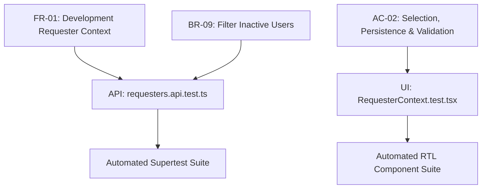

# Feature 2 Engineering Contract: Development Requester Context & Database Foundation

**Feature Title**: Development Requester Context & Database Foundation  
**Branch Name**: `feature/6-data-and-requester` (Issue 2)  
**Base Branch**: `lab2-staging`  
**Document Status**: Approved Feature Baseline  
**Author**: TokTickIT Engineering Team  
**Traceability References**:
* [TokTickIT-System-Level-SDS-v1.0.md](../../reference/TokTickIT-System-Level-SDS-v1.0.md) (§Data Architecture, §Decisions D-02, D-03, D-04, D-08, D-09, D-10)
* [Lab_02_labsheet.md](../../reference/Lab_02_labsheet.md) (§1, §3, §5.3, §7, §8.1)
* [specification.md](../../lab-02/specification.md) (`FR-01`, `BR-03`, `BR-09`, `AC-02`)
* [api-spec.md](../../lab-02/api-spec.md) (Endpoints `GET /api/requesters`, `GET /api/related-systems`, `GET /api/categories`)
* [ui-spec.md](../../lab-02/ui-spec.md) (Zen Green Tokens, DR-01 through DR-20)
* [tests.md](../../lab-02/tests.md) (STS Test Catalog)

---

## 1. Purpose, Scope, and Exclusions

### 1.1. Purpose
Feature 2 establishes the data architecture and simulated user context required for TokTickIT Sprint 2 (Lab 2). Because full authentication, credential management, and role-based access control are scheduled for Lab 3, Lab 2 introduces a **Development Requester Context Selector**. This simulated identity selector allows developers, testers, and grading evaluators to switch between distinct university requesters (students, staff, faculty) to verify multi-user ticket ownership isolation and ensure requesters can only inspect and manage their own tickets.

In addition to the identity context, Feature 2 scaffolds the authoritative PostgreSQL database schema (via Prisma ORM) for all Sprint 2 domain models (`RequesterUser`, `RelatedSystem`, `Category`, `Ticket`, `Attachment`, and `TicketNumberSequence`) and provisions safe, idempotent reference seed data.

### 1.2. Scope
1. **Prisma Schema Definition**:
   * Define the complete structural fields, scalar types, default values, and relational constraints for `RequesterUser`, `RelatedSystem`, `Category`, `Ticket`, `Attachment`, and `TicketNumberSequence`.
   * Create database migrations using `npx prisma migrate dev --name create-requester-and-ticket-foundation`.
2. **Idempotent Seed Pipeline**:
   * Implement `server/prisma/seed.ts` using Prisma upserts to populate 4 categories, 7 related systems, 4 active development requesters, and 1 inactive development requester without duplicate key errors on rerun.
   * Do not pass static primary key `id` values in the seed; rely on natural unique keys (`email`, `name`, `code`) to avoid PostgreSQL sequence desynchronization.
3. **Read-Only Master Data & Identity APIs**:
   * `GET /api/requesters` (and alias `GET /api/v1/requesters`): Query PostgreSQL for active development users (`where: { isActive: true }`, normalized lowercase emails).
   * `GET /api/related-systems` (and alias `GET /api/v1/related-systems`): Query PostgreSQL for active systems.
   * `GET /api/categories` (and alias `GET /api/v1/categories`): Query PostgreSQL for active ticket categories, preserving backwards compatibility with Lab 1 baseline.
4. **Frontend Context & UI Shell**:
   * React `RequesterContext` providing active user state with `localStorage` persistence and **Bootstrap Cache Validation** against the backend on startup.
   * Development Requester Selector modal with banner notice, styled select dropdown, and "Continue" button.
   * App Shell Navigation Header displaying the active user's identity badge and a "Change Requester" escape action that supports cancellation.
   * Visual states for loading skeletons, zero-user empty states, and API error boundaries.
5. **Automated Verification**:
   * Supertest integration tests for all three endpoints and inactive user exclusion.
   * React Testing Library component tests for context switching, persistence, cancellation, and UI states.

### 1.3. Explicit Exclusions
The following capabilities are deliberately out of scope for Feature 2 and Sprint 2:
* **Passwords & Hashing**: No password fields, hashing libraries (Argon2id/bcrypt), password validation, or reset flows.
* **Tokens & Sessions**: No JSON Web Tokens (JWT), bearer tokens, OAuth/OIDC, server-side session cookies (HttpOnly session tables), or CSRF tokens.
* **Role-Based Access Control (RBAC)**: Only the Requester role is simulated. Resolver (IT Staff) and Administrator workflows, role hierarchies, and permission catalogs are deferred to future sprints.
* **User Management CRUD**: No screens or endpoints for creating, editing, activating, or deactivating users.
* **Ticket & File Mutations**: Actual ticket submission (Feature 3), ticket history queries (Feature 4), and attachment upload/download/soft-removal (Feature 5) are deferred to subsequent issues.

---

## 2. Data Model Design (Prisma)

The Prisma schema defines the core data contracts and relationships in `server/prisma/schema.prisma`. All models use PostgreSQL-native types, enforce relational integrity, and index key query paths.

```prisma
// server/prisma/schema.prisma

datasource db {
  provider = "postgresql"
  url      = env("DATABASE_URL")
}

generator client {
  provider = "prisma-client-js"
}

// ---------------------------------------------------------------------------
// 1. Requester User (Simulated Development Identity)
// ---------------------------------------------------------------------------
model RequesterUser {
  id                 Int          @id @default(autoincrement())
  name               String
  email              String       @unique // Stored and queried in normalized lowercase
  department         String?      // Academic department / faculty unit
  isActive           Boolean      @default(true)
  createdAt          DateTime     @default(now())
  updatedAt          DateTime     @updatedAt

  // Relational Integrity
  tickets            Ticket[]     @relation("RequesterTickets")
  removedAttachments Attachment[] @relation("RequesterRemovedAttachments")

  @@map("requester_users")
}

// ---------------------------------------------------------------------------
// 2. Related System (Affected Campus IT Services)
// ---------------------------------------------------------------------------
model RelatedSystem {
  id        Int      @id @default(autoincrement())
  name      String   @unique
  isActive  Boolean  @default(true)
  createdAt DateTime @default(now())
  updatedAt DateTime @updatedAt

  // Relational Integrity
  tickets   Ticket[]

  @@map("related_systems")
}

// ---------------------------------------------------------------------------
// 3. Category (Problem Classification)
// ---------------------------------------------------------------------------
model Category {
  id          Int      @id @default(autoincrement())
  code        String?  @unique // e.g. ACC, HW, SW, NET
  name        String   @unique
  description String?
  isActive    Boolean  @default(true)
  createdAt   DateTime @default(now())
  updatedAt   DateTime @updatedAt

  // Relational Integrity
  tickets     Ticket[]

  @@map("categories")
}

// ---------------------------------------------------------------------------
// 4. Ticket (Service Desk Incident / Request)
// ---------------------------------------------------------------------------
model Ticket {
  id                Int          @id @default(autoincrement())
  ticketNumber      String       @unique @db.VarChar(32) // Format: TKT-YYYY-NNNNN
  requesterId       Int
  categoryId        Int
  relatedSystemId   Int
  summary           String       @db.VarChar(100)
  description       String       @db.Text
  requestedPriority String       // Low, Medium, High, Urgent (BR-05, D-03)
  itPriority        String?      // Low, Medium, High, Urgent (BR-05, D-03)
  currentStatus     String       @default("New") // New, Assigned, In Progress, Pending Requester, Resolved, Closed, Cancelled (D-02)
  createdAt         DateTime     @default(now())
  updatedAt         DateTime     @updatedAt

  // Relations
  requester         RequesterUser @relation("RequesterTickets", fields: [requesterId], references: [id], onDelete: Restrict)
  category          Category      @relation(fields: [categoryId], references: [id], onDelete: Restrict)
  relatedSystem     RelatedSystem @relation(fields: [relatedSystemId], references: [id], onDelete: Restrict)
  attachments       Attachment[]

  @@index([requesterId])
  @@index([currentStatus])
  @@map("tickets")
}

// ---------------------------------------------------------------------------
// 5. Attachment (Supporting File Metadata & Soft-Removal Tombstone)
// ---------------------------------------------------------------------------
model Attachment {
  id                   Int            @id @default(autoincrement())
  ticketId             Int
  originalFilename     String
  storedFilename       String         @unique // Disk storage key / UUID
  mimeType             String
  fileSize             Int            // Size in bytes (max 5MB = 5,242,880 bytes)
  isRemoved            Boolean        @default(false)
  removalReason        String?        @db.Text
  removedAt            DateTime?
  removedByRequesterId Int?
  createdAt            DateTime       @default(now())
  updatedAt            DateTime       @updatedAt

  // Relations
  ticket               Ticket         @relation(fields: [ticketId], references: [id], onDelete: Cascade)
  removedByRequester   RequesterUser? @relation("RequesterRemovedAttachments", fields: [removedByRequesterId], references: [id], onDelete: SetNull)

  @@index([ticketId])
  @@map("attachments")
}

// ---------------------------------------------------------------------------
// 6. Ticket Number Sequence (Annual Sequence Reset for TKT-YYYY-NNNNN)
// ---------------------------------------------------------------------------
model TicketNumberSequence {
  year    Int @id
  nextVal Int @default(1)

  @@map("ticket_number_sequences")
}
```

### 2.1. Structural Specifications & Invariants
* **Keys & Identifiers**: Numerical `Int @id @default(autoincrement())` is used across primary entities to preserve compatibility with the Lab 1 baseline (`Category.id`), while human-readable unique business keys are enforced (`ticketNumber`, `email`, `storedFilename`).
* **Email Normalization Rule**: All emails are normalized to lowercase (`email.trim().toLowerCase()`) on insertion and lookup to enforce case-insensitive uniqueness in compliance with *SDS v1.0* (§Security Architecture, p. 9).
* **Length Constraints**: `summary` is constrained to `@db.VarChar(100)` and `ticketNumber` to `@db.VarChar(32)` to prevent payload abuse.
* **Foreign Key Protection**: `onDelete: Restrict` prevents cascade deletion of referenced master entities (`Category`, `RelatedSystem`, `RequesterUser`).
* **Soft Removal Audit**: `Attachment` models soft removal explicitly (`isRemoved`, `removalReason`, `removedAt`, `removedByRequesterId`, `updatedAt`) to fulfill *SDS v1.0* Decision `D-11` and `BR-07`.
* **Annual Sequence Foundation**: `TicketNumberSequence` provides the transactional counter table required by Decision `D-10` (`TKT-YYYY-NNNNN`) to avoid schema alterations during Feature 3.

---

## 3. Idempotent Database Seeding

The seeding script `server/prisma/seed.ts` must execute safely in CI/CD pipelines, Docker initializations, and local test setups repeatedly without producing duplicate key constraint errors (`P2002`).

### 3.1. Seeding Execution Rules & Sequence Safety
1. **Never Hardcode Primary Keys**: The seed script must **omit** explicit `id` parameters in both `create` and `update` blocks. This ensures PostgreSQL's sequence counters (`*_id_seq`) remain synchronized with inserted rows.
2. **Upsert Matching on Immutable Unique Keys**:
   * For `Category`: Match on natural unique `name`.
   * For `RelatedSystem`: Match on natural unique `name`.
   * For `RequesterUser`: Match on normalized lowercase `email`.
3. **Dual Constraint Consistency**: The seed dataset guarantees that `code` and `name` pairings are immutable, ensuring `upsert({ where: { name } })` never triggers collision errors on `code`.

```typescript
// server/prisma/seed.ts execution pattern
for (const cat of categories) {
  await prisma.category.upsert({
    where: { name: cat.name },
    update: { code: cat.code, description: cat.description, isActive: true },
    create: { code: cat.code, name: cat.name, description: cat.description, isActive: true },
  });
}

for (const user of requesters) {
  const normalizedEmail = user.email.trim().toLowerCase();
  await prisma.requesterUser.upsert({
    where: { email: normalizedEmail },
    update: { name: user.name, department: user.department, isActive: user.isActive },
    create: { name: user.name, email: normalizedEmail, department: user.department, isActive: user.isActive },
  });
}
```

### 3.2. Concrete Seed Entities

#### 1. Categories (4 Master Records)
| Code | Name | Description | isActive |
| :--- | :--- | :--- | :--- |
| `ACC` | Account and Access | Logins, passwords, IAM, permissions, account unlock | `true` |
| `HW` | Hardware | Monitors, laptops, desktop towers, keyboards, docks, peripherals | `true` |
| `SW` | Software | OS issues, university portal tools, desktop applications, licenses | `true` |
| `NET` | Network | Campus Wi-Fi, Ethernet ports, DNS, VPN tunnels, connectivity | `true` |

#### 2. Related Systems (7 Affected Systems)
| Name | Description / Scope | isActive |
| :--- | :--- | :--- |
| Email | University webmail, calendar, and mailing lists | `true` |
| Campus Wi-Fi | KMUTT-Secure, eduroam, and guest wireless networks | `true` |
| VPN | GlobalProtect secure remote campus network access | `true` |
| LEB2 App | Learning Environment Version 2 portal | `true` |
| Grade Submission App | Registrar faculty grading and evaluation portal | `true` |
| Printer | Department shared multi-function network printers | `true` |
| Corporate Laptop | University-issued faculty and staff work machines | `true` |

#### 3. Development Requesters (4 Active + 1 Inactive)
| Name | Normalized Email | Department | Role Description | isActive |
| :--- | :--- | :--- | :--- | :--- |
| Sompong IT | `sompong.it@kmutt.ac.th` | Information Technology Office | Active IT Staff (Testing requester flow) | `true` |
| Anong Staff | `anong.sta@kmutt.ac.th` | Academic Affairs Office | Active Academic Officer | `true` |
| Kittisak Student | `kittisak.stu@kmutt.ac.th` | Computer Engineering Dept | Active Undergraduate Student | `true` |
| Wichai Faculty | `wichai.fac@kmutt.ac.th` | Department of Mathematics | Active Assistant Professor | `true` |
| Prasert Inactive | `prasert.ina@kmutt.ac.th` | Human Resources Office | Former Employee (Resigned) | `false` |

---

## 4. REST API Contracts

All endpoints return JSON with UTF-8 encoding. Routes are exposed at `/api/...` with aliases under `/api/v1/...`.

### 4.1. `GET /api/requesters`
Retrieves active development requesters for identity selection.

* **Method**: `GET`
* **Route**: `/api/requesters` (and `/api/v1/requesters`)
* **Headers**: `Accept: application/json`
* **Query Parameters**: None
* **Request Body**: None
* **Controller Logic**:
  ```typescript
  const requesters = await prisma.requesterUser.findMany({
    where: { isActive: true },
    select: { id: true, name: true, email: true, department: true, isActive: true, createdAt: true },
    orderBy: { name: "asc" }
  });
  ```
* **Success Response (`200 OK`)**:
  ```json
  [
    {
      "id": 2,
      "name": "Anong Staff",
      "email": "anong.sta@kmutt.ac.th",
      "department": "Academic Affairs Office",
      "isActive": true,
      "createdAt": "2026-09-01T08:00:00.000Z"
    },
    {
      "id": 3,
      "name": "Kittisak Student",
      "email": "kittisak.stu@kmutt.ac.th",
      "department": "Computer Engineering Dept",
      "isActive": true,
      "createdAt": "2026-09-01T08:00:00.000Z"
    },
    {
      "id": 1,
      "name": "Sompong IT",
      "email": "sompong.it@kmutt.ac.th",
      "department": "Information Technology Office",
      "isActive": true,
      "createdAt": "2026-09-01T08:00:00.000Z"
    },
    {
      "id": 4,
      "name": "Wichai Faculty",
      "email": "wichai.fac@kmutt.ac.th",
      "department": "Department of Mathematics",
      "isActive": true,
      "createdAt": "2026-09-01T08:00:00.000Z"
    }
  ]
  ```
  *(In compliance with `BR-09`, "Prasert Inactive" has `isActive: false` and is strictly excluded from this response).*
* **Error Response (`500 Internal Server Error`)**:
  ```json
  {
    "error": "Failed to fetch development requesters"
  }
  ```

---

### 4.2. `GET /api/related-systems`
Retrieves active campus IT systems for the ticket creation form dropdown.

* **Method**: `GET`
* **Route**: `/api/related-systems` (and `/api/v1/related-systems`)
* **Query Parameters**: None
* **Controller Logic**:
  ```typescript
  const systems = await prisma.relatedSystem.findMany({
    where: { isActive: true },
    select: { id: true, name: true, isActive: true },
    orderBy: { name: "asc" }
  });
  ```
* **Success Response (`200 OK`)**:
  ```json
  [
    { "id": 2, "name": "Campus Wi-Fi", "isActive": true },
    { "id": 7, "name": "Corporate Laptop", "isActive": true },
    { "id": 1, "name": "Email", "isActive": true },
    { "id": 5, "name": "Grade Submission App", "isActive": true },
    { "id": 4, "name": "LEB2 App", "isActive": true },
    { "id": 6, "name": "Printer", "isActive": true },
    { "id": 3, "name": "VPN", "isActive": true }
  ]
  ```
* **Error Response (`500 Internal Server Error`)**:
  ```json
  {
    "error": "Failed to fetch related systems"
  }
  ```

---

### 4.3. `GET /api/categories`
Retrieves active problem categories. Preserves compatibility with Lab 1 baseline tests (`tests/lab-01/categories.test.ts`).

* **Method**: `GET`
* **Route**: `/api/categories` (and `/api/v1/categories`)
* **Controller Logic**:
  ```typescript
  const categories = await prisma.category.findMany({
    where: { isActive: true },
    select: { id: true, code: true, name: true, description: true },
    orderBy: { id: "asc" }
  });
  ```
* **Success Response (`200 OK`)**:
  ```json
  [
    { "id": 1, "code": "ACC", "name": "Account and Access", "description": "Logins, passwords, IAM, permissions, account unlock" },
    { "id": 2, "code": "HW", "name": "Hardware", "description": "Monitors, laptops, desktop towers, keyboards, docks, peripherals" },
    { "id": 3, "code": "SW", "name": "Software", "description": "OS issues, university portal tools, desktop applications, licenses" },
    { "id": 4, "code": "NET", "name": "Network", "description": "Campus Wi-Fi, Ethernet ports, DNS, VPN tunnels, connectivity" }
  ]
  ```
* **Error Response (`500 Internal Server Error`)**:
  ```json
  {
    "error": "Failed to fetch categories"
  }
  ```

---

## 5. UI Specifications & Zen Green Design System

All UI components adhere to the KMUTT IT Service Desk "Zen Green" design language and the 20 approved architectural design decisions (**DR-01** through **DR-20**).

```
+-----------------------------------------------------------------------------+
| TokTickIT  [Create Ticket]  [My Tickets]         👤 Sompong IT  [Switch User]|
+-----------------------------------------------------------------------------+
|                                                                             |
|                 +-----------------------------------------+                 |
|                 |    Development Requester Selector       |                 |
|                 +-----------------------------------------+                 |
|                 | ℹ️ Select a Development Requester to     |                 |
|                 | test requester-specific ticket behavior.|                 |
|                 | This is not a login screen.             |                 |
|                 |                                         |                 |
|                 | Choose Requester:                       |                 |
|                 | [ Sompong IT (sompong.it@kmutt.ac.th) ▼] |                 |
|                 |                                         |                 |
|                 |             [ Continue ]                |                 |
|                 +-----------------------------------------+                 |
|                                                                             |
+-----------------------------------------------------------------------------+
```

### 5.1. Color Tokens & Classes
* **Header / Primary CTA**: `--zen-primary-green: #006B3C`
* **Focus Ring / Hover States**: `--zen-secondary-green: #0B7A46` (with `3px` halo: `rgba(11, 122, 70, 0.20)`)
* **Notice Tint Background**: `--zen-pale-green: #EAF6EF` with border `#D3E4D8`
* **Canvas Background**: `--zen-page-bg: #F5F7F6`
* **Surface Background**: `#FFFFFF`
* **Primary Text**: `#1C2826`

### 5.2. Component States & Interaction Workflows

#### 1. Development Notice Banner
* Visual Presentation: Displayed directly above the select control inside the selector card/modal.
* Styling: Background `#EAF6EF`, border `1px solid #D3E4D8`, border-radius `6px`, padding `12px 16px`.
* Exact Text:  
  *"Select a Development Requester to test requester-specific ticket behavior. This is not a login screen. Authentication will be introduced in Lab 3."*

#### 2. Requester Select Dropdown
* Element: `<select aria-label="Development Requester" className="form-select">` with custom focus styles.
* Dimensions: Height `40px`, border-radius `6px` (`rounded-2`), font-size `16px` (`1.0rem`).
* Focus Outline: `2px solid #0B7A46` with `box-shadow: 0 0 0 3px rgba(11, 122, 70, 0.20)`.
* Options:
  * Default Option: `<option value="">-- Select a Development Requester --</option>`
  * Active User Options: `<option value="{user.id}">{user.name} ({user.email})</option>`

#### 3. Modal Presentation & Cancellation Workflows
* **Initial App Mount (No User in Cache)**:
  * The selector renders as an **unclosable modal overlay** (`backdrop="static"`, `keyboard=false`).
  * The "Cancel" button is hidden.
  * The user cannot dismiss the modal until an active identity is selected and "Continue" is clicked.
* **Switching Requester ("Change Requester" escape action)**:
  * Clicking "Change Requester" in the header opens the modal with a secondary "Cancel" button.
  * **Cancellation Rule**: If the user clicks "Cancel" or presses Escape, the modal closes and the active user context remains **unchanged**. The context is NOT cleared prematurely upon opening the dialog.
  * **Confirmation Rule**: When a new user is selected and "Continue" is clicked:
    1. The new user object is saved to `localStorage` (`toktickit_current_requester`).
    2. `RequesterContext` state is updated, triggering a re-render of dependent views.
    3. The modal is dismissed.

#### 4. Bootstrap Cache Validation Rule (Server Reboot / Reset Resilience)
* **Problem Addressed**: If the backend reboots, wipes data, or deactivates the user while the client has `toktickit_current_requester` cached in `localStorage`.
* **Behavioral Rule**:
  1. On application mount, `RequesterContext` reads `localStorage` optimistically to avoid flash of unstyled content.
  2. In parallel, `RequesterContext` fetches `/api/requesters`.
  3. **Verification**: Once the list resolves, the client verifies that `currentRequester.id` is present in the returned active list.
  4. **Stale Cache Resolution**: If the cached user is not in the list (e.g. database reset, user deactivated), `RequesterContext` automatically removes `toktickit_current_requester` from `localStorage`, sets `currentRequester = null`, and triggers the unclosable Selection modal with an informative alert: *"Your previously selected session is no longer active. Please select an active requester."*
  5. **Offline Resilience**: If the backend is completely unreachable (`fetch` error), the client retains the cached user optimistically and displays a top alert banner: *"Network warning: Unable to synchronize user identity with server."*

#### 5. Resilience & Feedback States
* **Loading State**: While `/api/requesters` is fetching on initial load, render an animated skeleton shimmer placeholder for the dropdown.
* **Empty State**: If `/api/requesters` returns `[]`, display an alert card: *"No active development requesters found in the database. Please run database seeding."* with a "Retry" CTA.
* **API Error State**: If the network or server fails, render a dedicated error boundary alert with a "Retry Connection" button that re-executes the fetch.

---

## 6. Software Test Specification (STS)

Every requirement and edge case is mapped directly to automated assertions with exact, testable criteria.



### 6.1. Backend API Integration Tests (`server/tests/lab-02/requesters.api.test.ts`)

| Test ID | Method & Route | Exact Assertion & Verification Criteria | Mapped Req |
| :--- | :--- | :--- | :--- |
| `API-01` | `GET /api/requesters` | Returns HTTP `200 OK` with JSON array containing active users (`isActive: true`). | `FR-01`, `AC-02.1` |
| `API-02` | `GET /api/requesters` | Asserts that "Prasert Inactive" (`isActive: false`) is strictly omitted: `expect(res.body.find((u: any) => u.email === 'prasert.ina@kmutt.ac.th')).toBeUndefined()`. | `BR-09`, `AC-02.2` |
| `API-03` | `GET /api/requesters` | Asserts all returned items contain `id`, `name`, lowercase `email`, `department`, and `isActive: true`. | `FR-01` |
| `API-04` | `GET /api/related-systems` | Returns HTTP `200 OK` with array of at least 6 systems (`Email`, `Campus Wi-Fi`, `VPN`, etc.). | `AC-02.3` |
| `API-05` | `GET /api/categories` | Returns HTTP `200 OK` with exactly 4 seeded categories (`Account and Access`, `Hardware`, `Software`, `Network`). | `AC-02.4` |
| `API-06` | Seed Script Idempotency | Programmatically calls `seed()` from `server/prisma/seed.ts` twice consecutively; asserts promise resolves with no errors and category/requester count remains identical. | `AC-02.5` |

### 6.2. Frontend Component Tests (`client/tests/lab-02/RequesterSelector.test.tsx`)

| Test ID | Area | Exact Assertion & Verification Criteria | Mapped Req |
| :--- | :--- | :--- | :--- |
| `UI-01` | Banner Rendering | Asserts `expect(screen.getByText(/Select a Development Requester to test requester-specific ticket behavior/i)).toBeInTheDocument()`. | `BR-03` |
| `UI-02` | Dropdown Population | Mocks `/api/requesters`; asserts dropdown renders 4 active options matching mock data. | `AC-02.1` |
| `UI-03` | Button Disabled State | When default `-- Select a Development Requester --` is selected, asserts `expect(screen.getByRole('button', { name: /continue/i })).toBeDisabled()`. | `DR-11` |
| `UI-04` | Context Persistence | Selects user with ID 1, clicks Continue; asserts `expect(localStorage.getItem('toktickit_current_requester')).toContain('"id":1')` and modal closes. | `AC-02.6` |
| `UI-05` | Header Display | Renders `AppHeader` with active user; asserts `expect(screen.getByText(/Sompong IT/i)).toBeInTheDocument()`. | `AC-02.6` |
| `UI-06` | Modal Cancellation | Clicks "Change Requester", clicks "Cancel"; asserts active user remains "Sompong IT" and `localStorage` is not cleared. | `AC-02.7`, `DR-14` |
| `UI-07` | Identity Switch | Clicks "Change Requester", selects user ID 2 ("Anong Staff"), clicks Continue; asserts header updates to "Anong Staff" and `localStorage` holds ID 2. | `AC-02.7` |
| `UI-08` | Bootstrap Cache Invalidation | Caches user ID 999 in `localStorage`; mocks `/api/requesters` returning IDs 1–4; on mount, asserts cached user is cleared and selector modal opens. | `FR-01`, Finding 1.1 |
| `UI-09` | Error Boundary Retry | Mocks API rejection; asserts alert rendered with "Retry Connection" button; clicking button re-invokes API fetch. | `DR-13` |

---

## 7. Open Questions & Architectural Clarifications

1. **Category Table Backward Compatibility**:  
   * *Resolution Confirmed*: The Lab 1 baseline model had `{ id, name, createdAt }`. Adding `code String? @unique`, `description String?`, `isActive Boolean @default(true)`, and `updatedAt DateTime @updatedAt` is non-breaking. Lab 1 test suites continue to pass because `id` and `name` remain unchanged.
2. **Ticket Sequence Table Execution**:  
   * *Resolution Confirmed*: `TicketNumberSequence` (`year Int @id`, `nextVal Int @default(1)`) is bundled directly in this migration, ensuring that the database foundation completely supports Feature 3's `TKT-YYYY-NNNNN` generation without requiring further schema alterations.

---

## 8. Review & Sign-Off Gate

| Gate Checklist Item | Status | Notes |
| :--- | :---: | :--- |
| No application code created before contract approval | ✅ PASS | Only contract specification file updated. |
| All 6 required Prisma models fully specified with types and constraints | ✅ PASS | `RequesterUser`, `RelatedSystem`, `Category`, `Ticket`, `Attachment`, `TicketNumberSequence`. |
| Concrete seed data parameters defined (4 categories, 7 systems, 4+1 users) | ✅ PASS | Complete catalog documented with normalized lowercase emails. |
| Inactive user filtering contract specified | ✅ PASS | Explicitly documented in controller logic and test `API-02`. |
| Bootstrap cache validation & cancellation workflows codified | ✅ PASS | Resolves Findings 1.1 and 2.1 completely. |
| Idempotency risks resolved | ✅ PASS | Omission of hardcoded PKs and dual unique alignment codified. |
| Automated test specification (STS) mapped with deterministic assertions | ✅ PASS | 6 API tests + 9 Client UI tests cataloged with exact RTL queries. |
