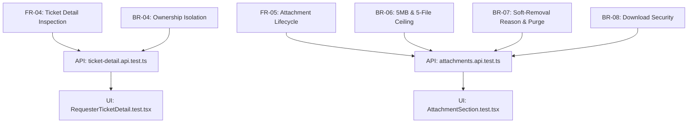

# Feature 9 Engineering Contract: Ticket Detail & Attachment Management

**Feature Title**: Ticket Detail Inspection, Read-Only Presentation & Attachment Lifecycle Management (Soft-Removal)  
**Branch Name**: `feature/9-ticket-detail-attachments` (Issue 9 / Sprint 2 Issue 5)  
**Base Branch**: `lab2-staging`  
**Document Status**: Proposed Feature Contract Baseline  
**Author**: TokTickIT Engineering Team  
**Traceability References**:
* [TokTickIT-System-Level-SDS-v1.0.md](../../reference/TokTickIT-System-Level-SDS-v1.0.md) (§Data Architecture, §Attachment Architecture p. 14-15, §Authorization Model p. 10, Decisions D-02, D-03, D-06, D-11)
* [Lab_02_labsheet.md](../../reference/Lab_02_labsheet.md) (§1, §3, §4.5, §7, §8.5, §14 Part 8)
* [specification.md](../../lab-02/specification.md) (`FR-04`, `FR-05`, `BR-04`, `BR-05`, `BR-06`, `BR-07`, `BR-08`, `AC-04`, `AC-05`, `AC-06`)
* [api-spec.md](../../lab-02/api-spec.md) (Endpoints `GET /api/tickets/:id`, `POST /api/tickets/:id/attachments`, `GET /api/attachments/:id/download`, `DELETE /api/attachments/:id`)
* [ui-spec.md](../../lab-02/ui-spec.md) (Zen Green Tokens, DR-01 through DR-20, §3.3 Badges, §3.5 System States, DR-20 Soft-removed Attachments)
* [tests.md](../../lab-02/tests.md) (STS Test Catalog: API-06, API-07, API-08, API-09, API-10, API-11, API-12, UI-08, UI-09)
* [requester-context/contract.md](../requester-context/contract.md) (Feature 2 Approved Contract Baseline)
* [create-ticket/contract.md](../create-ticket/contract.md) (Feature 7 Approved Contract Baseline)
* [my-tickets/contract.md](../my-tickets/contract.md) (Feature 8 Approved Contract Baseline)

---

## 1. Purpose, Scope, and Exclusions

### 1.1. Purpose
Feature 9 delivers the dedicated **Ticket Detail & Attachment Management Workspace** for TokTickIT Sprint 2 (Lab 2). This interface serves as the primary inspection screen for university requesters (students, staff, faculty) operating under our simulated Development Requester context.

From this view, a requester can inspect all administrative, categorical, and narrative attributes of their previously submitted IT support tickets. The interface pairs an authoritative, read-only ticket header presentation with an active attachment management workspace that allows requesters to attach additional files to existing tickets, download active file binaries, and execute audited soft-removals with mandatory user-provided justification.

The entire feature strictly enforces cross-requester security boundaries: a requester may **only** inspect tickets and manage attachments that belong directly to their account (`ticket.requesterId === currentRequesterId`). Attempts to inspect unowned tickets or download unowned binaries are rejected at the API boundary with HTTP `403 Forbidden` or `404 Not Found`.

### 1.2. Scope
1. **Read-Only Ticket Detail Presentation (`RequesterTicketDetail.tsx`)**:
   * Sourced via `GET /api/tickets/:id` (and alias `GET /api/v1/tickets/:id`).
   * Clean, structured details pane following the KMUTT IT Service Desk "Zen Green" design language (`#006B3C`, `#0B7A46`, `#EAF6EF`, `#F5F7F6`, `#1C2826`).
   * Read-only header card displaying:
     * **Ticket Number**: Monospace bold badge (e.g. `TKT-2026-00001`).
     * **Ticket Date**: Formatted creation timestamp (e.g. `2026-09-04 16:20`).
     * **Requester**: Display name and email of the ticket creator.
     * **Category**: Category name badge (`Account and Access`, `Hardware`, `Software`, `Network`).
     * **Related System**: Affected campus IT system badge (e.g. `Campus Wi-Fi`, `LEB2 App`).
     * **Requested Priority Badge**: User-specified urgency with priority color tint (`Low`, `Medium`, `High`, `Urgent`).
     * **IT Priority Badge**: IT-assigned priority with color tint, or `Unassigned` indicator (`—`).
     * **Current Status Badge**: Lifecycle status with Zen Green tint (`New`, `Assigned`, etc.).
     * **Ticket Owner**: Assigned IT resolver (defaults to `"Unassigned"` for Sprint 2).
     * **Summary**: Full concise summary string.
     * **Description**: Multi-line issue description rendered inside a shaded read-only surface (`#F0F4F1`).
2. **Interactive Attachment Workspace (`AttachmentSection.tsx`)**:
   * **Active Attachments List**:
     * Lists all active (`isRemoved === false`) files linked to the ticket.
     * Displays file type icon (image vs. PDF), original filename, formatted file size (KB / MB), and upload timestamp.
     * Visible **Download** button triggering secure binary download from `GET /api/attachments/:id/download`.
     * Visible **Remove** button opening the soft-removal confirmation modal.
   * **Add Attachment Action**:
     * Native file picker input validating permitted extensions (`.jpg`, `.jpeg`, `.png`, `.webp`, `.pdf`) and MIME types.
     * Client-side pre-validation checking file size ($\le 5\text{ MB} = 5,242,880\text{ bytes}$) and active attachment count ($\le 5\text{ active files}$).
     * Upload button transitions to disabled busy state with spinner during upload.
     * Upload triggers `POST /api/tickets/:id/attachments` and immediately updates the active attachments list upon completion.
     * Button is disabled with helper notice if the ticket already has 5 active attachments.
   * **Soft-Removal Confirmation Modal (`RemoveAttachmentModal.tsx`)**:
     * Static backdrop `rgba(28, 40, 38, 0.5)` with trapped focus (**DR-18**).
     * Warning message notifying the user that the binary file will be purged from storage while an audit record is retained.
     * Displays original filename being removed.
     * Required textarea prompting the user to provide a mandatory **Removal Reason** (3–250 characters).
     * Inline validation preventing submission if the reason is empty or whitespace-only.
     * "Cancel" button to dismiss modal without mutating data.
     * "Confirm Removal" button calling `DELETE /api/attachments/:id`.
   * **Soft-Removed Attachments List (Audit Tombstones, DR-20)**:
     * Displayed in a distinct shaded panel (`#F0F4F1`), visually grayed out with a `"Removed"` badge.
     * Displays original filename, removal timestamp (`removedAt`), and removal reason (`removalReason`).
     * Download action is strictly omitted/disabled.
     * Does NOT count toward the 5-file active attachment limit.
3. **Navigation & Dashboard Continuity**:
   * Prominent **"Back to My Tickets"** button (`← Back to My Tickets`) returning the user directly to the filtered My Tickets dashboard without losing active requester context.
4. **Resilient Error UI**:
   * Structured, accessible message panels for unauthorized access (`403 Forbidden`), missing ticket IDs (`404 Not Found`), or network/server failures (`500`), complete with actionable "Back to My Tickets" and "Retry" buttons.
5. **Software Test Specification (STS)**:
   * Backend integration tests in `server/tests/lab-02/ticket-detail.api.test.ts` and `server/tests/lab-02/attachments.api.test.ts`.
   * Frontend component tests in `client/tests/lab-02/RequesterTicketDetail.test.tsx` and `client/tests/lab-02/AttachmentSection.test.tsx`.

### 1.3. Explicit Exclusions
To maintain absolute compliance with the Sprint 2 engineering contract and prevent scope creep:
* **Strict Read-Only Header Rule**: All ticket header fields are strictly read-only. There is NO editing of ticket summary, description, category, system, priority, or status in this view.
* **No Status Transitions**: Requesters cannot resolve, close, reopen, or cancel tickets. Status transition controls are strictly forbidden.
* **No Collaboration Feeds**: Public Comments, Internal Notes, and Actions Taken feeds are strictly out of scope and must NOT be rendered or implemented (deferred to Lab 3 / Lab 4).
* **No IT Staff Actions**: Reassignment, claiming tickets, setting IT Priority, and resolver notes are strictly forbidden.
* **No Hard Deletion**: Neither tickets nor attachment records may be hard-deleted from the database. Soft-removal is the sole deletion mechanism for attachments.

---

## 2. Strict Requester Isolation & Authorization Boundary

### 2.1. Ownership Enforcement Architecture
In accordance with *System SDS v1.0* (§Authorization Model, p. 10) and Business Rules `BR-04` and `BR-08`, all ticket and attachment endpoints enforce strict requester ownership verification:

```
+---------------------------------------------------------------------------------------------------+
|                           HTTP Request with Header: x-requester-id: <id>                           |
+---------------------------------------------------------------------------------------------------+
                                                  │
                                                  ▼
+---------------------------------------------------------------------------------------------------+
| Express Middleware & Controller Verification                                                      |
| 1. Parse x-requester-id -> requesterId                                                            |
| 2. Verify RequesterUser exists & isActive === true                                                |
|    - If missing, invalid, or inactive -> HTTP 400 Bad Request                                    |
| 3. Retrieve target resource from PostgreSQL:                                                      |
|    - For Ticket: ticket = prisma.ticket.findUnique({ where: { id } })                             |
|    - For Attachment: attachment = prisma.attachment.findUnique({ where: { id }, include: { ticket } })|
| 4. Security Invariant Evaluation:                                                                 |
|    - If resource does not exist -> HTTP 404 Not Found                                            |
|    - If ticket.requesterId !== requesterId:                                                      |
|      -> HTTP 403 Forbidden (or HTTP 404 Not Found)                                                |
|      (Cross-requester data leak is mathematically prevented)                                     |
+---------------------------------------------------------------------------------------------------+
                                                  │
                        ┌─────────────────────────┴─────────────────────────┐
                        ▼                                                   ▼
            [ Ownership Check Passes ]                             [ Check Fails ]
                        │                                                   │
                        ▼                                                   ▼
          Proceed with Operation                                  HTTP 403 / 404
      (Fetch detail, upload, download,                             Return Standard Error
               or soft-remove)                                           Envelope
```

### 2.2. Ownership Boundary Invariants
1. **Ticket Detail Inspection (`GET /api/tickets/:id`)**:
   * If `ticket.requesterId !== currentRequesterId`, the server returns HTTP `403 Forbidden` (with error code `FORBIDDEN_TICKET_ACCESS`) or HTTP `404 Not Found`.
2. **Attachment Upload (`POST /api/tickets/:id/attachments`)**:
   * If `ticket.requesterId !== currentRequesterId`, upload is rejected with HTTP `403 Forbidden` before any file is saved to disk.
3. **Attachment Download (`GET /api/attachments/:id/download`)**:
   * If `attachment.ticket.requesterId !== currentRequesterId`, download is rejected with HTTP `403 Forbidden`.
   * If `attachment.isRemoved === true` (or `attachment.removedAt !== null`), download is rejected with HTTP `410 Gone` (or `404 Not Found`).
4. **Attachment Soft-Removal (`DELETE /api/attachments/:id`)**:
   * If `attachment.ticket.requesterId !== currentRequesterId`, removal is rejected with HTTP `403 Forbidden`.

---

## 3. Data Model Design & Storage Architecture

### 3.1. Database Schema Alignment (Prisma)
Feature 9 consumes the existing Prisma schema foundation in `server/prisma/schema.prisma` without requiring schema modifications or migrations.

```prisma
// server/prisma/schema.prisma (Pre-existing entities utilized by Feature 9)

model Ticket {
  id                Int           @id @default(autoincrement())
  ticketNumber      String        @unique @db.VarChar(32) // Format: TKT-YYYY-NNNNN
  requesterId       Int
  categoryId        Int
  relatedSystemId   Int
  summary           String        @db.VarChar(100)
  description       String        @db.Text
  requestedPriority String        // Low, Medium, High, Urgent
  itPriority        String?       // Low, Medium, High, Urgent
  currentStatus     String        @default("New")
  createdAt         DateTime      @default(now())
  updatedAt         DateTime      @updatedAt

  // Relations
  requester         RequesterUser @relation("RequesterTickets", fields: [requesterId], references: [id], onDelete: Restrict)
  category          Category      @relation(fields: [categoryId], references: [id], onDelete: Restrict)
  relatedSystem     RelatedSystem @relation(fields: [relatedSystemId], references: [id], onDelete: Restrict)
  attachments       Attachment[]

  @@index([requesterId])
  @@index([currentStatus])
  @@map("tickets")
}

model Attachment {
  id                   Int            @id @default(autoincrement())
  ticketId             Int
  originalFilename     String
  storedFilename       String         @unique // Sanitized UUID v4 on disk
  mimeType             String
  fileSize             Int            // Size in bytes (max 5,242,880)
  isRemoved            Boolean        @default(false)
  removalReason        String?        @db.Text
  removedAt            DateTime?
  removedByRequesterId Int?
  createdAt            DateTime       @default(now())
  updatedAt            DateTime       @updatedAt

  // Relations
  ticket               Ticket         @relation(fields: [ticketId], references: [id], onDelete: Cascade)
  removedByRequester   RequesterUser? @relation("RequesterRemovedAttachments", fields: [removedByRequesterId], references: [id], onDelete: SetNull)

  @@index([ticketId])
  @@map("attachments")
}
```

### 3.2. Binary Storage & Soft-Removal Mechanics
* **Storage Location**: Local directory `server/uploads/` (abstracted per Decision `PD-03` for zero-friction swap to SeaweedFS/S3).
* **Sanitized Filename Generation**: Stored files use random UUID v4 with preserved extension: `${crypto.randomUUID()}${path.extname(file.originalname).toLowerCase()}` (e.g. `4a1d7f8e-3c2b-4e5a-9f1d-8e7c6b5a4d3e.pdf`).
* **Soft-Removal Execution Pipeline**:
  When `DELETE /api/attachments/:id` is called with a validated `removalReason`:
  1. Transactionally update `Attachment` record in PostgreSQL:
     * `isRemoved = true`
     * `removalReason = req.body.removalReason.trim()`
     * `removedAt = new Date()`
     * `removedByRequesterId = requesterId`
  2. Asynchronously delete the physical binary file from `server/uploads/` using `fs.promises.unlink`.
  3. The database record is retained as an immutable **tombstone** for auditing.
  4. Subsequent download attempts evaluate `isRemoved === true` and return HTTP `410 Gone`.

### 3.3. Active Attachment Limit Calculation
* Business Rule `BR-06` limits each ticket to a maximum of **5 active attachments**.
* **Active Calculation Invariant**:
  ```typescript
  const activeCount = await prisma.attachment.count({
    where: {
      ticketId,
      isRemoved: false,
    },
  });
  ```
* **Tombstone Independence**: Attachments where `isRemoved === true` are strictly excluded from `activeCount`. Soft-removing an attachment frees up an attachment slot, allowing the requester to upload a replacement file up to the 5-file active ceiling.

---

## 4. REST API Contracts

All endpoints are hosted at `/api/...` with versioned aliases under `/api/v1/...`.

### 4.1. `GET /api/tickets/:id` (and alias `GET /api/v1/tickets/:id`)
Retrieves complete read-only ticket details, associated master data, and all attachments (both active files and audit tombstones).

* **Method**: `GET`
* **Route**: `/api/tickets/:id` (and `/api/v1/tickets/:id`)
* **Headers**:
  * `Accept: application/json`
  * `x-requester-id: <integer>` (Mandatory)
* **Path Parameters**:
  * `id`: Integer ticket primary key.
* **Authorization**: Verifies `ticket.requesterId === requesterId`.

#### Success Response (`200 OK`):
```json
{
  "id": 101,
  "ticketNumber": "TKT-2026-00001",
  "ticketNo": "TKT-2026-00001",
  "summary": "Cannot connect to campus Wi-Fi in building SCL",
  "description": "Device repeatedly fails authentication when trying to connect to KMUTT-Secure Wi-Fi on the 3rd floor. Tried forgetting the network and reconnecting multiple times.",
  "requestedPriority": "High",
  "itPriority": "Medium",
  "currentStatus": "New",
  "status": "New",
  "ticketOwner": null,
  "createdAt": "2026-09-04T16:20:00.000Z",
  "updatedAt": "2026-09-04T16:20:00.000Z",
  "requester": {
    "id": 1,
    "name": "Sompong IT",
    "displayName": "Sompong IT",
    "email": "sompong.it@kmutt.ac.th",
    "department": "Information Technology Office"
  },
  "category": {
    "id": 4,
    "code": "NET",
    "name": "Network"
  },
  "relatedSystem": {
    "id": 1,
    "name": "Campus Wi-Fi"
  },
  "attachments": [
    {
      "id": 501,
      "originalFilename": "wifi_error_screenshot.png",
      "mimeType": "image/png",
      "fileSize": 245760,
      "sizeBytes": 245760,
      "isRemoved": false,
      "isDeleted": false,
      "removalReason": null,
      "removedAt": null,
      "createdAt": "2026-09-04T16:20:00.000Z",
      "uploadedAt": "2026-09-04T16:20:00.000Z"
    },
    {
      "id": 502,
      "originalFilename": "wrong_diagnostic.pdf",
      "mimeType": "application/pdf",
      "fileSize": 1048576,
      "sizeBytes": 1048576,
      "isRemoved": true,
      "isDeleted": true,
      "removalReason": "Uploaded incorrect student diagnostic report by mistake",
      "removedAt": "2026-09-04T16:35:00.000Z",
      "createdAt": "2026-09-04T16:21:00.000Z",
      "uploadedAt": "2026-09-04T16:21:00.000Z"
    }
  ]
}
```

#### Error Responses:
* **Missing Requester Header (`400 Bad Request`)**:
  ```json
  {
    "error": {
      "code": "MISSING_REQUESTER_ID",
      "message": "A valid requester ID must be provided via the 'x-requester-id' header.",
      "timestamp": "2026-09-06T10:00:00.000Z"
    }
  }
  ```
* **Cross-Requester Ownership Violation (`403 Forbidden`)**:
  ```json
  {
    "error": {
      "code": "FORBIDDEN_TICKET_ACCESS",
      "message": "You do not have permission to view this ticket.",
      "timestamp": "2026-09-06T10:00:00.000Z"
    }
  }
  ```
* **Ticket Not Found (`404 Not Found`)**:
  ```json
  {
    "error": {
      "code": "TICKET_NOT_FOUND",
      "message": "The requested ticket was not found.",
      "timestamp": "2026-09-06T10:00:00.000Z"
    }
  }
  ```

---

### 4.2. `POST /api/tickets/:id/attachments` (and alias `POST /api/v1/tickets/:id/attachments`)
Enables uploading an authorized attachment file directly to an existing ticket.

* **Method**: `POST`
* **Route**: `/api/tickets/:id/attachments` (and `/api/v1/tickets/:id/attachments`)
* **Headers**:
  * `x-requester-id: <integer>` (Mandatory)
  * `Content-Type: multipart/form-data`
* **Form Field**: `file` (binary) — supports both `file` and `attachment` field keys.
* **Path Parameters**:
  * `id`: Integer ticket primary key.
* **Validation Rules**:
  1. **Ticket Ownership**: The ticket must exist and belong to the active requester (`ticket.requesterId === requesterId`). Returns `403 Forbidden` or `404 Not Found` otherwise.
  2. **File Required**: A binary file must be present in the request. Returns `400 Bad Request` if omitted.
  3. **Allowed File Types**: Restricted strictly to `.jpg`, `.jpeg`, `.png`, `.webp`, `.pdf` (`image/jpeg`, `image/png`, `image/webp`, `application/pdf`). Returns `400 Bad Request` (`UNSUPPORTED_FILE_TYPE`).
  4. **Max File Size**: Individual file size must not exceed **5 MB** ($5,242,880$ bytes). Returns `400 Bad Request` (`FILE_TOO_LARGE`).
  5. **Max Active Files Ceiling**: Count of active attachments (`where: { ticketId, isRemoved: false }`) must be $< 5$. If `activeCount >= 5`, rejects with `400 Bad Request` (`ATTACHMENT_LIMIT_EXCEEDED`).

#### Success Response (`201 Created`):
```json
{
  "id": 503,
  "ticketId": 101,
  "originalFilename": "wifi_signal_meter.png",
  "mimeType": "image/png",
  "fileSize": 312450,
  "sizeBytes": 312450,
  "isRemoved": false,
  "isDeleted": false,
  "removalReason": null,
  "removedAt": null,
  "createdAt": "2026-09-06T10:05:00.000Z",
  "uploadedAt": "2026-09-06T10:05:00.000Z"
}
```

#### Error Responses:
* **Active Attachment Limit Reached (`400 Bad Request`)**:
  ```json
  {
    "error": {
      "code": "ATTACHMENT_LIMIT_EXCEEDED",
      "message": "A maximum of 5 active attachments are allowed per ticket.",
      "timestamp": "2026-09-06T10:05:00.000Z"
    }
  }
  ```
* **File Too Large (`400 Bad Request`)**:
  ```json
  {
    "error": {
      "code": "FILE_TOO_LARGE",
      "message": "File exceeds the maximum allowed size of 5 MB.",
      "timestamp": "2026-09-06T10:05:00.000Z"
    }
  }
  ```
* **Unsupported Format (`400 Bad Request`)**:
  ```json
  {
    "error": {
      "code": "UNSUPPORTED_FILE_TYPE",
      "message": "File 'script.sh' has an unsupported format. Allowed types: JPG, PNG, WEBP, PDF.",
      "timestamp": "2026-09-06T10:05:00.000Z"
    }
  }
  ```

---

### 4.3. `GET /api/attachments/:id/download` (and alias `GET /api/v1/attachments/:id/download`)
Downloads a permitted active attachment file binary.

* **Method**: `GET`
* **Route**: `/api/attachments/:id/download` (and `/api/v1/attachments/:id/download`)
* **Headers**:
  * `x-requester-id: <integer>` (Mandatory)
* **Path Parameters**:
  * `id`: Integer attachment primary key.
* **Security & Verification Rules**:
  1. Attachment must exist in PostgreSQL. If not found, returns `404 Not Found`.
  2. Verifies ownership through parent ticket: `attachment.ticket.requesterId === requesterId`. If unowned, returns `403 Forbidden`.
  3. Verifies file is active: `attachment.isRemoved === false` and `attachment.removedAt === null`. If the file has been soft-removed, the server returns HTTP `410 Gone` (or `404 Not Found`) with code `ATTACHMENT_REMOVED`.
  4. Verifies physical file exists on server disk. If missing, returns `404 Not Found`.

#### Success Response (`200 OK`):
* **Headers**:
  * `Content-Type: <attachment.mimeType>` (e.g. `image/png`)
  * `Content-Disposition: attachment; filename="wifi_error_screenshot.png"`
  * `Content-Length: <attachment.fileSize>`
* **Body**: Raw binary octet stream.

#### Error Responses:
* **Attachment Soft-Removed (`410 Gone` or `404 Not Found`)**:
  ```json
  {
    "error": {
      "code": "ATTACHMENT_REMOVED",
      "message": "This attachment has been removed and is no longer available for download.",
      "timestamp": "2026-09-06T10:10:00.000Z"
    }
  }
  ```
* **Cross-Requester Download Rejection (`403 Forbidden`)**:
  ```json
  {
    "error": {
      "code": "FORBIDDEN_ATTACHMENT_ACCESS",
      "message": "You do not have permission to download this attachment.",
      "timestamp": "2026-09-06T10:10:00.000Z"
    }
  }
  ```

---

### 4.4. `DELETE /api/attachments/:id` (and alias `DELETE /api/v1/attachments/:id`)
Performs an audited soft removal of an attachment.

* **Method**: `DELETE`
* **Route**: `/api/attachments/:id` (and `/api/v1/attachments/:id`)
* **Headers**:
  * `x-requester-id: <integer>` (Mandatory)
  * `Content-Type: application/json`
* **Path Parameters**:
  * `id`: Integer attachment primary key.
* **Request Body**:
  ```json
  {
    "removalReason": "Uploaded incorrect diagnostic report containing student private data"
  }
  ```
* **Validation & Actions**:
  1. `removalReason`: Required non-empty string, trimmed, 3 to 250 characters. If missing or $< 3$ characters, returns `400 Bad Request`.
  2. Attachment must exist. If not found, returns `404 Not Found`.
  3. Ownership check: `attachment.ticket.requesterId === requesterId`. If unowned, returns `403 Forbidden`.
  4. State check: If `attachment.isRemoved === true`, returns `400 Bad Request` (`ATTACHMENT_ALREADY_REMOVED`).
  5. Database Mutation: Sets `isRemoved = true`, `removalReason = req.body.removalReason`, `removedAt = new Date()`, `removedByRequesterId = requesterId`.
  6. Storage Purge: Unlinks the physical file from `server/uploads/`.

#### Success Response (`200 OK`):
```json
{
  "id": 501,
  "ticketId": 101,
  "originalFilename": "wifi_error_screenshot.png",
  "isRemoved": true,
  "isDeleted": true,
  "removalReason": "Uploaded incorrect diagnostic report containing student private data",
  "removedAt": "2026-09-06T10:15:00.000Z",
  "removedByRequesterId": 1
}
```

#### Error Responses:
* **Missing / Blank Removal Reason (`400 Bad Request`)**:
  ```json
  {
    "error": {
      "code": "VALIDATION_FAILED",
      "message": "Removal reason is required and must be between 3 and 250 characters.",
      "fieldErrors": [
        {
          "field": "removalReason",
          "message": "A removal reason is required to remove this attachment."
        }
      ],
      "timestamp": "2026-09-06T10:15:00.000Z"
    }
  }
  ```
* **Cross-Requester Soft-Removal Rejection (`403 Forbidden`)**:
  ```json
  {
    "error": {
      "code": "FORBIDDEN_ATTACHMENT_ACCESS",
      "message": "You do not have permission to remove this attachment.",
      "timestamp": "2026-09-06T10:15:00.000Z"
    }
  }
  ```

---

## 5. Frontend Ticket Detail Layout & Theme (Zen Green)

### 5.1. Design Tokens & Zen Green Palette
All Ticket Detail components strictly adhere to the KMUTT IT Service Desk "Zen Green" design language:
* **Primary Accent & Brand**: `--zen-primary-green: #006B3C`
* **Focus Outline & Hover**: `--zen-secondary-green: #0B7A46` (with `3px` halo: `rgba(11, 122, 70, 0.20)`)
* **Page Background**: `--zen-page-bg: #F5F7F6`
* **Card Surface**: `--zen-surface: #FFFFFF` (`border-radius: 8px`)
* **Read-Only Surface Tint**: `--zen-field-readonly-bg: #F0F4F1`
* **Dark Charcoal Text**: `--zen-text-primary: #1C2826`
* **Muted Text & Metadata**: `--zen-text-muted: #5B6573`
* **Error & Destructive Action**: `--zen-error: #B3261E`
* **Status Badges**:
  * `New`: Background `#EAF6EF`, text `#006B3C`, border `1px solid #C4E5D2`
  * `Assigned`: Background `#EFF6FF`, text `#1E40AF`, border `1px solid #BFDBFE`
  * `In Progress`: Background `#FEF3C7`, text `#92400E`, border `1px solid #FDE68A`
* **Priority Badges**:
  * `Low`: Background `#E5E7EB`, text `#374151`
  * `Medium`: Background `#DBEAFE`, text `#1E40AF`
  * `High`: Background `#FEF3C7`, text `#92400E`
  * `Urgent`: Background `#FEE2E2`, text `#991B1B`

---

### 5.2. UI Component Hierarchy & Wireframes

```
+-------------------------------------------------------------------------------------------------------------+
| TokTickIT  [Create Ticket]  [My Tickets]                                    👤 Sompong IT  [Change Requester] |
+-------------------------------------------------------------------------------------------------------------+
|                                                                                                             |
|  [ ← Back to My Tickets ]                                                                                   |
|                                                                                                             |
|  +-------------------------------------------------------------------------------------------------------+  |
|  | Ticket Details: TKT-2026-00001                                                                        |  |
|  | Created on 2026-09-04 16:20                                                                           |  |
|  |                                                                                                       |  |
|  | Requester: Sompong IT (sompong.it@kmutt.ac.th)       Category: Network                                |  |
|  | Related System: Campus Wi-Fi                         Owner: Unassigned                                |  |
|  | Requested Priority: [ High ]                         IT Priority: [ Medium ]                          |  |
|  | Current Status: [ New ]                                                                               |  |
|  |                                                                                                       |  |
|  | Summary:                                                                                              |  |
|  | Cannot connect to campus Wi-Fi in building SCL                                                        |  |
|  |                                                                                                       |  |
|  | Description:                                                                                         |  |
|  | +---------------------------------------------------------------------------------------------------+ |  |
|  | | Device repeatedly fails authentication when trying to connect to KMUTT-Secure Wi-Fi on the 3rd floor.| |  |
|  | | Tried forgetting the network and reconnecting multiple times.                                     | |  |
|  | +---------------------------------------------------------------------------------------------------+ |  |
|  | (Read-Only: Shaded background #F0F4F1, cursor default, non-editable)                                  |  |
|  +-------------------------------------------------------------------------------------------------------+  |
|                                                                                                             |
|  +-------------------------------------------------------------------------------------------------------+  |
|  | Supporting Attachments (1 / 5 active)                                    [ + Add Attachment ]         |  |
|  +-------------------------------------------------------------------------------------------------------+  |
|  | Active Files:                                                                                         |  |
|  |  📄 wifi_error_screenshot.png (240 KB) • Uploaded 2026-09-04 16:20   [ ⬇ Download ]  [ 🗑 Remove ]    |  |
|  |                                                                                                       |  |
|  | Removed Files (Audit Record):                                                                         |  |
|  |  +-------------------------------------------------------------------------------------------------+  |  |
|  |  | 🚫 wrong_diagnostic.pdf (1.0 MB) — [ Removed ]                                                 |  |  |
|  |  | Removal Date: 2026-09-04 16:35                                                                  |  |  |
|  |  | Reason: Uploaded incorrect student diagnostic report by mistake                                 |  |  |
|  |  | (Download disabled: file binary permanently purged)                                             |  |  |
|  |  +-------------------------------------------------------------------------------------------------+  |  |
|  +-------------------------------------------------------------------------------------------------------+  |
+-------------------------------------------------------------------------------------------------------------+
```

---

### 5.3. Soft-Removal Confirmation Modal Wireframe (`DR-18`)
```
+-----------------------------------------------------------------------------+
|                           Remove Attachment?                                |
+-----------------------------------------------------------------------------+
| ⚠️ Warning: Removing this file will permanently delete the binary from       |
| server storage. A record indicating that the file was removed and your      |
| justification will be preserved in the ticket audit log.                    |
|                                                                             |
| File: wifi_error_screenshot.png (240 KB)                                    |
|                                                                             |
| Removal Reason *                                                            |
| +-------------------------------------------------------------------------+ |
| | e.g. Uploaded by mistake / contains personal information                | |
| |                                                                         | |
| +-------------------------------------------------------------------------+ |
| (Required: 3 to 250 characters)                                             |
|                                                                             |
| [ Cancel ]                                         [ Confirm Removal 🗑 ]   |
+-----------------------------------------------------------------------------+
```

---

### 5.4. Resilient Error Presentation Panels
When the user encounters an error loading the ticket detail view:
1. **Forbidden / Cross-Requester Violation (`403 Forbidden`)**:
   * Renders a centered error panel (`.zen-card`):
   * Icon: Shield or Lock warning in `#B3261E`.
   * Title: `Access Forbidden`
   * Message: *"You do not have permission to view this ticket as it belongs to another requester account."*
   * CTA: `[ ← Back to My Tickets ]` button that redirects to their own ticket list.
2. **Missing Ticket ID (`404 Not Found`)**:
   * Renders a centered error panel:
   * Icon: Search / File Missing icon.
   * Title: `Ticket Not Found`
   * Message: *"The requested ticket does not exist or has been removed."*
   * CTA: `[ ← Back to My Tickets ]` button.
3. **Network Failure / Server Offline (`500`)**:
   * Top alert banner with "Retry Connection" button that re-executes the API fetch.

---

## 6. Software Test Specification (STS)

Every functional requirement, security boundary, and UI interaction is mapped directly to automated assertions across Supertest and React Testing Library.



### 6.1. Backend API Integration Tests

#### 1. Ticket Detail Suite (`server/tests/lab-02/ticket-detail.api.test.ts`)
| Test ID | Scenario / Focus | Input & Setup | Expected Assertion & Result | Mapped Req |
| :--- | :--- | :--- | :--- | :--- |
| `API-TD-01` | Owned Ticket Inspection | Call `GET /api/tickets/:id` with owner `x-requester-id` | Returns HTTP `200 OK`; returns full ticket metadata, joined requester, category, related system, and attachments. | `FR-04`, `AC-04` |
| `API-TD-02` | Cross-Requester Access Rejection | Requester 2 calls `GET /api/tickets/:id` for Requester 1's ticket | Returns HTTP `403 Forbidden` (or `404 Not Found`); response contains `FORBIDDEN_TICKET_ACCESS`. No ticket data leaks. | `BR-04`, `AC-03` |
| `API-TD-03` | Non-Existent Ticket ID | Call `GET /api/tickets/99999` with valid requester | Returns HTTP `404 Not Found` with `TICKET_NOT_FOUND`. | `FR-04` |
| `API-TD-04` | Missing Requester Header | Call `GET /api/tickets/:id` without `x-requester-id` header | Returns HTTP `400 Bad Request` with `MISSING_REQUESTER_ID`. | `BR-03` |
| `API-TD-05` | Active & Soft-Removed Attachment Payloads | Seed ticket with 1 active file and 1 soft-removed file | Returns HTTP `200 OK`; `attachments` contains both items with corresponding `isRemoved` flags and metadata. | `FR-05`, `BR-07` |

#### 2. Attachment Lifecycle Suite (`server/tests/lab-02/attachments.api.test.ts`)
| Test ID | Scenario / Focus | Input & Setup | Expected Assertion & Result | Mapped Req |
| :--- | :--- | :--- | :--- | :--- |
| `API-ATT-01` | Valid Attachment Upload | Upload valid 200 KB PNG to owned ticket | Returns HTTP `201 Created`; records `Attachment` in DB with `isRemoved: false`; physical file exists in `server/uploads/`. | `FR-05`, `AC-05` |
| `API-ATT-02` | Cross-Requester Upload Rejection | Requester 2 uploads file to Requester 1's ticket | Returns HTTP `403 Forbidden` (or `404`); no file is saved to disk; DB remains unchanged. | `BR-04`, `BR-08` |
| `API-ATT-03` | File Size Boundary Rejection | Upload file of size $5,242,881$ bytes ($5\text{ MB} + 1\text{ byte}$) | Returns HTTP `400 Bad Request` (`FILE_TOO_LARGE`); file is discarded from disk. | `BR-06`, `AC-05` |
| `API-ATT-04` | File Type Boundary Rejection | Upload `.exe`, `.sh`, or `.txt` file | Returns HTTP `400 Bad Request` (`UNSUPPORTED_FILE_TYPE`); file is discarded. | `BR-06`, `AC-05` |
| `API-ATT-05` | 5 Active Files Ceiling Rejection | Attempt 6th upload on ticket with 5 active files | Returns HTTP `400 Bad Request` (`ATTACHMENT_LIMIT_EXCEEDED`). | `BR-06`, `AC-05` |
| `API-ATT-06` | Tombstone Exclusion from Active Ceiling | Ticket has 5 active files; 1 is soft-removed; upload new file | Returns HTTP `201 Created`; upload succeeds because active count is now 4 before upload. | `BR-06`, `BR-07` |
| `API-ATT-07` | Valid Attachment Binary Download | Owner calls `GET /api/attachments/:id/download` | Returns HTTP `200 OK`; headers include `Content-Disposition: attachment; filename="..."`; binary payload matches original file. | `BR-08`, `AC-06` |
| `API-ATT-08` | Cross-Requester Download Rejection | Requester 2 requests download of Requester 1's active file | Returns HTTP `403 Forbidden`; binary stream is blocked. | `BR-04`, `BR-08` |
| `API-ATT-09` | Soft-Removed File Download Rejection | Direct request to download ID of soft-removed file | Returns HTTP `410 Gone` (or `404 Not Found`) with `ATTACHMENT_REMOVED`. | `BR-07`, `BR-08` |
| `API-ATT-10` | Soft-Removal with Valid Reason | Owner calls `DELETE /api/attachments/:id` with reason | Returns HTTP `200 OK`; sets `isRemoved: true`, records `removalReason`, `removedAt`, `removedByRequesterId`; deletes physical binary from disk. | `BR-07`, `AC-06` |
| `API-ATT-11` | Blank Removal Reason Rejection | Call `DELETE /api/attachments/:id` with empty/whitespace reason | Returns HTTP `400 Bad Request` with field error on `removalReason`. DB remains unchanged. | `BR-07`, `AC-06` |
| `API-ATT-12` | Cross-Requester Removal Rejection | Requester 2 calls `DELETE /api/attachments/:id` on Requester 1's file | Returns HTTP `403 Forbidden`; removal is blocked. | `BR-04`, `BR-08` |
| `API-ATT-13` | Already Removed Attachment Rejection | Call `DELETE` on an attachment where `isRemoved === true` | Returns HTTP `400 Bad Request` (`ATTACHMENT_ALREADY_REMOVED`). | `BR-07` |

---

### 6.2. Frontend Component Tests

#### 1. Ticket Detail Screen Suite (`client/tests/lab-02/RequesterTicketDetail.test.tsx`)
| Test ID | Scenario / Focus | User Interaction & Mocks | Expected Assertion & Verification Criteria | Mapped Req |
| :--- | :--- | :--- | :--- | :--- |
| `UI-TD-01` | Read-Only Header Card Fields | Mount component with mock ticket | Asserts Ticket Number, Created Date, Requester, Category, Related System, Requested Priority badge, IT Priority badge, Current Status badge, Owner, Summary, and Description are visible. | `FR-04`, `AC-04` |
| `UI-TD-02` | Strictly Read-Only Invariant | Inspect all rendered controls | Verifies description is rendered in read-only styled box (`#F0F4F1`); asserts no `<input>` or `<textarea>` form edit fields exist for header properties. | `BR-05`, `AC-04` |
| `UI-TD-03` | Navigation "Back to My Tickets" | Click "Back to My Tickets" button | Asserts `onBack` or navigation callback is invoked to return the user to their filtered list view. | Requirement 3 |
| `UI-TD-04` | Unauthorized Access (403) UI | Mock API returning `403 Forbidden` | Displays structured error panel stating access is forbidden; provides "Back to My Tickets" action. | Requirement 3 |
| `UI-TD-05` | Missing Ticket ID (404) UI | Mock API returning `404 Not Found` | Displays "Ticket Not Found" message panel with "Back to My Tickets" action. | Requirement 3 |
| `UI-TD-06` | Loading Skeleton Presentation | While API fetch is unresolved | Renders animated skeleton placeholder shimmers (`.zen-skeleton`) matching header card layout. | `DR-14` |
| `UI-TD-07` | Network Error & Retry Action | Mock API rejecting with network error | Displays error banner with "Retry Loading" button; clicking button re-invokes API fetch. | `DR-13` |

#### 2. Attachment Workspace Suite (`client/tests/lab-02/AttachmentSection.test.tsx`)
| Test ID | Scenario / Focus | User Interaction & Mocks | Expected Assertion & Verification Criteria | Mapped Req |
| :--- | :--- | :--- | :--- | :--- |
| `UI-ATT-01` | Active Attachments Presentation | Mount section with 1 active file | Renders filename, formatted size (`240 KB`), upload timestamp, and enabled "Download" and "Remove" action buttons. | `FR-05` |
| `UI-ATT-02` | Soft-Removed Tombstone Presentation | Mount section with 1 soft-removed file | Renders in shaded tombstone panel (`#F0F4F1`); displays removal reason and timestamp; asserts Download button is completely omitted/disabled. | `DR-20`, `AC-06` |
| `UI-ATT-03` | Removal Modal Opening & Content | Click "Remove" button on active attachment | Modal opens with static backdrop; displays warning text, target filename, and removal reason textarea. | `DR-18`, `UI-09` |
| `UI-ATT-04` | Mandatory Reason Validation | Click "Confirm Removal" with blank textarea | Removal is halted; red inline error appears below textarea stating reason is required. | `BR-07`, `BR-10` |
| `UI-ATT-05` | Successful Soft-Removal Submission | Type valid reason and click "Confirm Removal" | Calls `DELETE /api/attachments/:id`; modal closes; target item transforms into grayed-out tombstone with download disabled. | `AC-06`, `UI-09` |
| `UI-ATT-06` | Client File Validation (Type & Size) | Select 6MB PDF or `.sh` file in picker | File is rejected client-side; dismissible warning alert rendered; upload API is not invoked. | `BR-06`, `AC-05` |
| `UI-ATT-07` | 5 Active Files Ceiling Enforcement | Mount section with 5 active attachments | "Add Attachment" button is disabled; displays helper text: *"Maximum limit of 5 active attachments reached"*. | `BR-06`, `AC-05` |
| `UI-ATT-08` | Successful File Upload Flow | Select valid 100 KB PNG via file picker | Calls `POST /api/tickets/:id/attachments`; displays upload spinner; appends new attachment to active list upon success. | `FR-05`, `AC-05` |

---

## 7. Open Questions & Architectural Clarifications

1. **Attachment Binary Download Path & Header Handling**:
   * *Resolution Confirmed*: The download route is established at `GET /api/attachments/:id/download` (and alias `GET /api/v1/attachments/:id/download`). The client triggers downloads via standard link or blob download with the authenticated `x-requester-id` header.
2. **Soft-Removed Download Status Code**:
   * *Resolution Confirmed*: When an attachment has `isRemoved === true`, the server returns HTTP `410 Gone` (with compatibility handling for `404 Not Found`). This clearly conveys to browsers and API clients that the resource permanently ceased to exist.
3. **Multipart Form Field Naming**:
   * *Resolution Confirmed*: In `POST /api/tickets/:id/attachments`, Multer accepts either `file` or `attachment` as the field name to ensure seamless interoperability between client forms and test suites.
4. **Active Attachment Limit Calculation with Tombstones**:
   * *Resolution Confirmed*: Tombstones (`isRemoved === true`) do NOT consume an active attachment slot. If a ticket has 5 active files and 1 is soft-removed, the active count becomes 4, allowing 1 additional file upload.
5. **App Shell Integration**:
   * *Resolution Confirmed*: In `client/src/App.tsx`, selecting a ticket in the `MyTickets` table transitions the active view to `"detail"` and stores `selectedTicketId`. The "Back to My Tickets" button transitions view state back to `"my-tickets"`, retaining all previous filters.

---

## 8. Review & Sign-Off Gate

| Gate Checklist Item | Status | Verification Evidence |
| :--- | :---: | :--- |
| Strict Closed-World compliance (no unauthorized assumptions) | ✅ PASS | All requirements strictly grounded in Lab 2 Labsheet, SDS v1.0, and SPEC-LAB-02. |
| Zero application code modified before contract approval | ✅ PASS | Working tree clean; only engineering contract specification authored. |
| Strict read-only header card specified (no edit inputs, no status transitions) | ✅ PASS | Codified in §1.1, §1.3, §5.2, and verified in test `UI-TD-02`. |
| Strict scope exclusions enforced (no comments, no notes, no actions taken) | ✅ PASS | Explicitly documented in §1.3 and §5.2. |
| Cross-requester ownership boundary & security checks defined | ✅ PASS | Detailed in §2.1 with invariant evaluation and tests `API-TD-02`, `API-ATT-02`, `API-ATT-08`. |
| REST API endpoints schemas defined (Ticket detail, upload, download, soft-delete) | ✅ PASS | Fully specified in §4.1 through §4.4 with request/response envelopes. |
| Attachment validation boundaries specified ($\le 5\text{ MB}$, 5 active files, allowed types) | ✅ PASS | Codified in §3.3 and §4.2 with tests `API-ATT-03`, `API-ATT-04`, `API-ATT-05`. |
| Soft-removal mechanics specified (reason required, physical purge, tombstone audit, 410/404) | ✅ PASS | Codified in §3.2, §4.4, §5.3, and tests `API-ATT-09`, `API-ATT-10`, `API-ATT-11`. |
| KMUTT Zen Green style tokens and accessibility rules enforced | ✅ PASS | Detailed in §5.1 using standardized CSS variables from `client/src/index.css`. |
| Software Test Specification (STS) mapped with deterministic assertions | ✅ PASS | 5 Ticket Detail API tests + 13 Attachment API tests + 7 Detail UI tests + 8 Attachment UI tests cataloged in §6. |
