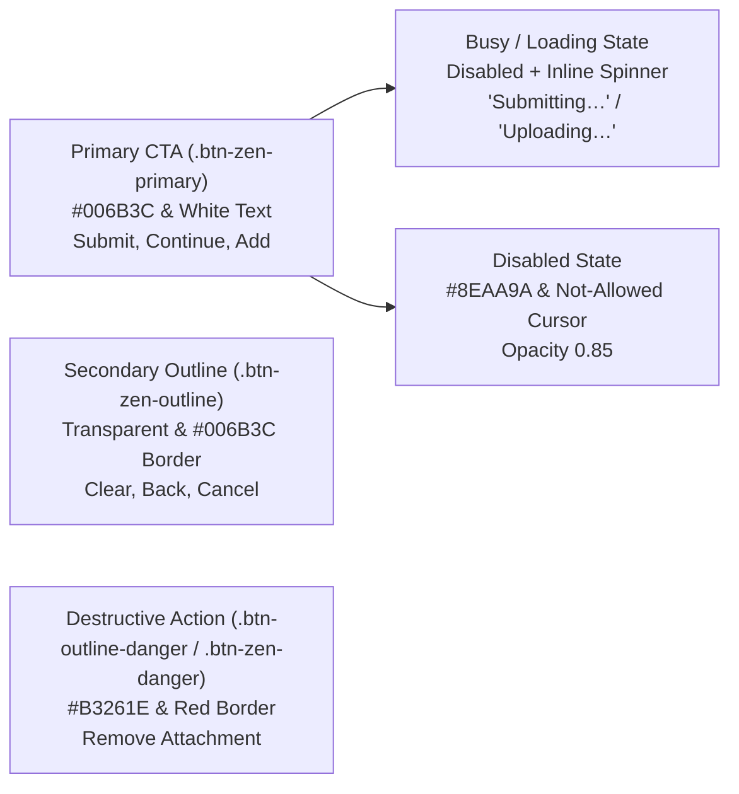
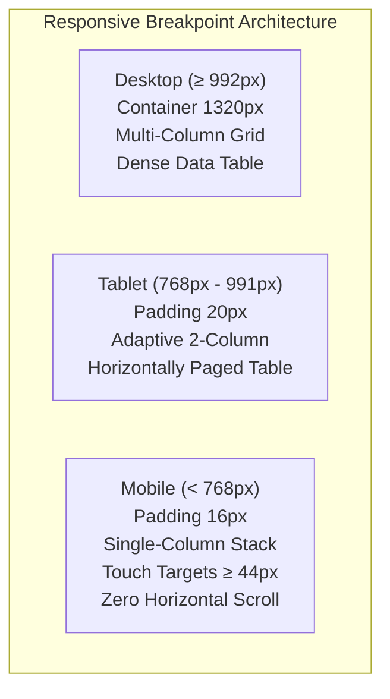
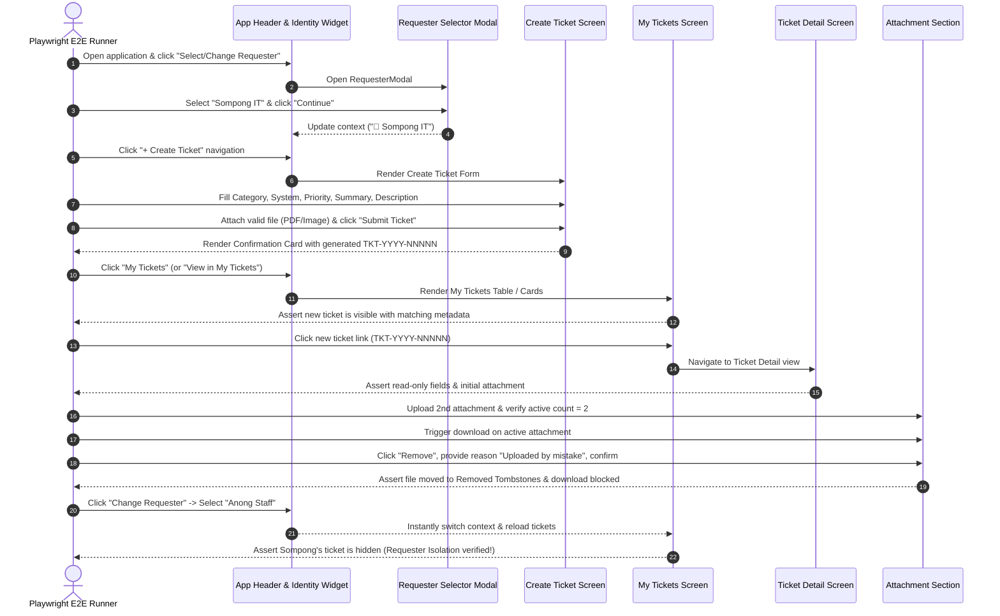

# Feature 10 Engineering Contract: UI Polish & E2E Testing

**Feature Title**: KMUTT Zen Green UI Design Polish, Multi-Viewport Responsiveness, Visual Screenshot Evidence & Playwright E2E Verification  
**Branch Name**: `feature/10-ui-polish-e2e` (Issue 10 / Sprint 2 Milestone Completion)  
**Base Branch**: `lab2-staging`  
**Document Status**: Proposed Feature Contract Baseline  
**Author**: TokTickIT Engineering Team  
**Traceability References**:
* [TokTickIT-System-Level-SDS-v1.0.md](../../reference/TokTickIT-System-Level-SDS-v1.0.md) (§Architecture Style p. 4-5, §Technology Stack p. 6, §Authorization Model p. 10, §Attachment Architecture p. 14-15, §Testing Architecture p. 17, Decisions D-01 through D-12)
* [Lab_02_labsheet.md](../../reference/Lab_02_labsheet.md) (§1, §3, §4.1-4.5, §7 Zen Green Theme UI Spec, §8.1-8.11, §9, §14, §15, §16, §17)
* [TokTickIT_GitHub_Workflow_Guide_TH_EN.pdf](../../reference/TokTickIT_GitHub_Workflow_Guide_TH_EN.pdf) (Kanban Board, PR Workflow, Peer Review Norms)
* [specification.md](../../lab-02/specification.md) (`FR-01` to `FR-05`, `BR-01` to `BR-10`, `AC-01` to `AC-09`, DoD §10)
* [ui-spec.md](../../lab-02/ui-spec.md) (Zen Green Design Tokens, Decisions DR-01 through DR-20, §3 Component States, §4 Responsive Breakpoint Rules)
* [api-spec.md](../../lab-02/api-spec.md) (REST Endpoints `/api/requesters`, `/api/tickets`, `/api/tickets/:id`, `/api/attachments/:id/download`, `/api/attachments/:id`)
* [tests.md](../../lab-02/tests.md) (STS Test Catalog: API-01 to API-12, UI-01 to UI-09, E2E-01)
* [source-evidence.md](../../lab-02/source-evidence.md) (Authoritative Grounded Requirement Citations)
* [poc-scope-and-issues.md](../../lab-02/poc-scope-and-issues.md) (Five-Issue Sprint Decomposition & Milestone Gates)
* [requester-context/contract.md](../requester-context/contract.md) (Feature 2 Approved Contract Baseline)
* [create-ticket/contract.md](../create-ticket/contract.md) (Feature 7 Approved Contract Baseline)
* [my-tickets/contract.md](../my-tickets/contract.md) (Feature 8 Approved Contract Baseline)
* [ticket-detail-attachments/contract.md](../ticket-detail-attachments/contract.md) (Feature 9 Approved Contract Baseline)

---

## 1. Purpose, Scope, and Exclusions

### 1.1. Purpose
Feature 10 represents the final integration, aesthetic refinement, and end-to-end verification milestone for TokTickIT Sprint 2 (Lab 2). Following the successful delivery and merge of the core vertical slices—Development Requester Context (Feature 2), Ticket Creation & Sequence Numbering (Feature 7), My Tickets History & Filtering (Feature 8), and Ticket Detail & Attachment Lifecycle (Feature 9)—Feature 10 guarantees that the complete requester ticketing portal functions as a unified, robust, accessible, and visually stunning system.

The primary objectives of Feature 10 are threefold:
1. **Zen Green UI Polish & Theme Consistency**: Audit and enforce rigorous compliance with the approved KMUTT IT Service Desk "Zen Green" design language across all client views, verifying tokens, colors, surface elevations, borders, badges, form controls, and button interaction hierarchies.
2. **Multi-Viewport Responsive Conformance**: Ensure flawless layout presentation, touch-target ergonomics, and strict prevention of horizontal screen overflow across Desktop ($\ge 992\text{px}$), Tablet ($768\text{px} - 991\text{px}$), and Mobile ($< 768\text{px}$) viewport breakpoints.
3. **Automated Playwright End-to-End (E2E) Verification & Visual Evidence**: Author and execute an exhaustive browser E2E test suite in `e2e/lab-02/requester-ticket-flow.spec.ts` that navigates the full requester lifecycle (identity selection, ticket creation, list browsing, detail inspection, attachment upload/download/soft-removal, and cross-requester isolation) while automatically capturing full-page visual evidence screenshots across all three standard device form factors for course evaluation.

### 1.2. Scope
1. **Zen Green Styling Polish & Token Harmonization**:
   * Verification and enforcement of core design tokens defined in `client/src/index.css` (`--zen-primary-green: #006B3C`, `--zen-secondary-green: #0B7A46`, `--zen-pale-green: #EAF6EF`, `--zen-page-bg: #F5F7F6`, `--zen-surface: #FFFFFF`, `--zen-text-primary: #1C2826`, `--zen-text-muted: #5B6573`, `--zen-error: #B3261E`).
   * Component-level inspection to eliminate rogue raw Bootstrap utility colors (e.g. `bg-primary`, `btn-primary`, `bg-dark`) in favor of standardized Zen Green semantic classes and variables.
   * Uniform card surfaces: clean `#FFFFFF` canvas, `border: 1px solid var(--zen-border-neutral)` (`#D1D5DB`), `border-radius: 8px`, and subtle elevation `box-shadow: 0 1px 3px rgba(0, 0, 0, 0.05)`.
   * Standardized button hierarchy classes (`.btn-zen-primary`, `.btn-zen-outline`, `.btn-zen-danger`) with proper interactive hover lifts, active depressions, disabled muting, and busy loading states.
   * Universal badge palettes for Status (`New`, `Assigned`, `In Progress`, `Pending Requester`, `Resolved`, `Closed`, `Cancelled`), Requested Priority (`Low`, `Medium`, `High`, `Urgent`), and IT Priority.
2. **Multi-Viewport Responsive Layout Audit**:
   * **Desktop ($\ge 992\text{px}$)**: Centered multi-column container (`max-width: 1320px`, padding `24px`), full-width data grid for My Tickets (`~52px` row height), 2-column classification header for Create Ticket, and dual-column/stacked attachments layout.
   * **Tablet ($768\text{px} - 991\text{px}$)**: Fluid 2-column adaptive layout (`padding: 0 20px`), horizontally scrollable table wrapper, and responsive card padding.
   * **Mobile ($< 768\text{px}$)**: Single-column vertically stacked controls (`padding: 0 16px`), mobile card transformation for ticket lists, touch targets measuring $\ge 44 \times 44\text{px}$ (specifically targetting $\ge 48\text{px}$ height per DR-12), and zero horizontal screen overflow (`overflow-x: hidden`).
3. **Playwright E2E Verification Suite (`e2e/lab-02/requester-ticket-flow.spec.ts`)**:
   * Configuration of Playwright runner targeting the integrated Vite development server and Express backend.
   * Implementation of the authoritative 6-step end-to-end requester workflow:
     * *Step 1*: Identity selection and confirmation via simulated requester modal.
     * *Step 2*: Ticket creation form submission with valid inputs and file attachment.
     * *Step 3*: My Tickets list inspection and metadata verification.
     * *Step 4*: Ticket Detail view navigation and read-only field verification.
     * *Step 5*: Attachment operations: secondary upload, active file download, and audited soft-removal with reason.
     * *Step 6*: Simulated requester switching and verification of immediate cross-requester data isolation.
4. **Visual Evidence Screenshot Automation**:
   * Automated capture of full-page PNG screenshots saved directly into `artifacts/lab-02/screenshots/`:
     * `create-ticket` on Desktop, Tablet, and Mobile.
     * `my-tickets` on Desktop, Tablet, and Mobile.
     * `ticket-detail` (active state) on Desktop, Tablet, and Mobile.
     * `ticket-detail` (soft-removed tombstone state) on Desktop, Tablet, and Mobile.
5. **Quality Gate & Regression Assurance**:
   * Verification that all existing Vitest unit/integration test suites (Server: 50 tests; Client: 49 tests) continue to execute with 100% pass rates without modification or regression.

### 1.3. Explicit Exclusions
To maintain strict architectural continuity with the approved Sprint 2 scope and prevent feature creep:
* **No Alternative Color Themes**: Custom themes, dark mode toggle switches, high-contrast alternate palettes, or user-configurable styling themes are strictly out of scope. The KMUTT Zen Green theme is the sole approved design system.
* **No Status Workflow Transitions**: Requesters cannot transition ticket statuses (e.g. resolving, closing, reopening, cancelling, or reassigning tickets). Status badges remain informative and read-only.
* **No Collaboration Feeds**: Public Comments, Internal Notes, Resolution Summaries, and Actions Taken audit streams are strictly forbidden in Sprint 2 (deferred to Lab 3 / Lab 4).
* **No Additional Navigation Screens**: No administrative dashboards, user profile management screens, category management tables, or IT resolver queues may be added.
* **No Real Authentication**: No password inputs, hashing algorithms (Argon2id), session cookies, or login/logout security boundaries. The simulated Development Requester context remains the sole identity mechanism for Lab 2.

---

## 2. Zen Green Design System Compliance

All presentation components must strictly honor the design tokens and styling conventions established in [ui-spec.md](../../lab-02/ui-spec.md) and grounded in *Lab 2 Labsheet* §7.

### 2.1. Standard CSS Tokens & Color Palette
The central stylesheet (`client/src/index.css`) establishes the authoritative `:root` design variables:

```css
:root {
  /* Brand Zen Green Core Palette (Labsheet §7) */
  --zen-primary-green:      #006B3C; /* App header, primary CTA, major anchors */
  --zen-secondary-green:    #0B7A46; /* Hover states, active tabs, supportive accents */
  --zen-pale-green:         #EAF6EF; /* Alerts, banners, table row hover, success surfaces */
  --zen-page-bg:            #F5F7F6; /* Overall light canvas background */
  --zen-surface:            #FFFFFF; /* Clean white card, panel, and modal surface */

  /* Typography & Contrast */
  --zen-font-family:        system-ui, -apple-system, "Segoe UI", Roboto, "Helvetica Neue", Arial, sans-serif;
  --zen-font-size-base:     16px;    /* DR-01: Base body scale (1.0rem) */
  --zen-font-size-label:    16px;    /* DR-06: Form label font size */
  --zen-font-size-error:    13px;    /* DR-13: Validation error font size */
  --zen-text-primary:       #1C2826; /* Dark charcoal-green text (high contrast, never pure black) */
  --zen-text-muted:         #5B6573; /* Secondary metadata, timestamps, helper copy */

  /* Borders & Controls */
  --zen-border-neutral:     #D1D5DB; /* Standard neutral border for fields and cards */
  --zen-border-radius:      6px;     /* DR-05: Standard control radius */
  --zen-control-height:     40px;    /* DR-05: Desktop input and button height */
  --zen-field-readonly-bg:  #F0F4F1; /* Soft gray-green shading for read-only fields */

  /* Focus & Focus Halo */
  --zen-focus-ring-color:   #0B7A46; /* DR-08, DR-19: Focus outline color */
  --zen-focus-halo:         0 0 0 3px rgba(11, 122, 70, 0.20); /* DR-08: Input focus halo */
  --zen-focus-outline:      2px solid var(--zen-focus-ring-color); /* DR-19: A11y focus ring */

  /* Semantic Feedback Colors */
  --zen-error:              #B3261E; /* DR-13: Dark red text and invalid border */
  --zen-error-glow:         0 0 0 3px rgba(179, 38, 30, 0.15); /* DR-13: Invalid field focus */
  --zen-warning:            #D97706; /* Amber callouts and badges */
  --zen-success:            #2E7D32; /* Green confirmation icon and text */

  /* Spacing Scale */
  --zen-field-spacing:      20px;    /* DR-02: Vertical margin between form fields */
  --zen-card-padding:       24px;    /* DR-03: Desktop card internal padding */
  --zen-container-max-w:    1320px;  /* DR-04: Desktop container max width */
}
```

### 2.2. Surface Cards & Elevations
All content containers, form cards, table panels, and detail panes must adhere to standard surface styling:
* **Background**: Pure white (`#FFFFFF`, `var(--zen-surface)`).
* **Border**: Subtle 1px neutral border (`border: 1px solid var(--zen-border-neutral)`).
* **Radius**: Bounded 8px corner radius (`border-radius: 8px`).
* **Elevation Shadow**: Soft, non-intrusive drop shadow (`box-shadow: 0 1px 3px rgba(0, 0, 0, 0.05)` or `shadow-sm`).
* **Read-Only Surfaces**: Distinct soft gray-green background (`#F0F4F1`, `var(--zen-field-readonly-bg)`) with neutral border, non-editable cursor (`cursor: default`), and charcoal-green text.

### 2.3. Badge Palette Specifications
Badges must pair background tint, contrasting text, and subtle borders. Color alone must never convey state without explicit accompanying text:

| Badge Type | State / Value | CSS Class | Background Hex | Text Hex | Border Hex | Notes |
| :--- | :--- | :--- | :--- | :--- | :--- | :--- |
| **Status** | `New` | `.badge-status-new` | `#EAF6EF` | `#006B3C` | `#C4E5D2` | Zen Green primary tint |
| **Status** | `Assigned` | `.badge-status-assigned` | `#EFF6FF` | `#1E40AF` | `#BFDBFE` | Soft blue |
| **Status** | `In Progress` | `.badge-status-in-progress` | `#FEF3C7` | `#92400E` | `#FDE68A` | Warm amber |
| **Status** | `Pending Requester` | `.badge-status-pending-requester` | `#F3E8FF` | `#6B21A8` | `#E9D5FF` | Muted purple |
| **Status** | `Resolved` / `Closed` | `.badge-status-resolved` | `#F3F4F6` | `#374151` | `#E5E7EB` | Neutral slate gray |
| **Status** | `Cancelled` | `.badge-status-cancelled` | `#FEE2E2` | `#991B1B` | `#FECACA` | Soft red |
| **Priority** | `Low` | `.badge-priority-low` | `#E5E7EB` | `#374151` | None | Slate gray |
| **Priority** | `Medium` | `.badge-priority-medium` | `#DBEAFE` | `#1E40AF` | None | Blue |
| **Priority** | `High` | `.badge-priority-high` | `#FEF3C7` | `#92400E` | None | Amber |
| **Priority** | `Urgent` | `.badge-priority-urgent` | `#FEE2E2` | `#991B1B` | None | Red |
| **Priority** | `Unassigned` | `.badge-priority-unassigned` | `#F3F4F6` | `#6B7280` | None | Muted placeholder (`—`) |
| **Audit** | `Removed` | `.badge bg-secondary` | `#6C757D` | `#FFFFFF` | None | Soft-removal tombstone tag |

### 2.4. Button Hierarchy & Interactive States
Buttons must communicate clear operational weight through consistent styling:



1. **Primary Button (`.btn-zen-primary`)**:
   * *Resting*: Background `var(--zen-primary-green)` (`#006B3C`), color `#FFFFFF`, font-weight `600`, border `1px solid transparent`, border-radius `6px`, height `40px` (desktop) / `48px` (mobile).
   * *Hover (DR-09)*: Background `var(--zen-secondary-green)` (`#0B7A46`), `transform: translateY(-1px)`, `box-shadow: 0 4px 6px -1px rgba(0, 107, 60, 0.2)`.
   * *Active*: `transform: translateY(0)`, shadow cleared.
   * *Disabled*: Background `#8EAA9A`, color `#FFFFFF`, opacity `0.85`, cursor `not-allowed`.
2. **Secondary / Outline Button (`.btn-zen-outline`)**:
   * *Resting*: Background `transparent`, border `1px solid var(--zen-border-neutral)` (`#D1D5DB`), color `var(--zen-text-primary)` or `var(--zen-primary-green)`.
   * *Hover*: Background `var(--zen-pale-green)` (`#EAF6EF`), border-color `var(--zen-secondary-green)` (`#0B7A46`), color `var(--zen-secondary-green)`.
   * *Active*: Background `#D8EFE2`.
3. **Destructive Button (`.btn-outline-danger` / `.btn-zen-danger`)**:
   * *Outline*: Border `1px solid var(--zen-error)` (`#B3261E`), color `var(--zen-error)`, hover background `#FEE2E2`.
   * *Solid*: Background `var(--zen-error)` (`#B3261E`), color `#FFFFFF`, hover background `#8C1D18`.
4. **Busy / Submitting State**:
   * Button receives `disabled={true}`, displays an inline loading spinner (`.spinner-border.spinner-border-sm.me-2`), and replaces text with active gerund ("Submitting…", "Uploading…", "Loading…").

---

## 3. Multi-Viewport Layout Rules



### 3.1. Desktop Viewport ($\ge 992\text{px}$)
* **Container Bounds**: Centered layout constrained to `max-width: 1320px` (`container-xl`) with generous horizontal margins (**DR-04**).
* **Card Density**: Internal card padding set to `24px` (`1.5rem`) (**DR-03**).
* **Create Ticket Layout**: Two-column layout pairing classification selections (Category, System, Priority) on the left with narrative inputs (Summary, Description) and Staged Attachments on the right, or centered single-column bounded card (`max-width: 860px`).
* **My Tickets Grid**: Full tabular display featuring 8 distinct columns (Ticket No, Created Date, Summary, Category, Requested Priority, IT Priority, Status, Attachments). Table row height comfortable at `~52px` (**DR-07**) with pale green hover highlight (`#EAF6EF`, **DR-17**).
* **Ticket Detail**: Spacious read-only header card displaying ticket number badge, status, priority, categorization, and full description panel (`#F0F4F1`), anchored above the interactive attachment section.

### 3.2. Tablet Viewport ($768\text{px} - 991\text{px}$)
* **Container Bounds**: Fluid container with `padding: 0 20px`.
* **Adaptive Grid**: Create Ticket classification inputs arrange into side-by-side pairs, with Summary and Description spanning full width below (**DR-11**).
* **My Tickets Presentation**: Table container wrapped in `.table-responsive` with clean horizontal paging or condensed cell text.
* **Attachments Grid**: Active and removed attachment items display as full-width list items with clear metadata truncation.

### 3.3. Mobile Viewport ($< 768\text{px}$)
* **Single-Column Stacking**: All form fields, action buttons, filter selectors, and metadata rows collapse into a strict single-column vertical flow with `padding: 0 16px`.
* **Zero Horizontal Overflow Rule**: Strict prohibition of horizontal page scrolling (`overflow-x: hidden`). All containers, tables, and modal dialogs must fit within 100% of the mobile viewport width ($375\text{px}$, $390\text{px}$, $414\text{px}$). Long summaries or filenames must truncate with ellipses (`text-truncate`).
* **Touch-Friendly Tap Targets**: All interactive touch targets—including buttons, input fields, select dropdowns, and priority radio pills—must measure **$\ge 44 \times 44\text{px}$** (with standard controls enforcing minimum height **`48px`** per DR-12 and CSS media queries).
* **Table-to-Card Transformation (DR-10)**: On screens $< 768\text{px}$, the desktop tabular grid in My Tickets hides (`d-none d-md-block`) and is replaced by stacked mobile ticket cards (`.my-tickets-mobile-card`, `d-md-none`). Each card presents Ticket Number, Status badge, Priority badge, Created Date, Summary, and Category without requiring horizontal scrolling.
* **Mobile Navigation**: Top navbar includes responsive toggles or mobile button bars with touch-friendly spacing.

---

## 4. Playwright Automated E2E Test Suite Specification

### 4.1. File Location & Test Harness Architecture
* **Designated Test File**: `e2e/lab-02/requester-ticket-flow.spec.ts`
* **Configuration**: Playwright config configured to test the full stack with automatic server execution or local connection (`http://localhost:5173` client; `http://localhost:3000` backend).
* **Test Isolation**: Tests run against an initialized development environment with seeded test users ("Sompong IT", "Anong Staff", "Kittisak Student") and reference data.

### 4.2. Sequential 6-Step Test Flow
The test script must execute the following sequential workflow in a single coherent test or clearly defined dependent steps:



#### Step-by-Step Specification:

* **Step 1: Select Simulated Requester in Header Identity Widget**
  * Locate and click the header identity action ("Select Requester" or "Change Requester").
  * Verify `RequesterModal` opens displaying the development disclaimer banner.
  * Select active user **"Sompong IT"** (`sompong.it@kmutt.ac.th`) from the dropdown.
  * Click "Continue".
  * Assert that the modal closes and the header reflects `data-testid="active-user-badge"` containing "Sompong IT".

* **Step 2: Create Ticket with File Attachment**
  * Click navigation link `data-testid="nav-create-ticket"`.
  * Verify Create Ticket form is displayed.
  * Assert Ticket Number shows *"Generated upon submission"* and Requester is pre-filled with Sompong IT.
  * Select Category: `"Network"`.
  * Select Related System: `"Campus Wi-Fi"`.
  * Select Requested Priority: `"High"`.
  * Type Summary: `"E2E Wi-Fi Connection Failure in SCL Building"`.
  * Type Description: `"Automated E2E Playwright test verifying ticket creation, attachments, and isolation."` (length $\ge 10$ chars).
  * Stage an attachment using the file input (`data-testid="attachments-input"` or native file chooser) with a valid PNG image or PDF document.
  * Click `"Submit Ticket"` (`.btn-zen-primary`).
  * Verify button transitions to disabled busy state with spinner and "Submitting…".
  * Assert the Success Confirmation Card appears (`createdTicket` state), containing a system-generated Ticket Number matching regex `/^TKT-\d{4}-\d{5}$/`.
  * Capture generated Ticket Number in a test variable for subsequent assertions.

* **Step 3: Navigate to "My Tickets" and Verify Listing**
  * Click `"View in My Tickets ➔"` or header nav `data-testid="nav-my-tickets"`.
  * Assert My Tickets view loads.
  * Verify that the newly created Ticket Number is present in the table row or mobile card.
  * Assert that the row displays:
    * Matching summary: `"E2E Wi-Fi Connection Failure in SCL Building"`.
    * Status badge: `"New"` (`.badge-status-new`).
    * Requested Priority badge: `"High"` (`.badge-priority-high`).
    * Category: `"Network"`.
    * Attachment indicator: `"📎 1"`.

* **Step 4: Open "Ticket Detail" View**
  * Click the ticket number link (`data-testid={`ticket-link-${id}`}`) or row.
  * Verify application navigates to Ticket Detail (`data-testid="ticket-detail-view"`).
  * Assert all ticket header fields are strictly read-only:
    * Ticket Number is displayed in bold monospace badge.
    * Requester name and email match Sompong IT.
    * Status shows `"New"`.
    * Priority shows `"High"`.
    * Summary and Description match entered values.
    * No editable input controls or status transition dropdowns exist in the header.

* **Step 5: Attachment Lifecycle (Upload 2nd, Download Active, Soft-Remove)**
  * **Upload 2nd File**:
    * Locate the Attachment Section.
    * Trigger file input (`data-testid="file-upload-input"`) with a second valid test file (e.g. `diagnostic.pdf`).
    * Assert active attachments list updates to display **2 active files**.
  * **Download Active Attachment**:
    * Click `data-testid={`download-btn-${attId}`}` for an active attachment.
    * Verify that the download request succeeds with HTTP 200 and attachment binary stream.
  * **Soft-Removal with Reason**:
    * Click `data-testid={`remove-btn-${attId}`}` on one of the attachments.
    * Assert `RemoveAttachmentModal` (`data-testid="remove-attachment-modal"`) opens.
    * Verify modal warns that the file binary will be deleted and displays the target filename.
    * Type mandatory removal reason into textarea (`data-testid="removal-reason-input"`): `"Uploaded outdated screenshot by mistake"`.
    * Click `"Confirm Removal"` (`data-testid="confirm-removal-btn"`).
    * Assert modal closes and active attachment count decrements from 2 to 1.
    * Assert the removed attachment appears in the **Removed Attachments Audit Log** (`data-testid="removed-attachments-list"`) styled as a tombstone with a `"Removed"` badge, timestamp, and the exact removal reason.
    * Assert that the download button for the removed attachment is strictly omitted.

* **Step 6: Context Switching & Cross-Requester Isolation**
  * Click `"Change Requester"` in the header.
  * Select a different active requester: **"Anong Staff"** (`anong.staff@kmutt.ac.th`).
  * Click `"Continue"`.
  * Assert header updates to display "👤 Anong Staff".
  * Navigate to (or observe) the My Tickets list.
  * Assert that Sompong IT's newly created ticket is **NOT** present in Anong Staff's ticket list.
  * Verify that Anong Staff's view displays only their own tickets or the appropriate empty state, proving strict server-side ownership isolation (`WHERE requesterId = currentRequesterId`).
  * (Optional verification): Switch back to Sompong IT and assert the ticket reappears.

---

## 5. Visual Evidence Screenshot Capture Specification

### 5.1. Automated Screenshot Output Directory
All captured visual evidence files must be saved automatically by the Playwright suite into the following directory:
```
artifacts/lab-02/screenshots/
```
The test suite must ensure this directory exists before saving screenshots.

### 5.2. Viewport Matrix
Screenshots must be systematically captured across three standard responsive viewport dimensions:

| Form Factor | Viewport Width | Viewport Height | Device Simulation Target |
| :--- | :--- | :--- | :--- |
| **Desktop** | `1280px` | `800px` | Standard Laptop / Desktop Monitor ($\ge 992\text{px}$) |
| **Tablet** | `768px` | `1024px` | Apple iPad / Android Tablet in Portrait ($768 - 991\text{px}$) |
| **Mobile** | `375px` | `812px` | Apple iPhone / Android Mobile in Portrait ($< 768\text{px}$) |

### 5.3. Required Screenshot Artifacts
The test suite must generate full-page screenshots (`page.screenshot({ path, fullPage: true })`) for the following screen states across all three viewport sizes:

| Target Screen State | Viewport | Output File Path | Verification / Visual Content Focus |
| :--- | :--- | :--- | :--- |
| **Create Ticket** | Desktop | `artifacts/lab-02/screenshots/create-ticket-desktop.png` | Zen Green header, classification selectors, form inputs, staged attachment |
| **Create Ticket** | Tablet | `artifacts/lab-02/screenshots/create-ticket-tablet.png` | 2-column adaptive layout, full-width description, responsive spacing |
| **Create Ticket** | Mobile | `artifacts/lab-02/screenshots/create-ticket-mobile.png` | Single-column stacked fields, $\ge 48\text{px}$ touch targets, zero horizontal scroll |
| **My Tickets** | Desktop | `artifacts/lab-02/screenshots/my-tickets-desktop.png` | Full 8-column data table, Zen Green header, status/priority badges, pagination |
| **My Tickets** | Tablet | `artifacts/lab-02/screenshots/my-tickets-tablet.png` | Condensed tabular layout, horizontal scroll container, filter bar |
| **My Tickets** | Mobile | `artifacts/lab-02/screenshots/my-tickets-mobile.png` | Stacked card list (`.my-tickets-mobile-card`), badges, touch-friendly tap targets |
| **Ticket Detail (Active)** | Desktop | `artifacts/lab-02/screenshots/ticket-detail-active-desktop.png` | Read-only header card, active attachments list with Download and Remove buttons |
| **Ticket Detail (Active)** | Tablet | `artifacts/lab-02/screenshots/ticket-detail-active-tablet.png` | Responsive detail cards, description shading (`#F0F4F1`), attachment items |
| **Ticket Detail (Active)** | Mobile | `artifacts/lab-02/screenshots/ticket-detail-active-mobile.png` | Stacked detail fields, mobile attachment rows, zero horizontal scroll |
| **Ticket Detail (Removed)** | Desktop | `artifacts/lab-02/screenshots/ticket-detail-removed-desktop.png` | Tombstone audit log (`#F0F4F1`), "Removed" badge, removal reason, omitted download |
| **Ticket Detail (Removed)** | Tablet | `artifacts/lab-02/screenshots/ticket-detail-removed-tablet.png` | Tablet tombstone cards showing audit history and security lock callout |
| **Ticket Detail (Removed)** | Mobile | `artifacts/lab-02/screenshots/ticket-detail-removed-mobile.png` | Mobile stacked tombstone layout, clean word wrapping, zero overflow |

---

## 6. Automated Test Suites (STS) & Traceability

### 6.1. Test Execution Commands & Runner Paths
The TokTickIT project maintains a multi-tiered automated testing hierarchy:

```bash
# 1. Server Unit & Integration API Tests (Supertest + PostgreSQL)
cd server
npm test

# 2. Client UI Component & State Tests (Vitest + React Testing Library)
cd ../client
npm test

# 3. Browser End-to-End & Visual Screenshot Test Suite (Playwright)
npx playwright test e2e/lab-02/requester-ticket-flow.spec.ts
```

### 6.2. Non-Regression Invariant
The introduction of Playwright E2E testing and UI polish in Feature 10 must **not** break or alter any existing unit or integration tests:
* Server Vitest Suite: **50 tests in 7 test files** must continue to pass with 0 failures.
* Client Vitest Suite: **49 tests in 6 test files** must continue to pass with 0 failures.

### 6.3. Acceptance Criteria Traceability Matrix

| Requirement / AC ID | Description | Verifying Test Suite / Level | Designated Test Files |
| :--- | :--- | :--- | :--- |
| **FR-01 / AC-02** | Development Requester Context Selection | API, UI, E2E | `server/tests/lab-02/requesters.api.test.ts`<br/>`client/tests/lab-02/RequesterSelector.test.tsx`<br/>`e2e/lab-02/requester-ticket-flow.spec.ts` (Step 1) |
| **FR-02 / AC-01** | Ticket Creation & Sequence Numbering (`TKT-YYYY-NNNNN`) | API, UI, E2E | `server/tests/lab-02/create-ticket.api.test.ts`<br/>`client/tests/lab-02/CreateTicket.test.tsx`<br/>`e2e/lab-02/requester-ticket-flow.spec.ts` (Step 2) |
| **FR-03 / AC-03** | My Tickets Listing, Search, Filter & Requester Isolation | API, UI, E2E | `server/tests/lab-02/my-tickets.api.test.ts`<br/>`client/tests/lab-02/MyTickets.test.tsx`<br/>`e2e/lab-02/requester-ticket-flow.spec.ts` (Steps 3 & 6) |
| **FR-04 / AC-04** | Read-Only Ticket Detail Inspection | API, UI, E2E | `server/tests/lab-02/ticket-detail.api.test.ts`<br/>`client/tests/lab-02/RequesterTicketDetail.test.tsx`<br/>`e2e/lab-02/requester-ticket-flow.spec.ts` (Step 4) |
| **FR-05 / AC-05** | Attachment Upload Validation & Ceilings | API, UI, E2E | `server/tests/lab-02/attachments.api.test.ts`<br/>`client/tests/lab-02/AttachmentSection.test.tsx`<br/>`e2e/lab-02/requester-ticket-flow.spec.ts` (Step 5) |
| **FR-05 / AC-06** | Attachment Download & Soft-Removal Audit Tombstone | API, UI, E2E | `server/tests/lab-02/attachments.api.test.ts`<br/>`client/tests/lab-02/AttachmentSection.test.tsx`<br/>`e2e/lab-02/requester-ticket-flow.spec.ts` (Step 5) |
| **BR-09 / AC-07** | Inactive User Exclusion | API, UI | `server/tests/lab-02/requesters.api.test.ts`<br/>`client/tests/lab-02/RequesterSelector.test.tsx` |
| **BR-10 / AC-08** | Blur & Form Submission Validation Timing | API, UI | `server/tests/lab-02/create-ticket.api.test.ts`<br/>`client/tests/lab-02/CreateTicket.test.tsx` |
| **DR-01-20 / AC-09** | Zen Green Design Compliance & Responsive Layouts | Visual, E2E | `client/tests/lab-02/MyTickets.test.tsx`<br/>`e2e/lab-02/requester-ticket-flow.spec.ts`<br/>`artifacts/lab-02/screenshots/*.png` |

---

## 7. Acceptance Criteria (Given-When-Then)

* **AC-10.1 (Zen Green Theme Compliance)**:
  * *Given* any rendered screen in the application (Create Ticket, My Tickets, Ticket Detail, Modals),
  * *when* inspecting CSS properties and computed styles,
  * *then* all primary headers and actions strictly resolve to `#006B3C`, hover states resolve to `#0B7A46`, row highlights and banners resolve to `#EAF6EF`, canvas backgrounds resolve to `#F5F7F6`, and text resolves to `#1C2826`, with no generic or raw Bootstrap colors overriding theme variables.

* **AC-10.2 (Multi-Viewport Layout & Zero Overflow)**:
  * *Given* the application rendered in viewport widths of $1280\text{px}$ (Desktop), $768\text{px}$ (Tablet), and $375\text{px}$ (Mobile),
  * *when* evaluating layout geometry and scroll bounds,
  * *then* all content fits cleanly within the screen width with zero horizontal scrollbar appearing (`document.body.scrollWidth <= window.innerWidth`), and all interactive mobile controls measure $\ge 44 \times 44\text{px}$ (targeting $\ge 48\text{px}$ height).

* **AC-10.3 (Playwright E2E Sequential Flow Execution)**:
  * *Given* a running frontend and backend environment,
  * *when* `npx playwright test e2e/lab-02/requester-ticket-flow.spec.ts` is executed,
  * *then* the runner completes all 6 lifecycle steps (Requester selection $\rightarrow$ Ticket creation $\rightarrow$ My Tickets listing $\rightarrow$ Detail inspection $\rightarrow$ Attachment upload/download/soft-removal $\rightarrow$ Requester switching isolation) with 100% assertions passing.

* **AC-10.4 (Cross-Requester Data Isolation Proof)**:
  * *Given* a ticket created under Requester "Sompong IT",
  * *when* the active requester is switched to "Anong Staff" via the header selector,
  * *then* Sompong's ticket immediately disappears from the My Tickets list, and attempting to directly query Sompong's ticket ID under Anong's identity returns HTTP 403 or 404.

* **AC-10.5 (Automated Screenshot Artifact Generation)**:
  * *Given* the execution of the Playwright E2E suite,
  * *when* the test run concludes,
  * *then* all 12 designated screenshot PNG files exist in `artifacts/lab-02/screenshots/` capturing Desktop, Tablet, and Mobile views for Create Ticket, My Tickets, and Ticket Detail (both active and removed tombstone states).

* **AC-10.6 (Vitest Non-Regression Guarantee)**:
  * *Given* the workspace test runner,
  * *when* executing `npm test` in `server/` and `client/`,
  * *then* all 50 server API tests and 49 client component tests pass completely without errors or warnings.

---

## 8. Definition of Done (DoD)

To consider Issue 10 and Feature 10 complete and ready for PR merge into `lab2-staging`:
1. **Contract Frozen**: This contract (`docs/features/ui-polish-e2e/contract.md`) is approved and committed.
2. **Design Tokens & Polish Audited**: All client components verified against Zen Green tokens with no visual regressions or raw Bootstrap brand colors.
3. **Playwright Suite Passing**: `e2e/lab-02/requester-ticket-flow.spec.ts` passes end-to-end against live client and server processes.
4. **Visual Evidence Saved**: All 12 screenshot artifacts generated and stored in `artifacts/lab-02/screenshots/`.
5. **Zero Regression**: All 50 server tests and 49 client tests continue to pass via `npm test`.
6. **Peer Review & Clean Working Tree**: Git working directory is clean with atomic commits referencing Issue 10, ready for pull request to `lab2-staging`.
