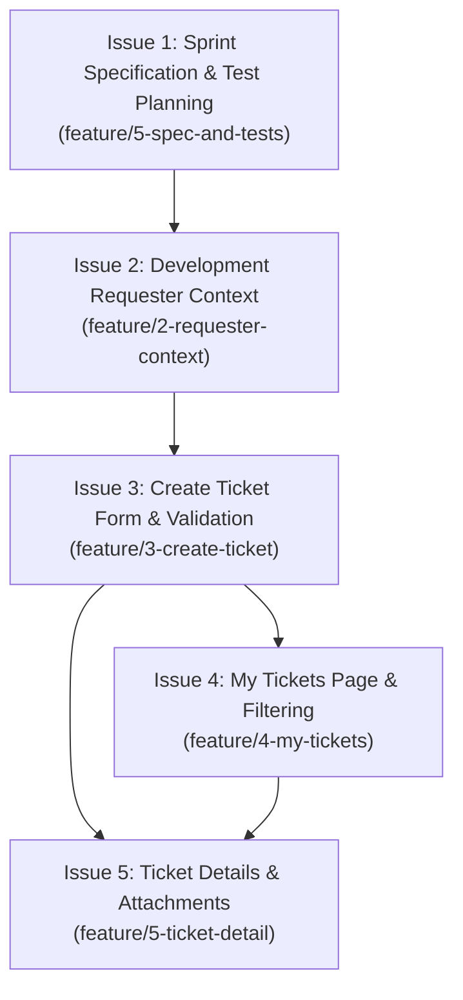

# TokTickIT Sprint 2 (Lab 2) — Proof-of-Concept Scope & Issue Decomposition

**Document Status**: Official Implementation Plan  
**Target Sprint**: TokTickIT Lab 2 (Sprint 2) — Requester Ticketing MVP with UI Foundation  
**Base Branch**: `lab2-staging`  
**Current Active Branch**: `feature/5-spec-and-tests`  
**Traceability Reference**: [docs/lab-02/source-evidence.md](file:///c:/Users/Muhammad%20Asad%20Aziz/Downloads/CPE%20334/toktickit/docs/lab-02/source-evidence.md)  

---

## 1. Sprint Architecture & Delivery Plan

### 1.1. Sprint Goal
Deliver an end-to-end Requester-facing IT Ticketing Minimum Viable Product (MVP) using a temporary simulated Development Requester context ("user login"), enabling ticket creation, category/system selection, attachment upload/download/soft-removal, personal ticket history browsing, and owned ticket inspection, built upon a cohesive Zen Green UI design system with comprehensive automated test coverage.

### 1.2. Git & GitHub Engineering Workflow
* All feature branches are cut from `lab2-staging` and merge back into `lab2-staging` via peer-reviewed Pull Requests.
* The reviewer merges approved PRs; the PR author responds to all review comments.
* When all 5 issues are complete and passing on `lab2-staging`, a final release PR is submitted to `main`.
* Project Kanban board tracks issues through the 6 approved states: `Backlog` $\rightarrow$ `Specified` $\rightarrow$ `Started` $\rightarrow$ `PR Review` $\rightarrow$ `Fixing` $\rightarrow$ `Done`.

---

## 2. Five Planned GitHub Issues for Sprint 2

---

### Issue 1: Sprint Specification and Test Planning
* **Issue Title**: `Issue 1: Sprint Specification and Test Planning`
* **Branch Name**: `feature/5-spec-and-tests`
* **Dependencies**: None (Sprint initiation).
* **Merge Order**: 1st (Must merge into `lab2-staging` before feature implementation begins).

#### Detailed Scope
1. Author the authoritative sprint engineering contract documents in `docs/lab-02/`:
   * `specification.md`: Sprint goals, scope, functional requirements, business rules, data models, API contract, acceptance criteria, and Definition of Done.
   * `tests.md`: Test DD strategy, planned test catalog (unit, API integration, UI component, responsive, E2E), acceptance criteria traceability matrix, test commands, and pass criteria.
   * `ui-spec.md`: Zen Green design tokens, typography, component states, layout wireframes/checklists for all screens, and responsive breakpoints.
   * `api-spec.md`: Exhaustive REST endpoint contracts, query parameters, DTO schemas, validation rules, HTTP status codes, and error envelopes.
   * `reviewer.md`: Course review evidence template.
   * `ai-use.md`: Course AI usage disclosure and prompt reflection log.
2. Setup test directory scaffolding:
   * `server/tests/lab-02/` for Supertest API test files.
   * `client/tests/lab-02/` for Vitest/RTL UI component test files.
   * `e2e/lab-02/` for Playwright browser end-to-end tests.

#### Explicit Exclusions
* Writing backend API route handlers or database migrations.
* Scaffolding React UI components or application code.
* Modifying Lab 1 baseline tests or implementation.

#### Mapped Requirement IDs
* **Labsheet**: §4.1, §4.3, §4.4, §4.5, §8.9, §8.10, §9, §10, §12, §13, §15, §16, §17.
* **SDS v1.0**: §"Feature Specification Contract" (p. 19-20), §"Definition of Ready for Implementation" (p. 19).

#### Acceptance Criteria (Given-When-Then)
* **AC-01.1**: *Given* the course requirements documents, *when* `docs/lab-02/specification.md` is drafted, *then* it must contain numbered requirements (`FR-01` to `FR-05`), business rules (`BR-01` to `BR-10`), Given-When-Then acceptance criteria, and a concrete Product Definition of Done.
* **AC-01.2**: *Given* the completed specifications, *when* `docs/lab-02/tests.md` is drafted, *then* every Acceptance Criterion must map directly to at least one designated automated test file path across unit, API, UI, or E2E levels.
* **AC-01.3**: *Given* the Zen Green UI specification in Labsheet §7, *when* `docs/lab-02/ui-spec.md` is drafted, *then* all color tokens, typography scales, component interaction states, and responsive breakpoints (Desktop, Tablet, Mobile) must be explicitly defined.
* **AC-01.4**: *Given* the completed contract documents on `feature/5-spec-and-tests`, *when* submitted for peer review, *then* a PR to `lab2-staging` is created, linked via the Development panel, reviewed, approved, and merged before implementing subsequent issues.

---

### Issue 2: Development Requester Selector & Context
* **Issue Title**: `Issue 2: Development Requester Selector & Context`
* **Branch Name**: `feature/2-requester-context`
* **Dependencies**: Issue 1 merged to `lab2-staging`.
* **Merge Order**: 2nd.

#### Detailed Scope
1. **Database Modeling & Seed Data**:
   * Create Prisma model `User` (or `RequesterUser`) with fields: `id` (Int or UUID), `email` (String unique), `displayName` (String), `department` (String, nullable), `isActive` (Boolean, default true), `createdAt` (DateTime).
   * Update `server/prisma/seed.ts` to seed at least 4 active Requesters and at least 1 inactive Requester idempotently.
   * Run Prisma migration: `prisma migrate dev --name create-requester-users`.
2. **Backend API**:
   * Implement `GET /api/v1/requesters` returning only active users (`WHERE isActive = true`).
   * Implement error handling returning HTTP 500 if database access fails.
3. **Frontend Application Shell & Context**:
   * Implement React `RequesterContext` holding `currentRequester` state with local storage persistence for session continuity.
   * Build the **Development Requester Selection Screen**:
     * Banner clearly stating: *"Select a Development Requester to test requester-specific ticket behavior. This is not a login screen. Authentication will be introduced in Lab 3."*
     * Dropdown populated from `GET /api/v1/requesters`.
     * "Continue" primary button.
     * Loading spinner, API failure error alert, and empty state if 0 active users exist.
   * Update Application Header to display active Requester name and a "Change Requester" action that opens the selector modal.
4. **Automated Tests**:
   * Server Supertest: Active user retrieval succeeds; inactive user excluded from response.
   * Client RTL: Dropdown renders active users; selecting user updates application context; loading and error states render correctly.

#### Explicit Exclusions
* Passwords, password hashing algorithms (Argon2id), and password reset flows.
* Session tokens, HttpOnly cookies, and CSRF protection.
* User registration, profile editing, and role-based permissions (IT Staff / Admin).

#### Mapped Requirement IDs
* **FR-01**: Development Requester Context Selection.
* **BR-03**: Simulated Development Identity for testing (non-authenticated).
* **BR-09**: Active User Dropdown Filtering.
* **AC-02**: Given no Requester is selected, the application displays the Requester Selection screen.
* **SDS v1.0**: §"Domain Data Model - User" (p. 7), Decisions `D-04`, `D-05`.
* **Labsheet**: §1, §3, §4.3, §4.4, §5.3, §8.1.

#### Acceptance Criteria (Given-When-Then)
* **AC-02.1**: *Given* seeded users with active and inactive statuses, *when* `GET /api/v1/requesters` is called, *then* the API returns HTTP 200 containing only users with `isActive === true`, strictly omitting inactive users.
* **AC-02.2**: *Given* a user navigates to the application with no requester selected in local state, *when* the app initializes, *then* the Development Requester Selection screen is displayed and ticketing routes remain blocked.
* **AC-02.3**: *Given* the active requester list in the dropdown, *when* the user selects "Sompong IT" and clicks "Continue", *then* the application shell displays "Current Requester: Sompong IT" in the header and enables access to ticketing navigation.
* **AC-02.4**: *Given* an active requester is set, *when* the user clicks the "Change Requester" button in the header, *then* the selector modal opens, allowing selection of a different active requester and updating all requester-scoped views upon change.
* **AC-02.5**: *Given* the database has 0 active requesters, *when* the selector loads, *then* an informative empty state message is shown and the "Continue" button is disabled.

---

### Issue 3: Create Ticket Form & Validation
* **Issue Title**: `Issue 3: Create Ticket Form & Validation`
* **Branch Name**: `feature/3-create-ticket`
* **Dependencies**: Issue 2 merged to `lab2-staging`.
* **Merge Order**: 3rd.

#### Detailed Scope
1. **Database Modeling & Seed Data**:
   * Create Prisma model `RelatedSystem` (`id`, `name` unique, `isActive`, `createdAt`). Seed 6+ systems: Email, Campus Wi-Fi, VPN, LEB2 App, Grade Submission App, Printer, Corporate Laptop.
   * Create Prisma model `Ticket`:
     * `id`: Int or UUID PK.
     * `ticketNo`: String unique (format `TKT-YYYY-NNNNN`).
     * `title` / `summary`: String (max 120 chars, non-empty).
     * `description`: String (text, min 10 chars, max 2000 chars).
     * `categoryId`: Int FK to `Category`.
     * `relatedSystemId`: Int FK to `RelatedSystem`.
     * `requestedPriority`: Enum (`LOW`, `MEDIUM`, `HIGH`, `URGENT`).
     * `status`: Enum (`NEW`), default `NEW`.
     * `requesterId`: Int/UUID FK to `User`.
     * `createdAt`, `updatedAt`: DateTime.
   * Create `TicketNumberSequence` table or atomic sequence generator to guarantee transactional `TKT-YYYY-NNNNN` generation with annual reset.
   * Run Prisma migration: `prisma migrate dev --name create-tickets-and-systems`.
2. **Backend API**:
   * `GET /api/v1/related-systems`: returns active systems.
   * `POST /api/v1/tickets`:
     * Validates required payload: `summary`, `description`, `categoryId`, `relatedSystemId`, `requestedPriority`, `requesterId`.
     * Generates `ticketNo` transactionally inside `prisma.$transaction`.
     * Saves ticket with status `NEW`.
     * Returns HTTP 201 with created ticket DTO.
     * Returns HTTP 400/422 with structured field errors on validation failure.
3. **Frontend Create Ticket Screen**:
   * Implemented using Zen Green design language (`#006B3C`, `#0B7A46`, `#EAF6EF`, `#F5F7F6`).
   * Fields:
     * Ticket Number (Read-only: *"Generated upon submission"*).
     * Ticket Date (Read-only: current date).
     * Requester (Read-only: pre-filled from active `RequesterContext`).
     * Category (Required dropdown, populated from `/api/categories`).
     * Related System (Required dropdown, populated from `/api/v1/related-systems`).
     * Requested Priority (Radio group or select: Low, Medium, High, Urgent).
     * Ticket Summary (Required text input, red asterisk, max 120 chars).
     * Detailed Description (Required multiline textarea, red asterisk).
   * Inline validation: blur validation clears invalid format; submission triggers field-specific red error messages directly below the controls.
   * Submit button: transitions to busy state (`disabled`, spinner, "Submitting…").
   * Success state: displays official generated `ticketNo` with navigation links to "View Ticket Detail" or "Go to My Tickets".
   * API failure handling: displays top error alert while retaining all entered form values.
4. **Automated Tests**:
   * Supertest: Valid payload returns 201 with format `TKT-YYYY-NNNNN`; invalid payload returns 400 with field errors.
   * Vitest/RTL: Form renders reference data; invalid submission shows inline errors; successful submit renders generated ticket number.

#### Explicit Exclusions
* Ticket editing or modification after creation.
* IT Staff priority assignment (`itPriority`) or owner assignment.
* Status transitions beyond `NEW`.
* Public Comments, Internal Notes, or Actions Taken.

#### Mapped Requirement IDs
* **FR-02**: Create IT Support Ticket.
* **BR-01**: Backend-generated unique Ticket Number (`TKT-YYYY-NNNNN`).
* **BR-02**: Initial status begins at `NEW`.
* **BR-10**: Form blur validation behavior and inline placement.
* **AC-01**: Valid ticket submission creates record and displays official Ticket Number.
* **SDS v1.0**: Decisions `D-02`, `D-03`, `D-10`, §"Domain Data Model - Ticket" (p. 7).
* **Labsheet**: §3, §4.3, §4.4, §8.2, §8.3.

#### Acceptance Criteria (Given-When-Then)
* **AC-03.1**: *Given* an active requester context and valid input data, *when* the user submits the Create Ticket form, *then* the backend creates a ticket in status `NEW`, assigns a unique number matching `^TKT-[0-9]{4}-[0-9]{5}$`, and returns HTTP 201.
* **AC-03.2**: *Given* the ticket form, *when* the user clicks Submit with empty Summary or Description, *then* form submission is halted, the API is not called, and field-level validation messages appear directly below the empty controls.
* **AC-03.3**: *Given* the Create Ticket form, *when* the user enters invalid input and tabs away, *then* the control triggers blur validation rules without showing premature form-level submission alerts.
* **AC-03.4**: *Given* valid form data, *when* the Submit button is clicked, *then* the button is immediately disabled, displays a loading spinner with "Submitting…", preventing duplicate submissions.
* **AC-03.5**: *Given* the backend API returns an HTTP 500 error, *when* submission fails, *then* an accessible error alert appears, and all user-entered inputs are preserved intact.
* **AC-03.6**: *Given* concurrent ticket creation requests, *when* numbers are allocated, *then* the database transaction guarantees no duplicate ticket numbers are issued.

---

### Issue 4: My Tickets Page & Filtering
* **Issue Title**: `Issue 4: My Tickets Page & Filtering`
* **Branch Name**: `feature/4-my-tickets`
* **Dependencies**: Issue 2 and Issue 3 merged to `lab2-staging`.
* **Merge Order**: 4th.

#### Detailed Scope
1. **Backend Query API**:
   * `GET /api/v1/tickets`:
     * Mandatory server-side ownership filter: queries strictly `WHERE requesterId = currentRequesterId`.
     * Query parameters supported:
       * `search`: string (matches `ticketNo` or `summary` case-insensitively).
       * `categoryId`: int (exact match).
       * `status`: string (exact match).
       * `sortBy`: string (`createdAt`, `ticketNo`, `summary`), default `createdAt`.
       * `sortOrder`: string (`asc`, `desc`), default `desc`.
       * `page`: int (1-based index, default 1).
       * `pageSize`: int (allowed: 10, 25, 50; default 10).
     * Response payload: `{ items: TicketSummaryDTO[], totalCount: number, page: number, pageSize: number, totalPages: number }`.
2. **Frontend My Tickets Screen**:
   * Navigation link in application shell with active route indicator.
   * Search & Filter Bar:
     * Keyword search input with "Search" and "Clear" buttons.
     * Category dropdown filter.
     * Status dropdown filter (displaying available statuses).
     * Sorting dropdown / clickable table column headers.
   * Data Display:
     * Desktop ($\ge 992\text{px}$): Tabular view with columns: Ticket Number, Summary, Category, Related System, Status Badge, Requested Priority Badge, Created Date, Actions ("View Details").
     * Mobile ($< 768\text{px}$): Responsive card list displaying the same metadata cleanly stacked without horizontal page scrolling.
   * Pagination Controls: Previous, page numbers, Next, and page size selector.
   * State Handling:
     * Loading: Skeleton rows or Zen Green spinner.
     * Empty State (0 total tickets for user): Prompts user to create their first ticket.
     * No-Results State (filters match 0 tickets): Displays "No tickets match your filters" with a "Reset Filters" action.
     * Cross-requester switching: Changing the active Requester in the header immediately refreshes the list to display only the new requester's tickets.
3. **Automated Tests**:
   * Supertest: Filtering by category, search text, pagination limits; cross-requester data isolation verification.
   * Vitest/RTL: Table rendering, pagination navigation, filter interactions, empty vs no-results display.

#### Explicit Exclusions
* Global IT Staff queue showing all tickets across all users.
* Ticket reassignment, claim, or IT Priority modification.
* Direct status modification from the list.

#### Mapped Requirement IDs
* **FR-03**: My Tickets List & Query.
* **BR-04**: Ticket Ownership Isolation (Requester sees only own tickets).
* **AC-03**: Given Requester B is selected, tickets belonging to Requester A are not returned.
* **SDS v1.0**: §"Authorization Model" (p. 10), §"API Design Standards" (p. 12).
* **Labsheet**: §1, §3, §6.1, §8.4, §14 Part 7.

#### Acceptance Criteria (Given-When-Then)
* **AC-04.1**: *Given* Requester A has 3 tickets and Requester B has 2 tickets, *when* Requester A views My Tickets, *then* only Requester A's 3 tickets are displayed, and no tickets from Requester B appear.
* **AC-04.2**: *Given* a populated ticket list, *when* the user types a keyword into the search box, *then* the list updates to show only tickets whose summary or ticket number matches the search term.
* **AC-04.3**: *Given* a ticket list with multiple pages, *when* the user navigates to Page 2, *then* the second page of results is displayed with correct pagination counters.
* **AC-04.4**: *Given* an active filter combination yielding zero matching tickets, *when* rendered, *then* the UI displays a "No matching tickets found" message with a button to clear filters.
* **AC-04.5**: *Given* Requester A is selected and viewing My Tickets, *when* the user switches the active requester context to Requester B, *then* Requester A's ticket list is instantly purged and replaced with Requester B's owned tickets.

---

### Issue 5: Ticket Details & Attachment Management / Soft Removal
* **Issue Title**: `Issue 5: Ticket Details & Attachment Management / Soft Removal`
* **Branch Name**: `feature/5-ticket-detail`
* **Dependencies**: Issue 3 and Issue 4 merged to `lab2-staging`.
* **Merge Order**: 5th (Final feature slice for Sprint 2).

#### Detailed Scope
1. **Database Modeling & Storage Service**:
   * Create Prisma model `Attachment`:
     * `id`: Int or UUID PK.
     * `ticketId`: FK to `Ticket` (onDelete: Restrict).
     * `uploadedById`: FK to `User`.
     * `originalFilename`: String.
     * `storedFilename`: String (sanitized generated UUID).
     * `mimeType`: String.
     * `sizeBytes`: Int.
     * `deletedAt`: DateTime (nullable, soft-delete timestamp).
     * `deletedById`: FK to `User` (nullable).
     * `removalReason`: String (nullable).
     * `createdAt`: DateTime.
   * Run Prisma migration: `prisma migrate dev --name create-attachments`.
   * Implement `AttachmentStorageService` providing upload, retrieval stream, and deletion methods. In development/testing, stores binaries in `server/uploads/`; designed to swap to SeaweedFS/S3 without API changes.
2. **Backend APIs**:
   * `GET /api/v1/tickets/:id`:
     * Verifies `ticket.requesterId === currentRequesterId`. Returns HTTP 403/404 on mismatch.
     * Returns ticket detail DTO including its attachments (both active and soft-deleted metadata).
   * `POST /api/v1/tickets/:id/attachments` (multipart/form-data):
     * Verifies ticket ownership.
     * Enforces validation: $\le 5\text{ MB}$, allowed MIME/extensions (`.jpg`, `.jpeg`, `.png`, `.webp`, `.pdf`), max 5 active files per ticket.
     * Saves file to storage under UUID; creates `Attachment` record. Returns HTTP 201.
   * `GET /api/v1/attachments/:id/download`:
     * Verifies ticket ownership.
     * Verifies `deletedAt === null`. If soft-deleted, returns HTTP 404/410.
     * Streams binary with `Content-Disposition: attachment; filename="..."`.
   * `DELETE /api/v1/attachments/:id`:
     * Verifies ticket ownership and uploader identity.
     * Requires request body with non-empty `removalReason`.
     * Sets `deletedAt = NOW()`, `deletedById = currentRequesterId`, and stores `removalReason`.
     * Deletes physical binary from storage.
     * Returns HTTP 200 with updated attachment metadata.
3. **Frontend Ticket Detail Screen**:
   * Read-Only Header Section: Ticket Number, Status badge, Priority badge, Created Date, Category, Related System, Summary, and Description formatted using Zen Green read-only surfaces.
   * Attachment Section:
     * Active attachments list: filename, file size (formatted KB/MB), upload date, "Download" button, and "Remove" button.
     * Soft-removed attachments list: styled as tombstones (grayed background, strike-through or "Removed" badge), displaying original filename, removal date, and removal reason. Download button strictly omitted/disabled.
     * "Add Attachment" button: opens file picker; client validates file size ($\le 5\text{ MB}$) and file extension before upload.
     * "Remove Attachment" Confirmation Modal: warns user of permanent file removal, requires typing a mandatory removal reason, and submits soft-removal request.
4. **Automated Tests**:
   * Supertest:
     * Accessing Ticket Detail of another user returns 403/404.
     * Uploading oversized (>5MB) or invalid extension file returns 400.
     * Exceeding 5 active files returns 400.
     * Downloading soft-deleted file returns 404/410.
     * Soft removal sets metadata, reason, and removes physical binary.
     * Cross-requester download attempt returns 403/404.
   * Vitest/RTL & E2E:
     * Read-only presentation; file upload interaction; soft-removal modal flow; verification that removed files cannot be downloaded.

#### Explicit Exclusions
* Hard deletion of attachment metadata or ticket records.
* IT Staff resolution workflow, closing tickets, or editing ticket status.
* Public comments, internal notes, or Actions Taken.

#### Mapped Requirement IDs
* **FR-04**: Requester Ticket Detail Inspection.
* **FR-05**: Attachment Lifecycle Management.
* **BR-05**: Read-only Ticket Detail for Requester.
* **BR-06**: Attachment validation limits (5MB, 5 files max, JPG/PNG/WEBP/PDF).
* **BR-07**: Attachment soft-removal with reason & audit tombstone.
* **BR-08**: Attachment ownership & download security.
* **AC-04**: Viewing owned ticket displays read-only data and attachment section.
* **SDS v1.0**: Decisions `D-06`, `D-11`, §"Attachment Architecture" (p. 14-15).
* **Labsheet**: §3, §4.5, §8.5, §14 Part 8.

#### Acceptance Criteria (Given-When-Then)
* **AC-05.1**: *Given* an existing ticket owned by Requester A, *when* Requester A views Ticket Detail, *then* all ticket header fields are displayed in read-only format with no editable inputs.
* **AC-05.2**: *Given* Ticket A belongs to Requester A and Requester B is active, *when* Requester B attempts to access `GET /api/v1/tickets/:idOfTicketA`, *then* the server returns HTTP 403 or 404.
* **AC-05.3**: *Given* a file exceeding 5 MB or of unsupported type (e.g. `.exe` or `.txt`), *when* upload is attempted, *then* the client prevents upload and the server rejects it with HTTP 400.
* **AC-05.4**: *Given* a ticket with 5 active attachments, *when* the user attempts to upload a 6th attachment, *then* upload is blocked and an informative error is displayed.
* **AC-05.5**: *Given* an active attachment on an owned ticket, *when* the requester confirms removal with reason *"Uploaded by mistake"*, *then* the server records the deletion reason and timestamp, deletes the physical binary, and the UI displays the attachment as soft-removed with download disabled.
* **AC-05.6**: *Given* an attachment has been soft-removed, *when* any user sends a direct HTTP request to download that attachment ID, *then* the server returns HTTP 404 or 410.

---

## 3. Planning Contract & Template Verification

An audit of the repository's existing documentation and planning contracts reveals the following:

| Contract / Template Area | Existing Template State | Alignment Assessment | Action Required |
| :--- | :--- | :--- | :--- |
| **Feature SDS** | `docs/form_prompts/new_form_prompt.md` | Legacy VB6 / ERP migration format with C# class models. | Retain as reference, but author official Sprint 2 SDS in `docs/lab-02/specification.md` based on `TokTickIT-System-Level-SDS-v1.0.md`. |
| **UI Specification** | `docs/style-contract.md` | Focuses on legacy Tabulator and ASP.NET Razor styles. | Supersede for Lab 2 by authoring `docs/lab-02/ui-spec.md` with the official Zen Green palette and React component states. |
| **API Specification** | None in workspace | Missing dedicated REST API contract. | Author comprehensive `docs/lab-02/api-spec.md` for all Sprint 2 endpoints. |
| **Data / State Design** | `server/prisma/schema.prisma` (only `Category`) | Incomplete for Lab 2 entities (`User`, `Ticket`, `RelatedSystem`, `Attachment`). | Define full Prisma models and migrations in `docs/lab-02/specification.md`. |
| **Cross-Requester Security** | Mentioned in `SDS v1.0` and `Labsheet` | Needs explicit endpoint-level enforcement rules. | Detailed in `specification.md` and verified in `tests.md`. |
| **Software Test Spec (STS)** | `docs/testing-contract.md` | General CRUD testing contract. | Author Sprint 2 test catalog in `docs/lab-02/tests.md` linking every AC to test files. |

---

## 4. Missing Items & Proposed Decisions Register

In accordance with course work norms, all items where source documents are silent or allow flexibility are explicitly classified below:

| ID | Topic | Status | Source Grounding | Proposed Decision for Lab 2 |
| :--- | :--- | :--- | :--- | :--- |
| **PD-01** | Primary Key Types | **Proposed Decision** | *SDS v1.0* p. 7 specifies UUIDs for primary entities; Lab 1 baseline used autoincrement `Int` for `Category`. | For Sprint 2, use autoincrement `Int` for reference models (`Category`, `RelatedSystem`) and `User`, and standard integer or UUID for `Ticket` and `Attachment`. This aligns with the baseline while keeping API URLs clean. |
| **PD-02** | Requester ID Transport in API | **Proposed Decision** | *Labsheet* §3, §4.3 mandates simulated login context without real auth sessions. | Transmit the active requester identity from the frontend via a custom HTTP header `x-requester-id: <id>` (or query parameter on GETs and body property on POSTs). Controller extracts `requesterId` to enforce ownership. |
| **PD-03** | Attachment Binary Storage in Dev | **Proposed Decision** | *SDS v1.0* Decision `D-06` mandates SeaweedFS; *Labsheet* focuses on local 5MB validation. SeaweedFS is not pre-installed in workspace. | Implement an abstracted `AttachmentStorageService` using a local filesystem folder (`server/uploads/`) for Lab 2 dev and test automation, with methods identical to S3/SeaweedFS for zero-friction production upgrade. |
| **PD-04** | Annual Sequence Reset Mechanism | **Proposed Decision** | *SDS v1.0* Decision `D-10` mandates `TKT-YYYY-NNNNN` with annual reset. | Implement a dedicated `TicketSequence` table (`year Int @id, nextVal Int`) incremented within a Prisma transaction (`SELECT ... FOR UPDATE` or atomic upsert) to prevent duplicate ticket numbers during concurrent creates. |
| **PD-05** | API URL Prefix Consistency | **Proposed Decision** | *SDS v1.0* specifies `/api/v1`; Lab 1 used `/api/health` and `/api/categories`. | Root all new Sprint 2 endpoints at `/api/v1/*`, while maintaining backward-compatible aliases at `/api/categories` and `/api/health` to ensure Lab 1 test suites continue to pass unmodified. |
