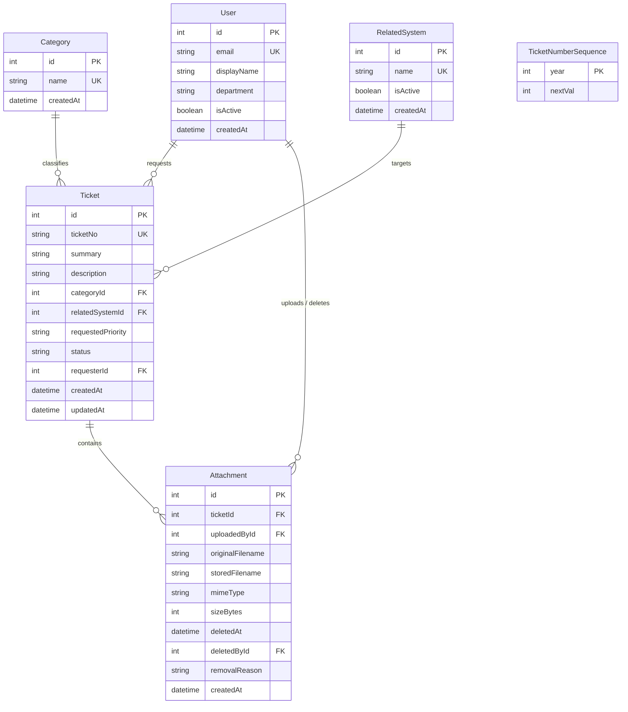

# Lab 2 Sprint Engineering Specification

**Sprint Title**: TokTickIT Requester Ticketing MVP with UI Foundation  
**Document ID**: SPEC-LAB-02  
**Version**: 1.0 (Approved Baseline)  
**Status**: Ready for Implementation  
**Base Branch**: `lab2-staging`  
**Active Working Branch**: `feature/5-spec-and-tests`  
**Reference Traceability**:
* [TokTickIT-System-Level-SDS-v1.0.md](file:///c:/Users/Muhammad%20Asad%20Aziz/Downloads/CPE%20334/toktickit/docs/reference/TokTickIT-System-Level-SDS-v1.0.md) (SDS-SYS-001)
* [Lab_02_labsheet.md](file:///c:/Users/Muhammad%20Asad%20Aziz/Downloads/CPE%20334/toktickit/docs/reference/Lab_02_labsheet.md)
* [docs/lab-02/source-evidence.md](file:///c:/Users/Muhammad%20Asad%20Aziz/Downloads/CPE%20334/toktickit/docs/lab-02/source-evidence.md)
* [docs/lab-02/poc-scope-and-issues.md](file:///c:/Users/Muhammad%20Asad%20Aziz/Downloads/CPE%20334/toktickit/docs/lab-02/poc-scope-and-issues.md)

---

## 1. Sprint Goal
Deliver a professional, accessible, and responsive Requester-facing IT Ticketing Minimum Viable Product (MVP) using a simulated Development Requester context. By the end of Sprint 2, a selected requester can create an IT support ticket with categories, related systems, priorities, and attachments; receive an official system-generated ticket number (`TKT-YYYY-NNNNN`); browse, search, filter, and page through their own ticket history; inspect owned ticket details in a read-only view; and manage supporting attachments (uploading, downloading active binaries, and soft-removing files with a mandatory reason), all built within the cohesive KMUTT IT Service Desk "Zen Green" design language.

---

## 2. Stakeholder Request Interpretation
The IT department requires a self-service ticketing portal for university requesters (students, staff, faculty). Requesters must be able to report IT problems clearly by categorizing the request, specifying the affected system, stating urgency, uploading supporting files, and submitting the request. Once submitted, the system must issue a unique ticket identifier and enable the requester to track their tickets. 

Because formal authentication and password management are scheduled for Lab 3, Lab 2 utilizes a temporary Development Requester selection mechanism to simulate multi-user ownership and test cross-requester data isolation. The interface must adhere to the Zen Green design language and provide reusable layouts, validation feedback, and responsive states that future sprints can build upon.

---

## 3. Scope

### 3.1. Included Scope
1. **Development Requester Context**:
   * Seeded active and inactive users in PostgreSQL.
   * Development Requester Selector modal/screen showing only active users.
   * Global application context tracking active user, display in header, and "Change Requester" switching action.
2. **Ticket Creation**:
   * Create Ticket form capturing Category, Related System, Requested Priority, Summary, Description, and initial Attachments.
   * Transactional backend generation of official Ticket Number (`TKT-YYYY-NNNNN`) with annual sequence reset.
   * Client and server input validation with field-level inline error display and blur validation handling.
   * Busy submitting state and dedicated success confirmation screen.
3. **My Tickets History**:
   * Requester-isolated paginated ticket list (`WHERE requesterId = currentRequesterId`).
   * Free-text search across Summary and Ticket Number.
   * Multi-attribute filtering by Category and Status.
   * Column sorting (Date, Ticket Number, Summary) and bounded pagination (10, 25, 50 items/page).
   * Responsive desktop table and mobile card layout; empty vs. no-results states.
4. **Ticket Detail View**:
   * Read-only presentation of owned ticket metadata.
   * Strict server-side ownership enforcement rejecting unauthorized access attempts.
5. **Attachment Lifecycle**:
   * Attachment upload validation (5MB max per file, 5 active files max, allowed extensions `.jpg`, `.jpeg`, `.png`, `.webp`, `.pdf`).
   * Authenticated download of active file binaries.
   * Soft-removal workflow requiring confirmation and non-empty removal reason, purging binary from storage while retaining database audit metadata and blocking future downloads.
6. **Zen Green UI Foundation**:
   * Comprehensive tokens (`#006B3C`, `#0B7A46`, `#EAF6EF`, `#F5F7F6`, `#1C2826`, `#B3261E`).
   * Responsive layout rules for Desktop ($\ge 992\text{px}$), Tablet ($768 - 991\text{px}$), and Mobile ($< 768\text{px}$).

### 3.2. Explicitly Excluded Scope
* **Real Authentication & Credentials**: Passwords, password hashing (Argon2id), login/logout credentials, session cookies, and CSRF protection (deferred to Lab 3).
* **IT Staff Workflows**: IT Staff user dashboard, queue management, claiming/reassigning tickets, setting IT Priority, or setting ticket status beyond `NEW`.
* **Ticket Lifecycle Beyond Creation**: Resolving, closing, reopening, or cancelling tickets.
* **Ticket Collaboration**: Public Comments, Internal Notes, and Actions Taken.
* **Administration Functions**: Managing users, roles, categories, or system reference tables.

---

## 4. Functional Requirements (FR)

* **FR-01 (Development Requester Context Selection)**: The system shall provide a simulated login screen allowing the user to select an active Development Requester from PostgreSQL. The selected user establishes the testing identity for all subsequent ticket creation, listing, inspection, and attachment operations.
* **FR-02 (Ticket Creation)**: The system shall allow an active Requester to create a support ticket with Category, Related System, Requested Priority, Summary (max 120 chars), Description (min 10 chars), and optional initial Attachments. The backend shall atomically generate a unique Ticket Number and save the ticket in status `NEW`.
* **FR-03 (My Tickets List & Query)**: The system shall provide a paginated list of tickets owned by the active Requester, supporting text search, Category filtering, Status filtering, multi-column sorting, and responsive mobile card display.
* **FR-04 (Requester Ticket Detail Inspection)**: The system shall display all fields of an owned ticket in a read-only layout. Requests for tickets belonging to another requester shall be rejected at the API boundary.
* **FR-05 (Attachment Lifecycle Management)**: The system shall allow adding permitted files to new or existing owned tickets, downloading active binaries, and soft-removing files with a mandatory user-provided reason.

---

## 5. Business Rules (BR)

* **BR-01 (Ticket Number Format)**: Ticket Numbers must strictly match `^TKT-[0-9]{4}-[0-9]{5}$` (e.g. `TKT-2026-00001`). Numbers are generated transactionally on the backend with an annual counter reset. They are immutable and read-only. (*SDS Decision D-10*)
* **BR-02 (Initial Ticket Status)**: Every newly submitted ticket begins in status `NEW`. Requesters cannot set any other status. (*SDS Decision D-02*)
* **BR-03 (Simulated Testing Identity)**: The Development Requester Selector is a testing mechanism, not authentication. Identity is conveyed via `x-requester-id` header/parameters. (*Labsheet §4.2, §4.3*)
* **BR-04 (Ticket Ownership Boundary)**: Requesters can only access tickets where `ticket.requesterId === currentRequesterId`. List queries must strictly enforce this filter server-side. Accessing an unowned ticket ID returns HTTP 403 Forbidden or 404 Not Found. (*SDS p. 10; Labsheet §3*)
* **BR-05 (Read-Only Detail Fields)**: In Sprint 2, all core ticket fields on the Ticket Detail screen are read-only. No status changes, notes, or assignment actions are permitted. (*Labsheet §4.2, §8.5*)
* **BR-06 (Attachment Validation)**: Attachments are restricted to `.jpg`, `.jpeg`, `.png`, `.webp`, and `.pdf`. File size must not exceed **5 MB** ($5,242,880$ bytes). A ticket may have at most **5 active (non-deleted) attachments**. (*SDS p. 14; Labsheet §4.5*)
* **BR-07 (Attachment Soft-Removal)**: Deleting an attachment sets `deletedAt = NOW()`, records `deletedById = currentRequesterId`, and stores a non-empty `removalReason`. The binary file is purged from storage; the database row is retained as a tombstone. (*SDS Decision D-11, p. 14-15*)
* **BR-08 (Attachment Download & Security)**: Removed attachments cannot be downloaded (HTTP 404/410). Active attachment downloads are permitted only if the requester owns the parent ticket. (*SDS p. 14; Labsheet §4.5*)
* **BR-09 (Active User Filtering)**: The Development Requester dropdown must filter `WHERE isActive = true`. Inactive users must never appear in the selector. (*Labsheet §5.3, §8.1*)
* **BR-10 (Blur & Form Validation Placement)**: Format validation on individual fields clears invalid inputs on blur. Form-level error messages appear immediately below the corresponding input upon clicking Submit. Previously entered data is preserved on failure. (*Labsheet §8.3; AGENTS.md §4*)

---

## 6. UI Specification Summary

The full presentation contract is codified in [docs/lab-02/ui-spec.md](file:///c:/Users/Muhammad%20Asad%20Aziz/Downloads/CPE%20334/toktickit/docs/lab-02/ui-spec.md), incorporating all 20 interview decisions (**DR-01** through **DR-20**):

* **Color Palette (Zen Green)**:
  * Primary Green: `#006B3C` (Header, primary buttons, strong accents).
  * Secondary Green: `#0B7A46` (Focus rings, hover states, active tabs).
  * Pale Green: `#EAF6EF` (Table row hover, selection, subtle surfaces).
  * Page Background: `#F5F7F6` (Quiet near-white canvas).
  * Surface: `#FFFFFF` (Card panels and modals).
  * Primary Text: `#1C2826` (Dark charcoal-green, never pure black).
  * Error: `#B3261E` (Inline error labels, invalid borders, required asterisks).
* **Typography & Dimensions**:
  * Base font size: `16px` (`1.0rem`) with system font stack (**DR-01**).
  * Form field vertical spacing: `20px` (`mb-3` + 4px custom) (**DR-02**).
  * Card padding: `24px` desktop / `16px` mobile (**DR-03**).
  * Container max width: `1320px` (`container-xl`) (**DR-04**).
  * Input height: `40px` with `6px` border radius (**DR-05**).
  * Form labels: `16px`, `font-weight: 600` above inputs (**DR-06**).
  * Table row density: Comfortable `py-3 px-3` (~52px height) (**DR-07**).
  * Input focus ring: `#0B7A46` border with 3px halo `rgba(11, 122, 70, 0.20)` (**DR-08**).
* **Interactions & States**:
  * Buttons: Elevation lift + soft shadow on hover (**DR-09**).
  * Mobile navigation: Hamburger toggle with offcanvas drawer (**DR-10**).
  * Tablet layout: Hybrid 2-column classification header with full-width description (**DR-11**).
  * Mobile touch targets: Minimum `48px` tap height on viewports $< 768\text{px}$ (**DR-12**).
  * Validation errors: `13px` `#B3261E` with SVG warning icon below input (**DR-13**).
  * Loading state: Pulsing skeleton shimmer placeholders (**DR-14**).
  * Empty lists: Centered card with icon, title, copy, and CTA button (**DR-15**).
  * Success state: Dedicated confirmation card with copyable ticket number (**DR-16**).
  * Table hover: Pale green `#EAF6EF` row highlight (**DR-17**).
  * Modals: Static dark backdrop `rgba(28, 40, 38, 0.5)` with trapped focus (**DR-18**).
  * Accessibility: 2px solid green focus ring with 2px offset (**DR-19**).
  * Soft-removed attachments: Shaded tombstone box with download button omitted (**DR-20**).

---

## 7. Data Changes (Database Models & Migrations)

Database increments are managed via Prisma ORM 5.22.0 in PostgreSQL:

### Seed Data Requirements
* **Category**: 4 records idempotently seeded ("Account and Access", "Hardware", "Software", "Network").
* **RelatedSystem**: At least 6 records ("Email", "Campus Wi-Fi", "VPN", "LEB2 App", "Grade Submission App", "Printer", "Corporate Laptop").
* **User**: At least 4 active users (e.g., "Sompong IT", "Anong Staff", "Kittisak Student", "Wichai Faculty") and at least 1 inactive user ("Prasert Inactive").

---

## 8. API Contract Summary

The complete REST API specification is detailed in [docs/lab-02/api-spec.md](file:///c:/Users/Muhammad%20Asad%20Aziz/Downloads/CPE%20334/toktickit/docs/lab-02/api-spec.md):

| Method | Path | Summary | Auth / Ownership Check |
| :--- | :--- | :--- | :--- |
| `GET` | `/api/v1/requesters` | List active development requesters | Public (filters `isActive: true`) |
| `GET` | `/api/categories` & `/api/v1/categories` | List active IT request categories | Public |
| `GET` | `/api/v1/related-systems` | List active affected IT systems | Public |
| `POST` | `/api/v1/tickets` | Create new support ticket | Uses active `requesterId` |
| `GET` | `/api/v1/tickets` | List tickets owned by requester (search, filter, sort, page) | Strictly `WHERE requesterId = currentRequesterId` |
| `GET` | `/api/v1/tickets/:id` | Get single owned ticket with attachments | Verifies `ticket.requesterId == currentRequesterId` |
| `POST` | `/api/v1/tickets/:id/attachments` | Upload attachment to ticket | Verifies ticket ownership, 5MB, 5 files max |
| `GET` | `/api/v1/attachments/:id/download` | Download active attachment binary | Verifies ticket ownership & `deletedAt IS NULL` |
| `DELETE` | `/api/v1/attachments/:id` | Soft-remove attachment with reason | Verifies ticket ownership & uploader identity |

---

## 9. Acceptance Criteria (Given-When-Then)

* **AC-01 (Ticket Creation)**: Given an active requester and valid form inputs, when the user clicks Submit, then the backend creates the ticket in status `NEW`, assigns an official Ticket Number matching `^TKT-[0-9]{4}-[0-9]{5}$`, and displays the success confirmation screen.
* **AC-02 (Requester Selection Context)**: Given a user opens the application with no requester selected, when the application loads, then the Development Requester Selector modal is displayed and ticketing screens remain inaccessible until a requester is chosen.
* **AC-03 (Cross-Requester Ticket Isolation)**: Given Requester A and Requester B each have tickets in the database, when Requester A navigates to My Tickets, then only Requester A's tickets appear, and any direct request to fetch Requester B's ticket ID returns HTTP 403 or 404.
* **AC-04 (Read-Only Ticket Detail)**: Given an owned ticket, when the requester opens Ticket Detail, then all ticket header fields are displayed as read-only, preventing client modification.
* **AC-05 (Attachment Validation & Limits)**: Given a file exceeding 5MB or with an unsupported extension (e.g. `.exe`), when the user attempts to upload it, then the application blocks the upload and reports an informative validation error.
* **AC-06 (Attachment Soft-Removal)**: Given an active attachment, when the requester confirms removal with a non-empty reason, then the file binary is deleted from storage, `deletedAt` and `removalReason` are recorded, and downloading that attachment is permanently blocked (HTTP 404/410).
* **AC-07 (Inactive User Exclusion)**: Given seeded users in PostgreSQL, when the requester dropdown loads, then users with `isActive: false` are strictly omitted from the list.
* **AC-08 (Form Validation on Blur & Submit)**: Given invalid field inputs, when the user moves focus away, blur validation clears the invalid format; when Submit is clicked, field-specific red error messages appear directly below the inputs.
* **AC-09 (Responsive Layouts)**: Given the ticketing screens, when viewed at $\ge 992\text{px}$, $768-991\text{px}$, and $< 768\text{px}$, then the layouts adjust cleanly without overlapping elements or horizontal scrolling.

---

## 10. Definition of Done (DoD)

### 10.1. Product Completion Definition
1. All 5 sprint issues (`feature/5-spec-and-tests` through `feature/5-ticket-detail`) implemented and merged into `lab2-staging`.
2. All unit, API integration, and UI component tests pass with zero skipped or failing tests via `npm test`.
3. Conformance to the Zen Green design specification verified across desktop, tablet, and mobile breakpoints.
4. Database migrations applied cleanly from scratch with idempotent seed execution.
5. Cross-requester security verified: unauthorized ticket viewing, listing, and file downloading are rejected.

### 10.2. Course Delivery Definition
1. Commit history on `main` demonstrates staged branch integration: feature branches $\rightarrow$ `lab2-staging` $\rightarrow$ `main`.
2. GitHub Project Kanban board shows all 5 sprint issues moved to `Done` with linked PRs.
3. Peer review documentation (`reviewer.md`) completed with reviewer approvals and author responses.
4. AI reflection report (`ai-use.md`) contains prompt logs and course reflections.
5. Single concise submission PDF prepared following headings "Answer Part 1" through "Answer Part 9".

---

## 11. Assumptions and Approved Decisions

* **PD-01 (Primary Keys)**: Autoincrement integers used for `Category`, `RelatedSystem`, `User`, `Ticket`, and `Attachment`.
* **PD-02 (Identity Transport)**: Active development requester identity passed via `x-requester-id` HTTP header.
* **PD-03 (Storage Adapter)**: Abstracted `AttachmentStorageService` backed by `server/uploads/` local filesystem in dev/test, swappable for SeaweedFS/S3.
* **PD-04 (Sequence Reset)**: `TicketNumberSequence` table managed transactionally for annual sequence resets.
* **PD-05 (API Prefix)**: New endpoints mounted under `/api/v1/*` with `/api/*` aliases for Lab 1 baseline endpoints.
* **DR-01 to DR-20**: UI/UX design tokens and layout decisions codified in Section 6 and `docs/lab-02/ui-spec.md`.
