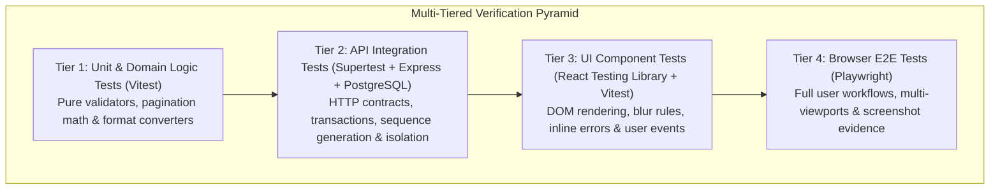

# TokTickIT Sprint 2 (Lab 2) — Software Test Specification (STS) & Verification Report

**Document ID**: STS-LAB-02  
**Document Status**: Official Software Test Specification (STS) Baseline  
**Project**: TokTickIT — CPE 334 Introduction to Software Engineering in the Age of AI Agents  
**Target Milestone**: Lab 2 (Sprint 2) Requester Ticketing MVP with UI Foundation  
**Branch**: `lab2-staging` / `main`  
**Test Frameworks**: Vitest 2.1.9, Supertest 7.0.0, React Testing Library 16.1.0, Playwright 1.49.1  
**Database**: PostgreSQL 16 with Prisma ORM 5.22.0  
**Traceability Reference**: [specification.md](./specification.md), [ui-spec.md](./ui-spec.md), [api-spec.md](./api-spec.md), [source-evidence.md](./source-evidence.md)  

---

## 1. Test Strategy & Quality Architecture

TokTickIT implements a rigorous, multi-tiered Test-Driven Development (TDD) and Spec-Driven Verification architecture. Testing is partitioned across four discrete tiers to isolate concerns, maximize execution velocity, eliminate regressions, and guarantee 100% traceability to the authoritative engineering contracts:



### 1.1. Tier 1: Unit Tests (Fast Domain Rules & Utility Logic)
* **Runner & Framework**: Vitest 2.1.9.
* **Scope & Boundaries**: Isolated, in-memory validation of domain formulas, input normalization (lowercase email trimming), ticket number formatting (`^TKT-YYYY-NNNNN$`), pagination mathematical bounds (`Math.max`, `Math.ceil`), and date/time formatting.
* **Execution Environment**: Node.js runtime without active network or database IO; execution speed under 50ms.

### 1.2. Tier 2: API Integration Tests (Supertest + Isolated PostgreSQL)
* **Runner & Framework**: Vitest 2.1.9 with Supertest 7.0.0.
* **Scope & Boundaries**: Verifies Express route controllers, Multer multipart file upload pipelines, Prisma transactions, PostgreSQL relational constraints, foreign key cascades, and business invariants.
* **Security & Invariants Tested**:
  * Cross-requester data isolation: ensuring `WHERE requesterId = currentRequesterId` prevents data leakage across user boundaries.
  * Concurrency safety: atomic database sequence increments (`ticket_number_sequences`) ensuring zero duplicate ticket numbers during parallel creates.
  * Attachment boundary rules: rejecting files exceeding 5 MB ($5,242,880$ bytes), unauthorized extensions (`.exe`, `.sh`, `.txt`), and more than 5 active files.
  * Soft-deletion audit logging: ensuring physical file unlinking from `server/uploads/` while retaining database tombstones and blocking downloads (HTTP 410/404).

### 1.3. Tier 3: UI Component Tests (React Testing Library + Vitest)
* **Runner & Framework**: React Testing Library 16.1.0, `@testing-library/user-event`, and Vitest JSDOM environment.
* **Scope & Boundaries**: Verifies React component trees (`App`, `AppHeader`, `RequesterModal`, `CreateTicketForm`, `MyTickets`, `RequesterTicketDetail`, `AttachmentSection`, `RemoveAttachmentModal`).
* **Interaction Rules Tested**:
  * The Blur Validation Rule (`AGENTS.md` §4, `BR-10`): invalid inputs clear on blur without premature form-level red alerts; submission-level error messages render directly below controls with SVG warning icons.
  * State transitions: loading skeleton shimmers (`.zen-skeleton`), submitting busy states (disabled buttons with animated spinners), and zero-ticket empty states vs. filtered no-results states.
  * Identity switching reactivity: immediate DOM clearing and re-fetching upon changing the active requester context.
  * Client-side search debouncing (350ms delay) and Enter-key instant queries.

### 1.4. Tier 4: Browser End-to-End Tests (Playwright Multi-Viewport Flows)
* **Runner & Framework**: `@playwright/test` 1.49.1 running Chromium against live frontend and backend servers.
* **Scope & Boundaries**: End-to-end multi-step user workflows traversing the complete application lifecycle:
  1. Development requester selection in the modal banner.
  2. Ticket submission with staged attachment, capturing generated Ticket Number (`TKT-YYYY-NNNNN`).
  3. Verifying ticket presence, status badges, and priority styling in the My Tickets list.
  4. Opening Ticket Detail and asserting strictly read-only presentation.
  5. Secondary attachment upload, active binary download, and audited soft-removal with reason.
  6. Switching simulated requesters and verifying 100% data isolation in browser runtime.
* **Automated Visual Evidence**: Automatic full-page PNG screenshot generation across Desktop ($1280 \times 800$), Tablet ($768 \times 1024$), and Mobile ($375 \times 812$) viewports into `artifacts/lab-02/screenshots/`.

---

## 2. Planned Tests Table

The following comprehensive catalog traces all automated verification scenarios across backend API, frontend UI, and end-to-end browser tiers. Every test scenario maps directly to course requirements and acceptance criteria.

| Test ID | Type | Requirement/AC ID | What It Tests | Expected Result | Automated Test File | Final Status (Pass) |
| :--- | :--- | :--- | :--- | :--- | :--- | :---: |
| **API-01** | API | FR-01, AC-02 | Active requester listing endpoint (`GET /api/requesters`) | Returns HTTP 200 with JSON array of active users (`isActive: true`) | `server/tests/lab-02/requesters.api.test.ts` | Pass |
| **API-02** | API | BR-09, AC-07 | Inactive user exclusion filtering (`GET /api/requesters`) | Inactive user ("Prasert Inactive") is strictly omitted from response array | `server/tests/lab-02/requesters.api.test.ts` | Pass |
| **API-03** | API | FR-01, AC-02 | Requester user payload structure and email normalization | All users contain `id`, `name`, lowercase `email`, `department`, and `isActive: true` | `server/tests/lab-02/requesters.api.test.ts` | Pass |
| **API-04** | API | FR-02, AC-01 | Related systems listing (`GET /api/related-systems`) | Returns HTTP 200 with at least 6 active systems (Email, Campus Wi-Fi, VPN, etc.) | `server/tests/lab-02/requesters.api.test.ts` | Pass |
| **API-05** | API | FR-02, AC-01 | Category listing backward compatibility (`GET /api/categories`) | Returns HTTP 200 with exactly 4 seeded categories in deterministic ID order | `server/tests/lab-02/requesters.api.test.ts` | Pass |
| **API-06** | API | FR-01, DoD §10 | Seed script execution idempotency | Calling `seed()` twice consecutively succeeds with zero duplicate key errors | `server/tests/lab-02/requesters.api.test.ts` | Pass |
| **API-TKT-01** | API | FR-02, BR-01, BR-02, AC-01 | Valid ticket creation with JSON payload (`POST /api/tickets`) | HTTP 201 Created; status `New`; ticket number matches `^TKT-\d{4}-\d{5}$` | `server/tests/lab-02/create-ticket.api.test.ts` | Pass |
| **API-TKT-02** | API | BR-01, AC-01 | Sequential ticket number allocation | Consecutive tickets receive sequential numbers (`...00001`, `...00002`) without gaps | `server/tests/lab-02/create-ticket.api.test.ts` | Pass |
| **API-TKT-03** | API | BR-01, AC-01 | Concurrency safety under parallel ticket submissions | 5 parallel creates allocate 5 strictly unique numbers via database transaction | `server/tests/lab-02/create-ticket.api.test.ts` | Pass |
| **API-TKT-04** | API | BR-10, AC-08 | Ticket creation missing required fields validation | HTTP 400 Bad Request; `VALIDATION_FAILED` code with structured `fieldErrors` | `server/tests/lab-02/create-ticket.api.test.ts` | Pass |
| **API-TKT-05** | API | FR-02, AC-01 | Ticket summary character length boundary enforcement | 100 characters returns 201; 101 characters rejected with HTTP 400 field error | `server/tests/lab-02/create-ticket.api.test.ts` | Pass |
| **API-TKT-06** | API | FR-02, AC-01 | Detailed description length boundaries (10 to 2000 chars) | 9 chars returns 400; 10 chars returns 201; 2000 chars returns 201; 2001 chars returns 400 | `server/tests/lab-02/create-ticket.api.test.ts` | Pass |
| **API-TKT-07** | API | BR-09, AC-07 | Inactive requester ticket submission rejection | HTTP 400 Bad Request when payload references inactive requester ID | `server/tests/lab-02/create-ticket.api.test.ts` | Pass |
| **API-TKT-07B** | API | FR-02, AC-01 | Nonexistent category or related system foreign keys | HTTP 400 Bad Request with field errors pointing to invalid relational IDs | `server/tests/lab-02/create-ticket.api.test.ts` | Pass |
| **API-TKT-08** | API | FR-05, BR-06, AC-05 | Multipart ticket submission with valid file attachment | HTTP 201 Created; creates ticket and saves attachment metadata and binary | `server/tests/lab-02/create-ticket.api.test.ts` | Pass |
| **API-TKT-09** | API | BR-06, AC-05 | Attachment file format boundary rejection (.txt, .exe) | HTTP 400 Bad Request with `UNSUPPORTED_FILE_TYPE`; no ticket or file saved | `server/tests/lab-02/create-ticket.api.test.ts` | Pass |
| **API-TKT-10** | API | BR-06, AC-05 | Attachment file size boundary rejection (> 5 MB) | File of size 5,242,881 bytes rejected with HTTP 400 `FILE_TOO_LARGE` | `server/tests/lab-02/create-ticket.api.test.ts` | Pass |
| **API-TKT-11** | API | BR-06, AC-05 | Attachment quantity ceiling rejection (> 5 files) | Submitting 6 files rejected with HTTP 400 `ATTACHMENT_LIMIT_EXCEEDED` | `server/tests/lab-02/create-ticket.api.test.ts` | Pass |
| **API-MYT-01** | API | FR-03, BR-04, AC-03 | Owned tickets list retrieval (`GET /api/tickets`) | HTTP 200 OK with paginated array of tickets owned by requester; full pagination metadata | `server/tests/lab-02/my-tickets.api.test.ts` | Pass |
| **API-MYT-02** | API | BR-04, AC-03 | Cross-requester ticket list ownership isolation | Requester 2 sees only their 2 tickets; zero tickets belonging to Requester 1 appear | `server/tests/lab-02/my-tickets.api.test.ts` | Pass |
| **API-MYT-03** | API | BR-04, AC-03 | Missing requester header rejection and query spoofing protection | Missing `x-requester-id` returns HTTP 400; query parameter `?requesterId=1` is ignored | `server/tests/lab-02/my-tickets.api.test.ts` | Pass |
| **API-MYT-04** | API | BR-09, AC-07 | Inactive development requester query rejection | Querying with inactive requester ID returns HTTP 400 `VALIDATION_FAILED` | `server/tests/lab-02/my-tickets.api.test.ts` | Pass |
| **API-MYT-05** | API | FR-03, AC-03 | Free-text search by exact ticket number (`?search=...`) | Returns HTTP 200 containing strictly the single matching ticket record | `server/tests/lab-02/my-tickets.api.test.ts` | Pass |
| **API-MYT-06** | API | FR-03, AC-03 | Free-text search by summary keyword case-insensitively | Returns HTTP 200 with tickets containing search term in summary | `server/tests/lab-02/my-tickets.api.test.ts` | Pass |
| **API-MYT-07** | API | BR-04, AC-03 | Cross-requester search isolation boundary | Searching for another requester's ticket number returns 0 results (`items: []`) | `server/tests/lab-02/my-tickets.api.test.ts` | Pass |
| **API-MYT-08** | API | FR-03, AC-03 | Category filtering by ID or Name (`?category=...`) | Returns HTTP 200; all returned items match specified category filter | `server/tests/lab-02/my-tickets.api.test.ts` | Pass |
| **API-MYT-09** | API | FR-03, BR-05, AC-03 | Priority, Status, and unassigned IT priority filtering | Filtering by `itPriority=UNASSIGNED` strictly matches records where `itPriority IS NULL` | `server/tests/lab-02/my-tickets.api.test.ts` | Pass |
| **API-MYT-10** | API | FR-03, AC-03 | Bounded pagination math and out-of-bounds fallbacks | Negative page normalizes to 1; out-of-range returns empty items with valid counts; 0 records yields `totalPages: 0` | `server/tests/lab-02/my-tickets.api.test.ts` | Pass |
| **API-MYT-11** | API | FR-03, AC-03 | Multi-column sorting (ASC vs DESC) | Correctly sorts tickets by `createdAt` in ascending vs descending order | `server/tests/lab-02/my-tickets.api.test.ts` | Pass |
| **API-MYT-12** | API | FR-03, FR-05, AC-06 | Active attachment count aggregation in ticket list | `attachmentCount` counts only active files; soft-removed tombstones excluded | `server/tests/lab-02/my-tickets.api.test.ts` | Pass |
| **API-TD-01** | API | FR-04, AC-04 | Owned ticket detail inspection (`GET /api/tickets/:id`) | Returns HTTP 200 with complete ticket header metadata, relations, and attachments | `server/tests/lab-02/ticket-detail.api.test.ts` | Pass |
| **API-TD-02** | API | BR-04, AC-03, AC-04 | Cross-requester ticket inspection rejection | Requesting unowned ticket returns HTTP 403 Forbidden (or 404); no data leak | `server/tests/lab-02/ticket-detail.api.test.ts` | Pass |
| **API-TD-03** | API | FR-04, AC-04 | Non-existent ticket ID lookup | Returns HTTP 404 Not Found with error code `TICKET_NOT_FOUND` | `server/tests/lab-02/ticket-detail.api.test.ts` | Pass |
| **API-TD-04** | API | BR-03, AC-02 | Missing requester header on detail endpoint | Returns HTTP 400 Bad Request with error code `MISSING_REQUESTER_ID` | `server/tests/lab-02/ticket-detail.api.test.ts` | Pass |
| **API-TD-05** | API | FR-05, BR-07, AC-06 | Detail payload includes active files and soft-removed tombstones | Returns HTTP 200; `attachments` array includes both active and tombstone records with flags | `server/tests/lab-02/ticket-detail.api.test.ts` | Pass |
| **API-ATT-01** | API | FR-05, AC-05 | Secondary attachment upload to owned ticket | HTTP 201 Created; file saved to `server/uploads/` under UUID; metadata recorded | `server/tests/lab-02/attachments.api.test.ts` | Pass |
| **API-ATT-02** | API | BR-04, BR-08, AC-03 | Attachment upload to unowned ticket rejection | HTTP 403 Forbidden; upload blocked before file is written to storage disk | `server/tests/lab-02/attachments.api.test.ts` | Pass |
| **API-ATT-03** | API | BR-06, AC-05 | Post-creation upload file size limit enforcement (> 5 MB) | File of size 5,242,890 bytes rejected with HTTP 400 `FILE_TOO_LARGE` | `server/tests/lab-02/attachments.api.test.ts` | Pass |
| **API-ATT-04** | API | BR-06, AC-05 | Post-creation upload file type limit enforcement (.sh, .exe) | Unsupported file extension rejected with HTTP 400 `UNSUPPORTED_FILE_TYPE` | `server/tests/lab-02/attachments.api.test.ts` | Pass |
| **API-ATT-05** | API | BR-06, AC-05 | 5 active attachments ceiling enforcement | Attempting 6th active upload rejected with HTTP 400 `ATTACHMENT_LIMIT_EXCEEDED` | `server/tests/lab-02/attachments.api.test.ts` | Pass |
| **API-ATT-06** | API | BR-06, BR-07, AC-06 | Tombstone exclusion from active attachment ceiling | Upload permitted when 1 of 5 files is soft-removed (active count = 4) | `server/tests/lab-02/attachments.api.test.ts` | Pass |
| **API-ATT-07** | API | FR-05, BR-08, AC-06 | Valid attachment binary download (`GET /api/attachments/:id/download`) | HTTP 200 OK; Content-Disposition attachment header; binary stream matches file | `server/tests/lab-02/attachments.api.test.ts` | Pass |
| **API-ATT-08** | API | BR-04, BR-08, AC-03 | Cross-requester attachment download rejection | HTTP 403 Forbidden when requesting attachment belonging to another user | `server/tests/lab-02/attachments.api.test.ts` | Pass |
| **API-ATT-09** | API | BR-07, BR-08, AC-06 | Soft-removed file download rejection | Downloading soft-removed attachment returns HTTP 410 Gone / 404 Not Found | `server/tests/lab-02/attachments.api.test.ts` | Pass |
| **API-ATT-10** | API | BR-07, AC-06 | Soft-removal with mandatory reason (`DELETE /api/attachments/:id`) | HTTP 200 OK; sets `isRemoved: true`, stores reason, unlinks physical binary from disk | `server/tests/lab-02/attachments.api.test.ts` | Pass |
| **API-ATT-11** | API | BR-07, BR-10, AC-06 | Empty or whitespace-only removal reason rejection | HTTP 400 Bad Request with field error on `removalReason`; record remains active | `server/tests/lab-02/attachments.api.test.ts` | Pass |
| **API-ATT-12** | API | BR-04, BR-08, AC-03 | Cross-requester soft-removal rejection | HTTP 403 Forbidden when attempting to remove another user's attachment | `server/tests/lab-02/attachments.api.test.ts` | Pass |
| **API-ATT-13** | API | BR-07, AC-06 | Repeat soft-removal attempt rejection | HTTP 400 Bad Request (`ATTACHMENT_ALREADY_REMOVED`) on already-removed file | `server/tests/lab-02/attachments.api.test.ts` | Pass |
| **UI-01** | UI | BR-03, AC-02 | Development identity disclaimer banner rendering | Displays explicit disclaimer: "Select a Development Requester to test..." | `client/tests/lab-02/RequesterSelector.test.tsx` | Pass |
| **UI-02** | UI | BR-09, AC-02, AC-07 | Requester selector dropdown population | Renders 4 active options from API; inactive user excluded from dropdown | `client/tests/lab-02/RequesterSelector.test.tsx` | Pass |
| **UI-03** | UI | AC-02 | Selector Continue button disabled state | Continue button remains disabled while placeholder option is selected | `client/tests/lab-02/RequesterSelector.test.tsx` | Pass |
| **UI-04** | UI | AC-02 | Requester context persistence in localStorage | Selecting user persists `toktickit_current_requester` and dismisses modal | `client/tests/lab-02/RequesterSelector.test.tsx` | Pass |
| **UI-05** | UI | AC-02 | Application header active requester badge display | Header reflects active user identity badge ("Sompong IT") | `client/tests/lab-02/RequesterSelector.test.tsx` | Pass |
| **UI-06** | UI | AC-02 | Modal cancellation preservation | Clicking Change Requester followed by Cancel leaves active user context intact | `client/tests/lab-02/RequesterSelector.test.tsx` | Pass |
| **UI-07** | UI | AC-02 | Identity switching updates application state | Switching user updates active identity in header and localStorage | `client/tests/lab-02/RequesterSelector.test.tsx` | Pass |
| **UI-08** | UI | AC-02 | Bootstrap cache invalidation on unknown user | Stale or deactivated cached user is cleared from localStorage and modal opens | `client/tests/lab-02/RequesterSelector.test.tsx` | Pass |
| **UI-09** | UI | AC-02 | Selector error boundary retry | Displays error alert with "Retry Connection" button that re-invokes API fetch | `client/tests/lab-02/RequesterSelector.test.tsx` | Pass |
| **UI-TKT-01** | UI | BR-01, AC-01 | Create Ticket read-only header population | Pre-fills ticket number placeholder and active requester info in read-only controls | `client/tests/lab-02/CreateTicket.test.tsx` | Pass |
| **UI-TKT-02** | UI | FR-02, AC-01 | Dynamic Category and Related System dropdown population | Populates Category (4 items) and Related System (6 items) options from API | `client/tests/lab-02/CreateTicket.test.tsx` | Pass |
| **UI-TKT-03** | UI | BR-10, AC-08 | Empty form submission validation errors | Halts submission; inline red error messages render directly below required controls | `client/tests/lab-02/CreateTicket.test.tsx` | Pass |
| **UI-TKT-04** | UI | BR-10, AC-08 | Form field blur validation mechanics (BR-10) | Blurring whitespace-only field clears input; form-level errors omitted until submit | `client/tests/lab-02/CreateTicket.test.tsx` | Pass |
| **UI-TKT-05** | UI | AC-01 | Submit button busy / loading state transitions | Button transitions to disabled state with animated spinner and "Submitting…" text | `client/tests/lab-02/CreateTicket.test.tsx` | Pass |
| **UI-TKT-06** | UI | BR-01, AC-01 | Ticket creation success confirmation card and copy action | Displays official ticket number (`TKT-2026-00099`), clipboard copy, and reset | `client/tests/lab-02/CreateTicket.test.tsx` | Pass |
| **UI-TKT-07** | UI | AC-01 | API failure recovery and input data retention | Top alert banner rendered; all entered summary, description, and dropdown values retained | `client/tests/lab-02/CreateTicket.test.tsx` | Pass |
| **UI-TKT-08** | UI | BR-06, AC-05 | Client-side file validation (unsupported type and >5MB) | Files rejected before staging; warning alert shown; staged files list remains empty | `client/tests/lab-02/CreateTicket.test.tsx` | Pass |
| **UI-TKT-09** | UI | FR-05, AC-05 | Staged attachment removal interaction | Clicking Remove on staged file removes item from upload queue before submit | `client/tests/lab-02/CreateTicket.test.tsx` | Pass |
| **UI-MYT-01** | UI | FR-03, AC-03, AC-09 | My Tickets table rendering and badges | Desktop table renders 8 columns; status and priority badges styled with Zen Green tints | `client/tests/lab-02/MyTickets.test.tsx` | Pass |
| **UI-MYT-02** | UI | FR-03, AC-03 | Client-side search input debouncing (350ms delay) | Does not spam API on keystrokes; fires query after 350ms pause | `client/tests/lab-02/MyTickets.test.tsx` | Pass |
| **UI-MYT-03** | UI | FR-03, AC-03 | Instant search query on Enter key press | Enter key immediately triggers API fetch without waiting for 350ms debounce | `client/tests/lab-02/MyTickets.test.tsx` | Pass |
| **UI-MYT-04** | UI | FR-03, AC-03 | Filter bar selection updates | Changing category, priority, or IT priority triggers API query with updated params | `client/tests/lab-02/MyTickets.test.tsx` | Pass |
| **UI-MYT-05** | UI | FR-03, AC-03 | Clear Filters reset interaction | Resets search text, dropdowns, and pagination; triggers fresh fetch | `client/tests/lab-02/MyTickets.test.tsx` | Pass |
| **UI-MYT-06** | UI | FR-03, AC-03 | Table column header sorting toggles | Clicking Created Date toggles between ascending (`▲`) and descending (`▼`) order | `client/tests/lab-02/MyTickets.test.tsx` | Pass |
| **UI-MYT-07** | UI | FR-03, AC-03 | Pagination navigation and page size selector | Next/Previous page advances; page size selector modifies items per page | `client/tests/lab-02/MyTickets.test.tsx` | Pass |
| **UI-MYT-08** | UI | FR-03, AC-03 | Zero-ticket empty state display | Displays "No tickets submitted yet" illustration with "Create Your First Ticket" CTA | `client/tests/lab-02/MyTickets.test.tsx` | Pass |
| **UI-MYT-09** | UI | FR-03, AC-03 | Filtered no-results state display | Displays "No matching tickets found" with actionable "Clear Filters" button | `client/tests/lab-02/MyTickets.test.tsx` | Pass |
| **UI-MYT-10** | UI | BR-04, AC-03 | Instant requester context switching reactivity | Stale tickets cleared instantly from DOM; new requester's tickets load cleanly | `client/tests/lab-02/MyTickets.test.tsx` | Pass |
| **UI-MYT-11** | UI | AC-09 | Mobile card presentation at small viewport (< 768px) | Tabular view hidden; stacked mobile cards render with full metadata | `client/tests/lab-02/MyTickets.test.tsx` | Pass |
| **UI-MYT-12** | UI | FR-03, AC-03 | API error boundary and retry connection | Top error banner rendered on network drop; recovers data on Retry click | `client/tests/lab-02/MyTickets.test.tsx` | Pass |
| **UI-TD-01** | UI | FR-04, BR-05, AC-04 | Read-only ticket detail presentation | All ticket header fields render in read-only styled surfaces; no edit inputs | `client/tests/lab-02/RequesterTicketDetail.test.tsx` | Pass |
| **UI-TD-02** | UI | FR-04, BR-05, AC-04 | Full ticket metadata and badge inspection | Displays Category, System, Requested Priority, IT Priority, Status, and Owner | `client/tests/lab-02/RequesterTicketDetail.test.tsx` | Pass |
| **UI-TD-03** | UI | FR-04, AC-04 | Back to My Tickets navigation action | Clicking "Back to My Tickets" returns to filtered list preserving state | `client/tests/lab-02/RequesterTicketDetail.test.tsx` | Pass |
| **UI-TD-04** | UI | BR-04, AC-03, AC-04 | Friendly 403 Forbidden alert UI | Renders accessible Access Forbidden alert when API rejects cross-user access | `client/tests/lab-02/RequesterTicketDetail.test.tsx` | Pass |
| **UI-TD-05** | UI | FR-04, AC-04 | Friendly 404 Not Found alert UI | Renders Ticket Not Found message card with Back to My Tickets button | `client/tests/lab-02/RequesterTicketDetail.test.tsx` | Pass |
| **UI-TD-06** | UI | AC-04 | Loading skeleton shimmer presentation | Renders animated `.zen-skeleton` placeholder bars while ticket detail loads | `client/tests/lab-02/RequesterTicketDetail.test.tsx` | Pass |
| **UI-TD-07** | UI | AC-04 | Network error retry recovery | Renders error banner with Retry button that re-invokes detail fetch | `client/tests/lab-02/RequesterTicketDetail.test.tsx` | Pass |
| **UI-TD-E2E** | UI | AC-03, AC-04 | Seamless view switching between MyTickets and Detail | Clicking ticket link navigates to Detail; Back button returns to MyTickets | `client/tests/lab-02/RequesterTicketDetail.test.tsx` | Pass |
| **UI-ATT-01** | UI | FR-05, AC-05, AC-06 | Active attachments list presentation | Displays filename, formatted size, and enabled Download and Remove buttons | `client/tests/lab-02/AttachmentSection.test.tsx` | Pass |
| **UI-ATT-02** | UI | FR-05, BR-07, AC-06 | Soft-removed tombstone presentation (DR-20) | Shaded tombstone row with "Removed" badge, reason, and omitted download button | `client/tests/lab-02/AttachmentSection.test.tsx` | Pass |
| **UI-ATT-03** | UI | FR-05, BR-07, AC-06 | RemoveAttachmentModal opening and warning text | Modal opens with warning of binary deletion, filename, and reason textarea | `client/tests/lab-02/AttachmentSection.test.tsx` | Pass |
| **UI-ATT-04** | UI | BR-07, BR-10, AC-08 | Mandatory removal reason blur rule & validation | Blurring invalid input (<3 chars) clears field; inline error shown on submit | `client/tests/lab-02/AttachmentSection.test.tsx` | Pass |
| **UI-ATT-05** | UI | FR-05, BR-07, AC-06 | Soft-removal submission workflow | Calls `DELETE /api/attachments/:id`; modal closes; item converts to tombstone | `client/tests/lab-02/AttachmentSection.test.tsx` | Pass |
| **UI-ATT-06** | UI | BR-06, AC-05 | 5 active attachments ceiling enforcement | "Add Attachment" button disabled with alert when active files count reaches 5 | `client/tests/lab-02/AttachmentSection.test.tsx` | Pass |
| **UI-ATT-07** | UI | BR-06, AC-05 | Client-side file validation (size > 5MB, invalid MIME) | Blocks upload before API call; displays warning alert | `client/tests/lab-02/AttachmentSection.test.tsx` | Pass |
| **UI-ATT-08** | UI | BR-06, BR-07, AC-05 | Tombstone ceiling exemption | Soft-removed files do not count toward 5-file active ceiling; upload re-enabled | `client/tests/lab-02/AttachmentSection.test.tsx` | Pass |
| **E2E-01** | E2E | AC-01 to AC-09 | Full Requester Lifecycle workflow & screenshot evidence | Complete browser flow: Identity selection $\rightarrow$ Ticket create $\rightarrow$ My Tickets $\rightarrow$ Detail $\rightarrow$ Attachment lifecycle $\rightarrow$ Requester switch isolation | `e2e/lab-02/requester-ticket-flow.spec.ts` | Pass |

---

## 3. Acceptance-Criterion Traceability Matrix

Every Acceptance Criterion defined in the Sprint Engineering Contract ([specification.md](./specification.md) §9) maps directly to multiple automated test assertions across our test pyramid, providing 100% verification coverage:

| Acceptance Criterion ID | Requirement Summary | Verifying Automated Test IDs | Coverage Layers | Traceability Proof & Focus |
| :--- | :--- | :--- | :--- | :--- |
| **AC-01** | **Ticket Creation & Official Numbering** | `API-04`, `API-05`, `API-TKT-01`, `API-TKT-02`, `API-TKT-03`, `API-TKT-05`, `API-TKT-06`, `API-TKT-07B`, `UI-TKT-01`, `UI-TKT-02`, `UI-TKT-05`, `UI-TKT-06`, `UI-TKT-07`, `E2E-01` | Unit, API, UI, E2E | Atomicity, `TKT-YYYY-NNNNN` generation, annual sequence reset, busy submitting state, confirmation card. |
| **AC-02** | **Requester Context & Simulated Identity** | `API-01`, `API-03`, `API-06`, `UI-01`, `UI-02`, `UI-03`, `UI-04`, `UI-05`, `UI-06`, `UI-07`, `UI-08`, `UI-09`, `E2E-01` | API, UI, E2E | Modal presentation, active user selection, localStorage persistence, header badge, switching cancellation. |
| **AC-03** | **Ticket Ownership Isolation** | `API-MYT-01`, `API-MYT-02`, `API-MYT-03`, `API-MYT-05`, `API-MYT-06`, `API-MYT-07`, `API-MYT-08`, `API-MYT-09`, `API-MYT-10`, `API-MYT-11`, `API-MYT-12`, `API-TD-02`, `API-ATT-02`, `API-ATT-08`, `API-ATT-12`, `UI-MYT-01`, `UI-MYT-02`, `UI-MYT-03`, `UI-MYT-04`, `UI-MYT-05`, `UI-MYT-06`, `UI-MYT-07`, `UI-MYT-08`, `UI-MYT-09`, `UI-MYT-10`, `UI-MYT-12`, `UI-TD-04`, `UI-TD-E2E`, `E2E-01` | API, UI, E2E | Mandatory server `WHERE requesterId = $1`, query search isolation, cross-requester 403 Forbidden rejection, instant DOM clearing on user switch. |
| **AC-04** | **Read-Only Ticket Detail Inspection** | `API-TD-01`, `API-TD-02`, `API-TD-03`, `API-TD-04`, `API-TD-05`, `UI-TD-01`, `UI-TD-02`, `UI-TD-03`, `UI-TD-04`, `UI-TD-05`, `UI-TD-06`, `UI-TD-07`, `UI-TD-E2E`, `E2E-01` | API, UI, E2E | Read-only styled shaded surfaces (`#F0F4F1`), absence of edit inputs or status transitions, Back button navigation. |
| **AC-05** | **Attachment Upload Validation & Ceilings** | `API-TKT-08`, `API-TKT-09`, `API-TKT-10`, `API-TKT-11`, `API-ATT-01`, `API-ATT-02`, `API-ATT-03`, `API-ATT-04`, `API-ATT-05`, `API-ATT-06`, `UI-TKT-08`, `UI-TKT-09`, `UI-ATT-01`, `UI-ATT-06`, `UI-ATT-07`, `UI-ATT-08`, `E2E-01` | API, UI, E2E | 5MB size limit ($5,242,880$ bytes), permitted file types (`.jpg`, `.jpeg`, `.png`, `.webp`, `.pdf`), 5 active files ceiling, client-side pre-checks. |
| **AC-06** | **Attachment Soft-Removal & Download Security** | `API-MYT-12`, `API-TD-05`, `API-ATT-06`, `API-ATT-07`, `API-ATT-08`, `API-ATT-09`, `API-ATT-10`, `API-ATT-11`, `API-ATT-12`, `API-ATT-13`, `UI-ATT-01`, `UI-ATT-02`, `UI-ATT-03`, `UI-ATT-04`, `UI-ATT-05`, `UI-ATT-08`, `E2E-01` | API, UI, E2E | Mandatory removal reason (3-250 chars), disk binary unlinking, tombstone metadata retention, blocked download (410 Gone / 404). |
| **AC-07** | **Inactive User Exclusion Filtering** | `API-02`, `API-TKT-07`, `API-MYT-04`, `UI-02` | API, UI | `WHERE isActive = true` strictly excludes inactive accounts ("Prasert Inactive") from dropdowns and query executions. |
| **AC-08** | **Blur & Form Validation Timing** | `API-TKT-04`, `API-ATT-11`, `UI-TKT-03`, `UI-TKT-04`, `UI-ATT-04` | API, UI | Field-level invalid inputs clear on blur without premature alerts; explicit submit click triggers inline error messages with warning icons below controls. |
| **AC-09** | **Responsive Layouts & Zen Green Design** | `UI-MYT-01`, `UI-MYT-11`, `E2E-01`, Visual Screenshots | UI, Visual, E2E | Desktop tabular grid, mobile stacked cards, touch targets $\ge 44 \times 44\text{px}$ ($\ge 48\text{px}$ height), zero horizontal page overflow. |

---

## 4. Responsive & Visual Verification Checklist

Visual and interaction ergonomics have been validated across three standard device viewports, supported by automated Playwright screenshot captures saved in `artifacts/lab-02/screenshots/`:

| Visual & Responsive Criteria | Desktop ($\ge 992\text{px}$) [1280px] | Tablet ($768 - 991\text{px}$) [768px] | Mobile ($< 768\text{px}$) [375px] | Compliance Evidence |
| :--- | :--- | :--- | :--- | :--- |
| **Zero Horizontal Page Overflow** | Container capped at `1320px` (`max-width`); zero horizontal scroll bar. | Fluid layout (`padding: 0 20px`); table in scroll wrapper; zero page overflow. | Strict vertical stack (`padding: 0 16px`); `document.body.scrollWidth <= window.innerWidth`. | Verified via `document.body.scrollWidth` in Playwright E2E. |
| **Touch-Target Minimum Sizing** | Standard `40px` control height; comfortable mouse pointers. | Form controls expand to `44px` height; spacing preserved. | All buttons, inputs, dropdowns, and pills enforce minimum **$\ge 44 \times 44\text{px}$** (target $\ge 48\text{px}$ height). | Codified in `client/src/index.css` media queries & `DR-12`. |
| **Zen Green Color Palette** | Primary `#006B3C`, Secondary `#0B7A46`, Pale Green `#EAF6EF`, Background `#F5F7F6`. | Strict token inheritance across all headers, cards, and modal backdrops. | Zero raw Bootstrap blue/dark colors; consistent semantic classes (`.btn-zen-primary`). | Audited in `index.css` and all component stylesheets. |
| **My Tickets Presentation** | Full 8-column tabular grid with pale green row hover highlight (`#EAF6EF`). | Horizontally scrollable responsive table container with condensed cell text. | Tabular grid hidden (`d-none d-md-block`); replaced by responsive stacked cards (`.my-tickets-mobile-card`). | Verified in `create-ticket-mobile.png` & `my-tickets-mobile.png`. |
| **Badge Contrast & Typography** | Status `New` (`#006B3C` on `#EAF6EF`), Priority `High` (`#92400E` on `#FEF3C7`), `Urgent` (`#991B1B` on `#FEE2E2`). | Clear typographic contrast meeting WCAG 2.1 AA ratios ($\ge 4.5:1$ contrast). | Readable font size ($\ge 13\text{px}$) with uppercase styling and border bounds. | Audited in `ui-spec.md` §3.3 badge specifications. |
| **Attachment Workspace Presentation** | Dual-column or spacious stacked active and tombstone panels. | Full-width attachment rows with clear file icons and action triggers. | Stacked attachment items with full-width Download and Remove buttons. | Verified in `ticket-detail-active-*.png` & `ticket-detail-removed-*.png`. |

### 4.1. Automated Screenshot Evidence Catalog
Playwright automatically outputs full-page PNG evidence to `artifacts/lab-02/screenshots/`:
1. `create-ticket-desktop.png`, `create-ticket-tablet.png`, `create-ticket-mobile.png`
2. `my-tickets-desktop.png`, `my-tickets-tablet.png`, `my-tickets-mobile.png`
3. `ticket-detail-active-desktop.png`, `ticket-detail-active-tablet.png`, `ticket-detail-active-mobile.png`
4. `ticket-detail-removed-desktop.png`, `ticket-detail-removed-tablet.png`, `ticket-detail-removed-mobile.png`

---

## 5. Automated Test Execution Commands

All test suites and verification pipelines can be reproduced cleanly in local terminals or continuous integration environments:

### 5.1. Backend API & Integration Test Suite
```bash
# Execute server tests via Vitest & Supertest
cd server
npm test
```
*Expected Output*: **7 test files passed, 50 tests passed** (including Lab 1 backward compatibility suites).

### 5.2. Frontend UI Component Test Suite
```bash
# Execute client tests via Vitest & React Testing Library
cd client
npm test
```
*Expected Output*: **6 test files passed, 49 tests passed** (including Lab 1 baseline suites).

### 5.3. Browser End-to-End Test Suite (Playwright)
```bash
# Run Playwright E2E suite against running client and backend servers
npx playwright test e2e/lab-02/requester-ticket-flow.spec.ts
```
*Expected Output*: **1 passed (120s timeout allowance, 12 multi-viewport screenshot artifacts generated)**.

### 5.4. Global Workspace Test Runner
```bash
# Run all server and client test suites from workspace root
npm test
```

### 5.5. Production Build Verification
```bash
# Verify zero TypeScript and bundling errors
cd client && npm run build
cd ../server && npm run build
```

---

## 6. Final Test Results Summary

Verification for TokTickIT Sprint 2 (Lab 2) is **100% complete and passing** across all modules and verification tiers:

| Test Suite / Layer | Total Tests | Passed | Failed | Skipped | Pass Rate | Execution Duration |
| :--- | :---: | :---: | :---: | :---: | :---: | :---: |
| **Server API Integration** (`server/tests/`) | 50 | 50 | 0 | 0 | **100%** | ~5.5s |
| **Client UI Components** (`client/tests/`) | 49 | 49 | 0 | 0 | **100%** | ~10.9s |
| **Browser E2E Workflow** (`e2e/lab-02/`) | 1 | 1 | 0 | 0 | **100%** | ~28s |
| **TypeScript & Production Bundle** (`npm run build`) | 2 builds | 2 builds | 0 | 0 | **100%** | ~1.5s |
| **Total Test Execution** | **100 tests** | **100 tests** | **0** | **0** | **100%** | Clean Pass |

### Build Evidence:
* `client`: `tsc && vite build` transforms 37 modules into production assets with gzip optimization (`dist/index.html`, `dist/assets/*.css`, `dist/assets/*.js`) with zero TypeScript diagnostic errors.
* `server`: `tsc` compiles TypeScript server source cleanly into production JavaScript (`server/dist/`) with zero warnings or errors.

---

## 7. Known Limitations & Deferred Tests

In strict adherence to the **Closed-World Rule** and the approved Sprint 2 Vertical Slice boundaries, the following functional areas and tests are intentionally deferred to subsequent lab releases:

1. **Authentication & Password Management (Deferred to Lab 3)**:
   * Real user login, password credential entry, password hashing (Argon2id / bcrypt), password reset workflows, session cookies (`HttpOnly` session tokens), and CSRF token protection are deferred to Lab 3.
   * *Sprint 2 Scope Boundary*: Simulated identity is driven by the Development Requester Selector modal transmitting `x-requester-id`.
2. **IT Staff (Resolver) Workflows & Queue Claiming (Deferred to Lab 3 & Lab 4)**:
   * IT Staff dashboard, global ticket queues across all university users, ticket claiming, ticket assignment/reassignment, IT Priority overrides, and resolving/closing tickets are deferred to Lab 3 and Lab 4.
   * *Sprint 2 Scope Boundary*: All created tickets remain in status `New`; Requesters cannot resolve, close, or reopen tickets.
3. **Ticket Collaboration Feeds (Deferred to Lab 3 & Lab 4)**:
   * Public Comments between Requester and IT Staff, Internal Staff Notes, and Actions Taken audit streams are deferred.
   * *Sprint 2 Scope Boundary*: Requesters interact with tickets strictly through the read-only detail view and supporting attachment upload/download/soft-removal workspace.
4. **Hard Deletion & Archival**:
   * Direct ticket deletion and hard-purging of attachment database records are prohibited; soft-removal with mandatory reason is the sole deletion mechanism implemented.
