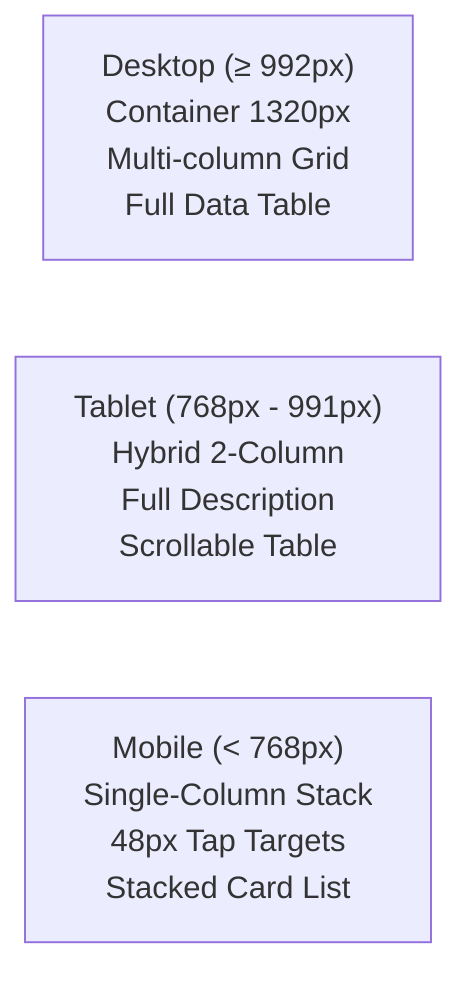

# TokTickIT Sprint 2 (Lab 2) — UI Specification & Style Contract

**Document Status**: Official UI Specification Baseline  
**Theme**: KMUTT IT Service Desk "Zen Green" Design System  
**Traceability Reference**: [Lab_02_labsheet.md](file:///c:/Users/Muhammad%20Asad%20Aziz/Downloads/CPE%20334/toktickit/docs/reference/Lab_02_labsheet.md) (§7, §8), [docs/lab-02/specification.md](file:///c:/Users/Muhammad%20Asad%20Aziz/Downloads/CPE%20334/toktickit/docs/lab-02/specification.md)  
**Approved Decisions**: DR-01 through DR-20  

---

## 1. Design Tokens & CSS Variables

All custom components, cards, tables, badges, and buttons must consume these standardized CSS variables. Page-local hardcoded hex colors or generic Bootstrap color classes for brand elements are prohibited.

```css
:root {
  /* Brand Zen Green Palette (Labsheet §7) */
  --zen-primary-green:      #006B3C; /* App header, primary CTA, active emphasis */
  --zen-secondary-green:    #0B7A46; /* Active tabs, hover states, focus accents, links */
  --zen-pale-green:         #EAF6EF; /* Selected cards, table row hover, subtle tint */
  --zen-page-bg:            #F5F7F6; /* Application background canvas */
  --zen-surface:            #FFFFFF; /* Card, panel, and modal surface */
  
  /* Typography & Text */
  --zen-font-family:        system-ui, -apple-system, "Segoe UI", Roboto, "Helvetica Neue", Arial, sans-serif;
  --zen-font-size-base:     16px;    /* DR-01: Base body scale (1.0rem) */
  --zen-font-size-label:    16px;    /* DR-06: Form label font size */
  --zen-font-size-error:    13px;    /* DR-13: Validation error font size */
  --zen-text-primary:       #1C2826; /* Dark charcoal-green text (never pure #000) */
  --zen-text-muted:         #5B6573; /* Secondary metadata, timestamps, helper copy */
  
  /* Borders & Controls */
  --zen-border-neutral:     #D1D5DB; /* Standard field and card border */
  --zen-border-radius:      6px;     /* DR-05: Standard control radius (rounded-2) */
  --zen-control-height:     40px;    /* DR-05: Uniform single-line input height */
  --zen-field-readonly-bg:  #F0F4F1; /* Soft gray-green shading for read-only fields */
  
  /* Focus & Focus Halo */
  --zen-focus-ring-color:   #0B7A46; /* DR-08, DR-19: Focus outline color */
  --zen-focus-halo:         0 0 0 3px rgba(11, 122, 70, 0.20); /* DR-08: Input focus halo */
  --zen-focus-outline:      2px solid var(--zen-focus-ring-color); /* DR-19: A11y focus ring */
  
  /* Feedback Colors */
  --zen-error:              #B3261E; /* DR-13: Dark red text and border */
  --zen-error-glow:         0 0 0 3px rgba(179, 38, 30, 0.15); /* DR-13: Invalid field focus */
  --zen-warning:            #D97706; /* Amber callouts and badges */
  --zen-success:            #2E7D32; /* Green confirmation icon and text */
  
  /* Spacing Scale */
  --zen-field-spacing:      20px;    /* DR-02: Vertical margin between form fields */
  --zen-card-padding:       24px;    /* DR-03: Desktop card internal padding */
  --zen-container-max-w:    1320px;  /* DR-04: Desktop container max width */
}
```

---

## 2. Typography & Hierarchy

* **Font Family**: System font stack (`system-ui, -apple-system, sans-serif`) for crisp native rendering across operating systems.
* **Heading Scale**:
  * `h1` (App Title / Primary Page Title): `1.75rem` (`28px`), `font-weight: 700`, color `var(--zen-text-primary)`.
  * `h2` (Card / Section Header): `1.375rem` (`22px`), `font-weight: 600`, color `var(--zen-primary-green)`.
  * `h3` (Sub-section Header): `1.125rem` (`18px`), `font-weight: 600`.
* **Form Labels**: Positioned strictly above controls (**DR-06**), `16px`, `font-weight: 600`, color `var(--zen-text-primary)`.
  * Required field indicator: `<span class="text-danger ms-1" aria-hidden="true">*</span>`.
* **Helper Text & Timestamps**: `14px`, `font-weight: 400`, color `var(--zen-text-muted)`.
* **Validation Error Text**: `13px` (`0.8125rem`), `font-weight: 500`, color `var(--zen-error)` (**DR-13**).

---

## 3. Component Design & States

### 3.1. Form Controls (Input, Select, Textarea)
* **Editable Inputs**: Background `#FFFFFF`, height `40px` (**DR-05**), border `1px solid var(--zen-border-neutral)`, border-radius `6px`.
* **Focus State**: Border transitions to `var(--zen-secondary-green)`, box-shadow `var(--zen-focus-halo)` (**DR-08**).
* **Read-Only Controls**: Background `var(--zen-field-readonly-bg)` (`#F0F4F1`), border `1px solid var(--zen-border-neutral)`, text color `var(--zen-text-primary)`, cursor `default`.
* **Invalid State**: Border turns `var(--zen-error)` (`#B3261E`), focus glow `var(--zen-error-glow)`. Validation message rendered immediately below (**DR-13**).
* **Description Textarea**: Height minimum `120px` (4 rows), vertically resizable only (`resize: vertical`).

### 3.2. Buttons
* **Primary Button (`.btn-zen-primary`)**:
  * Background `var(--zen-primary-green)` (`#006B3C`), text `#FFFFFF`, border-radius `6px`, font-weight `600`, min-height `40px` (`48px` on mobile).
  * Hover (**DR-09**): Background `var(--zen-secondary-green)` (`#0B7A46`), `transform: translateY(-1px)`, `box-shadow: 0 4px 6px -1px rgba(0, 107, 60, 0.2)`.
  * Active/Click: `transform: translateY(0)`, shadow clears.
  * Disabled / Submitting: Background `#8EAA9A`, text `#FFFFFF`, cursor `not-allowed`, inline spinner.
* **Secondary / Outline Button (`.btn-zen-outline`)**:
  * Background transparent, border `1px solid var(--zen-border-neutral)`, text `var(--zen-text-primary)`.
  * Hover: Background `var(--zen-pale-green)`, border-color `var(--zen-secondary-green)`.
* **Destructive Button (`.btn-zen-danger`)**:
  * Background `var(--zen-error)`, text `#FFFFFF`, hover `#8C1D18`.

### 3.3. Badges (Status & Priority)
Status and priority must **never** be communicated by color alone. Every badge pairs a background tint with explicit text and an icon:
* **Current Status Badges**:
  * `NEW`: Background `var(--zen-pale-green)`, text `var(--zen-primary-green)`, border `1px solid #C4E5D2`.
* **Requested Priority Badges**:
  * `LOW`: Background `#E5E7EB`, text `#374151` (Gray).
  * `MEDIUM`: Background `#DBEAFE`, text `#1E40AF` (Blue).
  * `HIGH`: Background `#FEF3C7`, text `#92400E` (Amber).
  * `URGENT`: Background `#FEE2E2`, text `#991B1B` (Red).

### 3.4. Tables (My Tickets Grid)
* **Table Wrapper**: Contained inside a white card with subtle border and `border-radius: 8px`.
* **Header Row**: Background `var(--zen-page-bg)` (`#F5F7F6`), text `var(--zen-text-muted)`, font-weight `600`, uppercase `13px`, padding `py-3 px-3`.
* **Data Rows**: Background `#FFFFFF`, height `~52px` (**DR-07**), cell padding `py-3 px-3`.
* **Row Hover**: Subtle tint to `var(--zen-pale-green)` (`#EAF6EF`) with pointer cursor (**DR-17**). Clicking the row or Ticket Number navigates to Ticket Detail.
* **Mobile Transformation**: At `< 768px`, table transforms into vertically stacked card items (**DR-10**).

### 3.5. System States & Feedback
* **Loading State**: Pulsing skeleton shimmers (`.zen-skeleton`) matching table row and form card dimensions (**DR-14**).
* **Empty State**: Centered card with subtle illustration icon, bold heading, helper copy, and CTA button (**DR-15**).
* **Ticket Submission Success**: Dedicated confirmation view with large green checkmark, highlighted Ticket Number box with "Copy" button, and dual navigation buttons (**DR-16**).
* **Modal Dialogs**: Semi-transparent static backdrop `rgba(28, 40, 38, 0.5)` preventing accidental click-outside dismissal (**DR-18**).
* **Soft-Removed Attachments**: Shaded tombstone card (`#F0F4F1`) with deletion timestamp, reason callout, and download button omitted (**DR-20**).

---

## 4. Responsive Breakpoint Rules



### 4.1. Desktop Viewport ($\ge 992\text{px}$)
* Centered layout inside `max-width: 1320px` (**DR-04**).
* Card internal padding `24px` (`1.5rem`) (**DR-03**).
* Create Ticket form: 2-column layout (Classification on left, Summary/Description on right).
* My Tickets: Full responsive table showing Ticket Number, Summary, Category, System, Status, Priority, Date, and Actions.

### 4.2. Tablet Viewport ($768\text{px} - 991\text{px}$)
* Fluid container with `padding: 0 20px`.
* Create Ticket form: Hybrid 2-column header (Category, System, Priority side-by-side); Summary and Description expand full-width below (**DR-11**).
* My Tickets: Table columns condensed with horizontal swipe container.

### 4.3. Mobile Viewport ($< 768\text{px}$)
* Full-width single-column stack with `padding: 0 16px`.
* Top navigation bar with Hamburger toggle button sliding an offcanvas navigation drawer (**DR-10**).
* Card internal padding `16px` (`1rem`) (**DR-03**).
* Minimum interactive touch target: **`48px`** for all buttons, inputs, and action links (**DR-12**).
* My Tickets: Table rows render as individual stacked cards displaying ticket badges and details without horizontal scrolling.

---

## 5. Visual Inspection Checklist

Use this checklist to audit visual compliance during PR reviews and before taking screenshots for the course submission PDF:

- [ ] **Palette Fidelity**: App header and primary buttons strictly use `#006B3C`; hover uses `#0B7A46`; row hover uses `#EAF6EF`; page background uses `#F5F7F6`.
- [ ] **Field Label Placement**: All field labels appear strictly above inputs with `font-weight: 600` and a red asterisk (`*`) on required fields.
- [ ] **Inline Error Messages**: Validation errors appear immediately below the invalid field in red (`#B3261E`) with warning icon prefix.
- [ ] **Blur Validation**: Field inputs clear/blank on blur when format is invalid; form validation triggers on Submit.
- [ ] **Submitting State**: Submit button displays an inline spinner, changes text to "Submitting…", and is disabled.
- [ ] **Read-Only Distinctness**: Read-only fields in Ticket Detail use soft gray-green background (`#F0F4F1`) and cannot be focused/typed into.
- [ ] **Mobile Overflow**: No horizontal page scrolling occurs at $375\text{px}$ or $768\text{px}$ viewports.
- [ ] **Touch Targets**: All mobile buttons and select controls measure $\ge 48\text{px}$ in height.
- [ ] **Removed Files**: Soft-removed attachments display filename, reason, and date with download button omitted.
- [ ] **A11y Focus Rings**: Tabbing through controls displays visible 2px green focus rings with 2px offset.
