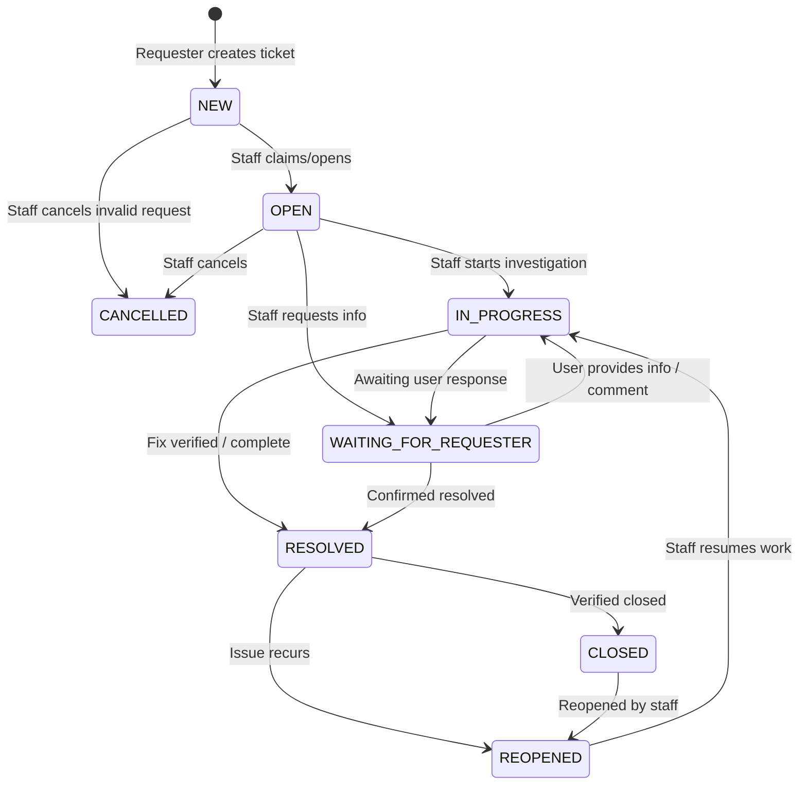
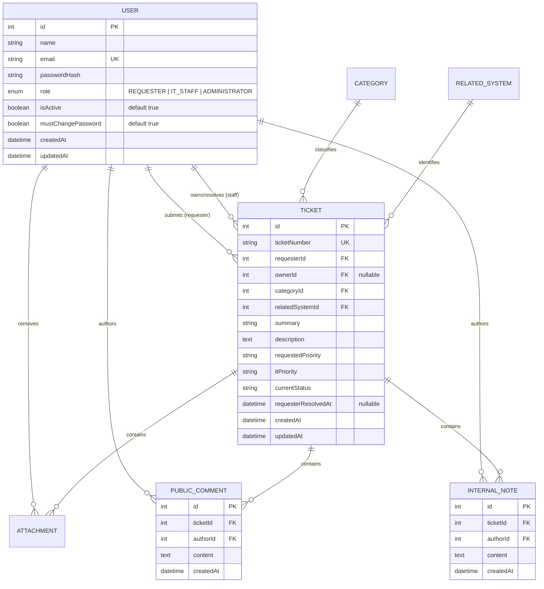

# TokTickIT Sprint 3 (Lab 3) — Engineering Specification

**Document Title**: Sprint 3 Feature Software Design Specification (Feature SDS)  
**Document ID**: SPEC-LAB-03  
**Version**: 1.0 (Approved Baseline)  
**Status**: Ready for Implementation  
**Base Branch**: `lab3-staging`  
**Active Working Branch**: `feature/11-spec-and-tests`  
**Course**: CPE 334 Introduction to Software Engineering in the Age of AI Agents (Semester 1/2026)  
**Reference Traceability**:
* [TokTickIT-System-Level-SDS-v1.0.md](../reference/TokTickIT-System-Level-SDS-v1.0.md) (System-Level Architecture SDS-SYS-001)
* [Lab_3_sheet.pdf](../reference/Lab_3_sheet.pdf) (Sprint 3 Scope, Business Rules, Rubrics)
* [poc-scope-and-issues.md](./poc-scope-and-issues.md) (Sprint Implementation Plan)
* [specification.md](../lab-02/specification.md) (Lab 2 Engineering Contract Baseline)

---

## 1. Sprint Goal

Deliver an authenticated, role-based IT ticketing product increment supporting three distinct roles: **Requester**, **IT Staff**, and **Administrator**. Sprint 3 eliminates the simulated Development Requester identity mechanism by introducing real authentication, secure credential hashing, and mandatory initial-password change workflows. The sprint maintains uninterrupted Requester continuity for all Lab 2 ticket creation and attachment features while adding an operational IT Staff shared Ticket Queue with rich query capabilities (search, filtering, sorting, pagination), an IT Staff Ticket Detail screen supporting ownership claims/reassignments, IT Priority setting, permitted status transitions, Public Comments, and role-restricted Internal Notes. Finally, a minimalist Administrator screen enables managing user accounts, assigning a single role, activating/deactivating users, and setting new initial passwords while strictly enforcing system safety guardrails.

---

## 2. Stakeholder Request Interpretation

The IT Department and University Stakeholders require an authentic multi-role operational ticketing system that transitions TokTickIT from a simulated single-requester prototype into an authenticated service platform. 

1. **Requesters** (Students, Staff, Faculty) must log in using university credentials, create and view their own tickets without risk of cross-user exposure, post public comments on their tickets, and indicate when a reported problem appears resolved.
2. **IT Staff** (Resolvers, Desk Agents) require operational tools to prioritize, claim, reassign, and track incoming service requests across the university. They must collaborate through both public messages visible to requesters and private internal technical notes invisible to non-staff users.
3. **Administrators** need a lean, self-contained user administration console to provision accounts, assign one role per user, manage active/inactive statuses, and issue initial passwords without the administrative overhead of complex identity federation.

All workflows must maintain the KMUTT IT Service Desk "Zen Green" design language, provide robust error and loading feedback, guarantee zero horizontal overflow across responsive viewports, and verify 100% of functional requirements via automated tests across unit, integration, UI, authorization, and E2E tiers.

---

## 3. Scope Boundaries

### 3.1. Included Scope
1. **Authentication & Session Foundation**:
   - Secure login using email and hashed password verification (`Argon2id` / `bcrypt`).
   - Session management (HTTP-only secure session cookies or signed bearer tokens).
   - Authenticated current-user retrieval (`/api/v1/auth/me`).
   - Session termination and cookie clearance (`/api/v1/auth/logout`).
   - Inactive user rejection with safe generic failure responses preventing account existence enumeration.
2. **Mandatory First-Login Password Change**:
   - Detection of initial or reset password state (`mustChangePassword: true`).
   - Full interception in middleware and frontend shell blocking normal app screens until changed.
   - Strong password validation rules (minimum 8 characters, uppercase, lowercase, digit, special character).
3. **Requester Continuity & Public Collaboration**:
   - Derivation of requester identity strictly from authenticated session (`req.user.id`), eliminating client-side `x-requester-id` headers and selector banners.
   - Preserved ticket creation, history listing, and attachment management from Lab 2.
   - Public Comments thread on Ticket Detail.
   - Requester problem-resolution indication ("Problem Appears Resolved") recording requester confirmation without formal terminal status closing.
4. **IT Staff Ticket Queue**:
   - Shared cross-requester queue accessible strictly to IT Staff and Administrators.
   - Case-insensitive text search by ticket number or summary keyword.
   - Multi-attribute filtering by Status, Category, IT Priority, and Owner (including unassigned).
   - Multi-column sorting (Created Date, Ticket Number, Summary, IT Priority, Status).
   - Page-based bounded pagination (page sizes: 10, 25, 50) with total count metadata.
5. **IT Staff Ticket Detail & Operational Controls**:
   - Read-only Requester problem description, category, and related system.
   - Operational controls: Ticket Owner assignment/reassignment (with 1-click "Claim" action).
   - IT Priority setting (`LOW`, `MEDIUM`, `HIGH`, `URGENT`).
   - Status workflow transition execution adhering to the formal status transition matrix.
   - Separate, visually distinct sections for Public Comments and Internal Notes.
   - Attachment download and inspection preserving Lab 2 capabilities.
6. **Administrator User Management**:
   - Dedicated `/admin/users` interface restricted to Administrators (`403 Forbidden` for other roles).
   - Listing users with Name, Email, Role badge, Status badge, and Edit trigger.
   - Search by name or email, with optional role filtering.
   - User creation form: Full Name, Email, single Role, Active toggle, and Initial Password (`mustChangePassword = true`).
   - User edit form: Name, Email, Role, Active status toggle, and initial password reset.
   - System safety rules: Prevention of self-deactivation and prevention of deactivating/demoting the system's last active Administrator.
7. **Zen Green Design & Responsiveness**:
   - Cohesive Zen Green styling tokens (`#006B3C`, `#0B7A46`, `#EAF6EF`, `#F5F7F6`).
   - Full responsive adaptation across Desktop ($\ge 1200\text{px}$), Tablet ($768\text{px}-1024\text{px}$), and Mobile ($< 768\text{px}$).

### 3.2. Explicitly Excluded Scope (Strictly Out of Scope per §4.2)
* **Email & External Auth**: No email invitations, password-reset emails, multi-factor authentication (MFA), social logins, or Single Sign-On (SSO).
* **Self-Registration**: No self-registration or public sign-up; all accounts are provisioned by Administrators or seeded.
* **Actions Taken**: "Actions Taken by IT Staff" and blocking ticket resolution based on incomplete actions are deferred to Lab 4.
* **SLAs & Notifications**: No formal SLA deadline calculations, automated escalation timers, webhooks, or push notifications.
* **Analytics**: No graphical dashboards, chart visualizations, or KPI metrics beyond tabular counters.
* **Multi-Tenancy**: No organizational hierarchy, customer tenant isolation, or department-level partitioning.
* **Account Extras**: No profile picture uploads, hard user deletion (deactivation only), bulk user imports/exports, or audit log screens.
* **Multiple Roles**: Strictly one role per user (`REQUESTER`, `IT_STAFF`, or `ADMINISTRATOR`).

---

## 4. Functional Requirements (FR)

* **FR-01 (User Authentication & Session Lifecycle)**:  
  The system shall authenticate users using email and password. Upon successful validation of an active account, the system shall establish an authenticated session, return the user identity with permitted role, and allow session invalidation via Logout. Unauthenticated requests to protected endpoints shall return `401 Unauthorized`.

* **FR-02 (Mandatory First-Login Password Change)**:  
  The system shall require any user with `mustChangePassword = true` to change their initial password before accessing any normal operational screen. The backend shall reject operational API requests for users in this state with a specific redirection code/error. The frontend shall present a password change form with interactive rule validation.

* **FR-03 (IT Staff Ticket Queue & List Queries)**:  
  The system shall provide IT Staff and Administrators with a unified, searchable, filterable, sortable, and paginated view of all tickets in the system. Requesters attempting to access the queue shall be rejected with `403 Forbidden`.

* **FR-04 (IT Staff Ticket Detail & Operational Management)**:  
  The system shall provide IT Staff and Administrators with an operational detail screen for any ticket. Users with permitted roles shall be able to claim ownership, assign/reassign tickets to active staff, set IT Priority, and update ticket status according to the status transition matrix. Requesters shall have access only to their own tickets and can indicate problem resolution.

* **FR-05 (Public Comments & Internal Notes Management)**:  
  The system shall allow Requesters, IT Staff, and Administrators to post append-only Public Comments on tickets. The system shall allow only IT Staff and Administrators to post and view append-only Internal Notes. Requesters shall be strictly prevented from viewing or creating Internal Notes at both the API and UI boundaries.

* **FR-06 (Administrator User Management & Account Safety)**:  
  The system shall provide an Administrator-only interface to view users, search by name/email, filter by role, create users with an initial password, edit user details and activation status, and set new initial passwords. The system shall enforce administrative safety rules preventing self-deactivation and the deactivation/demotion of the last active Administrator.

---

## 5. Business Rules (BR)

* **BR-01 (Active Account & Valid Credentials Policy)**:  
  Only an active account (`isActive = true`) with valid matching credentials may authenticate. Inactive accounts attempting login must be rejected with a generic safe error message ("Invalid email or password") that does not disclose whether the account exists or is disabled.

* **BR-02 (Mandatory Password Change Enforcement)**:  
  A user flagged with `mustChangePassword = true` cannot access normal application functionality. Protected operational API endpoints must reject requests from such users with `403 Forbidden` (`PASSWORD_CHANGE_REQUIRED`). Once a compliant new password (min 8 chars, uppercase, lowercase, digit, special character) is successfully submitted, `mustChangePassword` is set to `false`.

* **BR-03 (Session-Derived Requester Ownership)**:  
  Ticket ownership and Requester identity must be determined strictly by the verified server-side session (`req.user.id`). Any client-supplied `requesterId` in request bodies, headers, or query parameters must be disregarded. Requesters can only access, view, comment on, and manage attachments for tickets where `ticket.requesterId === req.user.id`.

* **BR-04 (Public Comments vs. Internal Notes Visibility Boundaries)**:  
  - **Public Comments**: Visible to the owning Requester, all IT Staff, and Administrators. Permitted authors: owning Requester, IT Staff, and Administrators.
  - **Internal Notes**: Visible **strictly** to IT Staff and Administrators. Requesters cannot view, query, or submit Internal Notes. Any direct API query by a Requester for internal notes must return `403 Forbidden` without exposing note count or metadata.

* **BR-05 (Requester Problem-Resolution Indication)**:  
  An authenticated Requester viewing an owned ticket in an active status may click "Problem Appears Resolved". This action records the requester's resolution indication timestamp (`requesterResolvedAt = NOW()`) and notifies IT Staff, but **does not** formally transition the ticket status to `RESOLVED` or `CLOSED`. Formal status closure remains the sole authority of IT Staff and Administrators.

* **BR-06 (Queue Authorization & Scope)**:  
  The IT Staff Ticket Queue (`GET /api/v1/staff/tickets`) is restricted to users with role `IT_STAFF` or `ADMINISTRATOR`. Requesters requesting this route receive HTTP `403 Forbidden`. The queue includes tickets across all requesters, categories, and active/closed statuses.

* **BR-07 (Default IT Priority Initialization)**:  
  Upon initial ticket creation, `itPriority` is automatically initialized to match the Requester's `requestedPriority`. Subsequent modifications to `itPriority` can only be performed by IT Staff or Administrators.

* **BR-08 (Append-Only Comment & Note Lifecycle)**:  
  Both Public Comments and Internal Notes are strictly append-only. Editing, updating, or deleting existing entries is prohibited. Content must contain between 1 and 2,000 characters after trimming whitespace. Author ID and timestamp must be populated by the server runtime.

* **BR-09 (Single-Role Assignment Policy)**:  
  Every user in the system possesses exactly one assigned role: `REQUESTER`, `IT_STAFF`, or `ADMINISTRATOR`. Multiple roles per user or fine-grained custom permission sets are prohibited.

* **BR-10 (Unique Email & Credential Storage Policy)**:  
  User emails must be unique across the system (case-insensitive). Passwords must never be stored in plaintext and must be hashed using `Argon2id` or `bcrypt` with appropriate work factors before persistence.

* **BR-11 (Administrator Self-Deactivation Prevention Rule)**:  
  An Administrator is strictly prohibited from modifying their own account's `isActive` status to `false`. Attempting to deactivate one's own account must be rejected with HTTP `400 Bad Request` or `403 Forbidden` (`CANNOT_DEACTIVATE_SELF`).

* **BR-12 (Minimum Active Administrator Preservation Rule)**:  
  The system must preserve at least one active user with the `ADMINISTRATOR` role at all times. Any administrative request that would result in zero active administrators (e.g., deactivating or demoting the last active administrator) must be rejected with HTTP `400 Bad Request` or `409 Conflict` (`CANNOT_DEACTIVATE_LAST_ADMIN`).

---

## 6. Ticket Status Transition Matrix

The system enforces a state machine for ticket progression. Only IT Staff and Administrators can perform formal status transitions:

| Current Status | Allowed Target Statuses | Permitted Roles | Conditions & Validations |
| :--- | :--- | :--- | :--- |
| `NEW` | `OPEN`, `CANCELLED` | IT Staff, Administrator | Auto-assigned or manually opened; Cancellation requires non-empty reason. |
| `OPEN` | `IN_PROGRESS`, `WAITING_FOR_REQUESTER`, `CANCELLED` | IT Staff, Administrator | Transitions when investigation begins or requester input needed. |
| `IN_PROGRESS` | `WAITING_FOR_REQUESTER`, `RESOLVED`, `CANCELLED` | IT Staff, Administrator | Resolving indicates technical completion. |
| `WAITING_FOR_REQUESTER` | `IN_PROGRESS`, `RESOLVED` | IT Staff, Administrator | Moving to `IN_PROGRESS` when requester responds via comment. |
| `RESOLVED` | `CLOSED`, `REOPENED` | IT Staff, Administrator | Confirmation required when transitioning to terminal `CLOSED`. |
| `CLOSED` | `REOPENED` | IT Staff, Administrator | Exceptional reopen allowed if issue recurs. |
| `REOPENED` | `IN_PROGRESS`, `CANCELLED` | IT Staff, Administrator | Staff resumes active remediation. |
| `CANCELLED` | None (Terminal) | — | Read-only; no further transitions allowed. |

---

## 7. Data Model Migration Plan (Lab 2 to Lab 3)

### 7.1. Entity Relationship & Relational Mapping

### 7.2. Evolution from Lab 2 `RequesterUser`
1. **Model Evolution**:
   - The Lab 2 `RequesterUser` table (`requester_users`) is migrated into a unified `User` model (`users`).
   - All foreign keys referencing `requester_users.id` in `tickets.requesterId` and `attachments.removedByRequesterId` are re-pointed to `users.id` with referential integrity preserved.
   - New columns added to `users`:
     - `passwordHash`: String (hashed password).
     - `role`: String/Enum (`REQUESTER`, `IT_STAFF`, `ADMINISTRATOR`), default `REQUESTER`.
     - `mustChangePassword`: Boolean, default `true`.
2. **Data Preservation Guarantee**:
   - Existing seeded Requesters ("Sompong IT", "Anong Staff", "Mana Student", "Kanda Faculty", "Prasert Inactive") retain their identical IDs (`1, 2, 3, 4, 5`).
   - All Lab 2 tickets (`TKT-2026-00001`, `TKT-2026-00002`, etc.) remain linked to their original requester IDs.
   - All file attachments and soft-removal tombstones remain completely intact.
3. **Ticket Model Evolution**:
   - Add nullable `ownerId` foreign key to `User`.
   - Add `itPriority` column (initialized to copy `requestedPriority`).
   - Add nullable `requesterResolvedAt` DateTime column.
   - Update `currentStatus` allowable values to match the 8 defined workflow states.
4. **New Models**:
   - `PublicComment`: `id`, `ticketId` (FK), `authorId` (FK), `content` (VARCHAR/TEXT), `createdAt`.
   - `InternalNote`: `id`, `ticketId` (FK), `authorId` (FK), `content` (VARCHAR/TEXT), `createdAt`.

### 7.3. Idempotent Seed Data Plan
The Prisma seed script (`server/prisma/seed.ts`) must be safe to execute multiple times (`upsert` pattern):
* **Requesters**:
  - `sompong.it@kmutt.ac.th` (Active Requester, Initial: `Password123!`, `mustChangePassword: false`)
  - `anong.st@kmutt.ac.th` (Active Requester, Initial: `Password123!`, `mustChangePassword: false`)
  - `mana.st@kmutt.ac.th` (Active Requester, Initial: `Password123!`, `mustChangePassword: false`)
  - `kanda.fc@kmutt.ac.th` (Active Requester, Initial: `Password123!`, `mustChangePassword: false`)
  - `prasert.in@kmutt.ac.th` (Inactive Requester, `isActive: false`)
  - `new.requester@kmutt.ac.th` (Active Requester, Initial: `InitialPass123!`, `mustChangePassword: true` for testing forced change)
* **IT Staff**:
  - `wichai.it@kmutt.ac.th` (Active IT Staff, `mustChangePassword: false`)
  - `nareerat.it@kmutt.ac.th` (Active IT Staff, `mustChangePassword: false`)
  - `ekachai.it@kmutt.ac.th` (Active IT Staff, `mustChangePassword: false`)
  - `inactive.staff@kmutt.ac.th` (Inactive IT Staff, `isActive: false`)
* **Administrators**:
  - `admin.toktick@kmutt.ac.th` (Active Administrator, `mustChangePassword: false`)
  - `backup.admin@kmutt.ac.th` (Active Administrator, for testing multi-admin rules)
* **Ticket Data**:
  - Realistic tickets across all 8 statuses (`NEW`, `OPEN`, `IN_PROGRESS`, `WAITING_FOR_REQUESTER`, `RESOLVED`, `CLOSED`, `REOPENED`, `CANCELLED`).
  - Realistic distribution of assigned owners and unassigned tickets.
  - Seeded Public Comments and Internal Notes.

---

## 8. Acceptance Criteria (AC-01 to AC-15)

* **AC-01 (Valid Login & Session Grant)**:  
  *Given* an active user with valid credentials,  
  *When* `POST /api/v1/auth/login` is submitted,  
  *Then* the system returns HTTP 200 with an authenticated session/token and user details (`id`, `name`, `email`, `role`, `mustChangePassword`).

* **AC-02 (Inactive Account & Invalid Credential Protection)**:  
  *Given* an inactive account or incorrect password,  
  *When* `POST /api/v1/auth/login` is submitted,  
  *Then* the system returns HTTP 401 with a safe, generic error message without disclosing account existence or active status.

* **AC-03 (Mandatory First-Login Password Change Enforcement)**:  
  *Given* a user with `mustChangePassword = true`,  
  *When* logging into the application,  
  *Then* access to standard application views and operational APIs is blocked until the password change process is completed.

* **AC-04 (Password Strength Validation & Flow Completion)**:  
  *Given* a user on the Mandatory Change Password screen,  
  *When* submitting a new password meeting all complexity criteria (8+ chars, upper, lower, number, symbol),  
  *Then* the password is updated, `mustChangePassword` is set to `false`, and the user is redirected to their role-appropriate home view.

* **AC-05 (Session-Derived Ownership & Anti-Spoofing)**:  
  *Given* an authenticated Requester,  
  *When* submitting a ticket or querying ticket history with an injected `x-requester-id` or body ID,  
  *Then* the system derives identity solely from the server session and rejects cross-requester queries with HTTP 403 or 404.

* **AC-06 (Logout Session Termination)**:  
  *Given* an authenticated user,  
  *When* `POST /api/v1/auth/logout` is triggered,  
  *Then* the session token/cookie is cleared, and subsequent requests to protected endpoints return HTTP 401 Unauthorized.

* **AC-07 (IT Staff Ticket Queue Retrieval & Query Features)**:  
  *Given* an authenticated IT Staff or Administrator user,  
  *When* querying `GET /api/v1/staff/tickets` with search, filter, sort, or pagination parameters,  
  *Then* matching tickets are returned with correct pagination metadata (`totalCount`, `page`, `pageSize`, `totalPages`).

* **AC-08 (IT Staff Queue Role Boundary)**:  
  *Given* an authenticated Requester,  
  *When* attempting to access `GET /api/v1/staff/tickets`,  
  *Then* the system responds with HTTP 403 Forbidden.

* **AC-09 (Ticket Claim & Ownership Assignment)**:  
  *Given* an authenticated IT Staff user viewing an unassigned ticket,  
  *When* clicking "Claim Ticket" or assigning to an active staff member,  
  *Then* `ownerId` is updated in the database and the new owner's name is displayed.

* **AC-10 (IT Priority & Permitted Status Transitions)**:  
  *Given* an authenticated IT Staff member viewing Ticket Detail,  
  *When* selecting a valid next status per the transition matrix or updating IT Priority,  
  *Then* the ticket record is updated and changes reflect immediately with confirmation feedback.

* **AC-11 (Public Comments Thread & Visibility)**:  
  *Given* an authenticated Requester (for owned ticket), IT Staff, or Administrator,  
  *When* submitting a valid Public Comment,  
  *Then* the comment is appended and rendered visibly to all permitted roles.

* **AC-12 (Internal Notes Role Isolation)**:  
  *Given* an authenticated Requester,  
  *When* attempting to view or post an Internal Note via API or UI,  
  *Then* the request is rejected with HTTP 403 Forbidden, and notes are never returned in ticket responses to Requesters.

* **AC-13 (Requester Problem-Resolution Indication)**:  
  *Given* an authenticated Requester viewing an owned open ticket,  
  *When* clicking "Problem Appears Resolved",  
  *Then* `requesterResolvedAt` is timestamped and recorded, but the ticket status is **not** set to `RESOLVED` or `CLOSED`.

* **AC-14 (Administrator User Creation & Provisioning)**:  
  *Given* an authenticated Administrator,  
  *When* creating a new user with valid name, unique email, role, and initial password,  
  *Then* the user is saved with `mustChangePassword: true` and rendered in the user list. Duplicate emails return HTTP 409 Conflict.

* **AC-15 (Administrator Safety Rules Enforcement)**:  
  *Given* an authenticated Administrator,  
  *When* attempting to deactivate their own account or deactivating/demoting the sole remaining active Administrator,  
  *Then* the operation is rejected with HTTP 400/409 and a clear safety alert is displayed.

---

## 9. Product Definition of Done (DoD)

Before declaring Sprint 3 complete and submitting the release PR from `lab3-staging` to `main`, the engineering team must satisfy every item on this checklist:

1. **Engineering Contract Pre-Condition**:
   - `docs/lab-03/specification.md`, `ui-spec.md`, `api-spec.md`, and `tests.md` are authored, peer-reviewed, and merged on `lab3-staging` before feature code is written.
2. **Database Migration & Data Preservation**:
   - Unified `User` model created; all Lab 2 Requester records, Tickets, and Attachments migrated with zero data loss or broken foreign keys.
   - Idempotent seed script populates required active/inactive users across all 3 roles, tickets across all 8 statuses, comments, and notes.
3. **Security & Authorization Invariants**:
   - Passwords hashed using `Argon2id` or `bcrypt`; zero plaintext passwords in database, logs, or network payloads.
   - Server-side role enforcement on every protected endpoint (`401` for unauthenticated, `403` for unauthorized).
   - Anti-spoofing: Requester identity derived strictly from session; client `requesterId` ignored.
   - Administrative safety rules (BR-11, BR-12) enforced server-side and client-side.
4. **UI & Design Language Compliance**:
   - Complete adoption of Zen Green design tokens (`#006B3C`, `#0B7A46`, `#EAF6EF`, `#F5F7F6`).
   - Distinction between Public Comments and Amber-tinted Internal Notes with lock icon.
   - Fully responsive layouts across Desktop ($\ge 1200\text{px}$), Tablet ($768\text{px}-1024\text{px}$), and Mobile ($< 768\text{px}$) with zero horizontal scrolling.
   - Blur validation behavior honored across all form inputs.
5. **Automated Test Verification**:
   - 100% of Acceptance Criteria (`AC-01` to `AC-15`) covered by automated test suites.
   - Backend API test suite passes (`npm run test` in `server/`).
   - Frontend UI component test suite passes (`npm run test` in `client/`).
   - End-to-end Playwright test suite passes (`npx playwright test e2e/lab-03/`).
6. **Artifacts & Deliverables**:
   - Full-page screenshots captured across viewports in `artifacts/lab-03/screenshots/`.
   - `docs/lab-03/reviewer.md` and `docs/lab-03/ai-use.md` fully completed with authentic records.
