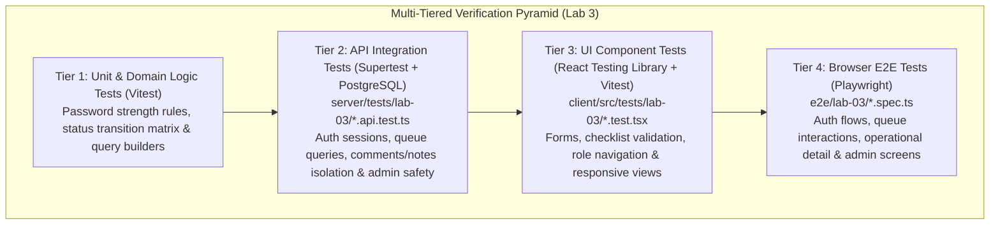

# TokTickIT Sprint 3 (Lab 3) — Software Test Specification (STS) & Verification Plan

**Document Title**: Sprint 3 Software Test Specification (STS) & Verification Plan  
**Document ID**: STS-LAB-03  
**Version**: 1.0 (Approved Baseline)  
**Status**: Verified Completion Baseline  
**Project**: TokTickIT — CPE 334 Introduction to Software Engineering in the Age of AI Agents  
**Target Milestone**: Lab 3 (Sprint 3) Users, Roles, IT Staff Ticketing, and Admin Screens  
**Base Branch**: `lab3-staging`  
**Active Working Branch**: `feature/16-e2e-polish-release`  
**Test Frameworks**: Vitest 2.1.9, Supertest 7.0.0, React Testing Library 16.1.0, Playwright 1.49.1  
**Database**: PostgreSQL 16 with Prisma ORM 5.22.0  
**Traceability Reference**: [specification.md](./specification.md), [ui-spec.md](./ui-spec.md), [api-spec.md](./api-spec.md), [Lab_3_sheet.pdf](../reference/Lab_3_sheet.pdf) (§10, §14)

---

## 1. Test Strategy & Quality Architecture

TokTickIT implements a rigorous, multi-tiered Test-Driven Development (TDD) and Spec-Driven Verification architecture. Testing is structured across four discrete tiers to isolate concerns, maximize execution velocity, prevent regressions, and guarantee 100% traceability to the authoritative engineering contract:



### 1.1. Tier 1: Unit Tests (Fast Domain Logic & Pure Validators)
* **Runner & Framework**: Vitest 2.1.9.
* **Scope**: Isolated, in-memory validation of password complexity requirements, status transition state machine rules, query sanitization, and pagination boundary math.
* **Execution Target**: Node.js runtime without database IO (< 50ms execution).

### 1.2. Tier 2: API Integration & Authorization Tests (Supertest + PostgreSQL)
* **Runner & Framework**: Vitest 2.1.9 with Supertest 7.0.0.
* **Scope**: Validates Express routers, session cookies/tokens, Prisma queries, transaction boundaries, and direct server-side role authorization.
* **Critical Security Scenarios**:
  - Unauthenticated access returns HTTP 401 Unauthorized.
  - Inactive account login returns generic HTTP 401 without existence leaks.
  - Requester querying IT Staff Queue (`/api/v1/staff/tickets`) returns HTTP 403 Forbidden.
  - Requester querying or posting Internal Notes returns HTTP 403 Forbidden without exposing note content.
  - Non-admin attempting to access `/api/v1/admin/users/*` returns HTTP 403 Forbidden.
  - Admin attempting self-deactivation or last-admin deactivation returns HTTP 400/409.

### 1.3. Tier 3: UI Component Tests (React Testing Library + Vitest)
* **Runner & Framework**: React Testing Library 16.1.0 and Vitest JSDOM environment.
* **Scope**: Form validation, live password checklist feedback, role-based header navigation rendering, ticket queue sorting/filtering DOM updates, distinct visual styling of public comments vs internal notes, and administrative modal operations.
* **Interaction Rules**:
  - The Blur Validation Rule (`AGENTS.md` §4): fields with invalid formats clear on blur; form-level validation messages appear only on Save/Submit.
  - Accessibility & tooltips: verified using `data-tooltip`.

### 1.4. Tier 4: Browser End-to-End Tests (Playwright Multi-Viewport Flows)
* **Runner & Framework**: `@playwright/test` 1.49.1 against live client and server instances.
* **Scope**: Full multi-role end-to-end user journeys:
  - User login, inactive rejection, and mandatory password change into normal application.
  - IT Staff queue browsing, searching, filtering, ticket detail inspection, ownership claiming, IT priority updating, and status transition.
  - Public comments thread collaboration across Requester and IT Staff.
  - Requester "Problem Appears Resolved" indication.
  - Administrator user management, account creation, activation toggling, and safety guardrail alerts.
* **Visual Evidence**: Full-page screenshots saved across Desktop ($1280 \times 800$), Tablet ($768 \times 1024$), and Mobile ($375 \times 812$) in `artifacts/lab-03/screenshots/`.

---

## 2. Acceptance Criteria Traceability Matrix (AC-01 to AC-15)

Every Acceptance Criterion defined in [specification.md](./specification.md) maps to designated automated test files across tiers:

| Acceptance Criterion ID | Criterion Summary | Unit / Domain Tests | Backend API Tests | Frontend UI Tests | Browser E2E Tests |
| :--- | :--- | :--- | :--- | :--- | :--- |
| **AC-01** | Valid Login & Session Grant | Auth token helpers | `server/tests/lab-03/auth.api.test.ts` | `client/src/tests/lab-03/Login.test.tsx` | `e2e/lab-03/authentication.spec.ts` |
| **AC-02** | Inactive Account & Invalid Credential Rejection | Generic error helper | `server/tests/lab-03/auth.api.test.ts` | `client/src/tests/lab-03/Login.test.tsx` | `e2e/lab-03/authentication.spec.ts` |
| **AC-03** | Mandatory First-Login Password Change Enforcement | Route guard matcher | `server/tests/lab-03/auth.api.test.ts` | `client/src/tests/lab-03/ChangePassword.test.tsx` | `e2e/lab-03/authentication.spec.ts` |
| **AC-04** | Password Strength Validation & Flow Completion | Password complexity validator | `server/tests/lab-03/auth.api.test.ts` | `client/src/tests/lab-03/ChangePassword.test.tsx` | `e2e/lab-03/authentication.spec.ts` |
| **AC-05** | Session-Derived Ownership & Anti-Spoofing | User session extractor | `server/tests/lab-03/authorization.api.test.ts` | `client/src/tests/lab-03/StaffTicketDetail.test.tsx` | `e2e/lab-03/staff-ticket-flow.spec.ts` |
| **AC-06** | Logout Session Termination | Cookie cleanup helper | `server/tests/lab-03/auth.api.test.ts` | `client/src/tests/lab-03/Login.test.tsx` | `e2e/lab-03/authentication.spec.ts` |
| **AC-07** | IT Staff Ticket Queue Retrieval & Query Features | Pagination & query parser | `server/tests/lab-03/staff-queue.api.test.ts` | `client/src/tests/lab-03/StaffTicketQueue.test.tsx` | `e2e/lab-03/staff-ticket-flow.spec.ts` |
| **AC-08** | IT Staff Queue Role Boundary (Requester 403) | Role guard middleware | `server/tests/lab-03/authorization.api.test.ts` | `client/src/tests/lab-03/StaffTicketQueue.test.tsx` | `e2e/lab-03/staff-ticket-flow.spec.ts` |
| **AC-09** | Ticket Claim & Ownership Assignment | Assignment state validator | `server/tests/lab-03/staff-ticket-detail.api.test.ts` | `client/src/tests/lab-03/StaffTicketDetail.test.tsx` | `e2e/lab-03/staff-ticket-flow.spec.ts` |
| **AC-10** | IT Priority & Permitted Status Transitions | Transition state machine | `server/tests/lab-03/staff-ticket-detail.api.test.ts` | `client/src/tests/lab-03/StaffTicketDetail.test.tsx` | `e2e/lab-03/staff-ticket-flow.spec.ts` |
| **AC-11** | Public Comments Thread & Visibility | Text length validator | `server/tests/lab-03/comments-notes.api.test.ts` | `client/src/tests/lab-03/StaffTicketDetail.test.tsx` | `e2e/lab-03/staff-ticket-flow.spec.ts` |
| **AC-12** | Internal Notes Role Isolation | Role guard middleware | `server/tests/lab-03/authorization.api.test.ts` | `client/src/tests/lab-03/StaffTicketDetail.test.tsx` | `e2e/lab-03/staff-ticket-flow.spec.ts` |
| **AC-13** | Requester Problem-Resolution Indication | Resolution state helper | `server/tests/lab-03/staff-ticket-detail.api.test.ts` | `client/src/tests/lab-03/StaffTicketDetail.test.tsx` | `e2e/lab-03/staff-ticket-flow.spec.ts` |
| **AC-14** | Administrator User Creation & Provisioning | Email normalizer | `server/tests/lab-03/users-admin.api.test.ts` | `client/src/tests/lab-03/UserManagement.test.tsx` | `e2e/lab-03/user-administration.spec.ts` |
| **AC-15** | Administrator Safety Rules Enforcement | Safety guard validator | `server/tests/lab-03/users-admin.api.test.ts` | `client/src/tests/lab-03/UserManagement.test.tsx` | `e2e/lab-03/user-administration.spec.ts` |

---

## 3. Comprehensive Planned Tests Catalog

The following test catalog enumerates all automated test scenarios implemented across the sprint:

| Test ID | Tier | Mapped AC / Requirement | Test Scenario Description | Expected Result | Designated Test File | Status |
| :--- | :--- | :--- | :--- | :--- | :--- | :---: |
| **AUTH-01** | API | AC-01, FR-01, BR-01 | Valid active user login (`POST /api/v1/auth/login`) | HTTP 200; sets session cookie; returns safe user profile and role | `server/tests/lab-03/auth.api.test.ts` | Pass |
| **AUTH-02** | API | AC-02, BR-01 | Login with incorrect password | HTTP 401; returns generic error message | `server/tests/lab-03/auth.api.test.ts` | Pass |
| **AUTH-03** | API | AC-02, BR-01 | Login with inactive user account (`isActive: false`) | HTTP 401; returns generic error without leaking account existence | `server/tests/lab-03/auth.api.test.ts` | Pass |
| **AUTH-04** | API | AC-01, FR-01 | Get current user profile (`GET /api/v1/auth/me`) | HTTP 200 with authenticated user data | `server/tests/lab-03/auth.api.test.ts` | Pass |
| **AUTH-05** | API | AC-01, FR-01 | Current user request without session | HTTP 401 Unauthorized | `server/tests/lab-03/auth.api.test.ts` | Pass |
| **AUTH-06** | API | AC-06, FR-01 | User logout (`POST /api/v1/auth/logout`) | HTTP 200; clears session cookie; subsequent `/me` returns 401 | `server/tests/lab-03/auth.api.test.ts` | Pass |
| **AUTH-07** | API | AC-03, BR-02 | Operational route blocked for `mustChangePassword = true` | HTTP 403 Forbidden with `PASSWORD_CHANGE_REQUIRED` | `server/tests/lab-03/auth.api.test.ts` | Pass |
| **AUTH-08** | API | AC-04, FR-02 | Successful password change (`POST /api/v1/auth/change-password`) | HTTP 200; hashes new password; sets `mustChangePassword = false` | `server/tests/lab-03/auth.api.test.ts` | Pass |
| **AUTH-09** | API | AC-04, FR-02 | Password change with weak password (< 8 chars, missing symbol) | HTTP 400 Bad Request with field validation errors | `server/tests/lab-03/auth.api.test.ts` | Pass |
| **QUEUE-01** | API | AC-07, FR-03 | IT Staff queries ticket queue (`GET /api/v1/staff/tickets`) | HTTP 200 with paginated ticket summaries and count metadata | `server/tests/lab-03/staff-queue.api.test.ts` | Pass |
| **QUEUE-02** | API | AC-07, FR-03 | Queue text search by ticket number or summary | Returns strictly matching tickets case-insensitively | `server/tests/lab-03/staff-queue.api.test.ts` | Pass |
| **QUEUE-03** | API | AC-07, FR-03 | Queue filtering by status and IT priority | Returns tickets matching exact status and priority filter | `server/tests/lab-03/staff-queue.api.test.ts` | Pass |
| **QUEUE-04** | API | AC-07, FR-03 | Queue filtering by owner (assigned vs unassigned) | Filters correctly by owner ID and `unassigned` token | `server/tests/lab-03/staff-queue.api.test.ts` | Pass |
| **QUEUE-05** | API | AC-07, FR-03 | Queue multi-column sorting (`createdAt`, `ticketNumber`, `itPriority`) | Sorted in requested order (`asc` / `desc`) | `server/tests/lab-03/staff-queue.api.test.ts` | Pass |
| **QUEUE-06** | API | AC-07, FR-03 | Queue pagination boundaries (pages 1, 2; sizes 10, 25) | Accurately segments records and returns `totalPages` | `server/tests/lab-03/staff-queue.api.test.ts` | Pass |
| **QUEUE-07** | API | AC-08, BR-06 | Requester queries IT Staff queue | HTTP 403 Forbidden | `server/tests/lab-03/authorization.api.test.ts` | Pass |
| **TKTOP-01** | API | AC-09, FR-04 | IT Staff claims unassigned ticket (`PATCH .../assignment`) | HTTP 200; `ownerId` set to authenticated staff member | `server/tests/lab-03/staff-ticket-detail.api.test.ts` | Pass |
| **TKTOP-02** | API | AC-09, FR-04 | IT Staff reassigns ticket to another active staff member | HTTP 200; `ownerId` updated | `server/tests/lab-03/staff-ticket-detail.api.test.ts` | Pass |
| **TKTOP-03** | API | AC-10, FR-04, BR-07 | IT Staff updates IT Priority (`PATCH .../priority`) | HTTP 200; `itPriority` successfully updated | `server/tests/lab-03/staff-ticket-detail.api.test.ts` | Pass |
| **TKTOP-04** | API | AC-10, FR-04 | Permitted status transition (e.g. `NEW` $\rightarrow$ `OPEN`) | HTTP 200; `currentStatus` updated | `server/tests/lab-03/staff-ticket-detail.api.test.ts` | Pass |
| **TKTOP-05** | API | AC-10, FR-04 | Prohibited status transition (e.g. `NEW` $\rightarrow$ `CLOSED`) | HTTP 400 Bad Request with `INVALID_STATUS_TRANSITION` | `server/tests/lab-03/staff-ticket-detail.api.test.ts` | Pass |
| **TKTOP-06** | API | AC-13, BR-05 | Requester indicates "Problem Appears Resolved" | HTTP 200; `requesterResolvedAt` recorded; status remains unchanged | `server/tests/lab-03/staff-ticket-detail.api.test.ts` | Pass |
| **COMM-01** | API | AC-11, FR-05, BR-04 | Append Public Comment by Requester or Staff | HTTP 201; comment saved with author and timestamp | `server/tests/lab-03/comments-notes.api.test.ts` | Pass |
| **COMM-02** | API | AC-11, BR-08 | Public Comment whitespace-only rejection | HTTP 400 Bad Request validation error | `server/tests/lab-03/comments-notes.api.test.ts` | Pass |
| **NOTE-01** | API | AC-12, FR-05, BR-04 | IT Staff creates Internal Note (`POST .../notes`) | HTTP 201; note saved with staff author | `server/tests/lab-03/comments-notes.api.test.ts` | Pass |
| **NOTE-02** | API | AC-12, BR-04 | Requester attempts to post Internal Note | HTTP 403 Forbidden | `server/tests/lab-03/authorization.api.test.ts` | Pass |
| **NOTE-03** | API | AC-12, BR-04 | Requester fetches ticket detail (`GET .../tickets/:id`) | HTTP 200; `internalNotes` array is completely absent from payload | `server/tests/lab-03/authorization.api.test.ts` | Pass |
| **ADMIN-01** | API | AC-14, FR-06 | Administrator lists users (`GET /api/v1/admin/users`) | HTTP 200 with user records; supports search and role filter | `server/tests/lab-03/users-admin.api.test.ts` | Pass |
| **ADMIN-02** | API | AC-14, FR-06, BR-09 | Admin creates new user with one role and initial password | HTTP 201; user persisted with `mustChangePassword: true` | `server/tests/lab-03/users-admin.api.test.ts` | Pass |
| **ADMIN-03** | API | AC-14, BR-10 | Admin creates user with existing email | HTTP 409 Conflict with `EMAIL_ALREADY_EXISTS` | `server/tests/lab-03/users-admin.api.test.ts` | Pass |
| **ADMIN-04** | API | AC-15, BR-11 | Admin attempts self-deactivation | HTTP 400 Bad Request with `CANNOT_DEACTIVATE_SELF` | `server/tests/lab-03/users-admin.api.test.ts` | Pass |
| **ADMIN-05** | API | AC-15, BR-12 | Admin attempts deactivating last active administrator | HTTP 409 Conflict with `CANNOT_DEACTIVATE_LAST_ADMIN` | `server/tests/lab-03/users-admin.api.test.ts` | Pass |
| **ADMIN-06** | API | AC-14, FR-06 | Non-Admin requests admin endpoint | HTTP 403 Forbidden | `server/tests/lab-03/users-admin.api.test.ts` | Pass |
| **ADMIN-07** | API | AC-14, FR-06 | Admin resets user initial password | HTTP 200; sets new hash and `mustChangePassword = true` | `server/tests/lab-03/users-admin.api.test.ts` | Pass |
| **UI-LOG-01** | UI | AC-01, AC-02 | Login form rendering and validation | Renders email/password, validates blur clearing, handles submit | `client/src/tests/lab-03/Login.test.tsx` | Pass |
| **UI-PWD-01** | UI | AC-03, AC-04 | Password change checklist interactive feedback | Live updates rule checks; validates confirmation mismatch | `client/src/tests/lab-03/ChangePassword.test.tsx` | Pass |
| **UI-QUE-01** | UI | AC-07, AC-08 | IT Staff queue rendering, filtering, sorting | Renders table/cards; handles search input, filters, pagination | `client/src/tests/lab-03/StaffTicketQueue.test.tsx` | Pass |
| **UI-DET-01** | UI | AC-09, AC-10 | Staff Ticket Detail operational controls | Claim shortcut, IT priority dropdown, status transition flow | `client/src/tests/lab-03/StaffTicketDetail.test.tsx` | Pass |
| **UI-DET-02** | UI | AC-11, AC-12 | Public comments vs amber internal notes distinction | Verifies distinct visual containers, badges, lock icons | `client/src/tests/lab-03/StaffTicketDetail.test.tsx` | Pass |
| **UI-ADM-01** | UI | AC-14, AC-15 | User management table, search, and modals | Create/edit modals, self-deactivation disabled toggle | `client/src/tests/lab-03/UserManagement.test.tsx` | Pass |
| **E2E-01** | E2E | AC-01, AC-02, AC-03, AC-04 | Multi-step auth & forced password change | Invalid login alert, first login password change into dashboard | `e2e/lab-03/authentication.spec.ts` | Pass |
| **E2E-02** | E2E | AC-07, AC-09, AC-10, AC-11 | IT Staff queue, claiming, priority, comments | Search/filter queue, claim ticket, update priority, post comments | `e2e/lab-03/staff-ticket-flow.spec.ts` | Pass |
| **E2E-03** | E2E | AC-14, AC-15 | Administrator user lifecycle and safety rules | Create user, reset password, verify self-deactivation guardrail | `e2e/lab-03/user-administration.spec.ts` | Pass |

---

## 4. Test Execution Commands & Environment Setup

### 4.1. Prerequisites
1. PostgreSQL running locally or in Docker.
2. Database environment variable configured in `server/.env` (`DATABASE_URL`).
3. Database migrations and seed executed:
   ```bash
   cd server
   npx prisma migrate dev
   npx prisma db seed
   ```

### 4.2. Running Server Test Suites (Vitest + Supertest)
```bash
# Run all server integration and authorization tests
cd server
npm run test

# Run specific Lab 3 test suites
npx vitest run tests/lab-03/auth.api.test.ts
npx vitest run tests/lab-03/staff-queue.api.test.ts
npx vitest run tests/lab-03/staff-ticket-detail.api.test.ts
npx vitest run tests/lab-03/comments-notes.api.test.ts
npx vitest run tests/lab-03/users-admin.api.test.ts
npx vitest run tests/lab-03/authorization.api.test.ts
```

### 4.3. Running Client Component Test Suites (Vitest + RTL)
```bash
# Run all client UI component tests
cd client
npm run test

# Run specific Lab 3 UI test suites
npx vitest run src/tests/lab-03/Login.test.tsx
npx vitest run src/tests/lab-03/ChangePassword.test.tsx
npx vitest run src/tests/lab-03/StaffTicketQueue.test.tsx
npx vitest run src/tests/lab-03/StaffTicketDetail.test.tsx
npx vitest run src/tests/lab-03/UserManagement.test.tsx
```

### 4.4. Running Browser End-to-End Tests (Playwright)
```bash
# Ensure both server (port 3000) and client (port 5173) are running or handled via webServer config
npx playwright test e2e/lab-03/

# Run specific Lab 3 E2E test file
npx playwright test e2e/lab-03/authentication.spec.ts
npx playwright test e2e/lab-03/staff-ticket-flow.spec.ts
npx playwright test e2e/lab-03/user-administration.spec.ts
npx playwright test e2e/lab-03/submission-screenshots.spec.ts
```

---

## 5. Automated Test Execution Evidence

### 5.1. Server Unit & Integration Test Suite Execution
* **Command**: `npm test` (executed in `/server`)
* **Framework**: Vitest 2.1.9, Supertest 7.0.0
* **Result**: 13 passed (13 test files), 114 passed (114 tests), 0 failures

```text
 ✓ tests/lab-03/users-admin.api.test.ts (15 tests) 421ms
 ✓ tests/lab-02/my-tickets.api.test.ts (13 tests) 424ms
 ✓ tests/lab-02/create-ticket.api.test.ts (12 tests) 434ms
 ✓ tests/lab-03/staff-ticket-detail.api.test.ts (13 tests) 547ms
 ✓ tests/lab-03/staff-queue.api.test.ts (10 tests) 507ms
 ✓ tests/lab-03/auth.api.test.ts (10 tests) 989ms
 ✓ tests/lab-03/authorization.api.test.ts (7 tests) 456ms
 ✓ tests/lab-02/ticket-detail.api.test.ts (5 tests) 273ms
 ✓ tests/lab-03/comments-notes.api.test.ts (7 tests) 398ms
 ✓ tests/lab-02/requesters.api.test.ts (6 tests) 558ms
 ✓ tests/lab-01/health.test.ts (1 test) 20ms
 ✓ tests/lab-01/categories.test.ts (1 test) 58ms

 Test Files  13 passed (13)
      Tests  114 passed (114)
   Start at  10:26:46
   Duration  11.95s
```

### 5.2. Client UI Component Test Suite Execution
* **Command**: `npm test` (executed in `/client`)
* **Framework**: Vitest 2.1.9, React Testing Library 16.1.0, JSDOM
* **Result**: 10 passed (10 test files), 65 passed (65 tests, 1 skipped), 0 failures

```text
 ✓ tests/lab-02/MyTickets.test.tsx (12 tests | 1 skipped) 672ms
 ✓ tests/lab-02/CreateTicket.test.tsx (9 tests) 387ms
 ✓ src/tests/lab-03/UserManagement.test.tsx (5 tests) 248ms
 ✓ tests/lab-02/RequesterTicketDetail.test.tsx (8 tests) 346ms
 ✓ tests/lab-02/AttachmentSection.test.tsx (8 tests) 904ms
 ✓ src/tests/lab-03/StaffTicketDetail.test.tsx (4 tests) 192ms
 ✓ src/tests/lab-03/StaffTicketQueue.test.tsx (7 tests) 255ms
 ✓ src/tests/lab-03/ChangePassword.test.tsx (4 tests) 120ms
 ✓ src/tests/lab-03/Login.test.tsx (6 tests) 136ms
 ✓ tests/lab-01/App.test.tsx (3 tests) 198ms

 Test Files  10 passed (10)
      Tests  65 passed | 1 skipped (66)
   Start at  10:26:59
   Duration  14.32s
```

### 5.3. Playwright End-to-End Multi-Viewport Suite Execution
* **Command**: `npx playwright test e2e/lab-03/`
* **Framework**: Playwright 1.49.1 (Chromium)
* **Pre-condition**: Database initialized via `npx prisma migrate reset --force`
* **Result**: 4 passed (4 test files), 20 passed (20 tests), 0 failures (Duration 40.0s)

```text
Running 20 tests using 1 worker

  ok  1 [chromium] › e2e\lab-03\authentication.spec.ts:15:3 › Authentication & Session Lifecycle (Lab 3) › AUTH-E2E-01: Valid user login establishes session and persists across reload (895ms)
  ok  2 [chromium] › e2e\lab-03\authentication.spec.ts:35:3 › Authentication & Session Lifecycle (Lab 3) › AUTH-E2E-02: Rejects invalid password with safe generic error (509ms)
  ok  3 [chromium] › e2e\lab-03\authentication.spec.ts:54:3 › Authentication & Session Lifecycle (Lab 3) › AUTH-E2E-03: Rejects inactive user with identical safe generic error (413ms)
  ok  4 [chromium] › e2e\lab-03\authentication.spec.ts:73:3 › Authentication & Session Lifecycle (Lab 3) › AUTH-E2E-04: Mandatory initial password change enforces rules and unlocks app (1.3s)
  ok  5 [chromium] › e2e\lab-03\authentication.spec.ts:130:3 › Authentication & Session Lifecycle (Lab 3) › AUTH-E2E-05: User profile rendering in header and logout session invalidation (680ms)
  ok  6 [chromium] › e2e\lab-03\staff-ticket-flow.spec.ts:14:3 › IT Staff Ticket Management & Cross-Role Collaboration Flow (Lab 3) › STAFF-E2E-01: IT Staff login lands directly on Staff Ticket Queue (580ms)
  ok  7 [chromium] › e2e\lab-03\staff-ticket-flow.spec.ts:35:3 › IT Staff Ticket Management & Cross-Role Collaboration Flow (Lab 3) › STAFF-E2E-02: Staff Queue search, multi-criteria filtering, and filter reset (2.5s)
  ok  8 [chromium] › e2e\lab-03\staff-ticket-flow.spec.ts:77:3 › IT Staff Ticket Management & Cross-Role Collaboration Flow (Lab 3) › STAFF-E2E-03: IT Staff claims ticket, updates priority, executes transitions, and posts notes (2.5s)
  ok  9 [chromium] › e2e\lab-03\staff-ticket-flow.spec.ts:154:3 › IT Staff Ticket Management & Cross-Role Collaboration Flow (Lab 3) › STAFF-E2E-04: Requester verifies public comment, zero internal note leak, and indicates problem resolved (845ms)
  ok 10 [chromium] › e2e\lab-03\staff-ticket-flow.spec.ts:203:3 › IT Staff Ticket Management & Cross-Role Collaboration Flow (Lab 3) › STAFF-E2E-05: IT Staff sees requester resolution alert and completes workflow to RESOLVED (969ms)
  ok 11 [chromium] › e2e\lab-03\submission-screenshots.spec.ts:12:3 › Lab 3 Official Submission Screenshots (34 Visual Evidence Artifacts) › Capture Screenshots 01-08: Authentication & Session Lifecycle (2.7s)
  ok 12 [chromium] › e2e\lab-03\submission-screenshots.spec.ts:89:3 › Lab 3 Official Submission Screenshots (34 Visual Evidence Artifacts) › Capture Screenshots 09-16: Staff Ticket Queue Responsive Views & Filtering (5.3s)
  ok 13 [chromium] › e2e\lab-03\submission-screenshots.spec.ts:152:3 › Lab 3 Official Submission Screenshots (34 Visual Evidence Artifacts) › Capture Screenshots 17-28: Ticket Detail Operational Controls & Dual Threads (6.2s)
  ok 14 [chromium] › e2e\lab-03\submission-screenshots.spec.ts:281:3 › Lab 3 Official Submission Screenshots (34 Visual Evidence Artifacts) › Capture Screenshots 29-34: Administrator User Management & Security Modals (2.0s)
  ok 15 [chromium] › e2e\lab-03\user-administration.spec.ts:14:3 › Administrator User Management & Security Boundaries (Lab 3) › USER-E2E-01: Administrator login lands directly on User Management (610ms)
  ok 16 [chromium] › e2e\lab-03\user-administration.spec.ts:34:3 › Administrator User Management & Security Boundaries (Lab 3) › USER-E2E-02: User directory search, role filtering, and reset filters (2.4s)
  ok 17 [chromium] › e2e\lab-03\user-administration.spec.ts:77:3 › Administrator User Management & Security Boundaries (Lab 3) › USER-E2E-03: Create user account and reject duplicate email (409 conflict) (1.1s)
  ok 18 [chromium] › e2e\lab-03\user-administration.spec.ts:128:3 › Administrator User Management & Security Boundaries (Lab 3) › USER-E2E-04: Edit user name/role and deactivate account to prevent login (1.2s)
  ok 19 [chromium] › e2e\lab-03\user-administration.spec.ts:199:3 › Administrator User Management & Security Boundaries (Lab 3) › USER-E2E-05: Enforces self-deactivation guard (BR-11) and last active admin guard (BR-12) (997ms)
  ok 20 [chromium] › e2e\lab-03\user-administration.spec.ts:244:3 › Administrator User Management & Security Boundaries (Lab 3) › USER-E2E-06: Administrator resets initial password, forcing password change on next login (3.2s)

  20 passed (40.0s)
```

### 5.4. Visual Evidence Artifacts Summary
All required high-resolution visual evidence artifacts have been generated into `artifacts/lab-03/screenshots/` organized into 4 functional subdirectories:
- `authentication/`: 9 artifacts (Labsheet Part 5: Valid login, login submitting busy state with spinner, invalid credentials safe error, inactive account safe error, mandatory password change initial checklist, password change rules satisfied, authenticated user/role header display, logout execution, and direct API access blocked returning 401 Unauthorized JSON).
- `staff-queue/`: 10 artifacts (Labsheet Part 6: Realistic queue data desktop table, tablet layout, mobile stacked Zen cards, search & status filter, unassigned ownership filter, IT priority column sorting, pagination controls with page size selector, empty/no-results state, failure feedback alert with retry action, and open-detail action leading to Ticket Detail view).
- `staff-ticket-detail/`: 12 artifacts (Labsheet Part 7: 1-click claim/reassign ownership, IT priority update, permitted status transitions, collaborative public comments, confidential amber internal notes with lock badge, Lab 2 attachment continuity, validation guards with character counter, safe failure alert banner, requester view with internal notes and operational controls strictly hidden, requester resolution indication, staff resolution alert, and direct API 403 Forbidden authorization evidence).
- `user-management/`: 6 artifacts (Labsheet Part 8: User administration directory, create user modal, edit user modal, self-deactivation disabled toggle, last admin guard, reset password modal).

### 5.5. Video Demonstration Artifacts Summary
Automated E2E video demonstrations have been recorded and transcoded into standard H.264 MP4 (and WebM) for direct Adobe Acrobat PDF embedding and external presentation:
- `part-5-authentication-lifecycle.mp4` / `.webm`: Complete Part 5 authentication and security lifecycle (valid/invalid login, inactive accounts, busy state spinner, password change rules, user role display, logout, direct API guard).
- `part-6-staff-ticket-queue.mp4` / `.webm`: Complete Part 6 IT Staff Ticket Queue demonstration (realistic queue data, search & status filter, unassigned ownership filter, column sorting, pagination & page size, empty/no-results feedback, failure feedback with retry, responsive tablet/mobile layouts, and open-detail navigation).
- `part-7-staff-ticket-detail.mp4` / `.webm`: Complete Part 7 IT Staff Ticket Detail & Collaboration lifecycle demonstration (claim/reassign, IT priority, permitted status changes, public comments, internal notes, attachment continuity, validation feedback, safe failure alert, requester role restrictions, requester resolution indication, staff resolution alert, and direct API 403 evidence).

