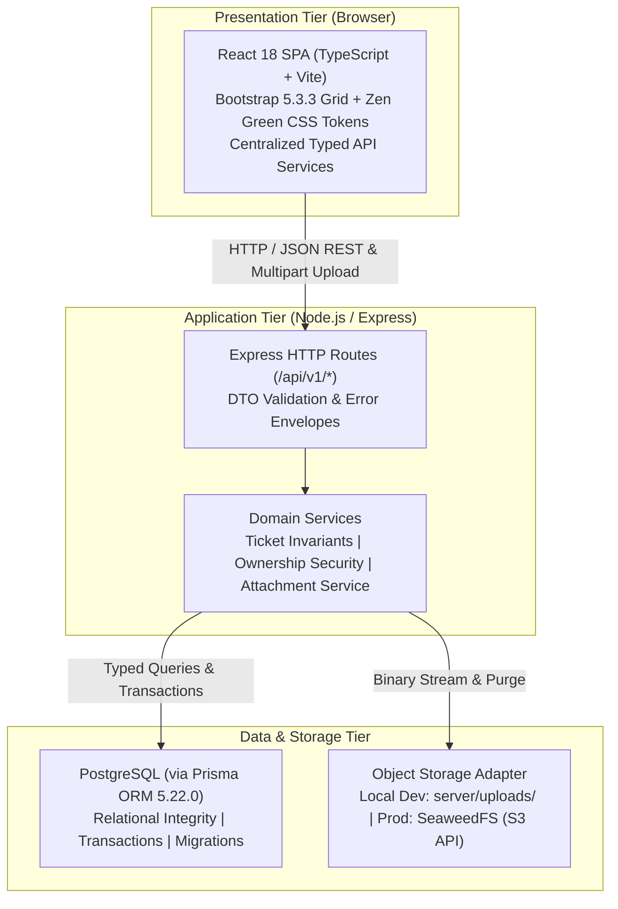

# TokTickIT System Context

**System Identity**: TokTickIT — IT Service Desk Ticketing System  
**Course**: CPE 334 Introduction to Software Engineering in the Age of AI Agents  
**Reference Document**: [TokTickIT-System-Level-SDS-v1.0.md](../reference/TokTickIT-System-Level-SDS-v1.0.md) (Document ID: SDS-SYS-001)  

---

## 1. System Overview & Scope
TokTickIT is an internal IT ticketing application facilitating incident and service request workflows across three primary system roles: **Requester** (end user), **IT Staff** (resolver), and **Administrator**. 

In **Sprint 2 (Lab 2)**, the scope focuses on the **Requester-facing MVP**:
* Simulated Development Requester identity selection ("user login context" for multi-user test verification).
* Creating IT support tickets with categories, related systems, priorities, summaries, descriptions, and file attachments.
* Viewing personal ticket history (My Tickets) with search, multi-attribute filtering, sorting, and pagination.
* Inspecting owned tickets in read-only Ticket Detail view.
* Managing attachment lifecycle (uploading permitted files, downloading active binaries, and soft-removing files with audited reasons).
* Strict server-side cross-requester ownership isolation.

---

## 2. Logical Three-Tier Architecture

TokTickIT is organized into three decoupled architectural tiers deployed on a single host for course development:

### 2.1. Presentation Tier (Web UI)
* **Framework**: React 18 (`react`, `react-dom` 18.3.1), bundled with Vite 6.0.5 and TypeScript 5.7.2.
* **Styling**: Bootstrap 5.3.3 responsive layout grid and utilities combined with custom **Zen Green** CSS design tokens (Primary Green `#006B3C`, Secondary Green `#0B7A46`, Pale Green `#EAF6EF`, Page Background `#F5F7F6`, Charcoal-green text `#1C2826`).
* **State & Communication**: Pure HTTP client communication via centralized typed API modules (`client/src/api.ts`). Manages `RequesterContext` for active simulated user state. Directly accessing database or persistence objects is strictly prohibited.

### 2.2. Application Tier (Backend API)
* **Runtime**: Node.js with Express 4.21.2 and TypeScript 5.7.2 (`server/src/app.ts`).
* **Routing**: Endpoints rooted at `/api/v1/*` with backwards-compatible `/api/*` aliases for baseline health and category checks.
* **Separation of Concerns**: Controllers parse HTTP requests, validate input DTOs, and serialize responses. Core business rules, invariant checks, transactional sequences, and cross-requester ownership security reside in dedicated backend domain services.

### 2.3. Data & Persistence Tier
* **Relational Database**: PostgreSQL accessed exclusively through Prisma ORM 5.22.0 (`@prisma/client`).
* **Transactions & Concurrency**: Multi-table operations (such as ticket creation with number generation, and attachment soft-removal with event logging) run inside atomic Prisma transactions (`prisma.$transaction`).
* **Object Storage**: Binary attachments are handled by an abstracted storage service (`server/uploads/` in development, designed to interface with SeaweedFS/S3 in production). Raw storage keys are never exposed directly to client applications.

---

## 3. Communication & Security Invariants

1. **Client-Server Contract**: All communication is conducted over RESTful HTTP using standard JSON request/response payloads, except for multipart file uploads and binary file downloads.
2. **Server-Side Authority**: The backend is authoritative on all business rules, format validation, and permissions. Hiding a button or input on the client is for user experience only and never substitutes for server-side authorization.
3. **Cross-Requester Isolation**: Requesters are strictly confined to their own records. Every ticket query and attachment download verifies `requesterId == currentRequesterId` at the API boundary, returning HTTP 403 or 404 upon violation.
4. **Auditability & Retention**: Tickets and audit events are never hard-deleted. Soft-removed attachments retain database metadata (`deletedAt`, `deletedById`, `removalReason`) while purging the physical binary file.
